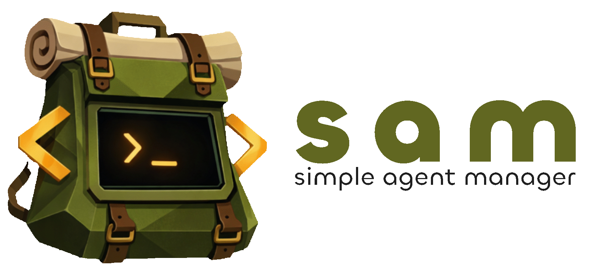

<p align="center">
  
</p>

<p align="center">
  <strong>Self-hosted cloud environments for AI coding agents.</strong>
</p>

<p align="center">
  <a href="#quick-deploy">Quick Deploy</a> •
  <a href="docs/guides/self-hosting.md">Self-Hosting Guide</a> •
  <a href="docs/architecture/walkthrough.md">Architecture</a> •
  <a href="CONTRIBUTING.md">Contributing</a>
</p>

<p align="center">
  <a href="LICENSE"></a>
</p>

---

SAM gives you on-demand cloud workspaces with [Claude Code](https://www.anthropic.com/claude-code) pre-installed. Point it at a GitHub repo, get a fully configured dev environment in your browser — running on your own infrastructure at a fraction of the cost of managed alternatives.

**Self-hosted on Cloudflare (free tier) + Hetzner Cloud VMs. Deploy in under 15 minutes.**

## Why SAM?

|                       | GitHub Codespaces    | SAM                                        |
| --------------------- | -------------------- | ------------------------------------------ |
| **Cost**              | $0.18–0.36/hr        | ~$0.007–0.03/hr (Hetzner VMs)              |
| **AI agent**          | Manual setup         | Claude Code pre-installed                  |
| **Control plane**     | Managed (vendor)     | Self-hosted (Cloudflare free tier)         |
| **Lifecycle control** | Auto-timeout         | Explicit stop / restart / delete           |
| **Private repos**     | GitHub-native        | GitHub App integration                     |

## Features

- **Instant workspaces** — create a cloud dev environment from any GitHub repo in minutes, with Claude Code ready to go
- **Chat-driven task execution** — describe what you want built, SAM provisions infrastructure and runs an AI agent autonomously
- **Project-first organization** — chat history, tasks, and activity persist beyond workspace lifecycle
- **Multi-workspace nodes** — run multiple workspaces on a single VM to maximize utilization
- **Bring-your-own-cloud** — users provide their own Hetzner API tokens; no shared cloud credentials
- **Web terminal + PWA** — browser-based terminal with session persistence, installable as a mobile app

## Quick Deploy

SAM deploys automatically via GitHub Actions. Fork, configure, push.

### Prerequisites

- A [Cloudflare account](https://dash.cloudflare.com/sign-up) (free tier works)
- A domain with nameservers pointing to Cloudflare
- A [GitHub App](docs/guides/self-hosting.md#github-setup) for OAuth + repo access

### Steps

**1. Fork this repository**

**2. Create a GitHub Environment** named `production` in your fork's Settings → Environments

**3. Add environment variables:**

| Variable | Example |
|----------|---------|
| `BASE_DOMAIN` | `example.com` |

**4. Add environment secrets:**

| Secret | Description |
|--------|-------------|
| `CF_API_TOKEN` | Cloudflare API token ([required permissions](docs/guides/self-hosting.md#step-4-create-api-token-with-required-permissions)) |
| `CF_ACCOUNT_ID` | Cloudflare account ID |
| `CF_ZONE_ID` | Cloudflare zone ID |
| `R2_ACCESS_KEY_ID` | R2 API token access key |
| `R2_SECRET_ACCESS_KEY` | R2 API token secret key |
| `PULUMI_CONFIG_PASSPHRASE` | `openssl rand -base64 32` |
| `GH_CLIENT_ID` | GitHub App client ID |
| `GH_CLIENT_SECRET` | GitHub App client secret |
| `GH_APP_ID` | GitHub App ID |
| `GH_APP_PRIVATE_KEY` | GitHub App private key (PEM) |
| `GH_APP_SLUG` | GitHub App URL slug |

> Security keys (JWT, encryption) are generated automatically on first deploy.

**5. Push to `main`** — GitHub Actions provisions all infrastructure, deploys the API + UI, runs migrations, and verifies health.

Your instance is live at `app.{your-domain}`. Users sign in with GitHub and provide their own Hetzner API token to create workspaces.

For detailed setup instructions, troubleshooting, and manual deployment options, see the **[Self-Hosting Guide](docs/guides/self-hosting.md)**.

## How It Works

```
Browser (app.{domain})
    ↕ HTTPS
Cloudflare Worker (API + reverse proxy)
    ├── D1 (database)
    ├── KV (sessions)
    ├── R2 (binaries)
    ↕ HTTP proxy
Hetzner VM (node)
    ├── VM Agent (Go) — terminal multiplexing, WebSocket, JWT auth
    └── Workspaces (Docker containers + Claude Code)
```

The control plane runs entirely on Cloudflare's edge network (Workers, D1, KV, R2, Pages). Compute happens on Hetzner Cloud VMs provisioned on demand. Each push to `main` triggers an automated deployment via Pulumi.

For the full architecture with Mermaid diagrams, see the **[Architecture Walkthrough](docs/architecture/walkthrough.md)**.

## Development

```bash
pnpm install        # Install dependencies
pnpm dev            # Start dev servers (API + Web)
pnpm test           # Run tests
pnpm typecheck      # Type check
pnpm build          # Build all packages
```

> Local dev has limitations (no real OAuth, DNS, or VMs). For full testing, deploy to staging. See [Local Development Guide](docs/guides/local-development.md).

## Contributing

Contributions welcome! See [CONTRIBUTING.md](CONTRIBUTING.md) for guidelines.

## Related Projects

- [Coder](https://github.com/coder/coder) — Self-hosted cloud development environments
- [Daytona](https://github.com/daytonaio/daytona) — Open-source dev environment manager
- [DevPod](https://github.com/loft-sh/devpod) — Client-only devcontainer management

## License

[MIT](LICENSE)

---

<p align="center">
  Built with <a href="https://hono.dev/">Hono</a> on <a href="https://cloudflare.com/">Cloudflare</a>
</p>
