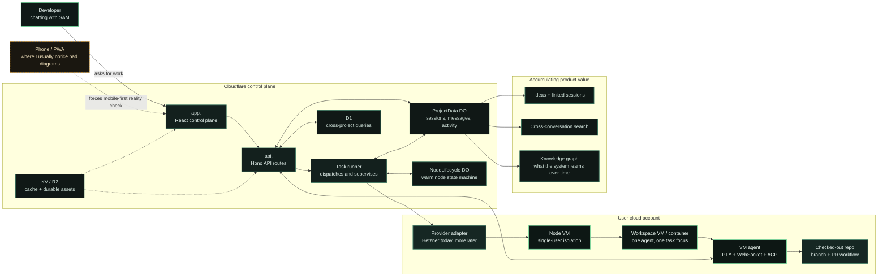

I kept ending up in the same conversation.

Someone would ask how SAM actually works. I would start with "Cloudflare Worker control plane, ephemeral VM workspaces, per-project context," and at some point I would paste a static diagram. On desktop it was fine. On my phone, which is where I use SAM a lot, it was basically a green blur with tiny labels.

That felt wrong for a product like this. If SAM is supposed to make complex systems feel operable, the architecture post on the marketing site should not collapse the second you pinch-zoom it on mobile.

So this is the version I actually wanted: one diagram, directly inside the blog post, with enough detail to be useful and enough interaction to stay readable.

## The shape I keep explaining

The core SAM story is simple.

You talk to an agent. The control plane figures out what infrastructure is needed. A workspace appears on your own cloud. The project keeps the durable context. The agent does work there, not in some black box you can't inspect.

The diagram below shows the control flow I keep describing to people when they ask where the moving parts actually are.

## What matters in the diagram

There are four ideas I want people to get from this immediately.

### 1. The control plane is not the workspace

SAM's UI and API live on Cloudflare. The actual coding work happens in a workspace that runs on infrastructure you control. That's the boundary that matters.

It is easy to accidentally present agent products like a magic hosted blob where everything is happening in one place. SAM is the opposite. The control plane coordinates. The workspace does the work.

### 2. Project memory is part of the product, not just metadata

The `ProjectData` durable object, ideas system, search, and knowledge graph are not side dishes.

They're the part that compounds.

If all you have is "spin up a fresh workspace," you can replace that with raw infrastructure pretty quickly. What is harder to replace is the layer that remembers what you were doing, what your agents learned, and what should happen next across sessions.

That is the reason I keep thinking about SAM as more than a workspace launcher.

### 3. Isolation is a product decision

We are opinionated about this: one agent per workspace, and different users do not share the same VM. That sounds like an implementation detail until you've debugged enough messy shared-state systems.

The architecture diagram should communicate that isolation visually, because it is part of the trust model.

### 4. The UX has to survive mobile

I am on the phone a lot when I check on agents. That means diagrams, logs, task trees, and status surfaces have to survive narrow screens and clumsy thumbs.

This is not a separate "later we will make it responsive" concern. It changes the design from the start.

## Why I wanted the diagram to be interactive

Static diagrams are fine when they are tiny or shallow.

SAM is neither.

If I try to make the architecture honest, it includes the control plane, the provider boundary, the per-project state, and the long-term context layer. That is enough density that the viewer should be allowed to explore it, not just stare at a screenshot. So the interaction model here is intentionally simple:

- Drag to pan across dense sections.
- Scroll or pinch to zoom when labels get tight.
- Click key nodes to jump into the relevant docs or blog posts.

That is enough to make the post feel alive without turning it into a toy.

## The product lesson hiding inside this

This started as a content problem. I wanted a better blog post.

But it is also the same standard I want the rest of SAM to meet. When the system gets complicated, the answer should not be "flatten the truth until it fits." The answer should be "make the real thing understandable."

I want the product to feel like that. Honest topology. Real boundaries. Enough polish that complexity stays navigable.

That is the vibe I want the marketing site to carry too.

## What's next

The obvious follow-up is using the same treatment for docs pages and architecture explainers, not just blog posts. Dense system diagrams get a lot more useful once they behave like surfaces instead of screenshots.

If you want to see the actual system this diagram describes, [the code is here](https://github.com/raphaeltm/simple-agent-manager). If you're building something similar, I think the interesting problem is not just rendering diagrams. It's designing systems that still make sense when you have to explain them to yourself on a phone while an agent is already working.
