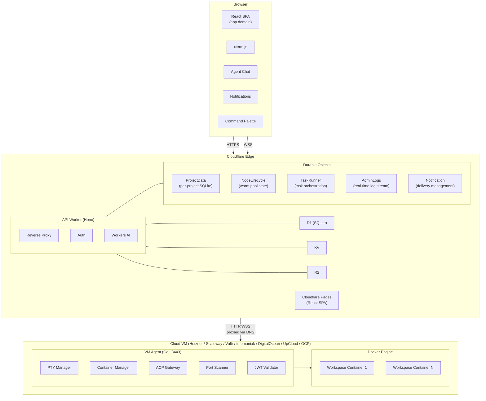
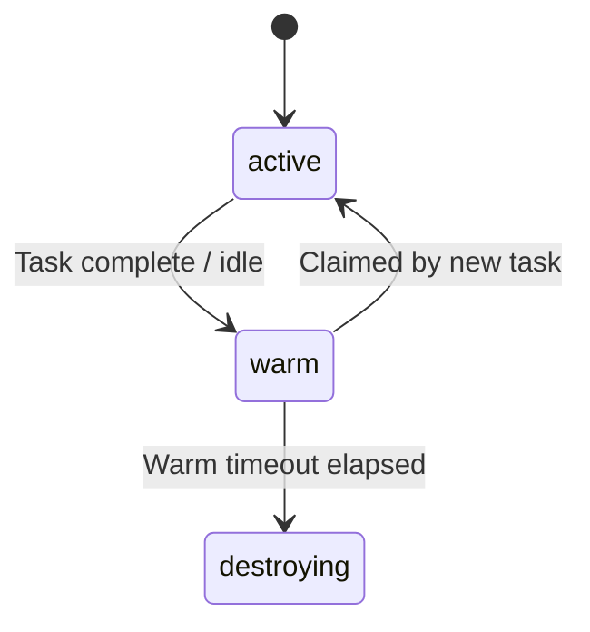
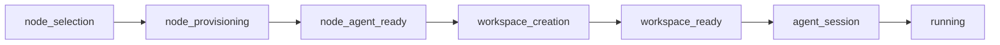
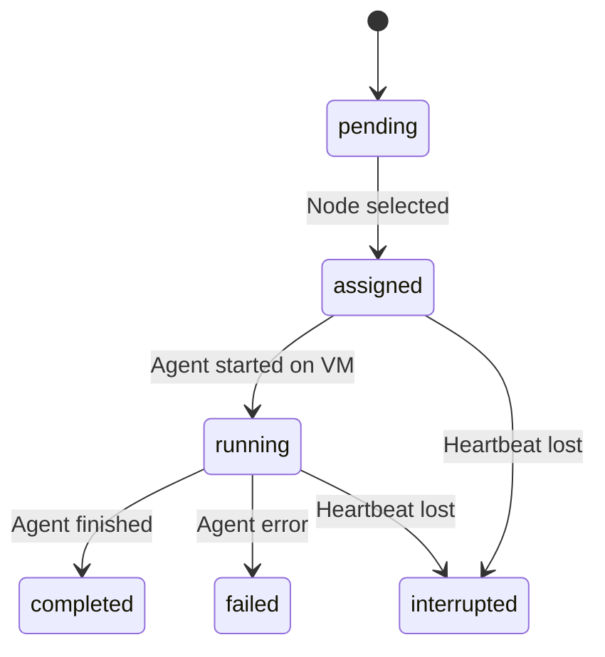
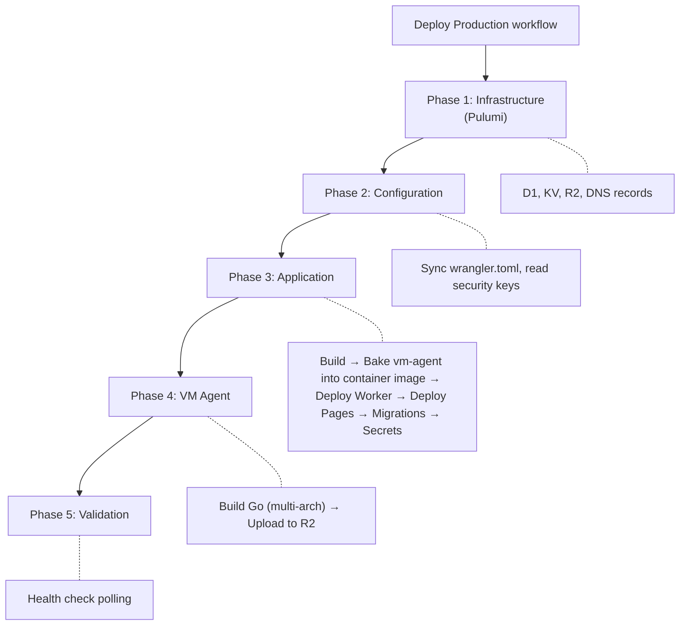

SAM is a serverless platform for ephemeral AI coding environments. The architecture splits into three layers: **edge** (Cloudflare), **compute** (cloud VMs — Hetzner, Scaleway, Vultr, Infomaniak, DigitalOcean, UpCloud, or GCP), and **external services** (GitHub, DNS).

For instant sessions, SAM can also run one standalone vm-agent in a raw Cloudflare Container. The deployment workflow builds the Linux vm-agent from the deployment commit, records its version and SHA-256 digest, and bakes it into the container image before Wrangler deploys the Worker. Cloudflare Worker deployment versions therefore provide the matching image/Worker rollback boundary. The image contains only SAM runtime tooling: project, profile, and skill files, environment variables, and secrets remain outside the image and are fetched and applied when the ACP session starts.

## High-Level Architecture



## Request Routing

Every request to `*.domain` passes through the same Cloudflare Worker. The `Host` header determines routing:

| Pattern                                     | Destination             | How                                                                              |
| ------------------------------------------- | ----------------------- | -------------------------------------------------------------------------------- |
| `app.{domain}`                              | Cloudflare Pages        | Worker proxies to `{project}.pages.dev`                                          |
| `api.{domain}`                              | Worker API routes       | Direct handling by Hono router                                                   |
| `ws-{id}.{domain}`                          | VM Agent on port 8443   | Worker proxies via `{nodeId}.vm.{domain}` backend hostname                       |
| `ws-{id}--{port}.{domain}`                  | Workspace port proxy    | Worker proxies to dev server running on `{port}`                                 |
| `r{N}-{service}-{port}-{env}.apps.{domain}` | Deployment public route | DNS-only A record points at the deployment node; node-local Caddy terminates TLS |
| `*.{domain}` (other)                        | 404                     | No matching route                                                                |

:::note[Why backend hostnames?]
Cloudflare Workers can't fetch IP addresses directly (Error 1003). Node backend DNS records (`{nodeId}.vm.{domain}` → VM IP) are created so the Worker can proxy through hostnames, with `*.vm.{domain}` excluded from the Worker route.
:::

Deployment public routes do not pass through the Worker proxy. The API derives a
stable hostname and loopback host port for each public route in a release,
creates the SAM-owned DNS-only A record, and sends those route targets inside
the signed deployment apply payload. The deployment node's Caddy instance then
terminates TLS and reverse-proxies to `127.0.0.1:{hostPort}`. User-owned custom
subdomains reuse the same signed route-target path after DNS verification, but
SAM does not create those user DNS records.

## Control Plane — API Worker

The API Worker (`apps/api/`) is a Hono application handling:

- **Authentication** — GitHub, Google, and GitLab OAuth via BetterAuth
- **Resource management** — CRUD for nodes, workspaces, projects, ideas
- **Reverse proxy** — workspace subdomain, port traffic, and file proxy to VMs
- **Durable Objects** — per-project data, node lifecycle, idea orchestration, notifications
- **Workers AI** — idea title generation, voice transcription, text-to-speech, context summarization
- **MCP server** — project-aware tools for running agents
- **Cron triggers** — provisioning timeout checks, warm node cleanup, orphan detection

### Key Route Groups

| Route                   | Purpose                                                                        |
| ----------------------- | ------------------------------------------------------------------------------ |
| `/api/auth/*`           | GitHub OAuth sign-in/out, sessions                                             |
| `/api/nodes/*`          | Node CRUD, lifecycle, health callbacks                                         |
| `/api/workspaces/*`     | Workspace CRUD, lifecycle, boot logs, agent sessions                           |
| `/api/projects/*`       | Project CRUD, runtime config, ideas, chat sessions, file proxy                 |
| `/api/credentials/*`    | Cloud provider + agent API key management                                      |
| `/api/notifications/*`  | Notification list, preferences, WebSocket, and Web Push subscriptions          |
| `/api/tasks/*`          | Idea submission, lifecycle, status updates                                     |
| `/api/github/*`         | GitHub App installations, repos                                                |
| `/api/terminal/token`   | Workspace JWT for WebSocket auth                                               |
| `/api/agent/*`          | VM Agent binary download (VM/cloud-init path; container image has it baked in) |
| `/api/bootstrap/:token` | One-time credential injection                                                  |
| `/api/admin/*`          | Admin dashboard, error logs, real-time log stream                              |
| `/api/tts/*`            | Text-to-speech synthesis                                                       |
| `/api/transcribe`       | Voice-to-text transcription                                                    |

## Data Layer — Hybrid D1 + Durable Objects

SAM uses a hybrid storage model: **D1** for cross-project queries and **Durable Objects** for write-heavy, project-scoped data.

### D1 (Cross-Project Queries)

| Binding                  | Purpose                                                                              |
| ------------------------ | ------------------------------------------------------------------------------------ |
| `DATABASE`               | Users, projects, nodes, workspaces, ideas, credentials, diagnostic incident metadata |
| `OBSERVABILITY_DATABASE` | Error storage for admin dashboard                                                    |

D1 stores platform-level data that needs to be queried across projects (e.g., "show all my ideas" on the dashboard).

Before a deploy applies D1 migrations, SAM records per-table counts and a time-travel recovery timestamp. Post-migration comparison runs only for databases whose `d1_migrations` ledger advanced. Business tables use zero decrease tolerance; code-reviewed retention/expiry tables use a configurable percentage limit (50% by default), preserving catastrophic-wipe detection without treating routine telemetry churn as migration damage. Configuration may narrow that reviewed table set but cannot add arbitrary tables to it.

### Durable Objects (Per-Project Data)

| Binding                         | Scope       | Purpose                                                                  |
| ------------------------------- | ----------- | ------------------------------------------------------------------------ |
| `PROJECT_DATA`                  | Per project | Chat sessions, messages, activity events, ACP sessions (embedded SQLite) |
| `NODE_LIFECYCLE`                | Per node    | Warm pool state machine (active → warm → destroying)                     |
| `TASK_RUNNER`                   | Per task    | Multi-step task execution orchestration via alarm callbacks              |
| `ADMIN_LOGS`                    | Singleton   | Real-time log broadcast to admin WebSocket clients                       |
| `NOTIFICATION`                  | Per user    | Notification delivery and state management                               |
| `PROJECT_ORCHESTRATOR`          | Per project | Project-scoped agent orchestration                                       |
| `PROJECT_AGENT`                 | Per project | AI technical-lead session for a project                                  |
| `SAM_SESSION`                   | Per user    | SAM agent conversation session state                                     |
| `CODEX_REFRESH_LOCK`            | Per user    | Serializes Codex OAuth token refresh (prevents 429 rotation races)       |
| `GITHUB_USER_ACCESS_TOKEN_LOCK` | Per user    | Serializes GitHub OAuth user-token refresh                               |
| `GITLAB_USER_ACCESS_TOKEN_LOCK` | Per user    | Serializes GitLab OAuth user-token refresh                               |
| `AI_TOKEN_BUDGET_COUNTER`       | Per user    | Atomic AI token budget accounting                                        |
| `TRIAL_COUNTER`                 | Singleton   | Monthly trial-onboarding cap counter (keyed by `YYYY-MM`)                |
| `TRIAL_EVENT_BUS`               | Per trial   | SSE event buffering for trial provisioning                               |
| `TRIAL_ORCHESTRATOR`            | Per trial   | Alarm-driven trial provisioning                                          |

### Why Hybrid?

D1 handles reads well but has write contention under high concurrency. Chat messages and activity events generate high-frequency writes that would overwhelm D1. Durable Objects provide single-threaded SQLite access per project, eliminating contention while keeping data co-located.

Summary data flows back from DOs to D1 via debounced sync (e.g., `last_activity_at`, `active_session_count` on the projects table).

### Other Bindings

| Service        | Binding | Purpose                                                                                                      |
| -------------- | ------- | ------------------------------------------------------------------------------------------------------------ |
| **KV**         | `KV`    | Auth sessions, bootstrap tokens, boot logs, MCP tokens                                                       |
| **R2**         | `R2`    | VM Agent binaries, private diagnostic artifacts, session snapshots, compose image artifacts, TTS audio cache |
| **Workers AI** | `AI`    | Idea title generation, transcription, TTS, context summarization                                             |

### VM diagnostic incident flow

VM Agent errors and their automatic evidence remain inside one SAM installation. The agent first persists a stable incident ID and error in its local SQLite outbox, then posts the error batch using the node callback JWT. The Worker creates primary-D1 incident metadata before strictly acknowledging the observability-D1 error row. The VM registers a bounded redacted manifest/preview, claims a time-bounded D1 upload lease, streams the gzip archive into a deterministic private R2 key, and retries safely after restarts. The same lease prevents scheduled reconciliation or a failed-evidence report from racing a live upload. A scheduled reconciler repairs partial D1/R2 state, fails stale unleased uploads, expires metadata, and deletes retained objects in bounded batches.

Superadmin error queries batch-join incident summaries without exposing object keys. The UI downloads bytes only through an authenticated Worker proxy, while the diagnosis agent can read only the redacted D1 preview. There is no cross-installation intake or transport in this flow.

### Compose image artifact retention

Compose-publish releases may store docker-save archives in R2 under
`compose-image-artifacts/`. Those objects are durable while any surviving
`deployment_releases.manifest` references them. The scheduled release-retention path
(`apps/api/src/scheduled/d1-retention.ts:runDeploymentReleaseRetention()`) reconciles
only provably stale `created`/`applying` compose releases to terminal `failed` using
D1-observed deployment-node state and recent release-event activity as the lease. It
does not call the deployment node or inspect R2. Terminal release retention then prunes
old releases outside the observed-applied/newest rollback window, and
`apps/api/src/scheduled/compose-image-artifact-cleanup.ts:runComposeImageArtifactCleanup()`
deletes only old compose artifacts that are no longer referenced by any remaining valid
release manifest.

## Agent Configuration Layers

Agent behavior is assembled from several override layers rather than a single global setting:

- **Composable credentials** — reusable credential rows (`cc_credentials`) and configuration/attachment rows (`cc_configurations`, `cc_attachments`) can be layered per project and per profile, resolved **skill → profile → project → platform**.
- **Agent profiles** — named, reusable agent configurations (agent type, model, runtime, env, files) selected per chat or per task/trigger.
- **Skills** — a first-class override layer that further specializes a profile for a specific task type.
- **Provider modes** — each agent runs in one of three auth modes: `user-api-key` (the user's own key), `oauth` (a subscription token such as Claude Max), or `sam` (the platform-managed AI proxy, opt-in). See [Agent Authentication](/docs/guides/agents/).

### Agent Bootstrap Payload (`get_instructions`)

Every agent session begins by calling the SAM MCP `get_instructions` tool
(`handleGetInstructions()` in `apps/api/src/routes/mcp/instruction-tools.ts`), which returns
the task/session context, the project record, a mode-specific `instructions[]` array, and the
project's stored knowledge and policies.

Knowledge and policies are delivered as **rendered markdown only** — `knowledgeDirectives` and
`policyDirectives`, produced by `formatKnowledgeDirectives()` and `formatPolicyDirectives()`.
Each field is omitted entirely when there is nothing to render; a failed Durable Object read
also degrades to "omitted" rather than erroring the bootstrap.

There is deliberately **no second structured copy** of this data. The payload previously also
carried `knowledgeContext` and `policyContext` arrays holding byte-identical observation and
policy bodies. Nothing consumed them, and on a mature project they accounted for roughly half
the payload (~166K → ~81K characters, about 21k tokens per session bootstrap), so they were
removed. Callers that need machine-readable records should use the dedicated tools —
`list_policies` / `get_policy`, and `search_knowledge` / `get_project_knowledge` — rather than
parsing the bootstrap payload.

Because `update_policy` and `remove_policy` resolve rows by exact id (`updatePolicy()` and
`removePolicy()` in `apps/api/src/durable-objects/project-data/policies.ts` use `WHERE id = ?`),
each rendered policy line carries its **full, untruncated** id:

```text
### Rules (MUST follow)
- **Call get_instructions first** (id: 7d24e435-0153-44a6-a532-1244510d9e25): Agents must load SAM context before starting work.
```

A policy may also carry a **shelf life**. `add_policy` and `update_policy` accept an optional
`expiresAt` (epoch milliseconds) and a `scope` of either `always` (a standing project policy,
the default) or `task` (a one-shot policy captured for a specific piece of work). A
`task`-scoped policy must set `expiresAt`, enforced at every write boundary by
`validatePolicyLifecycle()` in `packages/shared/src/constants/policies.ts` — which is what
stops a constraint captured for one workflow from being injected forever. When a policy has an
expiry, `formatPolicyLifecycle()` renders it inline between the title and the id:

```text
- **Use profile X for the reliability wave** (task-scoped, expires 2026-09-30) (id: d55af478-5234-4178-8f9c-47dfd5647de2): ...
- **Prefer Valibot for runtime validation** (expires 2026-12-01) (id: 56b02cb5-71aa-46bd-9ea1-858aaa5551ec): ...
```

Expiry is evaluated at **read time** in `getActivePolicies()`
(`apps/api/src/durable-objects/project-data/policies.ts`) — `active = 1 AND (expires_at IS NULL
OR expires_at > ?)`. There is no sweep or cron: a lapsed policy simply stops being selected. The
row is deliberately retained and stays `active`, so `get_policy`, `list_policies`, and the
Policies tab can still show a human that the policy existed and when it stopped applying. A
policy with no `expiresAt` never expires, which is the behaviour of every policy created before
lifecycle controls existed.

Knowledge observations do **not** currently carry their `observationId` in this payload, so
`update_knowledge`, `remove_knowledge`, and `confirm_knowledge` need an id obtained from
`search_knowledge` or `get_project_knowledge` first.

## Durable Objects Deep Dive

### ProjectData DO

Each project gets one `ProjectData` Durable Object instance, accessed via `env.PROJECT_DATA.idFromName(projectId)`.
Every user-visible chat session has exactly one backing D1 Task. `taskMode` controls autonomous task versus human-controlled conversation lifecycle semantics; it never controls whether the Task exists. D1 `tasks.chat_session_id` and ProjectData `chat_sessions.task_id` form a bidirectional soft link. Because the stores cannot share a transaction, creation and legacy repair are idempotent and retain compatibility readers while reconciliation is in progress.

When a sleeping VM conversation needs a replacement runtime, one D1 transaction conditionally creates the recovery task, records `recovery_source_task_id`, and transfers the unique chat-session binding only while the source task is still non-terminal. Parent-wake validation accepts that linked recovery task as the temporary session owner while continuing to require the original parent and child lineage to remain valid. If the parent terminalizes before runner startup, SAM cancels the handoff and restores the original task/workspace bindings.

ProjectData also owns the single durable prompt-delivery queue used by browser followups and agent handoffs. Acceptance persists the visible transcript message and its stable delivery identity before runtime I/O. Alarm-driven attempts use bounded exponential backoff, a finite lifetime, compare-and-set attempt tokens, and stable VM receipts. A lost response is reconciled before retry; if receipt evidence is unavailable or belongs to another runtime, the delivery becomes explicitly ambiguous and is not replayed.

Checkpoint episodes are stored idempotently by ACP session and prompt epoch, including state transitions, attempt/error metadata, and a progress envelope for inspection. Automatic long-turn selection and checkpoint preemption remain disabled. Task agents can explicitly park on a bounded `wait_for_subtasks` subscription: ProjectData reconciles selected same-project task terminal state and enqueues one immutable caller wake through the existing durable prompt-delivery queue. See [Configuration](/docs/reference/configuration/) for the durable-execution settings and rollout flags.

**Embedded SQLite tables:**

- `chat_sessions` — session metadata, lifecycle status, message counts
- `chat_messages` — append-only streaming token log; each row is one streaming chunk from Claude Code, not a logical message. Consecutive same-role tokens (assistant, tool, thinking) are grouped into logical messages at the API and UI layers. The `origin` column tags SAM-injected content (e.g. the `get_instructions` reminder) as `system` (NULL/absent = normal `user` message); `origin=system` rows are excluded from grouping/materialization, full-text search, topic auto-capture, and attention resolution, and are rendered collapsed in the chat UI.
- `chat_messages_grouped` — materialized grouped messages, populated when a session stops by concatenating consecutive same-role tokens. Source for FTS5 full-text search.
- `chat_messages_grouped_fts` — FTS5 virtual table indexed on grouped message content for full-text search with stemming and phrase matching.
- `activity_events` — audit trail (workspace created, session stopped, etc.)
- `chat_session_ideas` — many-to-many links between sessions and ideas
- `task_status_events` — idea lifecycle transitions with actor tracking
- `session_attention_markers` — active human-input and reconciliation waits, including bounded escalation/expiry state and correlated structured answers
- `acp_sessions` — ACP session state machine with fork lineage
- `acp_session_events` — ACP session state transition history
- `task_wait_subscriptions` — idempotent bounded parent waits, immutable wake payloads, and retry state
- `task_wait_children` — normalized same-project task observations for each durable wait

**Key features:**

- Hibernatable WebSockets for zero-idle-cost real-time chat
- Heartbeat-based VM failure detection via DO alarms
- Session forking with parent lineage tracking
- Debounced D1 summary sync for dashboard data

### Notification DO

Each user gets one `Notification` Durable Object instance, accessed via
`env.NOTIFICATION.idFromName(userId)`. Its embedded SQLite store owns notification rows,
channel preferences, endpoint-keyed browser Push subscriptions, failure state, and durable
push delivery receipts. Normal medium/high-urgency inserts schedule encrypted Declarative
Web Push fan-out with `waitUntil()`; batching and deduplication early returns do not push.
Live WebSocket presence never suppresses out-of-band delivery.

For `needs_input`, ProjectData queries the linked Notification receipt before its original
deadline can fail a task or stop a workspace. Missing delivery instead enters a bounded
reminder/grace path. The `reconciliation_checkin` machine-liveness watchdog is separately
classified and retains its immediate terminal behavior.

### NodeLifecycle DO

Each node gets one `NodeLifecycle` Durable Object, accessed via `env.NODE_LIFECYCLE.idFromName(nodeId)`.

**State machine:**



- `markIdle(nodeId, userId)` — transitions to warm, schedules cleanup alarm
- `tryClaim(taskId)` — atomically claims a warm node for reuse (single-threaded, no races)
- `alarm()` — fires after warm timeout, triggers node destruction

### TaskRunner DO

Each idea execution gets one `TaskRunner` Durable Object, accessed via `env.TASK_RUNNER.idFromName(taskId)`.

**Orchestration steps** (each idempotent, alarm-driven):



Cross-DO coordination with NodeLifecycle (for warm node claims) and ProjectData (for session linkage). Exponential backoff on transient errors.

## ACP Session Lifecycle

Agent sessions are managed by the ProjectData DO with this state machine:



**Heartbeat detection**: VM agent sends heartbeats every 60 seconds. If no heartbeat within 5 minutes (`ACP_SESSION_DETECTION_WINDOW_MS`), the DO alarm marks the session as `interrupted`.

**Session forking**: Sessions track `parentSessionId` and `forkDepth` for lineage. Fork depth is limited to 10 (`ACP_SESSION_MAX_FORK_DEPTH`).

## VM Agent

The VM Agent (`packages/vm-agent/`) is a Go binary running on each node:

| Subsystem         | Package                   | Responsibility                                                  |
| ----------------- | ------------------------- | --------------------------------------------------------------- |
| PTY Manager       | `internal/pty/`           | Terminal multiplexing, ring buffer replay                       |
| Container Manager | `internal/container/`     | Docker exec, devcontainer CLI                                   |
| ACP Gateway       | `internal/acp/`           | Agent protocol, streaming responses, notification serialization |
| Port Scanner      | `internal/ports/`         | Auto-detect listening ports, build proxy URLs                   |
| JWT Validator     | `internal/auth/`          | Validates workspace JWTs via JWKS endpoint                      |
| Persistence       | `internal/persistence/`   | SQLite tab/session storage                                      |
| Boot Logger       | `internal/bootlog/`       | Reports provisioning progress                                   |
| Message Reporter  | `internal/messagereport/` | Outbox-based message relay to control plane                     |

## Deployment Pipeline



CI runs lint, typecheck, tests, and build on pull requests and on canonical-repository `main` pushes. In the canonical repository, Deploy Production runs after successful `main` CI and re-verifies that the completed CI SHA is still the current `main` tip after entering the serialized deployment queue. In self-host forks, `main` push CI is intentionally skipped, so operators update their instance by manually running **Deploy Production** against the exact commit SHA from the fork's synced `main` branch. The production GitHub Environment must separately restrict deployments to the selected `main` branch so other refs cannot access its secrets with modified workflow code.

## Key Design Decisions

| Decision                             | Rationale                                                                                                                                                                               |
| ------------------------------------ | --------------------------------------------------------------------------------------------------------------------------------------------------------------------------------------- |
| Single Worker as API + reverse proxy | Simplifies infrastructure — one Worker handles everything                                                                                                                               |
| Hybrid D1 + Durable Objects          | D1 for cross-project reads, DOs for high-throughput project-scoped writes                                                                                                               |
| BYOC + platform-credential fallback  | Users/self-hosters may bring their own cloud tokens; SAM's hosted platform also has an enabled platform credential so provisioning works with zero config (resolution: user → platform) |
| Callback-driven provisioning         | VMs POST `/ready` when bootstrapped — no polling                                                                                                                                        |
| Dynamic DNS per workspace            | Instant subdomain resolution; cleaned up on stop                                                                                                                                        |
| Alarm-driven execution orchestration | Idempotent steps with exponential backoff; no long-running processes                                                                                                                    |
| No credentials in cloud-init         | Bootstrap tokens for secure credential injection                                                                                                                                        |
| Multi-provider abstraction           | Unified VM size/lifecycle API across Hetzner, Scaleway, Vultr, Infomaniak, DigitalOcean, UpCloud, and GCP                                                                               |
