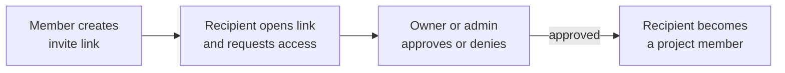

A SAM project can be shared with a small team. Members work in the same project — they see each other's chat sessions, reuse the same agent profiles and skills, and run against the same repository — while every member's personal API keys and cloud credentials stay their own.

This guide covers the whole collaboration loop: inviting people, approving access, what teammates can and cannot use, and how to keep track of whose keys are paying for shared work.

> Collaboration is designed for small, trusted teams (roughly 3–10 people). Both **owners** and **admins** can approve new members, so approval does not bottleneck on a single person.

## How access works

SAM does not send email invitations. Instead, access is a three-step flow:

1. **Any active member** creates an invite link from the project's settings.
2. The recipient opens the link and **requests access** — the link never grants access on its own.
3. An **owner or admin** approves (or denies) the pending request. Approval adds the person as a member.

Because the link only produces a *request*, sharing a link is safe: nobody joins your project until someone with permission approves them.

## Roles

Every member has one role. Roles control who can manage the project and its members — they do not change whose credentials pay for work (see [Credential attribution](#who-pays-credential-attribution)).

| Role | Manage members & invites | Approve access requests | Transfer ownership | Everyday work (chat, tasks, triggers) |
| --- | --- | --- | --- | --- |
| **Owner** | Yes | Yes | Yes (hands the project to another member) | Yes |
| **Admin** | Yes | Yes | No | Yes |
| **Member** | No | No | No | Yes |

- There is exactly one **owner** per project. The owner can transfer ownership to an admin; the previous owner then becomes an admin.
- **Admins** can do everything except transfer ownership, including approving new members and removing other non-owner members.
- **Members** can use the project fully — start chats, run tasks, use shared profiles and skills — but cannot manage membership.

## Invite a teammate

1. Open the project and go to **Settings → Access**.
2. In the **Members** panel, find **Invite Link** and click **Create Link**.
3. Click **Copy** and send the link to your teammate through any channel (chat, email, ticket).

Each project keeps one active invite link at a time. From the same panel you can:

- **New Link** — rotate to a fresh link (the old one keeps working until you revoke it).
- **Revoke** — immediately disable the active link. Anyone who already joined keeps their access; only the link stops working.

Invite links carry an **expiry** (shown as "Expires …") and a **use count** so you can see how much a link has been shared. Expiry length is configurable by self-hosters via `PROJECT_INVITE_DEFAULT_EXPIRY_DAYS` and `PROJECT_INVITE_MAX_EXPIRY_DAYS`.

## Request access (the recipient's view)

When someone opens an invite link, they land on a page that shows the project name and repository and a single **Request Access** button.

- Clicking **Request Access** creates a pending request and shows "Your request will be reviewed by a project owner or admin."
- Once an owner or admin approves, the same page shows **Open Project**.
- If the repository is on GitHub, SAM checks whether the requester's GitHub sign-in already has access to that repository and surfaces the result on the request (for example "GitHub sign-in needed" or "no repo access") so approvers can make an informed decision.

The recipient must be signed in to SAM to request access. If they do not have a SAM account yet, they sign in first, then open the link again.

## Approve or deny requests

Owners and admins manage requests from **Settings → Access → Members**:

- Pending requests appear under **Pending Requests** with the requester's name, email, and a GitHub-access badge.
- Click **Approve** to add the person as a member, or **Deny** to reject the request.
- A denied person can **request access again** while the link is still active — denial is not a permanent block.

## What teammates share

Once someone is a member, the project becomes genuinely shared. Any active member can use the project's shared resources regardless of who created them:

- **Agent profiles** — the model, agent, and settings bundles configured for the project.
- **Skills** — reusable, repeatable-work configurations.
- **Project environment variables and secrets** — supplied to workspaces and tasks in the project.
- **Project files and runtime assets** — files SAM materializes into each workspace.
- **Chat sessions** — everyone's sessions appear in the same list. A filter near the session search toggles between **my sessions** and **all sessions** so you can focus on your own work or watch everything happening in the project. See [Chat Features → Session filters](/docs/guides/chat-features/#session-filters-shared-projects).

What stays personal:

- **Your API keys and cloud credentials** are yours. A teammate never sees or uses your raw keys.
- **Nodes** (the VMs that host workspaces) are user-scoped resources, billed to the credential that provisioned them.

For repository work, SAM lets a member's workspace use the project's GitHub App installation to clone and push — but only after re-verifying that the running member still has access to that repository on GitHub. If a member loses GitHub repo access, their authenticated clone fails fast rather than silently falling back to an unauthenticated clone.

## Who pays: credential attribution

Sharing a project raises a practical question: **when a teammate's trigger or task runs, whose API key and cloud credential pays for it?**

By default, shared work runs on the **personal** keys of whoever set it up. That is fine for getting started, but it means one person's key can quietly fund the whole team's automation. To make this visible, a shared project shows a **Credentials** indicator in the project navigation.

- The indicator only appears once a project is actually shared (more than one member, an active invite link, or a pending request) and there are credential-backed resources.
- It shows a small badge — for example how many resources still run on personal keys, or "No shared keys" when everything is covered.
- Clicking it opens the **Credential Attribution** panel, which lists credential-backed resources (triggers, running tasks, nodes, deployments, and project credential attachments) grouped by type. Each shows whether it is covered by a **project credential** (green) or a **personal** key (warning), with a **Fix** link that takes you to **Settings → Connections** to attach a project-level credential.

The goal is not to block sharing — invites and approvals continue regardless. It is to let the team see, and choose to fix, which shared work is running on an individual's personal keys. To move a resource off personal keys, attach a project-scoped credential under **Settings → Connections**; project members' sessions then use the shared project credential instead of an individual's key.

## Manage members

The **Members** panel under **Settings → Access** lists every member with their role and status. From here owners and admins can:

- **Transfer ownership** (owner only) — promote an admin to owner. The current owner becomes an admin and keeps admin controls; only ownership-specific actions move to the new owner. Personal credentials are never copied or moved.
- **Remove member** — remove another non-owner member from the project.
- **Leave project** — any non-owner member can remove themselves.

### Offboarding: what happens to a departing member's resources

Removing a member or leaving a project opens an **offboarding** step that previews the resources tied to that member — triggers they created, running tasks, attached credentials — and lets you choose what to do with each before finalizing. This prevents a departure from silently breaking shared automation or stranding running work.

If the departing member's personal credentials were paying for shared resources, the offboarding preview is where you decide whether to reassign, keep, or stop those resources. Combined with the credential-attribution indicator above, this keeps a member's exit from unexpectedly cutting off the team's automation.

## Related

- [Chat Features](/docs/guides/chat-features/) — session filters for shared projects, forking, and the command palette.
- [AI Agents](/docs/guides/agents/) — agent profiles and provider modes that members share.
- [Webhook Triggers](/docs/guides/webhook-triggers/) — automated work that runs on a project credential or a member's personal key.
