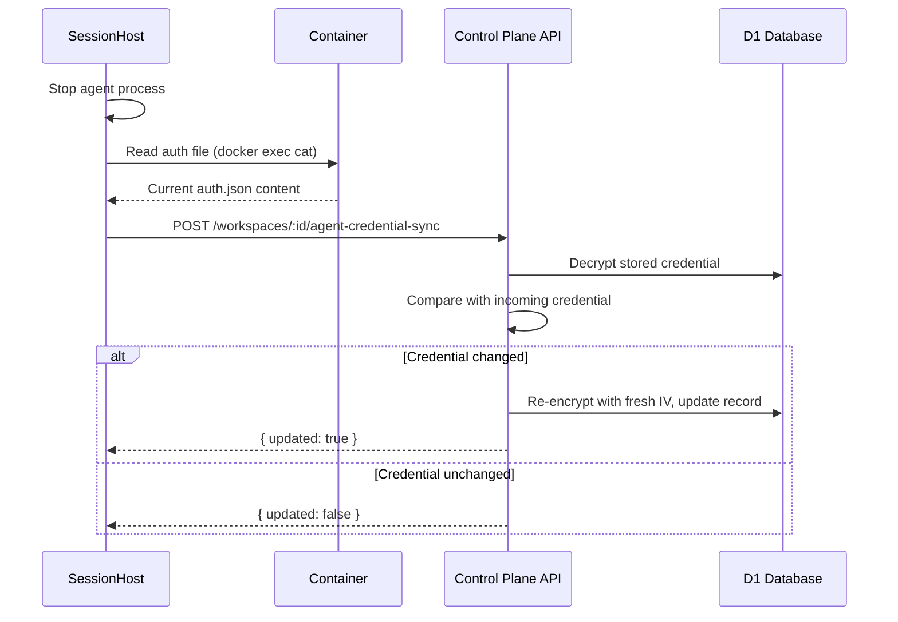

# Credential Security Architecture

## Overview

Simple Agent Manager uses a **Bring-Your-Own-Cloud (BYOC)** model where users provide their own cloud provider credentials (e.g., Hetzner API tokens). This document describes how these credentials are secured.

## Key Principle

**The platform does NOT have cloud provider credentials.** Users bring their own.

```
┌─────────────────────────────────────────────────────────────────┐
│                    CREDENTIAL FLOW                               │
├─────────────────────────────────────────────────────────────────┤
│                                                                  │
│   User                    Platform                    Cloud      │
│   ────                    ────────                    ─────      │
│                                                                  │
│   1. User enters          2. Platform encrypts       3. When     │
│      Hetzner token           with ENCRYPTION_KEY       workspace │
│      in Settings UI          and stores per-user       created,  │
│                              in D1 database            decrypt   │
│                                                        and use   │
│                                                                  │
│   ┌──────────┐           ┌──────────────┐          ┌──────────┐ │
│   │ Settings │ ────────► │  Encrypted   │ ───────► │ Hetzner  │ │
│   │   Form   │           │  in D1 (per  │          │   API    │ │
│   └──────────┘           │    user)     │          └──────────┘ │
│                          └──────────────┘                        │
│                                                                  │
└─────────────────────────────────────────────────────────────────┘
```

## Database Schema

User credentials are stored in the `credentials` table:

```sql
CREATE TABLE credentials (
  id TEXT PRIMARY KEY,
  user_id TEXT NOT NULL REFERENCES users(id) ON DELETE CASCADE,
  provider TEXT NOT NULL,           -- e.g., 'hetzner'
  encrypted_token TEXT NOT NULL,    -- AES-GCM encrypted
  iv TEXT NOT NULL,                 -- Unique initialization vector
  created_at TEXT NOT NULL,
  updated_at TEXT NOT NULL
);
```

### Key Security Features

1. **Per-user isolation**: Each credential is tied to a specific `user_id`
2. **Unique IV per credential**: Every encrypted token has its own initialization vector
3. **Cascade delete**: When a user is deleted, their credentials are automatically removed
4. **Provider separation**: Different providers stored as separate records

## Encryption Implementation

### Encryption (when user saves token)

```typescript
// 1. Generate unique IV for this credential
const iv = crypto.getRandomValues(new Uint8Array(12));

// 2. Import the credential encryption key (CREDENTIAL_ENCRYPTION_KEY or ENCRYPTION_KEY fallback)
const key = await crypto.subtle.importKey(
  'raw',
  base64Decode(getCredentialEncryptionKey(env)),
  { name: 'AES-GCM' },
  false,
  ['encrypt']
);

// 3. Encrypt the token
const encrypted = await crypto.subtle.encrypt(
  { name: 'AES-GCM', iv },
  key,
  new TextEncoder().encode(token)
);

// 4. Store encrypted_token + iv in database
```

### Decryption (when provisioning workspace)

```typescript
// 1. Fetch credential from database (WHERE user_id = currentUser.id)
const credential = await db.query.credentials.findFirst({
  where: and(
    eq(credentials.userId, userId),
    eq(credentials.provider, 'hetzner')
  )
});

// 2. Decrypt using stored IV
const key = await crypto.subtle.importKey(...);
const decrypted = await crypto.subtle.decrypt(
  { name: 'AES-GCM', iv: base64Decode(credential.iv) },
  key,
  base64Decode(credential.encryptedToken)
);

// 3. Use token for Hetzner API call
const hetznerClient = new HetznerClient(decryptedToken);
```

### Decryption (project runtime assets for workspace injection)

Project runtime env vars/files can be marked secret per entry. Secret entries are encrypted at rest in D1 and only decrypted when a workspace requests runtime assets via callback-authenticated API.

Runtime flow:

1. VM agent calls `GET /api/workspaces/:id/runtime-assets` with workspace callback token
2. Control plane loads workspace `project_id`
3. Control plane loads `project_runtime_env_vars` and `project_runtime_files`
4. Secret rows are decrypted in-memory using `CREDENTIAL_ENCRYPTION_KEY` (or `ENCRYPTION_KEY` fallback)
5. Decrypted payload is returned over HTTPS for immediate VM injection

## What This Means

### Platform Secrets (Cloudflare Worker Secrets)

These are set once during deployment and managed by the platform operator:

| Secret | Purpose | Who Sets It |
|--------|---------|-------------|
| `ENCRYPTION_KEY` | Shared fallback key | Platform operator |
| `CREDENTIAL_ENCRYPTION_KEY` | Encrypt user credentials (overrides `ENCRYPTION_KEY`) | Platform operator |
| `BETTER_AUTH_SECRET` | BetterAuth session management (overrides `ENCRYPTION_KEY`) | Platform operator |
| `GITHUB_WEBHOOK_SECRET` | Webhook HMAC verification (overrides `ENCRYPTION_KEY`) | Platform operator |
| `JWT_PRIVATE_KEY` | Sign authentication tokens | Platform operator |
| `JWT_PUBLIC_KEY` | Verify authentication tokens | Platform operator |
| `CF_API_TOKEN` | DNS operations for workspaces | Platform operator |
| `CF_ZONE_ID` | DNS zone for workspace subdomains | Platform operator |
| `GITHUB_CLIENT_*` | OAuth authentication | Platform operator |

### User Credentials (Encrypted in Database)

These are provided by each user through the Settings UI:

| Credential | Purpose | Who Provides It |
|------------|---------|-----------------|
| Hetzner API Token | Provision VMs | Each user |
| (Future: AWS, GCP, etc.) | Provision resources | Each user |

### Project Runtime Secrets (Encrypted in Database)

Projects support runtime env vars and runtime files as plaintext or secret values:

| Data | Storage | Encryption Behavior |
|------|---------|---------------------|
| Runtime env vars | `project_runtime_env_vars` | Secret rows use AES-GCM (`stored_value` + `value_iv`) |
| Runtime files | `project_runtime_files` | Secret rows use AES-GCM (`stored_content` + `content_iv`) |

Secret values are masked in project runtime-config list responses and only decrypted in callback-authenticated runtime asset responses for workspace provisioning.

## Security Considerations

### Why BYOC?

1. **Cost transparency**: Users pay their own cloud bills directly
2. **No platform liability**: Platform doesn't hold keys to expensive resources
3. **User control**: Users can revoke access anytime by regenerating their token
4. **Compliance**: Some organizations require credentials stay within their control

### Threat Model

| Threat | Mitigation |
|--------|------------|
| Database breach | Credentials encrypted with AES-GCM |
| Encryption key leak | Rotate the affected key, re-encrypt all credentials |
| Token in logs | Never log decrypted tokens |
| Cross-user access | Always filter by `user_id` in queries |
| Replay attacks | Unique IV per credential |

### What We Do NOT Do

- Store Hetzner tokens as environment variables
- Store Hetzner tokens as Worker secrets
- Share credentials between users
- Log decrypted credentials
- Send credentials to the browser

## Key Rotation

If `CREDENTIAL_ENCRYPTION_KEY` (or `ENCRYPTION_KEY`) needs to be rotated:

1. Deploy new key alongside old key
2. Re-encrypt all credentials with new key
3. Remove old key
4. This is a manual process requiring database migration

## OAuth Token Encryption (BetterAuth)

In addition to user-provided cloud credentials, the platform also encrypts **OAuth tokens** stored by BetterAuth during GitHub login. This is enabled via BetterAuth's built-in `encryptOAuthTokens` option in the account configuration.

### What Is Encrypted

The following fields in the `accounts` table are encrypted at rest:

| Field | Description |
|-------|-------------|
| `access_token` | GitHub OAuth access token used for API calls |
| `refresh_token` | GitHub OAuth refresh token (when available) |
| `id_token` | OpenID Connect ID token (when available) |

### How It Works

- BetterAuth uses the `secret` value (`BETTER_AUTH_SECRET`, falling back to `ENCRYPTION_KEY`) to encrypt these token fields before writing them to D1.
- Decryption happens transparently when BetterAuth reads account records.
- No application code changes are needed beyond enabling the flag — BetterAuth handles encryption/decryption internally.

### Migration of Existing Tokens

Existing plaintext tokens in the `accounts` table will be re-encrypted on the next user login. This works because `overrideUserInfoOnSignIn` is already enabled in the GitHub social provider config, which causes BetterAuth to overwrite account data (including tokens) on each sign-in.

### Why This Matters

Without this setting, GitHub OAuth tokens are stored as plaintext in D1. If the database were compromised, an attacker could use these tokens to access users' GitHub accounts (within the granted scopes: `read:user`, `user:email`). Encrypting them at rest ensures that a database breach alone does not expose usable tokens.

## Agent Credential Injection

Agent credentials (API keys and OAuth tokens) are injected into workspaces when an ACP session starts (see `session_host.go:startAgent()`). The injection mechanism varies by agent and credential type, determined by `gateway.go:getAgentCommandInfo()`:

| Agent | Credential Kind | Injection Method | Details |
|-------|----------------|------------------|---------|
| Claude Code | API Key | Env var `ANTHROPIC_API_KEY` | Standard env var injection |
| Claude Code | OAuth Token | Env var `CLAUDE_CODE_OAUTH_TOKEN` | Standard env var injection |
| OpenAI Codex | API Key | Env var `OPENAI_API_KEY` | Standard env var injection |
| OpenAI Codex | OAuth Token | File `~/.codex/auth.json` | Written into container with `0600` permissions; `NO_BROWSER=1` env var also set |
| Google Gemini | API Key | Env var `GEMINI_API_KEY` | Standard env var injection |

Env var injection is performed at `session_host.go:startAgent()` line `envVars = append(envVars, ...)`. File-based injection uses `gateway.go:writeAuthFileToContainer()`.

### OpenAI Codex auth.json Injection

Unlike Claude Code which accepts OAuth tokens via environment variable, `codex-acp` reads OAuth credentials from `~/.codex/auth.json`. There is no `CODEX_OAUTH_TOKEN` env var. The VM agent writes the auth.json file into the container before starting the agent process (see `session_host.go:startAgent()` — branches on `info.injectionMode == "auth-file"`).

When SAM injects task-scoped MCP servers into a Codex ACP session, it also writes a managed block into `~/.codex/config.toml`. That block uses Codex's native `mcp_servers.<id>.url` support and `bearer_token_env_var` so the SAM MCP bearer token stays in process environment rather than being written to disk.

The auth.json file contains:
- `OPENAI_API_KEY`: `null` — indicates OAuth mode (not API key)
- `tokens.access_token`: JWT (RS256, ~1hr expiry, auto-refreshed by codex-acp)
- `tokens.refresh_token`: Opaque refresh token (long-lived)
- `tokens.id_token`: OIDC JWT with optional `chatgpt_plan_type` claim
- `tokens.account_id`: ChatGPT account identifier

Users obtain this file by running `codex login` on their local machine and copying `~/.codex/auth.json`. The full JSON blob is stored as a single encrypted credential in D1 (validated by `validation.ts:validateOpenAICodexAuthJson()`).

Security measures for auth.json injection (see `gateway.go:writeAuthFileToContainer()`):
1. File written with `0600` permissions (owner read/write only)
2. Parent directory `.codex/` created with `0700` permissions
3. Content streamed via stdin to `docker exec` — avoids exposing secrets in process args or `/proc/<pid>/environ`
4. `NO_BROWSER=1` set by `session_host.go:startAgent()` to prevent codex-acp from attempting browser-based login
5. SAM-managed MCP config is merged into `~/.codex/config.toml` without storing the bearer token in the file; Codex reads the token from `bearer_token_env_var`

## Agent Credential Sync-Back (Token Refresh)

Some agent credential types use **rotating refresh tokens** — the token changes during agent sessions. OpenAI OAuth is the primary example: `codex-acp` refreshes the access token using the refresh token, and OpenAI invalidates the old refresh token immediately (single-use rotation). If the refreshed token is not synced back, the stored credential becomes stale and causes `invalid_grant` errors on the next session.

### How Sync-Back Works

After an agent session ends (`SessionHost.Stop()` or `SessionHost.Suspend()` in `session_host.go`), the VM agent reads the credential file from the container and sends any changes back to the control plane API:



### Sync-Back Guard Conditions

Preconditions checked upfront (see `session_host.go:syncCredentialOnStop()`):
1. **Injection mode is `auth-file`** — env var credentials are not modified by agents at runtime
2. **`CredentialSyncer` is configured** — the server must provide a syncer implementation

Runtime early-exit paths (logged as warnings, not returned as errors):
3. **`ContainerResolver` is nil or fails** — container no longer accessible (e.g., forcibly removed)
4. **Auth file is empty** — nothing to sync

### API Endpoint

`POST /api/workspaces/:id/agent-credential-sync` (callback JWT auth, not user auth):

| Field | Type | Description |
|-------|------|-------------|
| `agentType` | string | Agent type (e.g., `openai-codex`) |
| `credentialKind` | string | Credential kind (e.g., `oauth-token`) |
| `credential` | string | Full credential content (e.g., auth.json JSON) |

Responses:

| Response | Meaning |
|----------|---------|
| `{ success: false, reason: 'credential_not_found' }` | Credential was deleted while session was active |
| `{ success: true, updated: false }` | Credential unchanged, no write performed |
| `{ success: true, updated: true }` | Credential refreshed and re-encrypted in DB |

Input validation: `agentType` is validated against `AGENT_CATALOG` via `isValidAgentType()` from `packages/shared/src/agents.ts`. `credentialKind` must be `api-key` or `oauth-token`. Payload capped at 64 KB.

### Security Considerations

- Uses **workspace callback JWT** authentication (same as other VM agent → API callbacks)
- Credential comparison done server-side after decryption — the VM agent cannot read the stored credential
- Fresh **AES-GCM IV** generated on every update (never reuses IVs)
- Sync errors are logged but do not fail the session teardown (best-effort)
- Uses `callbackretry` exponential backoff for transient HTTP failures

## Project-Scoped Credential Overrides

Agent credentials (API keys and OAuth tokens) can be overridden at the **project level**. This allows a single user to run parallel projects with different credentials — for example, different Anthropic API keys billed to different clients, or a Claude Max OAuth token for personal projects alongside an API key for work projects.

### Schema

The `credentials` table includes a nullable `project_id` column referencing `projects.id` (migration 0042):

```sql
ALTER TABLE credentials ADD COLUMN project_id TEXT
  REFERENCES projects(id) ON DELETE CASCADE;

-- Two partial unique indexes enforce scope-aware uniqueness
CREATE UNIQUE INDEX credentials_user_scope_idx ON credentials(
  user_id, credential_type, provider, credential_kind
) WHERE project_id IS NULL;

CREATE UNIQUE INDEX credentials_project_scope_idx ON credentials(
  user_id, project_id, credential_type, provider, credential_kind
) WHERE project_id IS NOT NULL;
```

A user may hold both a user-scoped credential (`project_id IS NULL`) and a project-scoped credential for the same `agentType + credentialKind`. Resolution always prefers the more specific match.

### Resolution Order

`getDecryptedAgentKey(db, userId, agentType, key, projectId?)` in `apps/api/src/routes/credentials.ts` resolves in order:

1. **Project** (if `projectId` is provided and a project-scoped row exists)
2. **User** (row with `project_id IS NULL`)
3. **Platform** (entries in `platform_credentials`)
4. **null** (no credential available — agent start fails)

The workspace runtime callback in `apps/api/src/routes/workspaces/runtime.ts` fetches the workspace's `projectId` and forwards it to the resolver so VMs receive the correct scoped credential.

### OAuth Refresh (Codex) Preserves Scope

The `CodexRefreshLock` Durable Object (`apps/api/src/durable-objects/codex-refresh-lock.ts`) accepts a `projectId` field and looks up the matching scoped row before rotating. The refreshed token is written back to the same row, preserving the scope.

### API Endpoints

| Method | Path | Purpose |
|--------|------|---------|
| GET | `/api/projects/:id/credentials` | List project-scoped credentials for a project |
| PUT | `/api/projects/:id/credentials` | Create/update a project-scoped credential |
| DELETE | `/api/projects/:id/credentials/:agentType/:credentialKind` | Remove a project-scoped credential (falls back to user credential) |

All guarded by `requireOwnedProject` — cross-user access returns **404** (not 403) to avoid confirming the existence of other users' projects.

### Isolation Guarantees

- Every query filters by `userId = auth.userId AND project_id = :id` (isolation at the query layer, not only at the ownership check)
- Cross-user writes fail because `requireOwnedProject` rejects the request before the write is attempted
- `ON DELETE CASCADE` from `projects.id` removes all project-scoped credentials when a project is deleted
- `autoActivate` only deactivates other project-scoped rows for that project — user-scoped rows are untouched

## Related Documentation

- [Secrets Taxonomy](./secrets-taxonomy.md) - Full breakdown of all secrets
- [spec/003-browser-terminal-saas](../../specs/003-browser-terminal-saas/data-model.md) - Original data model
