# Architecture Walkthrough

A comprehensive guide to the Simple Agent Manager (SAM) architecture — how every system fits together, from the user's browser to the VM terminal.

---

## Table of Contents

1. [High-Level Architecture](#high-level-architecture)
2. [Request Routing](#request-routing)
3. [Control Plane — API Worker](#control-plane--api-worker)
4. [Web Application](#web-application)
5. [Data Layer](#data-layer)
6. [VM Agent](#vm-agent)
7. [Workspace Lifecycle](#workspace-lifecycle)
8. [Node Lifecycle](#node-lifecycle)
9. [Authentication & Security](#authentication--security)
10. [VM Provisioning](#vm-provisioning)
11. [Terminal & Agent Sessions](#terminal--agent-sessions)
12. [Deployment Pipeline](#deployment-pipeline)
13. [Infrastructure (Pulumi)](#infrastructure-pulumi)

---

## High-Level Architecture

SAM is a serverless platform for ephemeral AI coding environments. Users create cloud VMs running devcontainers with Claude Code pre-installed, then interact with them through a web terminal and agent chat interface.

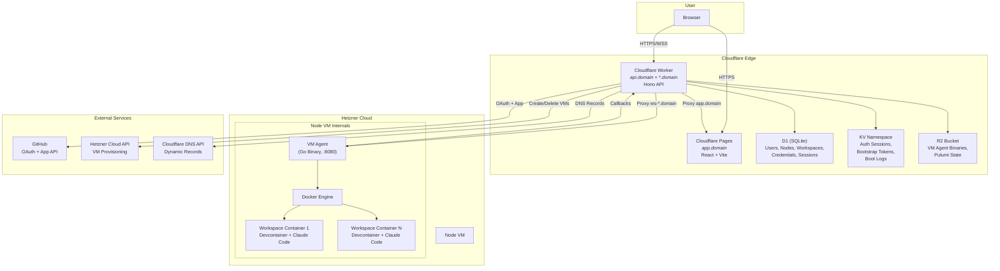
```mermaid
graph TB
    subgraph "User"
        Browser["Browser"]
    end

    subgraph "Cloudflare Edge"
        Pages["Cloudflare Pages<br/><i>app.domain</i><br/>React + Vite"]
        Worker["Cloudflare Worker<br/><i>api.domain + *.domain</i><br/>Hono API"]
        D1["D1 (SQLite)<br/>Users, Nodes, Workspaces,<br/>Credentials, Sessions"]
        KV["KV Namespace<br/>Auth Sessions,<br/>Bootstrap Tokens,<br/>Boot Logs"]
        R2["R2 Bucket<br/>VM Agent Binaries,<br/>Pulumi State"]
    end

    subgraph "Hetzner Cloud"
        Node1["Node VM"]
        subgraph "Node VM Internals"
            VMAgent["VM Agent<br/>(Go Binary, :8080)"]
            Docker["Docker Engine"]
            WS1["Workspace Container 1<br/>Devcontainer + Claude Code"]
            WS2["Workspace Container N<br/>Devcontainer + Claude Code"]
        end
    end

    subgraph "External Services"
        GitHub["GitHub<br/>OAuth + App API"]
        Hetzner["Hetzner Cloud API<br/>VM Provisioning"]
        CFDNS["Cloudflare DNS API<br/>Dynamic Records"]
    end

    Browser -->|"HTTPS"| Pages
    Browser -->|"HTTPS/WSS"| Worker
    Worker --> D1
    Worker --> KV
    Worker --> R2
    Worker -->|"Proxy ws-*.domain"| VMAgent
    Worker -->|"Proxy app.domain"| Pages
    Worker -->|"OAuth + App"| GitHub
    Worker -->|"Create/Delete VMs"| Hetzner
    Worker -->|"DNS Records"| CFDNS
    VMAgent --> Docker
    Docker --> WS1
    Docker --> WS2
    VMAgent -->|"Callbacks"| Worker
```

### Key Design Decisions

| Decision | Rationale |
|----------|-----------|
| **Cloudflare Worker as API + reverse proxy** | Single Worker handles API requests AND proxies workspace subdomain traffic to VMs |
| **D1 for persistent state** | SQLite at the edge — zero latency, zero management |
| **User-provided Hetzner tokens (BYOC)** | Users own their infrastructure; platform never stores cloud provider auth |
| **Callback-driven provisioning** | VMs POST `/ready` when bootstrapped — no polling required |
| **Dynamic DNS per workspace** | `ws-{id}.domain` resolves instantly; deleted when workspace stops |

---

## Request Routing

Every HTTP request to `*.simple-agent-manager.org` passes through the same Cloudflare Worker. The Worker uses the `Host` header to decide what to do.

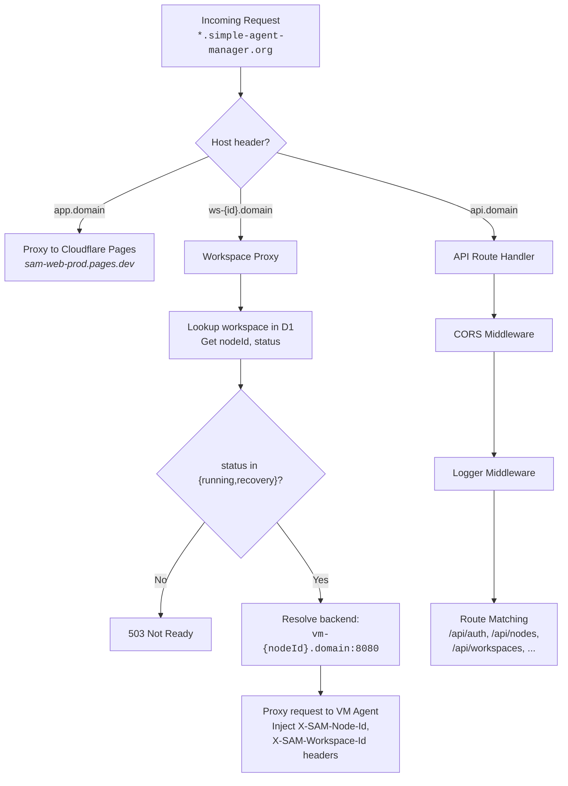
```mermaid
flowchart TD
    Request["Incoming Request<br/><code>*.simple-agent-manager.org</code>"]

    Request --> HostCheck{"Host header?"}

    HostCheck -->|"app.domain"| ProxyPages["Proxy to Cloudflare Pages<br/><i>sam-web-prod.pages.dev</i>"]
    HostCheck -->|"ws-{id}.domain"| WSProxy["Workspace Proxy"]
    HostCheck -->|"api.domain"| APIRoutes["API Route Handler"]

    WSProxy --> LookupDB["Lookup workspace in D1<br/>Get nodeId, status"]
    LookupDB --> StatusCheck{"status in {running,recovery}?"}
    StatusCheck -->|No| Return503["503 Not Ready"]
    StatusCheck -->|Yes| ResolveNode["Resolve backend:<br/><code>vm-{nodeId}.domain:8080</code>"]
    ResolveNode --> ProxyVM["Proxy request to VM Agent<br/>Inject X-SAM-Node-Id,<br/>X-SAM-Workspace-Id headers"]

    APIRoutes --> CORS["CORS Middleware"]
    CORS --> Logger["Logger Middleware"]
    Logger --> Routes["Route Matching<br/>/api/auth, /api/nodes,<br/>/api/workspaces, ..."]
```

### Subdomain Routing Rules

| Pattern | Destination | How |
|---------|-------------|-----|
| `app.{domain}` | Cloudflare Pages | Worker proxies to `{project}.pages.dev` |
| `api.{domain}` | Worker API routes | Direct handling by Hono router |
| `ws-{id}.{domain}` | VM Agent on port 8080 | Worker proxies via DNS-only `vm-{nodeId}.{domain}` |
| `*.{domain}` (other) | 404 | No matching route |

> **Why DNS-only backend hostnames?** Cloudflare Workers cannot fetch IP addresses directly (Error 1003). We create non-proxied DNS A records (`vm-{nodeId}.{domain}` → VM IP) and the Worker fetches through those hostnames.

---

## Control Plane — API Worker

The API Worker (`apps/api/`) is a Hono application running on Cloudflare Workers. It handles authentication, resource management, and proxying.

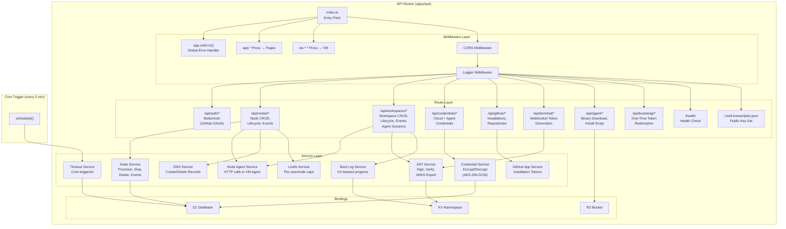
```mermaid
graph TB
    subgraph "API Worker (apps/api/)"
        Entry["index.ts<br/>Entry Point"]

        subgraph "Middleware Layer"
            ErrHandler["app.onError()<br/>Global Error Handler"]
            AppProxy["app.* Proxy → Pages"]
            WSProxy["ws-*.* Proxy → VM"]
            CORSMw["CORS Middleware"]
            LogMw["Logger Middleware"]
        end

        subgraph "Route Layer"
            Auth["/api/auth/*<br/>BetterAuth<br/>(GitHub OAuth)"]
            Nodes["/api/nodes/*<br/>Node CRUD,<br/>Lifecycle, Events"]
            Workspaces["/api/workspaces/*<br/>Workspace CRUD,<br/>Lifecycle, Events,<br/>Agent Sessions"]
            Creds["/api/credentials/*<br/>Cloud + Agent<br/>Credentials"]
            GH["/api/github/*<br/>Installations,<br/>Repositories"]
            Terminal["/api/terminal/*<br/>WebSocket Token<br/>Generation"]
            Agent["/api/agent/*<br/>Binary Download,<br/>Install Script"]
            Bootstrap["/api/bootstrap/*<br/>One-Time Token<br/>Redemption"]
            JWKS["/.well-known/jwks.json<br/>Public Key Set"]
            Health["/health<br/>Health Check"]
        end

        subgraph "Service Layer"
            NodeSvc["Node Service<br/>Provision, Stop,<br/>Delete, Events"]
            NodeAgentSvc["Node Agent Service<br/>HTTP calls to VM Agent"]
            JWTSvc["JWT Service<br/>Sign, Verify,<br/>JWKS Export"]
            DNSSvc["DNS Service<br/>Create/Delete Records"]
            CredSvc["Credential Service<br/>Encrypt/Decrypt<br/>(AES-256-GCM)"]
            GHAppSvc["GitHub App Service<br/>Installation Tokens"]
            LimitsSvc["Limits Service<br/>Per-user/node caps"]
            BootLogSvc["Boot Log Service<br/>KV-backed progress"]
            TimeoutSvc["Timeout Service<br/>Cron-triggered"]
        end

        subgraph "Bindings"
            D1B["D1 Database"]
            KVB["KV Namespace"]
            R2B["R2 Bucket"]
        end

        Entry --> ErrHandler
        Entry --> AppProxy
        Entry --> WSProxy
        Entry --> CORSMw
        CORSMw --> LogMw
        LogMw --> Auth & Nodes & Workspaces & Creds & GH & Terminal & Agent & Bootstrap & Health & JWKS

        Nodes --> NodeSvc
        Nodes --> NodeAgentSvc
        Workspaces --> NodeAgentSvc
        Workspaces --> JWTSvc
        Workspaces --> BootLogSvc
        Terminal --> JWTSvc
        Creds --> CredSvc
        GH --> GHAppSvc
        Nodes --> DNSSvc
        Nodes --> LimitsSvc

        NodeSvc --> D1B
        CredSvc --> D1B
        JWTSvc --> KVB
        BootLogSvc --> KVB
        Agent --> R2B
    end

    subgraph "Cron Trigger (every 5 min)"
        Cron["scheduled()"] --> TimeoutSvc
        TimeoutSvc --> D1B
    end
```

### Route Summary

| Route | Auth | Purpose |
|-------|------|---------|
| `/api/auth/*` | Public | GitHub OAuth sign-in/out, session management |
| `/api/nodes/*` | Required | Node CRUD, stop, delete, events, ready/heartbeat callbacks |
| `/api/workspaces/*` | Required | Workspace CRUD, stop, restart, delete, events, boot logs |
| `/api/workspaces/:id/agent-sessions/*` | Required | Create/list/stop agent sessions |
| `/api/credentials/*` | Required | Cloud provider + agent API key management |
| `/api/github/*` | Required | GitHub App installations, repository listing |
| `/api/terminal/token` | Required | Generate workspace JWT for WebSocket auth |
| `/api/agent/*` | Public | VM Agent binary download, version, install script |
| `/api/bootstrap/:token` | Token | One-time token redemption (VM → API) |
| `/.well-known/jwks.json` | Public | JWT public key set for VM Agent verification |
| `/health` | Public | Health check with version and limits |

---

## Web Application

The web UI (`apps/web/`) is a React SPA deployed to Cloudflare Pages, served through the Worker's `app.*` proxy.

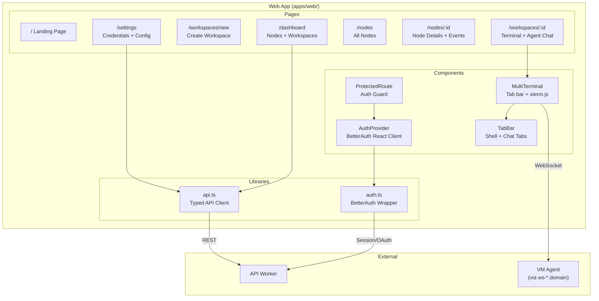
```mermaid
graph TB
    subgraph "Web App (apps/web/)"
        subgraph "Pages"
            Landing["/ Landing Page"]
            Dashboard["/dashboard<br/>Nodes + Workspaces"]
            CreateWS["/workspaces/new<br/>Create Workspace"]
            WSView["/workspaces/:id<br/>Terminal + Agent Chat"]
            NodeList["/nodes<br/>All Nodes"]
            NodeView["/nodes/:id<br/>Node Details + Events"]
            Settings["/settings<br/>Credentials + Config"]
        end

        subgraph "Components"
            AuthProvider["AuthProvider<br/>BetterAuth React Client"]
            ProtectedRoute["ProtectedRoute<br/>Auth Guard"]
            MultiTerminal["MultiTerminal<br/>Tab bar + xterm.js"]
            TabBar["TabBar<br/>Shell + Chat Tabs"]
        end

        subgraph "Libraries"
            APIClient["api.ts<br/>Typed API Client"]
            AuthLib["auth.ts<br/>BetterAuth Wrapper"]
        end
    end

    subgraph "External"
        API["API Worker"]
        VMAgent["VM Agent<br/>(via ws-*.domain)"]
    end

    AuthProvider --> AuthLib
    AuthLib -->|"Session/OAuth"| API
    ProtectedRoute --> AuthProvider
    Dashboard --> APIClient
    WSView --> MultiTerminal
    MultiTerminal -->|"WebSocket"| VMAgent
    MultiTerminal --> TabBar
    APIClient -->|"REST"| API
    Settings --> APIClient
```

### Key UI Features

- **Mobile-first design** — Single-column layouts, 56px+ touch targets, responsive text
- **Real-time terminal** — xterm.js with WebSocket reconnection and exponential backoff
- **Tab-based workspace view** — Shell terminals and agent chat sessions in tabs
- **Session persistence** — Tabs restored from VM Agent SQLite on page refresh

---

## Data Layer

All persistent state lives in Cloudflare's edge storage services.

### Entity Relationships

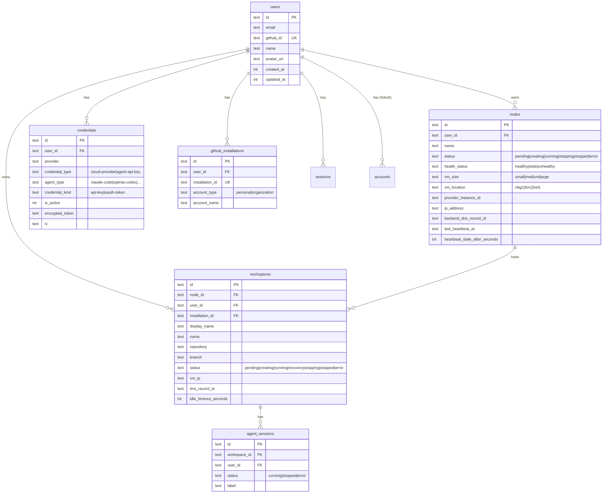
```mermaid
erDiagram
    users ||--o{ nodes : "owns"
    users ||--o{ workspaces : "owns"
    users ||--o{ credentials : "has"
    users ||--o{ github_installations : "has"
    users ||--o{ sessions : "has"
    users ||--o{ accounts : "has (OAuth)"
    nodes ||--o{ workspaces : "hosts"
    workspaces ||--o{ agent_sessions : "has"

    users {
        text id PK
        text email
        text github_id UK
        text name
        text avatar_url
        int created_at
        int updated_at
    }

    nodes {
        text id PK
        text user_id FK
        text name
        text status "pending|creating|running|stopping|stopped|error"
        text health_status "healthy|stale|unhealthy"
        text vm_size "small|medium|large"
        text vm_location "nbg1|fsn1|hel1"
        text provider_instance_id
        text ip_address
        text backend_dns_record_id
        text last_heartbeat_at
        int heartbeat_stale_after_seconds
    }

    workspaces {
        text id PK
        text node_id FK
        text user_id FK
        text installation_id FK
        text display_name
        text name
        text repository
        text branch
        text status "pending|creating|running|recovery|stopping|stopped|error"
        text vm_ip
        text dns_record_id
        int idle_timeout_seconds
    }

    credentials {
        text id PK
        text user_id FK
        text provider
        text credential_type "cloud-provider|agent-api-key"
        text agent_type "claude-code|openai-codex|..."
        text credential_kind "api-key|oauth-token"
        int is_active
        text encrypted_token
        text iv
    }

    agent_sessions {
        text id PK
        text workspace_id FK
        text user_id FK
        text status "running|stopped|error"
        text label
    }

    github_installations {
        text id PK
        text user_id FK
        text installation_id UK
        text account_type "personal|organization"
        text account_name
    }
```

### Storage Services

| Service | Binding | Purpose | Key Patterns |
|---------|---------|---------|--------------|
| **D1 (SQLite)** | `DATABASE` | All persistent state | Users, nodes, workspaces, credentials, sessions |
| **KV** | `KV` | Transient/session data | `session:{token}` → session data, `boot-log:{workspaceId}` → JSON progress, `bootstrap:{token}` → credential payload |
| **R2** | `R2` | Binary artifacts | `agents/vm-agent-linux-amd64`, `agents/version.json` |

### Credential Encryption

User credentials (Hetzner tokens, agent API keys) are encrypted at rest using AES-256-GCM with a per-credential random IV. The `ENCRYPTION_KEY` is a platform secret stored as a Cloudflare Worker secret.

```
Encrypt: plaintext + ENCRYPTION_KEY → { ciphertext, iv }  (stored in D1)
Decrypt: { ciphertext, iv } + ENCRYPTION_KEY → plaintext   (on-demand)
```

---

## VM Agent

The VM Agent (`packages/vm-agent/`) is a Go binary that runs on each Hetzner node. It manages Docker containers (workspaces), terminal PTY sessions, and Claude Code agent sessions.

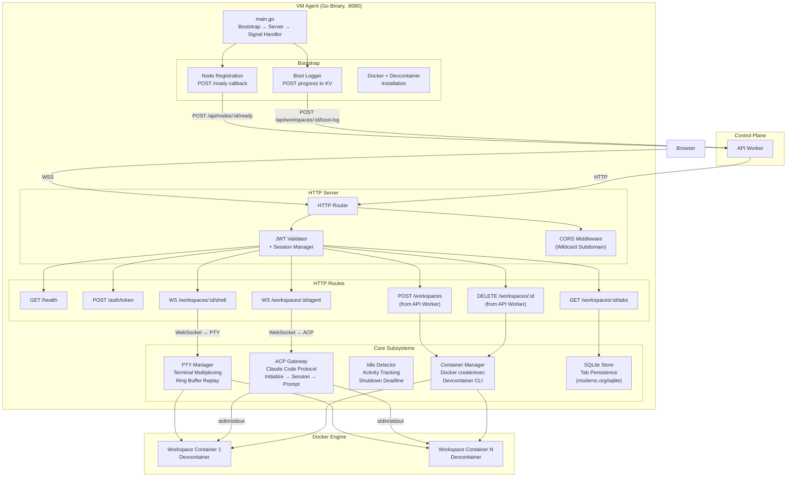
```mermaid
graph TB
    subgraph "VM Agent (Go Binary, :8080)"
        Main["main.go<br/>Bootstrap → Server → Signal Handler"]

        subgraph "HTTP Server"
            Router["HTTP Router"]
            AuthMw["JWT Validator<br/>+ Session Manager"]
            CORSMw["CORS Middleware<br/>(Wildcard Subdomain)"]
        end

        subgraph "Core Subsystems"
            PTYMgr["PTY Manager<br/>Terminal Multiplexing<br/>Ring Buffer Replay"]
            ContainerMgr["Container Manager<br/>Docker create/exec<br/>Devcontainer CLI"]
            IdleDetect["Idle Detector<br/>Activity Tracking<br/>Shutdown Deadline"]
            ACPGateway["ACP Gateway<br/>Claude Code Protocol<br/>Initialize → Session → Prompt"]
            Persistence["SQLite Store<br/>Tab Persistence<br/>(modernc.org/sqlite)"]
        end

        subgraph "Bootstrap"
            BootLog["Boot Logger<br/>POST progress to KV"]
            NodeReg["Node Registration<br/>POST /ready callback"]
            DockerSetup["Docker + Devcontainer<br/>Installation"]
        end

        subgraph "HTTP Routes"
            HealthR["GET /health"]
            AuthR["POST /auth/token"]
            ShellR["WS /workspaces/:id/shell"]
            AgentR["WS /workspaces/:id/agent"]
            TabsR["GET /workspaces/:id/tabs"]
            WSCreateR["POST /workspaces<br/>(from API Worker)"]
            WSDeleteR["DELETE /workspaces/:id<br/>(from API Worker)"]
        end
    end

    subgraph "Docker Engine"
        DC1["Workspace Container 1<br/>Devcontainer"]
        DC2["Workspace Container N<br/>Devcontainer"]
    end

    subgraph "Control Plane"
        API["API Worker"]
    end

    Browser["Browser"] -->|"WSS"| Router
    API -->|"HTTP"| Router
    Router --> AuthMw
    Router --> CORSMw
    AuthMw --> HealthR & AuthR & ShellR & AgentR & TabsR & WSCreateR & WSDeleteR

    ShellR -->|"WebSocket ↔ PTY"| PTYMgr
    AgentR -->|"WebSocket ↔ ACP"| ACPGateway
    TabsR --> Persistence
    WSCreateR --> ContainerMgr
    WSDeleteR --> ContainerMgr

    PTYMgr --> DC1 & DC2
    ACPGateway -->|"stdin/stdout"| DC1 & DC2
    ContainerMgr --> DC1 & DC2

    Main --> BootLog
    Main --> NodeReg
    NodeReg -->|"POST /api/nodes/:id/ready"| API
    BootLog -->|"POST /api/workspaces/:id/boot-log"| API
```

### VM Agent Subsystems

| Subsystem | Package | Responsibility |
|-----------|---------|---------------|
| **PTY Manager** | `internal/pty/` | Terminal session multiplexing, ring buffer for replay on reconnect, session lifecycle |
| **Container Manager** | `internal/container/` | Docker exec, devcontainer CLI, named volume management, git credential injection |
| **JWT Validator** | `internal/auth/` | Validates workspace JWTs via JWKS endpoint, extracts claims |
| **Session Manager** | `internal/auth/` | HTTP cookie-based sessions, TTL cleanup |
| **ACP Gateway** | `internal/acp/` | ACP SDK protocol — Initialize → NewSession → Prompt — streams to WebSocket |
| **Idle Detector** | `internal/idle/` | Tracks last activity timestamp, computes shutdown deadline |
| **Persistence** | `internal/persistence/` | SQLite storage for workspace tabs (survives browser refresh) |
| **Boot Logger** | `internal/bootlog/` | Reports provisioning progress to control plane KV |

### Key Go Dependencies

| Dependency | Version | Purpose |
|------------|---------|---------|
| `github.com/coder/acp-go-sdk` | v0.6.3 | Agent Control Protocol for Claude Code |
| `github.com/creack/pty` | v1.1.21 | PTY allocation and management |
| `github.com/gorilla/websocket` | v1.5.3 | WebSocket server |
| `github.com/golang-jwt/jwt` | v5.2.1 | JWT validation |
| `modernc.org/sqlite` | v1.45.0 | Pure Go SQLite (no CGO) |

---

## Workspace Lifecycle

Workspaces transition through a defined state machine. Transitions are triggered by API calls and VM Agent callbacks.

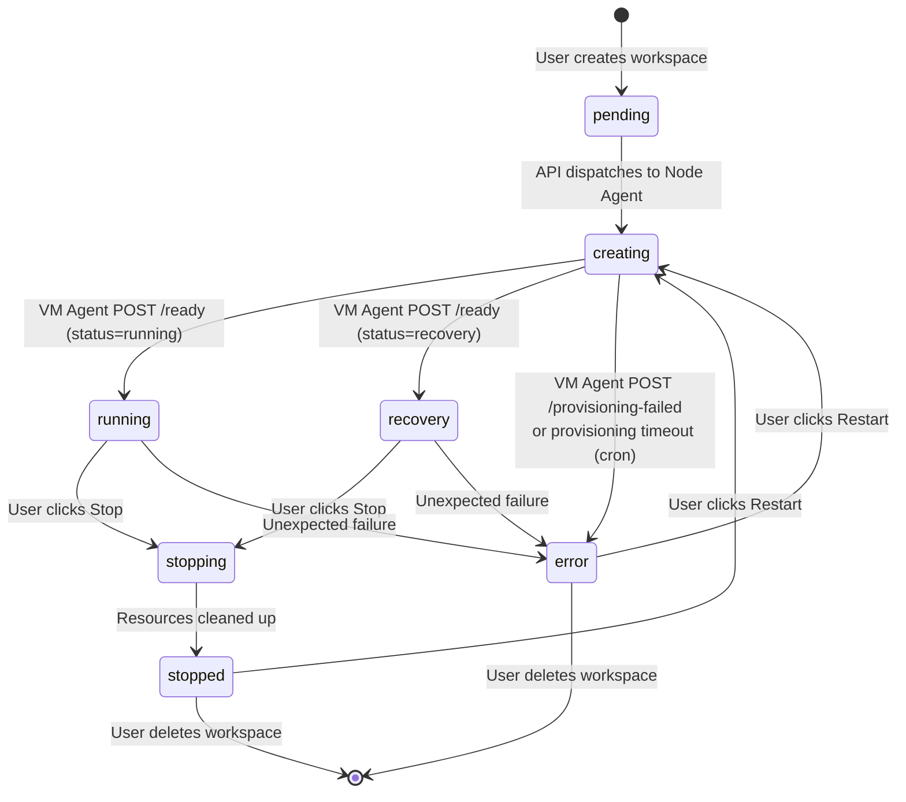
```mermaid
stateDiagram-v2
    [*] --> pending : User creates workspace

    pending --> creating : API dispatches to Node Agent
    creating --> running : VM Agent POST /ready (status=running)
    creating --> recovery : VM Agent POST /ready (status=recovery)
    creating --> error : VM Agent POST /provisioning-failed<br/>or provisioning timeout (cron)

    running --> stopping : User clicks Stop
    recovery --> stopping : User clicks Stop
    stopping --> stopped : Resources cleaned up

    running --> error : Unexpected failure
    recovery --> error : Unexpected failure

    stopped --> creating : User clicks Restart
    error --> creating : User clicks Restart

    stopped --> [*] : User deletes workspace
    error --> [*] : User deletes workspace
```

### Workspace Creation Flow

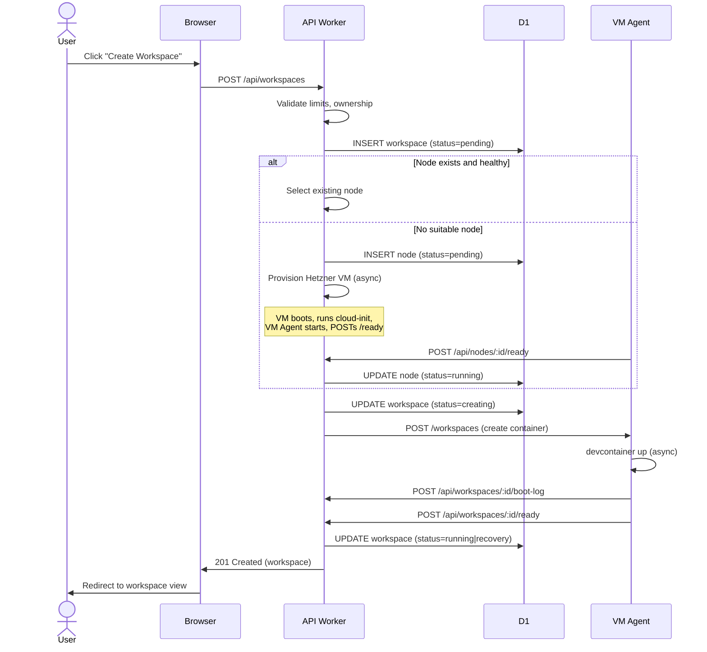
```mermaid
sequenceDiagram
    actor User
    participant Browser
    participant API as API Worker
    participant D1
    participant NodeAgent as VM Agent

    User->>Browser: Click "Create Workspace"
    Browser->>API: POST /api/workspaces
    API->>API: Validate limits, ownership
    API->>D1: INSERT workspace (status=pending)

    alt Node exists and healthy
        API->>API: Select existing node
    else No suitable node
        API->>D1: INSERT node (status=pending)
        API->>API: Provision Hetzner VM (async)
        Note over API: VM boots, runs cloud-init,<br/>VM Agent starts, POSTs /ready
        NodeAgent->>API: POST /api/nodes/:id/ready
        API->>D1: UPDATE node (status=running)
    end

    API->>D1: UPDATE workspace (status=creating)
    API->>NodeAgent: POST /workspaces (create container)
    NodeAgent->>NodeAgent: devcontainer up (async)
    NodeAgent->>API: POST /api/workspaces/:id/boot-log
    NodeAgent->>API: POST /api/workspaces/:id/ready
    API->>D1: UPDATE workspace (status=running|recovery)
    API->>Browser: 201 Created (workspace)
    Browser->>User: Redirect to workspace view
```

---

## Node Lifecycle

Nodes are Hetzner VMs that host one or more workspace containers.

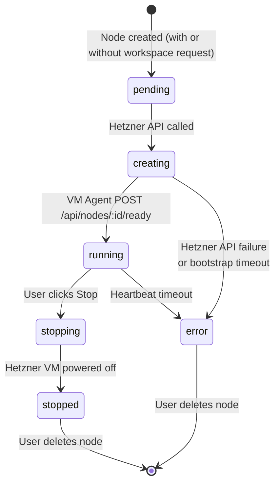
```mermaid
stateDiagram-v2
    [*] --> pending : Node created (with or without workspace request)

    pending --> creating : Hetzner API called
    creating --> running : VM Agent POST /api/nodes/:id/ready
    creating --> error : Hetzner API failure<br/>or bootstrap timeout

    running --> stopping : User clicks Stop
    stopping --> stopped : Hetzner VM powered off

    running --> error : Heartbeat timeout

    stopped --> [*] : User deletes node
    error --> [*] : User deletes node
```

### Node Health Status

The VM Agent sends periodic heartbeats. Health is derived from heartbeat freshness:

| Health Status | Condition |
|---------------|-----------|
| `healthy` | Last heartbeat within `heartbeatStaleAfterSeconds` (default: 180s) |
| `stale` | Heartbeat older than threshold but node still `running` |
| `unhealthy` | No heartbeat received or node not running |

---

## Authentication & Security

### Authentication Flow

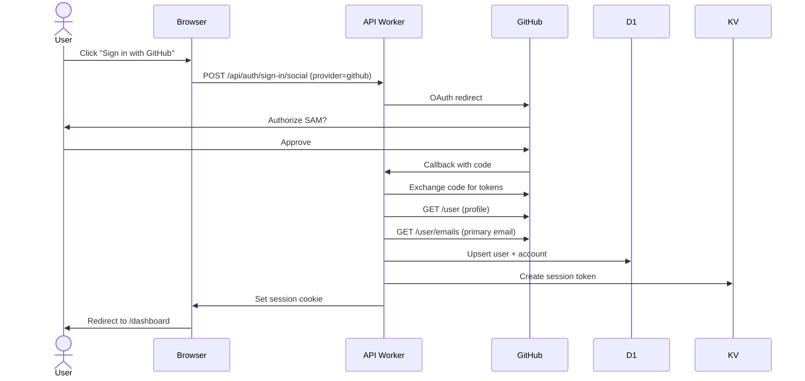
```mermaid
sequenceDiagram
    actor User
    participant Browser
    participant API as API Worker
    participant GitHub
    participant D1
    participant KV

    User->>Browser: Click "Sign in with GitHub"
    Browser->>API: POST /api/auth/sign-in/social (provider=github)
    API->>GitHub: OAuth redirect
    GitHub->>User: Authorize SAM?
    User->>GitHub: Approve
    GitHub->>API: Callback with code
    API->>GitHub: Exchange code for tokens
    API->>GitHub: GET /user (profile)
    API->>GitHub: GET /user/emails (primary email)
    API->>D1: Upsert user + account
    API->>KV: Create session token
    API->>Browser: Set session cookie
    Browser->>User: Redirect to /dashboard
```

### Security Model

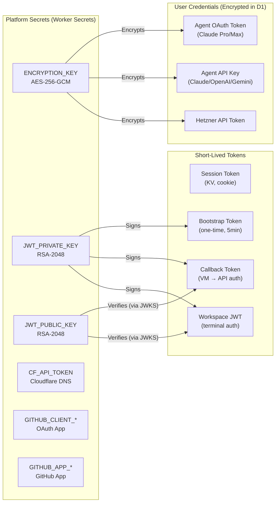
```mermaid
graph LR
    subgraph "Platform Secrets (Worker Secrets)"
        EK["ENCRYPTION_KEY<br/>AES-256-GCM"]
        JWT_PRIV["JWT_PRIVATE_KEY<br/>RSA-2048"]
        JWT_PUB["JWT_PUBLIC_KEY<br/>RSA-2048"]
        CF["CF_API_TOKEN<br/>Cloudflare DNS"]
        GH_OAUTH["GITHUB_CLIENT_*<br/>OAuth App"]
        GH_APP["GITHUB_APP_*<br/>GitHub App"]
    end

    subgraph "User Credentials (Encrypted in D1)"
        HETZNER["Hetzner API Token"]
        AGENT_KEY["Agent API Key<br/>(Claude/OpenAI/Gemini)"]
        OAUTH_TOK["Agent OAuth Token<br/>(Claude Pro/Max)"]
    end

    subgraph "Short-Lived Tokens"
        SESSION["Session Token<br/>(KV, cookie)"]
        WS_JWT["Workspace JWT<br/>(terminal auth)"]
        BOOTSTRAP["Bootstrap Token<br/>(one-time, 5min)"]
        CALLBACK["Callback Token<br/>(VM → API auth)"]
    end

    EK -->|"Encrypts"| HETZNER & AGENT_KEY & OAUTH_TOK
    JWT_PRIV -->|"Signs"| WS_JWT & CALLBACK & BOOTSTRAP
    JWT_PUB -->|"Verifies (via JWKS)"| WS_JWT & CALLBACK
```

### Token Types

| Token | Lifetime | Purpose | Where Validated |
|-------|----------|---------|-----------------|
| **Session cookie** | Hours | Browser auth (BetterAuth) | API Worker |
| **Workspace JWT** | Minutes | Terminal WebSocket auth | VM Agent (via JWKS) |
| **Bootstrap token** | 5 minutes | One-time VM credential injection | API Worker |
| **Callback token** | Minutes | VM Agent → API callbacks | API Worker |

---

## VM Provisioning

When a new node is created, the VM bootstraps itself through cloud-init and the VM Agent.

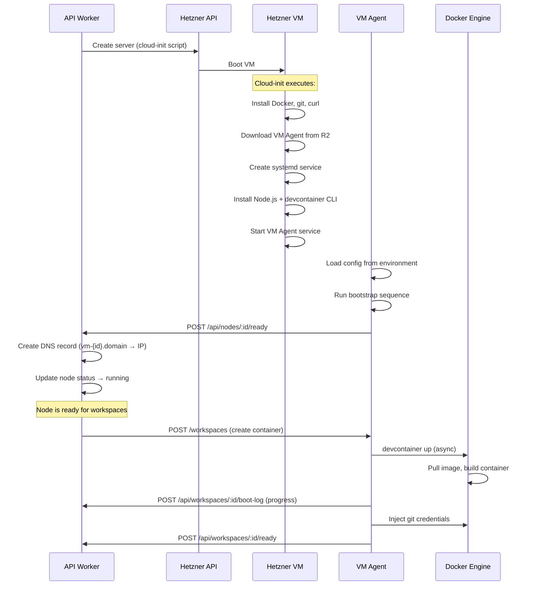
```mermaid
sequenceDiagram
    participant API as API Worker
    participant Hetzner as Hetzner API
    participant VM as Hetzner VM
    participant Agent as VM Agent
    participant Docker as Docker Engine

    API->>Hetzner: Create server (cloud-init script)
    Hetzner->>VM: Boot VM

    Note over VM: Cloud-init executes:
    VM->>VM: Install Docker, git, curl
    VM->>VM: Download VM Agent from R2
    VM->>VM: Create systemd service
    VM->>VM: Install Node.js + devcontainer CLI
    VM->>VM: Start VM Agent service

    Agent->>Agent: Load config from environment
    Agent->>Agent: Run bootstrap sequence
    Agent->>API: POST /api/nodes/:id/ready
    API->>API: Create DNS record (vm-{id}.domain → IP)
    API->>API: Update node status → running

    Note over API: Node is ready for workspaces

    API->>Agent: POST /workspaces (create container)
    Agent->>Docker: devcontainer up (async)
    Docker->>Docker: Pull image, build container
    Agent->>API: POST /api/workspaces/:id/boot-log (progress)
    Agent->>Docker: Inject git credentials
    Agent->>API: POST /api/workspaces/:id/ready
```

### Cloud-Init Configuration

The cloud-init template (`packages/cloud-init/src/template.ts`) creates a fully provisioned VM with:

1. **System packages** — Docker, git, curl, jq
2. **VM Agent binary** — Downloaded from R2 via `/api/agent/download`
3. **Systemd service** — Auto-restart, environment injection (NODE_ID, CONTROL_PLANE_URL, CALLBACK_TOKEN)
4. **Node.js + devcontainer CLI** — For building devcontainer images
5. **Config file** — Written to `/etc/workspace/config.json`

> **No credentials are embedded in cloud-init.** The VM Agent uses a one-time callback token to fetch credentials from the control plane during bootstrap.

---

## Terminal & Agent Sessions

### Terminal WebSocket Flow

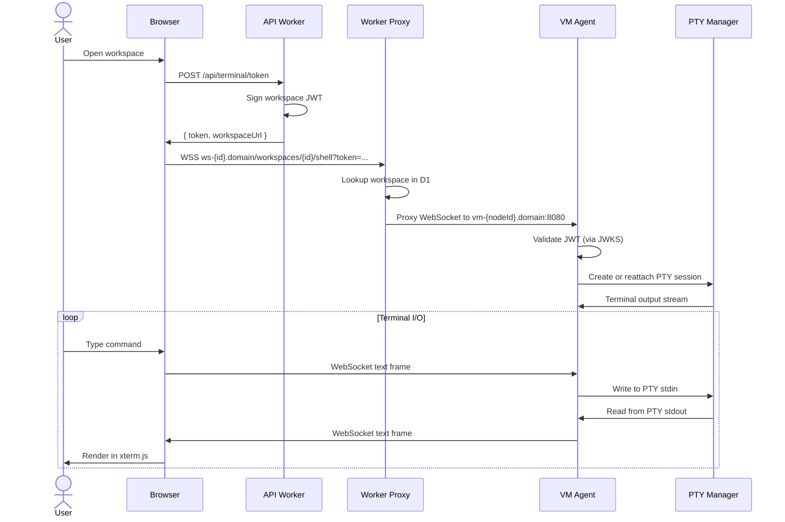
```mermaid
sequenceDiagram
    actor User
    participant Browser
    participant API as API Worker
    participant Worker as Worker Proxy
    participant Agent as VM Agent
    participant PTY as PTY Manager

    User->>Browser: Open workspace
    Browser->>API: POST /api/terminal/token
    API->>API: Sign workspace JWT
    API->>Browser: { token, workspaceUrl }

    Browser->>Worker: WSS ws-{id}.domain/workspaces/{id}/shell?token=...
    Worker->>Worker: Lookup workspace in D1
    Worker->>Agent: Proxy WebSocket to vm-{nodeId}.domain:8080

    Agent->>Agent: Validate JWT (via JWKS)
    Agent->>PTY: Create or reattach PTY session
    PTY->>Agent: Terminal output stream

    loop Terminal I/O
        User->>Browser: Type command
        Browser->>Agent: WebSocket text frame
        Agent->>PTY: Write to PTY stdin
        PTY->>Agent: Read from PTY stdout
        Agent->>Browser: WebSocket text frame
        Browser->>User: Render in xterm.js
    end
```

### Agent Session (ACP) Flow

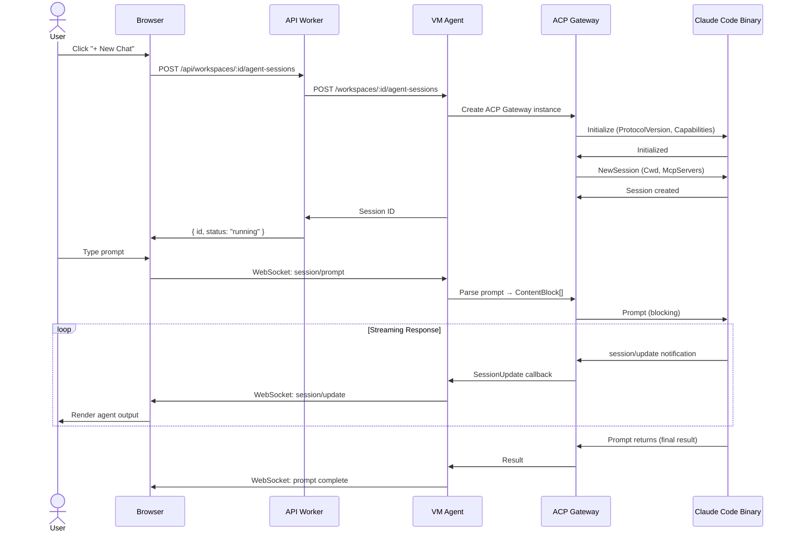
```mermaid
sequenceDiagram
    actor User
    participant Browser
    participant API as API Worker
    participant Agent as VM Agent
    participant ACP as ACP Gateway
    participant Claude as Claude Code Binary

    User->>Browser: Click "+ New Chat"
    Browser->>API: POST /api/workspaces/:id/agent-sessions
    API->>Agent: POST /workspaces/:id/agent-sessions
    Agent->>ACP: Create ACP Gateway instance
    ACP->>Claude: Initialize (ProtocolVersion, Capabilities)
    Claude->>ACP: Initialized
    ACP->>Claude: NewSession (Cwd, McpServers)
    Claude->>ACP: Session created
    Agent->>API: Session ID
    API->>Browser: { id, status: "running" }

    User->>Browser: Type prompt
    Browser->>Agent: WebSocket: session/prompt
    Agent->>ACP: Parse prompt → ContentBlock[]
    ACP->>Claude: Prompt (blocking)

    loop Streaming Response
        Claude->>ACP: session/update notification
        ACP->>Agent: SessionUpdate callback
        Agent->>Browser: WebSocket: session/update
        Browser->>User: Render agent output
    end

    Claude->>ACP: Prompt returns (final result)
    ACP->>Agent: Result
    Agent->>Browser: WebSocket: prompt complete
```

---

## Deployment Pipeline

### CI/CD Workflows

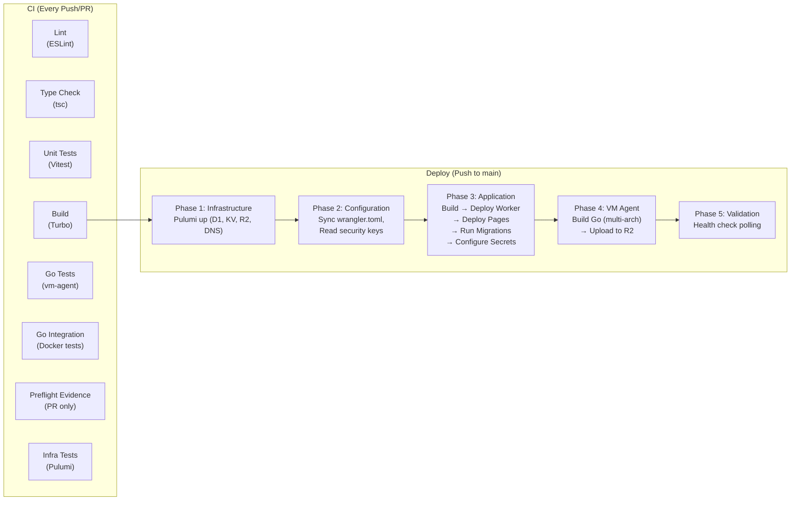
```mermaid
flowchart LR
    subgraph "CI (Every Push/PR)"
        Lint["Lint<br/>(ESLint)"]
        TypeCheck["Type Check<br/>(tsc)"]
        Test["Unit Tests<br/>(Vitest)"]
        Build["Build<br/>(Turbo)"]
        GoTest["Go Tests<br/>(vm-agent)"]
        GoInteg["Go Integration<br/>(Docker tests)"]
        Preflight["Preflight Evidence<br/>(PR only)"]
        InfraTest["Infra Tests<br/>(Pulumi)"]
    end

    subgraph "Deploy (Push to main)"
        direction TB
        P1["Phase 1: Infrastructure<br/>Pulumi up (D1, KV, R2, DNS)"]
        P2["Phase 2: Configuration<br/>Sync wrangler.toml,<br/>Read security keys"]
        P3["Phase 3: Application<br/>Build → Deploy Worker<br/>→ Deploy Pages<br/>→ Run Migrations<br/>→ Configure Secrets"]
        P4["Phase 4: VM Agent<br/>Build Go (multi-arch)<br/>→ Upload to R2"]
        P5["Phase 5: Validation<br/>Health check polling"]

        P1 --> P2 --> P3 --> P4 --> P5
    end

    Build --> P1
```

### Deployment Architecture

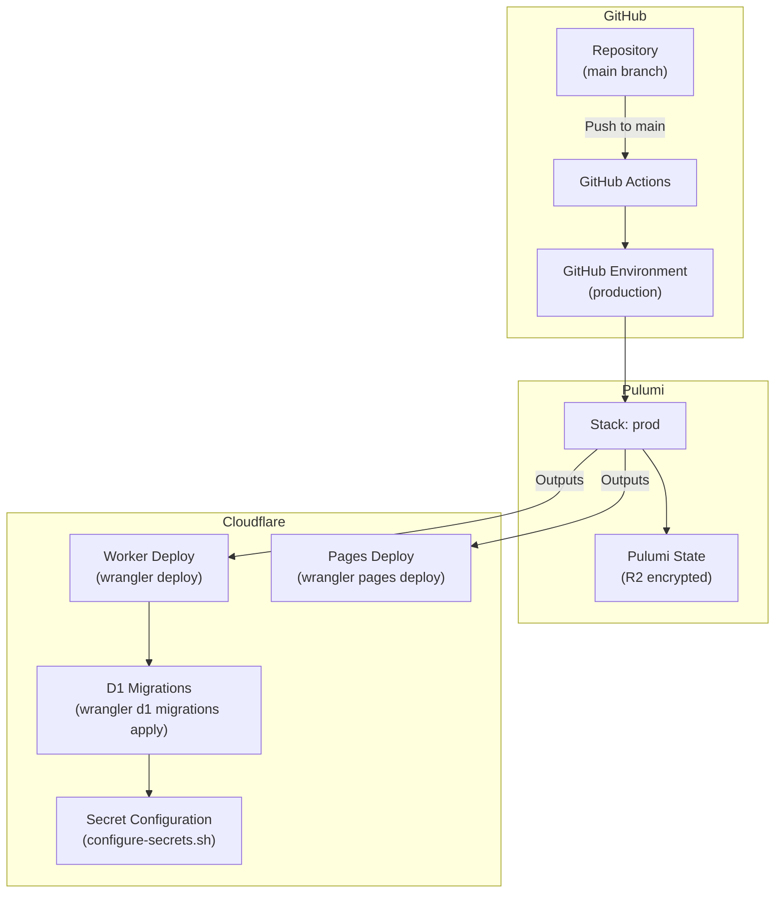
```mermaid
graph TB
    subgraph "GitHub"
        Repo["Repository<br/>(main branch)"]
        Actions["GitHub Actions"]
        Secrets["GitHub Environment<br/>(production)"]
    end

    subgraph "Pulumi"
        State["Pulumi State<br/>(R2 encrypted)"]
        Stack["Stack: prod"]
    end

    subgraph "Cloudflare"
        WorkerDeploy["Worker Deploy<br/>(wrangler deploy)"]
        PagesDeploy["Pages Deploy<br/>(wrangler pages deploy)"]
        D1Migrate["D1 Migrations<br/>(wrangler d1 migrations apply)"]
        SecretConfig["Secret Configuration<br/>(configure-secrets.sh)"]
    end

    Repo -->|"Push to main"| Actions
    Actions --> Secrets
    Secrets --> Stack
    Stack --> State
    Stack -->|"Outputs"| WorkerDeploy
    Stack -->|"Outputs"| PagesDeploy
    WorkerDeploy --> D1Migrate
    D1Migrate --> SecretConfig
```

---

## Infrastructure (Pulumi)

Infrastructure is defined as code in `infra/` using Pulumi with TypeScript.

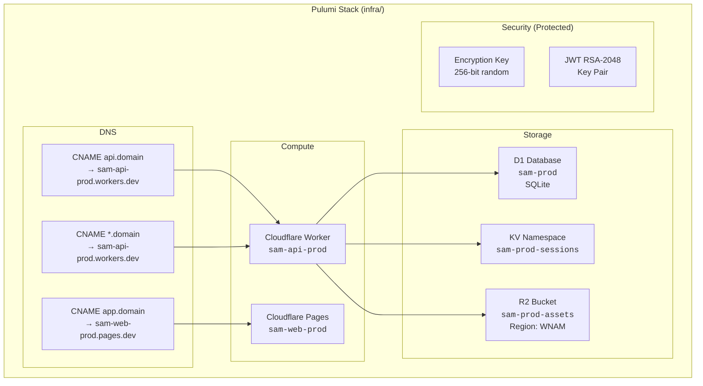
```mermaid
graph TB
    subgraph "Pulumi Stack (infra/)"
        subgraph "Compute"
            Worker["Cloudflare Worker<br/><code>sam-api-prod</code>"]
            Pages["Cloudflare Pages<br/><code>sam-web-prod</code>"]
        end

        subgraph "Storage"
            D1["D1 Database<br/><code>sam-prod</code><br/>SQLite"]
            KV["KV Namespace<br/><code>sam-prod-sessions</code>"]
            R2["R2 Bucket<br/><code>sam-prod-assets</code><br/>Region: WNAM"]
        end

        subgraph "DNS"
            APIDns["CNAME api.domain<br/>→ sam-api-prod.workers.dev"]
            AppDns["CNAME app.domain<br/>→ sam-web-prod.pages.dev"]
            WildDns["CNAME *.domain<br/>→ sam-api-prod.workers.dev"]
        end

        subgraph "Security (Protected)"
            EncKey["Encryption Key<br/>256-bit random"]
            JWTKeys["JWT RSA-2048<br/>Key Pair"]
        end
    end

    Worker --> D1 & KV & R2
    APIDns --> Worker
    WildDns --> Worker
    AppDns --> Pages
```

### Resource Details

| Resource | Pulumi Type | Name Pattern | Notes |
|----------|------------|--------------|-------|
| D1 Database | `cloudflare.D1Database` | `{prefix}-{stack}` | SQLite at edge |
| KV Namespace | `cloudflare.WorkersKvNamespace` | `{prefix}-{stack}-sessions` | Transient data |
| R2 Bucket | `cloudflare.R2Bucket` | `{prefix}-{stack}-assets` | WNAM region |
| DNS (API) | `cloudflare.Record` | `api.{domain}` | CNAME, proxied |
| DNS (App) | `cloudflare.Record` | `app.{domain}` | CNAME, proxied |
| DNS (Wildcard) | `cloudflare.Record` | `*.{domain}` | CNAME, proxied |
| Encryption Key | `random.RandomId` | — | 32 bytes, base64, protected |
| JWT Keys | `tls.PrivateKey` | — | RSA-2048, PKCS#8, protected |

---

## Appendix: Key File Locations

| Component | Path | Language |
|-----------|------|----------|
| API entry | `apps/api/src/index.ts` | TypeScript |
| DB schema | `apps/api/src/db/schema.ts` | TypeScript |
| API routes | `apps/api/src/routes/*.ts` | TypeScript |
| API services | `apps/api/src/services/*.ts` | TypeScript |
| Web entry | `apps/web/src/main.tsx` | TypeScript |
| Web pages | `apps/web/src/pages/*.tsx` | TypeScript |
| API client | `apps/web/src/lib/api.ts` | TypeScript |
| Shared types | `packages/shared/src/types.ts` | TypeScript |
| Provider | `packages/providers/src/hetzner.ts` | TypeScript |
| Cloud-init | `packages/cloud-init/src/template.ts` | TypeScript |
| Terminal UI | `packages/terminal/src/*.tsx` | TypeScript |
| VM Agent | `packages/vm-agent/main.go` | Go |
| Agent server | `packages/vm-agent/internal/server/` | Go |
| ACP gateway | `packages/vm-agent/internal/acp/` | Go |
| PTY manager | `packages/vm-agent/internal/pty/` | Go |
| Infra | `infra/resources/*.ts` | TypeScript |
| Deploy CI | `.github/workflows/deploy.yml` | YAML |
| Wrangler config | `apps/api/wrangler.toml` | TOML |
