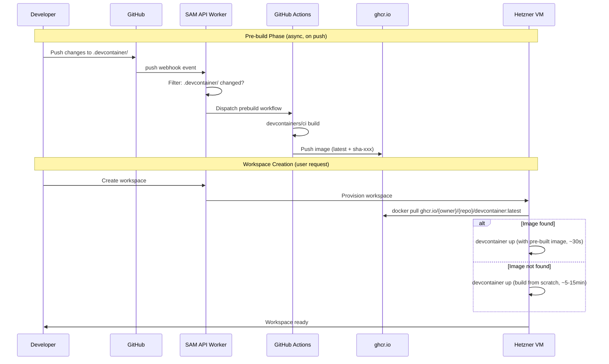

# Design: Devcontainer Prebuild Acceleration

**Status**: Draft
**Date**: 2026-03-09
**Author**: AI-assisted

## Problem

Workspace creation is slow. The bottleneck is the devcontainer build step, which runs `devcontainer up` from scratch on every workspace bootstrap (`packages/vm-agent/internal/bootstrap/bootstrap.go:ensureDevcontainerReady()`). This builds the Docker image, installs devcontainer Features, and starts the container — taking 5-15 minutes per workspace depending on the complexity of the user's `devcontainer.json`.

Every workspace build repeats this work even when the devcontainer configuration hasn't changed. For repos that rarely update their `.devcontainer/` directory, this is entirely wasted time.

## Goal

Reduce devcontainer instantiation from minutes to seconds by pre-building images when the configuration changes and pulling them at workspace creation time.

## Current Flow

```
User creates workspace
  → VM agent clones repo (bootstrap.go:ensureRepositoryReady)
  → VM agent runs `devcontainer up` (bootstrap.go:ensureDevcontainerReady)
    → Docker builds image from Dockerfile/devcontainer.json
    → Installs devcontainer Features (node, git, gh, etc.)
    → Runs lifecycle commands (onCreateCommand, etc.)
    → Container starts
  → Total: 5-15 minutes
```

The cloud-init template (`packages/cloud-init/src/template.ts`) also runs `devcontainer up` during initial node provisioning, adding to the first-workspace delay.

## Proposed Flow

```
.devcontainer/ changes pushed to repo
  → GitHub webhook triggers build workflow
  → GitHub Actions builds devcontainer image
  → Image pushed to container registry
  → Tagged with content hash + latest

User creates workspace
  → VM agent clones repo
  → VM agent checks registry for pre-built image
  → If found: docker pull (10-30 seconds)
  → If not found: fallback to devcontainer up (current behavior)
  → Container starts
  → Total: 30-60 seconds (pre-built) or 5-15 minutes (fallback)
```

## Design Decisions

### Decision 1: Trigger Mechanism — GitHub App Webhook

SAM already has a GitHub App integration. We can use the `push` webhook event filtered to `.devcontainer/**` path changes to trigger pre-builds.

**How it works:**
1. SAM's GitHub App receives `push` events (already configured)
2. API Worker filters for commits touching `.devcontainer/` paths
3. Worker dispatches a GitHub Actions workflow via the GitHub API (`POST /repos/{owner}/{repo}/actions/workflows/{workflow_id}/dispatches`)
4. The workflow builds and pushes the image

**Alternative considered:** Repository-level webhooks. Rejected because SAM's GitHub App already receives push events, and using it avoids requiring users to configure additional webhooks per repository.

**Alternative considered:** Polling for changes. Rejected — webhooks are real-time and more efficient.

### Decision 2: Build System — GitHub Actions + `devcontainers/ci`

The `devcontainers/ci` GitHub Action (v0.3) is the standard tool for pre-building devcontainer images. It handles Feature installation, metadata labeling, and cache management automatically.

**Workflow template** (to be provided to user repos or run in SAM's infrastructure):

```yaml
name: Prebuild Dev Container
on:
  workflow_dispatch:
    inputs:
      repo_ref:
        description: 'Git ref to build'
        required: true
        default: 'main'

jobs:
  prebuild:
    runs-on: ubuntu-latest
    permissions:
      packages: write
      contents: read
    steps:
      - uses: actions/checkout@v4
        with:
          ref: ${{ inputs.repo_ref }}

      - name: Login to GHCR
        uses: docker/login-action@v3
        with:
          registry: ghcr.io
          username: ${{ github.actor }}
          password: ${{ secrets.GITHUB_TOKEN }}

      - name: Pre-build dev container image
        uses: devcontainers/ci@v0.3
        with:
          imageName: ghcr.io/${{ github.repository }}/devcontainer
          cacheFrom: ghcr.io/${{ github.repository }}/devcontainer
          push: always
```

**Key advantage:** The `devcontainers/ci` action embeds devcontainer metadata as image labels, so `devcontainer up` with the pre-built image automatically picks up all settings without needing the original `devcontainer.json`.

### Decision 3: Container Registry — GitHub Container Registry (Primary) + Cloudflare Serverless Registry (Future)

**Primary: GitHub Container Registry (ghcr.io)**
- Currently free for all GitHub accounts
- Native `GITHUB_TOKEN` authentication in Actions (no PAT needed)
- OCI-compliant, supports standard `docker pull`
- Excellent integration with the repos SAM already manages
- Public images allow anonymous pulls from Hetzner VMs without credential setup

**Future option: Cloudflare Serverless Registry**
- Open-source OCI registry deployed as a Cloudflare Worker with R2 storage
- Zero egress fees (R2 has no egress charges)
- Registry fallback feature — can mirror from ghcr.io on cache miss
- Would eliminate dependency on GitHub's "currently free" pricing
- Could be deployed as part of SAM's existing Cloudflare infrastructure

**Cloudflare Managed Registry** (`registry.cloudflare.com`) was considered but is tightly coupled to the `wrangler deploy` workflow and not designed for arbitrary pulls from external VMs.

**Migration path:** Start with ghcr.io (zero setup cost, free). If GitHub starts charging for container storage, deploy the Cloudflare serverless registry as a mirror/replacement. The serverless registry's fallback feature makes this transition seamless.

### Decision 4: Image Tagging Strategy

Each pre-built image gets two tags:
- `latest` — always points to the most recent build for quick pulls
- `sha-<commit>` — pinned to the exact commit that triggered the build, for reproducibility

The VM agent attempts to pull `latest` first. If the user's workspace targets a specific commit that has a pre-built image, it can pull the exact tag.

### Decision 5: VM Agent Integration

Modify `bootstrap.go:ensureDevcontainerReady()` to check for a pre-built image before building:

```
ensureDevcontainerReady()
  → Check if repo has devcontainer.json
  → Compute expected image name: ghcr.io/{owner}/{repo}/devcontainer:latest
  → docker pull {image} (with timeout)
  → If pull succeeds:
      → devcontainer up --workspace-folder {dir} with pre-built image
  → If pull fails:
      → Fall back to current behavior (build from scratch)
```

This is a **graceful enhancement** — the existing build path remains as a fallback, so no workspace creation is broken if the registry is unavailable or no pre-built image exists.

**Configuration:**
- `PREBUILD_REGISTRY` — registry base URL (default: `ghcr.io`)
- `PREBUILD_ENABLED` — enable/disable pre-built image lookup (default: `true`)
- `PREBUILD_PULL_TIMEOUT` — timeout for image pull before falling back to build (default: `120s`)

## Architecture



## Implementation Phases

### Phase 1: VM Agent — Pre-built Image Pull (Core Value)

Modify the VM agent to check for and pull pre-built images before building. This delivers value immediately for any user who manually pushes devcontainer images to ghcr.io.

**Changes:**
- `packages/vm-agent/internal/bootstrap/bootstrap.go` — add image pull logic before `devcontainer up`
- New config vars: `PREBUILD_REGISTRY`, `PREBUILD_ENABLED`, `PREBUILD_PULL_TIMEOUT`
- Fallback to existing build path on pull failure

### Phase 2: GitHub Actions Workflow Template

Provide a reusable GitHub Actions workflow that users can add to their repos (or that SAM can install via the GitHub App).

**Changes:**
- Template workflow file in `docs/guides/` or installable via SAM UI
- Documentation for manual setup

### Phase 3: Automated Webhook-Triggered Builds

Wire SAM's GitHub App webhook handler to automatically dispatch prebuild workflows when `.devcontainer/` files change.

**Changes:**
- `apps/api/src/routes/` — new webhook handler for push events filtered to devcontainer paths
- GitHub API integration to dispatch workflow runs
- UI indicator showing prebuild status per project

### Phase 4: Cloudflare Serverless Registry (Optional)

Deploy the Cloudflare serverless registry as a CDN-cached mirror of ghcr.io, eliminating egress costs and GitHub dependency.

**Changes:**
- Deploy `cloudflare/serverless-registry` as a Worker + R2
- Configure registry fallback to ghcr.io
- Update VM agent `PREBUILD_REGISTRY` to point to the Cloudflare registry

## Risks and Mitigations

| Risk | Impact | Mitigation |
|------|--------|------------|
| ghcr.io starts charging | Increased cost | Cloudflare serverless registry as migration path (Phase 4) |
| Pre-built image stale (devcontainer changed but build hasn't run) | Workspace has wrong tools | Fallback to fresh build; webhook ensures builds trigger on changes |
| Registry unavailable | Workspace creation delayed | Graceful fallback to existing build path with configurable timeout |
| Large images slow to pull | Reduced time savings | Monitor image sizes; use multi-stage builds; layer optimization |
| GitHub App permissions insufficient | Can't dispatch workflows | Document required permissions; verify during setup |
| User repos without `.devcontainer/` | No benefit (but no harm) | SAM's default devcontainer config still works; could pre-build the default image too |

## Open Questions

1. **Should SAM pre-build its own default devcontainer image?** For repos without `.devcontainer/`, SAM uses `mcr.microsoft.com/devcontainers/base:ubuntu` with additional features. Pre-building this default could speed up the common case significantly.

2. **Should pre-build be opt-in or opt-out per project?** Default to enabled with a project setting to disable.

3. **How to handle private repos?** The VM needs credentials to pull from ghcr.io for private repos. SAM already has GitHub tokens — these could be used for `docker login` during workspace creation.

4. **Should we support user-specified registries?** Some users may prefer their own registry (ECR, ACR, self-hosted). A configurable `PREBUILD_REGISTRY` per project would support this.

5. **Build compute costs?** GitHub Actions provides 2,000 free minutes/month for public repos, 500-3,000 for private (depending on plan). For repos with frequent devcontainer changes, this could add up. The webhook filter on `.devcontainer/` paths limits unnecessary builds.

## References

- [devcontainers/ci GitHub Action](https://github.com/devcontainers/ci)
- [containers.dev Prebuild Guide](https://containers.dev/guide/prebuild)
- [Cloudflare Serverless Registry](https://github.com/cloudflare/serverless-registry)
- [Cloudflare Containers](https://developers.cloudflare.com/containers/)
- [GitHub Container Registry Docs](https://docs.github.com/en/packages/working-with-a-github-packages-registry/working-with-the-container-registry)
- Current bootstrap code: `packages/vm-agent/internal/bootstrap/bootstrap.go`
- Current cloud-init template: `packages/cloud-init/src/template.ts`
