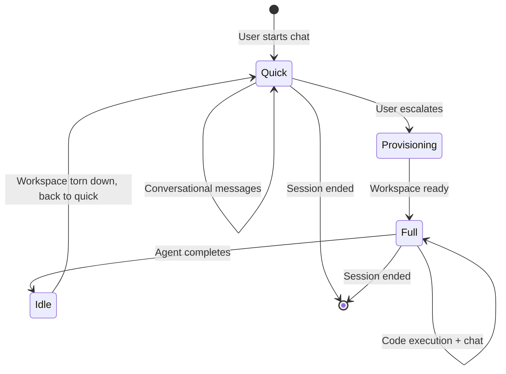

# Quick Chat Mode — Design Exploration

> **Status**: Design exploration (Mar 2026)
> **Author**: AI-assisted
> **Context**: SAM currently requires full VM provisioning (1-5 min with warm pool, 10-15 min cold start) for every interaction. This document explores designs for a lightweight "quick chat" mode focused on fast, low-overhead conversations.

---

## Table of Contents

1. [Problem Statement](#problem-statement)
2. [Current Provisioning Cost](#current-provisioning-cost)
3. [Design Goals](#design-goals)
4. [Approach 1: Minimal Devcontainer Profile](#approach-1-minimal-devcontainer-profile)
5. [Approach 2: Workers AI Chat Agent](#approach-2-workers-ai-chat-agent)
6. [Approach 3: Hybrid — Workers Chat with Optional VM Escalation](#approach-3-hybrid--workers-chat-with-optional-vm-escalation)
7. [Approach 4: Custom Lightweight Agent on VM](#approach-4-custom-lightweight-agent-on-vm)
8. [Approach 5: Durable Object Chat Agent](#approach-5-durable-object-chat-agent)
9. [Comparison Matrix](#comparison-matrix)
10. [Recommendation](#recommendation)
11. [Open Questions](#open-questions)

---

## Problem Statement

Every SAM interaction today — even a simple question like "explain this function" — requires:

1. Finding or provisioning a Hetzner VM (~2-3 min cold, ~5s warm)
2. Cloning a git repository (~10-30s)
3. Building a devcontainer (~30-120s)
4. Installing and starting an ACP agent binary (~10-20s)
5. Establishing WebSocket connections

**Total: 60-180 seconds best case, 10+ minutes worst case.**

This is appropriate for tasks that modify code (writing features, fixing bugs, running tests). But many interactions are purely conversational:

- "Explain how the auth flow works"
- "What's the best way to structure this feature?"
- "Review this PR approach before I start"
- "Help me think through this architecture decision"
- "Summarize what changed in the last 5 commits"

These don't need a devcontainer, a PTY, or even a cloned repo. They need fast responses and access to the codebase context (which could be provided via the GitHub API or pre-indexed content rather than a local clone).

---

## Current Provisioning Cost

| Step | Duration | Required for Chat? |
|------|----------|--------------------|
| VM provisioning (cold) | 2-3 min | No |
| Cloud-init + agent binary | 1-2 min | No |
| Git clone | 10-30s | Maybe (context) |
| Devcontainer build | 30-120s | No |
| ACP agent startup | 10-20s | No |
| **Total (cold)** | **~5-10 min** | |
| **Total (warm pool)** | **~60-90s** | |

---

## Design Goals

1. **Sub-5-second time to first message** — user sends a message, gets a response starting within seconds, not minutes
2. **Zero infrastructure cost when idle** — no VMs running, no containers, pure serverless
3. **Seamless integration with existing chat UI** — reuse ProjectData DO, chat sessions, message rendering
4. **Codebase awareness** — the agent should understand the project's code, not just be a generic chatbot
5. **Escalation path** — if the conversation evolves into "actually, go implement this," there should be a way to spin up a full workspace
6. **Use existing credentials** — reuse the user's configured agent API keys (Anthropic, OpenAI, Google)

---

## Approach 1: Minimal Devcontainer Profile

### Concept

Keep the existing VM-based architecture but create a "chat" workspace profile that skips expensive steps.

### How It Works

1. Add a `WorkspaceProfile` concept: `'full' | 'chat'`
2. Chat profile skips: devcontainer build, dependency installation, SAM env setup
3. Chat profile does: git clone (shallow, for context), start agent with read-only mode
4. Use smallest VM size (`small`: 2 CPU, 4GB)
5. Aggressively reuse warm pool — chat workspaces are ideal warm pool candidates

### Architecture

```
User → API → TaskRunner DO → Node (warm pool preferred)
                                → VM Agent
                                  → git clone --depth 1 (10-20s)
                                  → Claude Code --chat-only (no devcontainer)
                                  → ACP WebSocket → Browser
```

### Provisioning Timeline

```
T+0s:   Task submitted
T+1s:   Warm node claimed (or ~3min cold start)
T+5s:   Shallow git clone starts
T+20s:  Clone complete, agent starts
T+25s:  First response streaming
```

### Pros

- **Minimal code changes** — reuses entire existing pipeline
- **Full agent capabilities** — Claude Code/Codex/Gemini with file access
- **Codebase context** — agent can read the actual repo files
- **Familiar UX** — same chat interface, same message flow
- **Easy escalation** — "upgrade" workspace to full profile by running devcontainer build

### Cons

- **Still 20-60 seconds** to first message (even with warm pool)
- **Still requires a VM** — Hetzner cost even for simple chat
- **Warm pool dependency** — cold start still takes minutes
- **Overkill** — spinning up a VM for "explain this function" feels wasteful

### Estimated Effort

Small — mostly configuration changes to cloud-init template and task runner.

---

## Approach 2: Workers AI Chat Agent

### Concept

Build a chat agent that runs entirely within Cloudflare Workers, using Workers AI or proxied API calls. No VMs involved at all.

### How It Works

1. New API route: `POST /api/projects/:id/quick-chat` creates a session without a task/workspace
2. User messages go directly to ProjectData DO via WebSocket
3. DO (or a Worker route) calls the Claude/OpenAI/Gemini API with the message + project context
4. Responses stream back to the browser via WebSocket or SSE
5. All messages persisted in the DO's SQLite — same as today

### Architecture

```
User → Browser WebSocket → ProjectData DO
         ↓                      ↓
    Send message          Persist message
                               ↓
                    Call Claude API (streaming)
                               ↓
                    Stream response chunks
                               ↓
                    Persist assistant message
                               ↓
              Broadcast to connected clients
```

### Codebase Context Strategy

Without a cloned repo, we need alternative ways to give the agent context:

| Strategy | Latency | Quality | Cost |
|----------|---------|---------|------|
| **GitHub API (on-demand)** — fetch files via `GET /repos/:owner/:repo/contents/:path` | ~200ms/file | Good for targeted questions | GitHub API rate limits |
| **GitHub Search API** — search code for relevant snippets | ~500ms | Good for "where is X" questions | Rate limits, no private repo search without app |
| **Pre-indexed summaries** — store repo structure + key file summaries in KV/DO | ~5ms | Good for architecture questions | Requires indexing pipeline |
| **User-provided context** — user pastes code or references files | 0ms | Depends on user | No automation |
| **R2-cached repo snapshot** — periodic shallow clone cached in R2 | ~100ms | Excellent | Storage cost, staleness |

### Pros

- **Sub-second time to first response** — no VM, no clone, no container
- **Zero infrastructure cost** — pure serverless, pay per request
- **Instant availability** — no warm pool needed
- **Scales infinitely** — Workers handle concurrency natively
- **Integrates with existing chat UI** — same ProjectData DO, same message format

### Cons

- **No file system access** — agent can't `cat`, `grep`, or explore files naturally
- **Limited codebase context** — depends on the context strategy chosen (see table above)
- **Can't run code** — no tests, no builds, no terminal
- **Different agent** — not Claude Code/Codex/Gemini CLI; it's a raw API call with a system prompt
- **API key management** — need to call external APIs from Workers (user's keys already encrypted in DB)
- **Workers CPU limits** — 30s CPU time per request (plenty for streaming a single response, but complex multi-turn reasoning could hit limits)
- **No tool use** — unless we build MCP-like tool calling (GitHub API, search, etc.)

### Estimated Effort

Medium — new API route, DO integration for streaming, context fetching strategy, frontend "quick chat" flow.

---

## Approach 3: Hybrid — Workers Chat with Optional VM Escalation

### Concept

Start every conversation in Workers (instant), but allow the user to "escalate" to a full VM workspace when the conversation needs code execution.

### How It Works

1. Quick chat starts serverless (Approach 2)
2. User or agent recognizes the need for code execution:
   - User clicks "Start workspace" button
   - Or agent suggests: "I'd need to run tests to verify this. Want me to spin up a workspace?"
3. System provisions a workspace (existing TaskRunner flow) linked to the same chat session
4. Chat session transitions from serverless → VM-backed
5. Conversation history transfers seamlessly (already in DO)

### Architecture

```
Phase 1 (Instant):
  User → DO WebSocket → Claude API → Response

Phase 2 (Escalated, ~60s transition):
  User clicks "Start Workspace"
    → TaskRunner DO provisions workspace
    → Workspace linked to existing session
    → Agent picks up conversation history
    → Full Claude Code/Codex/Gemini capabilities
```

### Session Lifecycle



### Pros

- **Best of both worlds** — instant for simple questions, full power when needed
- **Natural UX** — conversation flows from lightweight to heavyweight without restart
- **Cost efficient** — only pay for VMs when actually needed
- **Conversation continuity** — same session, same history, same DO
- **Graceful degradation** — even if VM provisioning is slow, the user was chatting productively

### Cons

- **Two different agent backends** — serverless chat uses raw API calls, VM uses ACP agents
- **Context handoff complexity** — when escalating, the VM agent needs the conversation history + any context the serverless agent gathered
- **UX design challenge** — when/how to suggest escalation? Automatic? Manual?
- **More code paths** — session can be in two fundamentally different states

### Estimated Effort

Large — combines Approach 1 and 2, plus escalation logic, context handoff, and UI for mode switching.

---

## Approach 4: Custom Lightweight Agent on VM

### Concept

Build a custom Go-based chat agent that runs directly on the VM (no devcontainer, no ACP), optimized for fast startup and low resource usage.

### How It Works

1. A new `sam-chat-agent` binary (Go, ~5MB) ships alongside `vm-agent`
2. It clones the repo (shallow), indexes key files, and serves a chat API
3. Uses the user's API key to call Claude/OpenAI/Gemini directly
4. Runs inside the existing vm-agent process (no Docker, no devcontainer)
5. Messages proxied through the same WebSocket infrastructure

### Architecture

```
User → Browser → API → VM Agent
                         ↓
                  sam-chat-agent (Go)
                    ├── Shallow git clone
                    ├── File indexer (tree + key files)
                    ├── LLM API client (streaming)
                    └── Response → WebSocket → Browser
```

### Pros

- **Fast startup** — Go binary, no Docker, no devcontainer (~10-15s total)
- **Full file system access** — can read, search, and grep the repo
- **Custom-tuned for SAM** — purpose-built for the "chat about code" use case
- **Low resource usage** — runs on `small` VM, minimal memory
- **Can be extended** — add read-only tools (file search, git log, etc.) incrementally

### Cons

- **New codebase to maintain** — custom Go agent is a significant new component
- **Still requires a VM** — even if lightweight, still Hetzner cost + provisioning time
- **Not standard** — doesn't use Claude Code/Codex/Gemini CLI, so no ecosystem compatibility
- **Warm pool helps but doesn't eliminate** startup time
- **Feature parity pressure** — users will want features that already exist in Claude Code

### Estimated Effort

Large — new Go binary, LLM API client, file indexing, streaming, integration with vm-agent.

---

## Approach 5: Durable Object Chat Agent

### Concept

Run the entire chat agent inside a Cloudflare Durable Object. The DO maintains conversation state, calls LLM APIs, and provides tool use via GitHub API — all without any VM.

### How It Works

1. Each project already has a `ProjectData` DO — extend it (or create a sibling `ProjectChatAgent` DO) with agent logic
2. DO handles the full conversation loop: receive message → build context → call LLM → persist response
3. Tool use implemented as DO-native functions:
   - `read_file(path)` → GitHub API Contents endpoint
   - `search_code(query)` → GitHub API Code Search
   - `list_files(path)` → GitHub API Trees endpoint
   - `git_log(n)` → GitHub API Commits endpoint
   - `get_diff(sha)` → GitHub API Compare endpoint
4. Context window managed by the DO — maintains conversation + relevant file cache
5. Hibernatable WebSocket for real-time streaming to browser

### Architecture

```
User → Browser WebSocket → ProjectChatAgent DO
                              ├── Conversation state (SQLite)
                              ├── File cache (SQLite)
                              ├── GitHub API client
                              │     ├── read_file()
                              │     ├── search_code()
                              │     ├── list_files()
                              │     └── git_log()
                              ├── LLM API client
                              │     └── Claude/GPT/Gemini streaming
                              └── WebSocket broadcast
```

### Tool Implementation

```typescript
// Example: DO-native tool for reading files
const tools = [
  {
    name: 'read_file',
    description: 'Read a file from the repository',
    parameters: { path: { type: 'string' } },
    execute: async (params) => {
      // Use GitHub API with the project's GitHub App token
      const content = await githubApi.getFileContent(
        owner, repo, params.path, branch
      );
      return content;
    }
  },
  {
    name: 'search_code',
    description: 'Search for code patterns in the repository',
    parameters: { query: { type: 'string' } },
    execute: async (params) => {
      const results = await githubApi.searchCode(
        owner, repo, params.query
      );
      return results;
    }
  }
];
```

### Pros

- **Sub-second startup** — DO is always warm after first access, hibernates when idle
- **Zero VM cost** — pure Cloudflare, pay per request + storage
- **Stateful** — DO maintains conversation + file cache across messages
- **Tool use** — read files, search code, view git history via GitHub API
- **Scales perfectly** — one DO per project, Cloudflare handles distribution
- **Natural integration** — already have ProjectData DO, this extends the pattern
- **Hibernatable** — DO hibernates between messages, zero cost when idle

### Cons

- **GitHub API rate limits** — 5,000 req/hr for authenticated apps, could hit limits on code-heavy conversations
- **No code execution** — can read code but can't run it
- **30s CPU limit per request** — complex tool-use chains might need to be broken up across multiple requests/alarms
- **Cloudflare-specific** — deeply ties the agent to Cloudflare's platform (but SAM is already Cloudflare-first)
- **Context window management** — need to build summarization/pruning for long conversations
- **New complexity** — agent loop (LLM call → tool use → LLM call) in a DO is non-trivial
- **Subrequest limits** — Workers have a 1000 subrequest limit per invocation; tool-heavy conversations could approach this

### Estimated Effort

Large — LLM streaming from DO, tool-use loop, GitHub API integration, context management, caching.

---

## Comparison Matrix

| Criteria | 1: Minimal Profile | 2: Workers AI | 3: Hybrid | 4: Custom Agent | 5: DO Agent |
|----------|-------------------|---------------|-----------|-----------------|-------------|
| **Time to first message** | 20-60s (warm) | <2s | <2s (quick), 60s (escalated) | 10-15s (warm) | <2s |
| **VM required** | Yes | No | Only if escalated | Yes | No |
| **Idle cost** | Warm pool cost | $0 | $0 (until escalated) | Warm pool cost | $0 |
| **Codebase access** | Full (local clone) | Limited (API) | Both | Full (local clone) | Via GitHub API |
| **Can run code** | Yes (limited) | No | Yes (after escalation) | No (read-only) | No |
| **Agent quality** | Claude Code / Codex / Gemini | Raw API + system prompt | Both | Custom | Raw API + tools |
| **Tool use** | Full ACP tools | None (unless built) | Full (after escalation) | Read-only built-in | GitHub API tools |
| **Implementation effort** | Small | Medium | Large | Large | Large |
| **Maintenance burden** | Low (existing infra) | Low | Medium | High (new Go binary) | Medium |
| **Escalation to full** | Already full | Manual provision | Built-in | Needs migration | Manual provision |
| **Works without Hetzner** | No | Yes | Partially | No | Yes |

---

## Recommendation

**Start with Approach 3 (Hybrid), implemented in two phases:**

### Phase 1: Workers Chat (Approach 2)

Build the serverless quick-chat path first:

1. New `POST /api/projects/:id/quick-chat` route that creates a session without task/workspace
2. Extend ProjectData DO to handle LLM API calls with streaming
3. Add GitHub API-based context fetching (repo tree + targeted file reads)
4. Frontend "Quick Chat" button on project page — starts instant conversation
5. Reuse existing chat UI, message rendering, WebSocket infrastructure

This alone delivers the core value: **sub-second responses for conversational interactions**.

### Phase 2: Escalation Path (Approach 3)

Add the ability to "upgrade" a quick-chat session to a full workspace:

1. "Start Workspace" button in quick-chat UI
2. Links existing session to new workspace via TaskRunner
3. VM agent picks up conversation context
4. Seamless transition from serverless → VM-backed chat

### Why Not the Others?

- **Approach 1 (Minimal Profile)**: Still too slow (20-60s). Doesn't solve the core problem of "I just want to ask a quick question."
- **Approach 4 (Custom Agent)**: High maintenance burden for marginal benefit over Approach 1. Building a custom Go agent is a significant investment.
- **Approach 5 (DO Agent)**: Compelling architecture but the tool-use loop in a DO is complex to build correctly (CPU limits, subrequest limits, error handling). Could evolve into this from Approach 2 if GitHub API tools prove valuable.

### Why Approach 2/3 Specifically?

1. **Fastest path to value** — sub-second chat with existing infrastructure
2. **Zero new infrastructure** — no VMs, no new binaries, no new runtime
3. **Natural upgrade path** — conversation can escalate when needed
4. **Leverages existing chat infrastructure** — ProjectData DO, WebSocket, message rendering all reuse
5. **BYOC compatible** — doesn't require Hetzner credentials for basic chat
6. **Works as a "free tier"** — could offer quick-chat to users who haven't configured a cloud provider yet

---

## Open Questions

1. **Which LLM to use for quick chat?** Options:
   - User's configured agent API key (Anthropic/OpenAI/Google) — consistent but requires setup
   - Workers AI (free, built-in) — limited model quality, but zero config
   - Both — Workers AI as default, user key as upgrade

2. **How much codebase context is enough?** For a "quick question" mode:
   - Repo file tree (always included)?
   - README + key config files (pre-cached)?
   - On-demand file fetching via GitHub API?
   - All of the above with a context budget?

3. **Should quick-chat messages count toward task limits?** Quick chats are conversational, not task-driven. Different billing/quota model?

4. **System prompt strategy**: Should the quick-chat agent have a project-aware system prompt? Could include:
   - Repo description and structure
   - Tech stack (from package.json, go.mod, etc.)
   - Recent commit summaries
   - Project-specific instructions (CLAUDE.md equivalent)

5. **Context window management**: Long conversations will exceed context limits. Summarization? Sliding window? User-controlled "forget and start fresh"?

6. **Multi-model support**: If the user has keys for multiple providers, should quick-chat let them pick? Or default to one?

7. **Offline/degraded mode**: What happens if the LLM API is down? Show error? Queue message? Fall back to Workers AI?

8. **Privacy**: Quick-chat messages go through SAM's Workers. Is this a concern for users who care about data sovereignty? (Same concern exists for task-based chat, but worth noting.)
