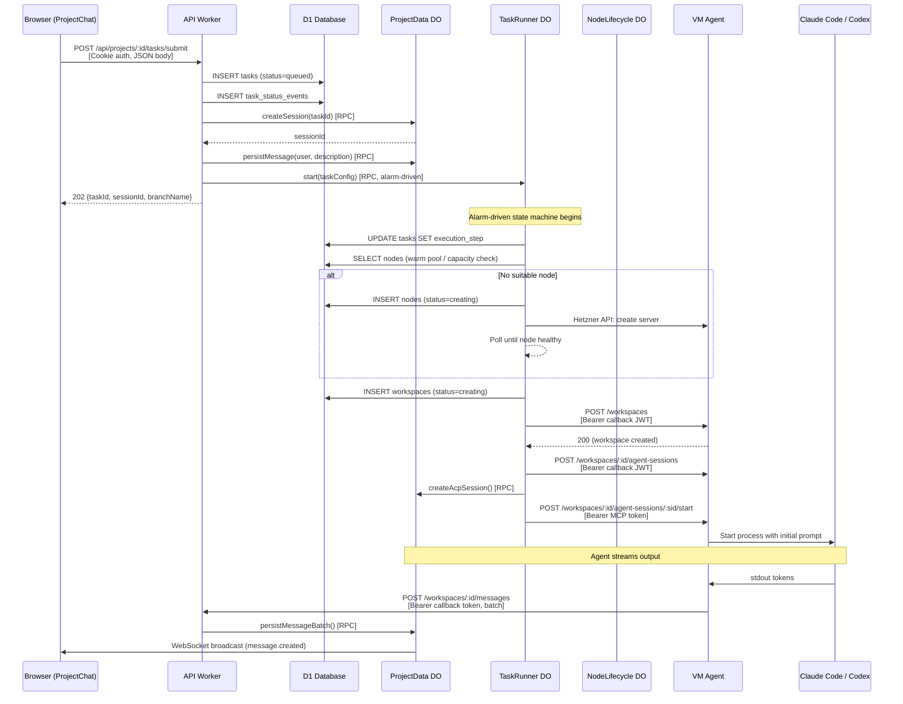
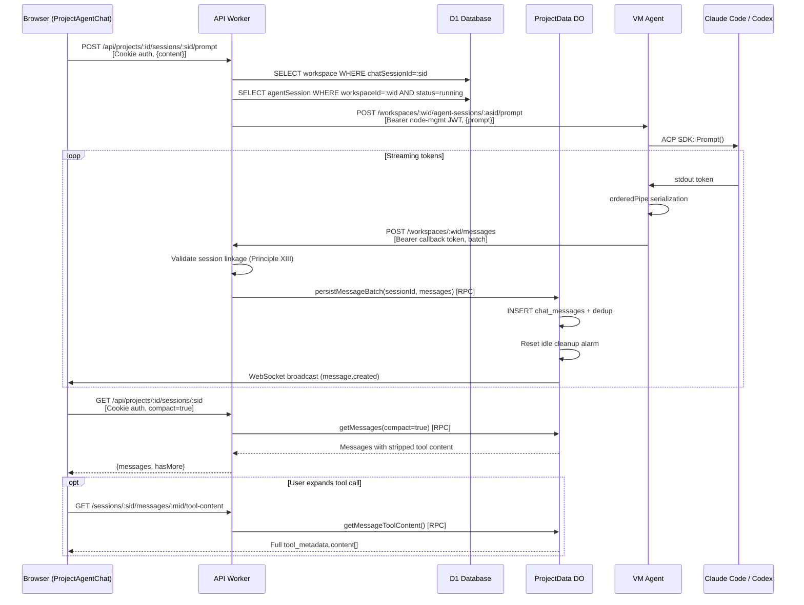
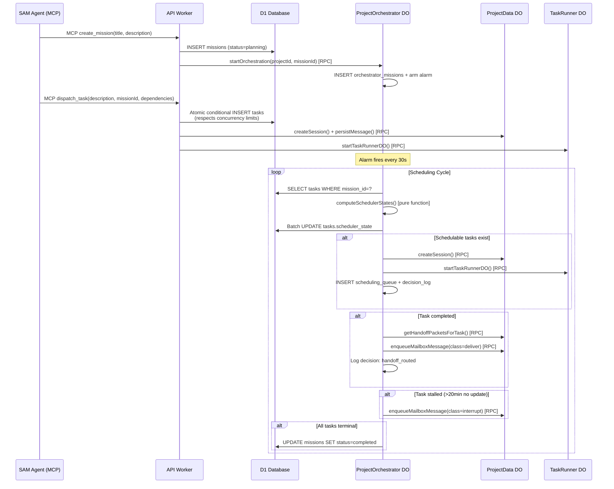
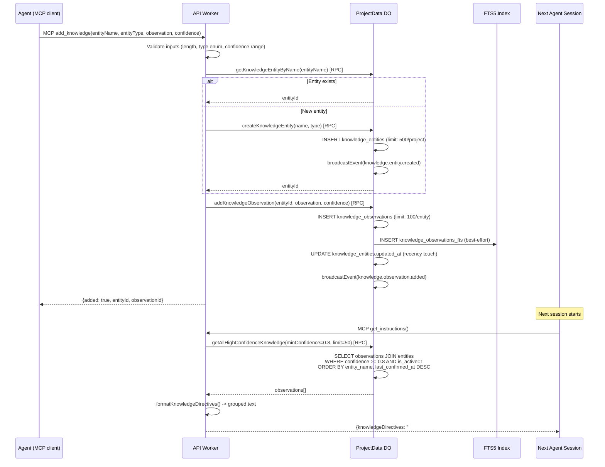
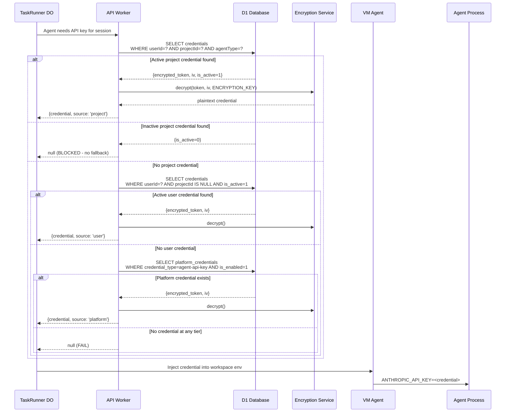
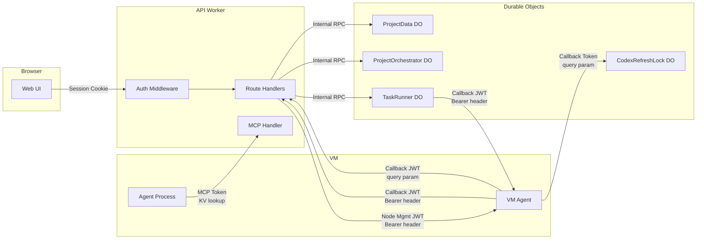

# Track 2: Data Flow & Cross-Boundary Communication

**Status**: Complete
**Evaluator**: Claude Opus 4.6 (automated evaluation)
**Date**: 2026-05-07
**Branch**: `sam/execute-task-using-skill-01kr08`

---

## Executive Summary

SAM's data flows are well-structured with clear boundary ownership and consistent auth mechanisms at each crossing. The hybrid D1 + Durable Object architecture creates natural transaction boundaries. Five primary flows were traced end-to-end, revealing:

- **1 HIGH finding**: Dual callback token validation paths with divergent logic
- **4 MEDIUM findings**: Polling where events would suffice, WebSocket broadcast error swallowing, VM agent error shape inconsistency, and terminal activity recording race condition
- **3 LOW findings**: Task submit multi-query overhead, polling without jitter, and admin log aggregation memory pressure
- **3 INFO findings**: Excellent shared type discipline, well-designed compact mode, and clean DO fan-out avoidance

Total: **11 findings** across contract alignment, efficiency, and error propagation.

---

## 2.1 Primary Flow Traces

### Flow 1: Task Submission



#### Boundary Details

| Boundary | Method | Auth | Payload Type | Contract | Contract Test |
|----------|--------|------|-------------|----------|---------------|
| UI -> API (submit) | `POST /api/projects/:id/tasks/submit` | Session cookie | `SubmitTaskRequest` (`packages/shared`) | Shared type | Miniflare integration tests |
| API -> D1 (task insert) | Drizzle ORM | Internal (same Worker) | SQL params | Schema types | Vitest unit tests |
| API -> ProjectData DO | RPC (in-Worker) | Internal | Method params | TypeScript interface | Unit tests |
| API -> TaskRunner DO | RPC (in-Worker) | Internal | `TaskRunnerState` | TypeScript interface | Unit tests |
| TaskRunner -> VM Agent (workspace) | `POST /workspaces` | Bearer JWT (callback token) | JSON body | **No shared type** | No contract test |
| TaskRunner -> VM Agent (agent start) | `POST /workspaces/:id/agent-sessions/:sid/start` | Bearer MCP token | JSON body | **No shared type** | No contract test |
| VM Agent -> API (messages) | `POST /workspaces/:id/messages` | Bearer callback token | `MessageBatchSchema` | Valibot schema | Unit tests |
| ProjectData DO -> UI | WebSocket | Session cookie (upgrade) | JSON event | TypeScript interface | No contract test |

**Key Code Paths**:
- UI form: `apps/web/src/components/task/TaskSubmitForm.tsx:44-494`
- API client: `apps/web/src/lib/api/tasks.ts:60-68`
- Route handler: `apps/api/src/routes/tasks/submit.ts:54-450`
- TaskRunner DO: `apps/api/src/durable-objects/task-runner/index.ts:51-200`
- Node selection: `apps/api/src/durable-objects/task-runner/node-steps.ts:22-88`
- Workspace creation: `apps/api/src/durable-objects/task-runner/workspace-steps.ts:16-150`
- Agent session: `apps/api/src/durable-objects/task-runner/agent-session-step.ts:11-200`
- Message persistence: `apps/api/src/durable-objects/project-data/messages.ts:98-224`

**Configuration Precedence Chain** (applied at `submit.ts:174-221`):
```
VM Size:        explicit > agent profile > project.defaultVmSize > DEFAULT_VM_SIZE
Cloud Provider: explicit > agent profile > project.defaultProvider > null
VM Location:    explicit > agent profile > project.defaultLocation > provider default > DEFAULT_VM_LOCATION
Workspace Profile: explicit > agent profile > project default > DEFAULT_WORKSPACE_PROFILE
Agent Type:     explicit > agent profile > project default > DEFAULT_TASK_AGENT_TYPE env var
```

---

### Flow 2: Chat Message Round-Trip



#### Boundary Details

| Boundary | Method | Auth | Payload | Contract Test |
|----------|--------|------|---------|---------------|
| UI -> API (prompt) | `POST /sessions/:sid/prompt` | Session cookie | `{content: string}` | Miniflare tests |
| API -> VM Agent (prompt) | `POST /workspaces/:wid/agent-sessions/:asid/prompt` | Bearer node-mgmt JWT | `{prompt: string}` | **No contract test** |
| VM Agent -> API (messages) | `POST /workspaces/:wid/messages` | Bearer callback token | `MessageBatchSchema` (max 100 msgs, 256KB) | Unit tests |
| PD -> UI (WebSocket) | WebSocket frame | Session cookie (upgrade) | JSON event | No contract test |

**Session Linkage Validation** (Principle XIII, `apps/api/src/routes/workspaces/runtime.ts:587-783`):
- `workspace.chatSessionId` MUST match incoming `sessionId`
- Mismatch: reject with **400** (permanent, logged to observability DB)
- No link: reject with **409 Conflict** (transient, VM agent retries)

**Message Deduplication** (`apps/api/src/durable-objects/project-data/messages.ts:98-224`):
- ID-based: skip if `chat_messages.id` already exists
- Content-based (user messages): skip if `(session_id, role='user', content)` match

**Compact Mode** (`apps/api/src/durable-objects/project-data/row-schemas.ts:265-311`):
- `parseChatMessageRowCompact()` strips `tool_metadata.content[]`, replaces with `contentSize` (byte count)
- Reduces RPC payload 80-90% for tool-heavy sessions
- On-demand fetch via `GET /sessions/:sid/messages/:mid/tool-content`

**Key Code Paths**:
- UI hook: `apps/web/src/hooks/useAgentChat.ts:159-285`
- Route: `apps/api/src/routes/chat.ts:395-472`
- Prompt forward: `apps/api/src/services/node-agent.ts:344-362`
- VM agent handler: `packages/vm-agent/internal/acp/session_host.go:344+`
- Message batch persistence: `apps/api/src/routes/workspaces/runtime.ts:587-783`
- Token grouping: `apps/api/src/routes/mcp/session-tools.ts:55-84`

---

### Flow 3: Mission Orchestration



#### Key Design Elements

**Scheduler States** (11 states, `packages/shared/src/types/mission.ts`):
`schedulable | blocked_dependency | blocked_budget | blocked_resource | blocked_human | waiting_delivery | stalled | running | completed | failed | cancelled`

**Pure State Computation** (`apps/api/src/services/scheduler-state.ts:33-95`):
- `computeSchedulerStates()` is a pure function — no side effects
- Input: task statuses + dependency graph edges
- Output: new scheduler state per task
- Synced to D1 via `recomputeMissionSchedulerStates()` (`scheduler-state-sync.ts:17-67`)

**Atomic Task Dispatch** (`apps/api/src/routes/mcp/dispatch-tool.ts:432-466`):
- Uses conditional INSERT to prevent TOCTOU race on concurrency limits
- Respects per-task and per-project limits atomically in a single SQL statement

**Handoff Routing** (`apps/api/src/durable-objects/project-orchestrator/scheduling.ts:344-406`):
- Idempotent: checks `decision_log` for existing `handoff_routed` action before routing
- Broadcasts via durable mailbox with `deliver` class (ack-required, re-delivery on timeout)

**Durable Messaging** (`apps/api/src/durable-objects/project-data/mailbox.ts:44-114`):
- 5 message classes: `notify | deliver | interrupt | preempt_and_replan | shutdown_with_final_prompt`
- Priority ordering by class (shutdown=5, notify=1)
- State machine: `queued -> delivered -> acked -> expired`
- Configurable: `MAILBOX_ACK_TIMEOUT_MS` (300s), `MAILBOX_REDELIVERY_MAX_ATTEMPTS` (5)

**Orchestrator Configuration** (`packages/shared/src/constants/orchestrator.ts`):
- `ORCHESTRATOR_SCHEDULING_INTERVAL_MS`: 30s default
- `ORCHESTRATOR_STALL_TIMEOUT_MS`: 20min default
- `ORCHESTRATOR_MAX_DISPATCHES_PER_CYCLE`: 5
- `ORCHESTRATOR_MAX_ACTIVE_TASKS_PER_MISSION`: 5

**Key Code Paths**:
- Mission creation: `apps/api/src/routes/mcp/mission-tools.ts:28-80`
- Task dispatch: `apps/api/src/routes/mcp/dispatch-tool.ts:41-600`
- Orchestrator DO: `apps/api/src/durable-objects/project-orchestrator/index.ts`
- Scheduling cycle: `apps/api/src/durable-objects/project-orchestrator/scheduling.ts:42-135`
- Auto-dispatch: `scheduling.ts:154-337`
- Handoff routing: `scheduling.ts:344-406`
- Mailbox: `apps/api/src/durable-objects/project-data/mailbox.ts:44-114`

---

### Flow 4: Knowledge Graph Update



#### Key Design Elements

**Entity-Observation-Relation Model** (`apps/api/src/durable-objects/project-data/knowledge.ts`):
- Entities: nodes (concepts, preferences, decisions) — max 500/project
- Observations: timestamped facts attached to entities — max 100/entity
- Relations: edges between entities (influences, contradicts, supports, requires, related_to)

**Non-Lossy Updates** (`knowledge.ts:183-222`):
- `updateObservation()` creates a NEW observation, marks old as `superseded_by`
- Old observation stays in DB with `is_active=0` — full audit trail

**Confidence x Recency Scoring** (`knowledge.ts:349-376`):
```
score = confidence * (1 / (1 + days_since_confirmed / 30))
```
- 0 days old, confidence 0.9: score 0.9
- 30 days old, confidence 0.9: score 0.45
- `confirm_knowledge` tool resets `last_confirmed_at` to now

**FTS5 Dual-Index Strategy** (`knowledge.ts:260-347`):
- Tier 1: FTS5 MATCH query with sanitized input (strips operators)
- Tier 2: LIKE fallback for edge cases (special chars, FTS5 syntax errors)
- FTS5 sync is best-effort — errors never block mutations

**Auto-Retrieval at Session Start** (`apps/api/src/routes/mcp/instruction-tools.ts:60-83`):
- `get_instructions` loads ALL observations with `confidence >= 0.8` (configurable)
- Formatted as readable text grouped by entity name
- Injected into initial agent prompt alongside task context

**Contradiction Flagging** (`knowledge.ts:444-477`):
- `flag_contradiction` adds new observation at 80% of existing confidence
- Creates self-referencing `contradicts` relation for graph traversal

**Key Code Paths**:
- MCP tool handlers: `apps/api/src/routes/mcp/knowledge-tools.ts:30-422`
- Knowledge CRUD: `apps/api/src/durable-objects/project-data/knowledge.ts:29-477`
- Auto-retrieval: `apps/api/src/routes/mcp/instruction-tools.ts:60-83`
- REST API: `apps/api/src/routes/knowledge.ts`
- Shared types: `packages/shared/src/types/knowledge.ts:117-131`

---

### Flow 5: Credential Resolution



#### Key Design Elements

**3-Tier Resolution** (`apps/api/src/routes/credentials.ts:567-651`):
1. **Project-scoped**: `WHERE userId=? AND projectId=? AND agentType=?`
2. **User-scoped**: `WHERE userId=? AND projectId IS NULL AND is_active=1`
3. **Platform**: `platform_credentials WHERE credential_type=agent-api-key AND is_enabled=1`

**Critical Invariant**: Inactive project credential (`is_active=0`) blocks fallback to user/platform tiers. This prevents silent scope boundary crossing when a user explicitly deactivates a project override.

**Partial Unique Indexes** (prevent duplicate active credentials per scope):
- `idx_credentials_user_agent_kind_user_scope`: `(userId, agentType, credentialKind) WHERE project_id IS NULL`
- `idx_credentials_user_agent_kind_project_scope`: `(userId, projectId, agentType, credentialKind) WHERE project_id IS NOT NULL`

**Encryption** (`apps/api/src/services/encryption.ts`):
- AES-256-GCM via Web Crypto API
- Unique 12-byte random IV per encryption operation
- Key: base64-encoded 256-bit key from `ENCRYPTION_KEY` Worker secret

**OAuth Token Refresh** (`apps/api/src/durable-objects/codex-refresh-lock.ts`):
- Per-user serialization via DO keyed by `userId`
- Stale-token grace window (5min) for concurrent sessions
- Scope validation against configurable allowlist
- Rate limiting with atomic DO storage (not KV)

**AI Proxy Auth Resolution** (`apps/api/src/services/ai-billing.ts:66-104`):
- Billing mode: KV > env > default (`auto`)
- `auto`: unified billing if CF token exists, else platform key
- `unified`: `cf-aig-authorization: Bearer <CF_AIG_TOKEN ?? CF_API_TOKEN>`
- `platform-key`: `x-api-key: <platform credential>`

**Key Code Paths**:
- Resolution function: `apps/api/src/routes/credentials.ts:567-651`
- Platform credentials: `apps/api/src/services/platform-credentials.ts:12-71`
- Encryption: `apps/api/src/services/encryption.ts:33-95`
- CodexRefreshLock DO: `apps/api/src/durable-objects/codex-refresh-lock.ts`
- AI billing: `apps/api/src/services/ai-billing.ts:66-104`
- Tests: `apps/api/tests/unit/routes/project-credentials.test.ts:505-543`

---

## 2.2 Contract Alignment

### 2.2.1 Shared Types

**Assessment: STRONG**

All request/response types are defined in `packages/shared/src/types/` (25+ domain-specific modules) and imported by both `apps/api/` and `apps/web/`. No duplicate type definitions were found between the API and web client.

Key shared types: `SubmitTaskRequest`, `TaskAttachment`, `ChatMessage`, `VMSize`, `WorkspaceProfile`, `TaskMode`, `MissionStatus`, `KnowledgeEntity`, `ProjectPolicy`, `AgentMailboxMessage`.

The barrel file at `packages/shared/src/types/index.ts` uses explicit named re-exports — no `export *` wildcards.

### 2.2.2 Auth Mechanism Consistency

**Assessment: PARTIAL — see Finding DF-01**

The system uses 5 distinct auth mechanisms at different boundaries:

| Auth Mechanism | Created At | Validated At | Used By |
|----------------|-----------|-------------|---------|
| **Session cookies** | `routes/auth.ts` | `middleware/auth.ts:requireAuth()` | All web UI routes |
| **Callback tokens** (workspace JWT) | `services/jwt.ts:signCallbackToken()` | `services/jwt.ts:verifyCallbackToken()` AND `services/ai-proxy-shared.ts:verifyAIProxyAuth()` | VM agent -> API, AI proxy |
| **MCP tokens** (random string in KV) | TaskRunner agent-session step | MCP tool handlers (KV lookup) | Agent MCP tools |
| **Node management JWT** | `services/jwt.ts:signNodeManagementToken()` | VM agent JWT middleware | API -> VM agent prompts |
| **Query param tokens** | Various (Codex refresh) | Route-specific extraction | Codex OAuth refresh |

**Risk**: Callback token validation has **two independent paths** (`jwt.ts` vs `ai-proxy-shared.ts`) with different rejection logic. `ai-proxy-shared.ts:47-65` explicitly rejects `scope !== 'workspace'` tokens, while `jwt.ts` does not have this check. A token valid in one path may be invalid in the other.

### 2.2.3 Error Shape Consistency

**Assessment: MOSTLY CONSISTENT — see Finding DF-03**

- **API Worker**: Centralized `AppError` factory (`middleware/error.ts`) produces consistent `{error: string, message: string, details?: object}` shape
- **VM Agent (Go)**: Returns `{"error": "...", "detail": "..."}` — different field naming
- **AI Proxy passthrough**: Anthropic-format errors `{type: "error", error: {type, message}}` for proxy routes — intentionally different
- **MCP tools**: JSON-RPC 2.0 error responses via `jsonRpcError(requestId, code, message)` — protocol-appropriate

The VM agent error format mismatch is the primary inconsistency. The API Worker's error handler does not normalize VM agent errors when proxying responses.

---

## 2.3 Efficiency Assessment

### 2.3.1 N+1 Query Patterns

**Assessment: CLEAN**

No N+1 patterns were identified in critical paths. The codebase consistently uses:
- Single queries with JOINs for related data
- `inArray()` queries for batch lookups (e.g., `node-usage.ts:123-131`)
- In-memory aggregation after single-pass queries

One minor concern: WebSocket broadcast in `project-data/index.ts:710-717` iterates all connections and silently swallows per-socket errors. This isn't an N+1 query pattern but is an N+1 I/O pattern.

### 2.3.2 Payload Bloat

**Assessment: WELL MITIGATED**

The compact mode system (`CHAT_COMPACT_MODE_DEFAULT=true`) addresses the largest payload concern — tool-heavy sessions that could send MBs of tool content. The lazy-load pattern (`GET /messages/:mid/tool-content`) is well-designed.

Admin cost endpoints (`admin-costs.ts`) aggregate from AI Gateway logs with configurable pagination (`AI_USAGE_MAX_PAGES=20, hard cap`). Memory pressure is bounded.

### 2.3.3 Unnecessary Round-Trips

**Assessment: ONE CONCERN — see Finding DF-04**

Terminal token generation (`routes/terminal.ts:60-68`) fires an async activity recording to ProjectData DO via `waitUntil()`, then returns the response before the recording completes. If the recording fails, the idle cleanup timer may not be extended, leading to premature workspace termination even though the user just accessed the terminal.

Task submission makes 6 sequential database/DO calls, but each is necessary for correctness — no optimization opportunity without sacrificing safety guarantees.

### 2.3.4 DO Fan-Out

**Assessment: CLEAN**

No circular DO calls detected. Cross-project queries correctly use D1. The ProjectData DO is a per-project singleton with clear ownership boundaries. The ProjectOrchestrator DO only queries D1 and sends RPCs to ProjectData DO and TaskRunner DO — no fan-out to multiple ProjectData instances.

The ProjectOrchestrator scheduling cycle does make multiple D1 queries per cycle (SELECT tasks, SELECT dependencies, batch UPDATE scheduler_state), but these are within a single project scope and bounded by `ORCHESTRATOR_MAX_DISPATCHES_PER_CYCLE`.

### 2.3.5 WebSocket vs SSE vs Polling

**Assessment: MOSTLY APPROPRIATE — see Findings DF-05, DF-06**

| Data Type | Channel | Appropriate? |
|-----------|---------|-------------|
| Chat messages (live) | WebSocket (Hibernatable) | YES |
| Node logs (stream) | WebSocket | YES |
| Notifications (broadcast) | WebSocket | YES |
| Admin logs (live stream) | WebSocket (AdminLogs DO) | YES |
| Recent chats list | **Polling** (30s default) | QUESTIONABLE |
| Active tasks list | **Polling** (configurable) | QUESTIONABLE |
| Workspace ports | Polling (5s) | ACCEPTABLE (port detection requires polling) |
| Trial events | SSE (unnamed frames) | YES |

Recent chats and active tasks polling could be replaced with WebSocket events from the ProjectData DO, which already broadcasts `session.created`, `session.stopped`, and `session.updated` events. The WebSocket infrastructure exists — the polling is legacy.

---

## 2.4 Findings

### [HIGH] DF-01: Dual Callback Token Validation Paths

**Track**: 2 — Data Flow & Cross-Boundary Communication
**Location**: `apps/api/src/services/ai-proxy-shared.ts:47-65` vs `apps/api/src/services/jwt.ts:185-225`
**Category**: data-flow

**Finding**: Callback token validation has two independent code paths with divergent rejection logic. `verifyAIProxyAuth()` in `ai-proxy-shared.ts` explicitly rejects tokens where `scope !== 'workspace'`, while `verifyCallbackToken()` in `jwt.ts` does not include this check. A node-management-scoped token that would pass `jwt.ts` validation would be rejected by `ai-proxy-shared.ts`.

**Impact**: An attacker or misconfigured component sending a node-management JWT to an AI proxy endpoint would be correctly rejected, but a workspace-scoped callback token sent to a non-proxy endpoint using the `jwt.ts` path would skip the scope check. More importantly, divergent validation logic is a maintenance hazard — future changes to one path may not be reflected in the other, creating scope-escalation vulnerabilities.

**Recommendation**: Extract a single `validateCallbackToken(token, expectedScope)` function that both paths call. Add an explicit scope parameter to the shared function. Add a contract test that verifies both paths reject the same malformed tokens.

**Implementation Owner**: `apps/api` — auth/middleware
**Effort**: S

---

### [MEDIUM] DF-02: WebSocket Broadcast Silently Swallows Errors

**Track**: 2 — Data Flow & Cross-Boundary Communication
**Location**: `apps/api/src/durable-objects/project-data/index.ts:710-717`
**Category**: data-flow

**Finding**: The WebSocket broadcast loop iterates all connected clients and wraps each `ws.send()` in a try/catch that silently discards errors. If a client disconnects mid-broadcast, the error is swallowed with no logging or metrics.

**Impact**: Silent message loss for disconnected clients. No observability into broadcast failure rates. If a systematic issue causes many clients to fail (e.g., message size exceeding WebSocket frame limit), it would be invisible.

**Recommendation**: Collect errors during the broadcast loop and log an aggregate summary after completion. Include count of successful sends, failed sends, and the first error message. Do not log per-client failures (too noisy).

**Implementation Owner**: `apps/api` — ProjectData DO
**Effort**: S

---

### [MEDIUM] DF-03: VM Agent Error Shape Inconsistency

**Track**: 2 — Data Flow & Cross-Boundary Communication
**Location**: `packages/vm-agent/internal/server/*.go` vs `apps/api/src/middleware/error.ts`
**Category**: data-flow

**Finding**: The API Worker returns errors as `{error: string, message: string, details?: object}`. The VM agent (Go) returns errors as `{"error": "...", "detail": "..."}` — using `detail` (singular) instead of `details` (plural), and with different field semantics. When the API proxies VM agent errors to the browser (e.g., file upload/download proxy routes), the inconsistent shape can confuse frontend error handling.

**Impact**: Frontend error parsing must handle two shapes. Future error aggregation or monitoring tools must normalize across boundaries. Contract tests for cross-boundary error propagation are harder to write.

**Recommendation**: Define a `VMAgentErrorResponse` type in `packages/shared`. Add a `normalizeVMAgentError()` helper in the API proxy layer that translates VM agent errors to the standard API error shape before returning to the browser.

**Implementation Owner**: `packages/vm-agent` + `apps/api`
**Effort**: M

---

### [MEDIUM] DF-04: Terminal Activity Recording Race Condition

**Track**: 2 — Data Flow & Cross-Boundary Communication
**Location**: `apps/api/src/routes/terminal.ts:60-68`
**Category**: data-flow

**Finding**: Terminal token generation fires an async `waitUntil()` call to record activity in the ProjectData DO, then immediately returns the token to the client. If the activity recording fails (DO timeout, network error), the idle cleanup timer is not extended. The user has an active terminal session, but the server may terminate the workspace for idleness.

**Impact**: Workspace termination while user is actively using the terminal. The user sees the terminal disconnect unexpectedly. This is the same class of bug documented in the idle cleanup post-mortem — authoritative write activity should extend cleanup timers synchronously.

**Recommendation**: Either (a) await the activity recording before returning the token, or (b) move the idle-reset into the WebSocket connection handler (which is already synchronous with the DO). Option (b) is preferred because WebSocket connections are more authoritative indicators of activity than token generation.

**Implementation Owner**: `apps/api` — terminal routes
**Effort**: S

---

### [MEDIUM] DF-05: Polling Where WebSocket Events Exist

**Track**: 2 — Data Flow & Cross-Boundary Communication
**Location**: `apps/web/src/hooks/useRecentChats.ts:119-143`, `apps/web/src/hooks/useActiveTasks.ts:48`
**Category**: data-flow

**Finding**: The recent chats list and active tasks list use polling (30s and configurable intervals respectively). However, the ProjectData DO already broadcasts `session.created`, `session.stopped`, and `session.updated` events over WebSocket. The WebSocket infrastructure is already connected in the same components — the polling is redundant for real-time updates.

**Impact**: Unnecessary API calls every 30s per open browser tab. Stale data visible to users between poll intervals. Extra D1 query load (list queries are heavier than event-driven incremental updates).

**Recommendation**: Replace polling with WebSocket event listeners for `session.*` events. Keep a manual refresh button as fallback. Retain visibility-aware polling only as a "catch-up" mechanism when the tab regains focus (fetch once, not continuously).

**Implementation Owner**: `apps/web`
**Effort**: M

---

### [LOW] DF-06: Polling Without Jitter

**Track**: 2 — Data Flow & Cross-Boundary Communication
**Location**: `apps/web/src/hooks/useActiveTasks.ts:48`
**Category**: data-flow

**Finding**: The active tasks polling uses `setInterval` with a fixed interval and no jitter. If many users have the dashboard open simultaneously, all clients poll the API at exactly the same offset from their page load time.

**Impact**: Thundering herd risk is low at current user counts but could become problematic at scale. The D1 query for listing active tasks involves a JOIN and could be expensive under concurrent load.

**Recommendation**: Add random jitter (0-5s) to the polling interval. Use `setTimeout` with recalculated jitter instead of `setInterval`.

**Implementation Owner**: `apps/web`
**Effort**: S

---

### [LOW] DF-07: No Cross-Boundary Contract Tests for Worker-to-VM-Agent Calls

**Track**: 2 — Data Flow & Cross-Boundary Communication
**Location**: `apps/api/src/services/node-agent.ts:344-362`, `apps/api/src/durable-objects/task-runner/workspace-steps.ts:140-150`
**Category**: data-flow

**Finding**: The Worker-to-VM-Agent boundary (HTTP calls for workspace creation, agent session start, prompt forwarding, file upload/download) has no cross-boundary contract tests. The Worker constructs URLs and payloads in TypeScript; the VM agent parses them in Go. There is no shared schema or test that verifies both sides agree on paths, auth mechanisms, and payload shapes.

**Impact**: Contract mismatches (wrong URL path, wrong auth header format, wrong body field names) are only caught on staging with a real VM. This is the exact class of bug documented in the R2 upload post-mortem and enforced by `.claude/rules/23-cross-boundary-contract-tests.md`.

**Recommendation**: Create a shared route constant file (or a contract test file) that defines VM agent route paths, auth mechanisms, and payload shapes. Import from both the TypeScript caller and reference in Go tests. At minimum, add a test that constructs the same URLs/payloads the Worker would and asserts they match the Go route registration patterns.

**Implementation Owner**: `packages/shared` + `apps/api` + `packages/vm-agent`
**Effort**: M

---

### [LOW] DF-08: Admin AI Usage Log Aggregation Memory Pressure

**Track**: 2 — Data Flow & Cross-Boundary Communication
**Location**: `apps/api/src/services/ai-gateway-logs.ts`
**Category**: data-flow

**Finding**: The `iterateGatewayLogs()` function fetches up to 20 pages of 50 entries (1000 log entries) and aggregates them in memory. For the admin cost dashboard and user AI usage dashboard, all entries are loaded before aggregation. The hard cap of 20 pages bounds the worst case, but 1000 entries with full request/response metadata could be significant.

**Impact**: Memory spikes in the Worker during admin cost dashboard loads. Cloudflare Workers have a 128MB memory limit. With large request/response metadata per entry, this could approach limits under heavy AI usage.

**Recommendation**: Stream aggregation — process each page as it arrives instead of collecting all pages first. Discard raw entries after extracting the needed fields (model, tokens, cost). This is a performance optimization, not a correctness issue.

**Implementation Owner**: `apps/api` — ai-gateway-logs service
**Effort**: S

---

### [INFO] DF-09: Shared Type Discipline Is Exemplary

**Track**: 2 — Data Flow & Cross-Boundary Communication
**Location**: `packages/shared/src/types/`
**Category**: data-flow

**Finding**: All request/response types are defined once in `packages/shared/src/types/` and imported by both `apps/api/` and `apps/web/`. The barrel file uses explicit named re-exports. No duplicate type definitions were found across packages. Domain types (tasks, missions, knowledge, policies, mailbox, credentials) are cleanly separated into individual modules.

**Impact**: Positive — type changes are automatically reflected in both API and UI. TypeScript catches most contract mismatches at compile time.

**Recommendation**: Maintain this discipline. Consider extending to cover VM agent contracts (currently Go has no TypeScript type input).

---

### [INFO] DF-10: Compact Mode Is Well-Designed

**Track**: 2 — Data Flow & Cross-Boundary Communication
**Location**: `apps/api/src/durable-objects/project-data/row-schemas.ts:265-311`
**Category**: data-flow

**Finding**: The compact mode for chat messages strips `tool_metadata.content[]` arrays and replaces them with a `contentSize` byte count. This reduces RPC payload by 80-90% for tool-heavy sessions. The lazy-load endpoint (`GET /messages/:mid/tool-content`) fetches individual message content on demand. The default is `compact=true` via `CHAT_COMPACT_MODE_DEFAULT`.

**Impact**: Positive — significant bandwidth and memory savings for the most common use case (browsing session history). Tool content is loaded only when the user explicitly expands a tool call card.

**Recommendation**: Consider applying a similar pattern to the `getMessages()` response for `content` fields of very long assistant messages (>10KB). Currently only tool metadata is compacted.

---

### [INFO] DF-11: Mission Orchestration Uses Clean DO-to-D1 Boundary

**Track**: 2 — Data Flow & Cross-Boundary Communication
**Location**: `apps/api/src/durable-objects/project-orchestrator/scheduling.ts`
**Category**: data-flow

**Finding**: The mission orchestration system cleanly separates concerns: D1 holds canonical mission/task/dependency state, ProjectOrchestrator DO holds ephemeral scheduling state (alarm timing, decision log, queue), and ProjectData DO holds per-project write-heavy data (handoff packets, mailbox messages). The `computeSchedulerStates()` function is pure — it takes inputs and returns outputs with no side effects, making it testable in isolation.

**Impact**: Positive — the architecture naturally avoids the "DO as database" anti-pattern. State can be reconstructed from D1 if a DO instance is lost.

**Recommendation**: This pattern should be documented as the canonical DO architecture pattern for future features.

---

## 2.5 Auth Mechanism Map



---

## 2.6 Follow-Up Task Packets

### P0: No P0 findings

### P1: DF-01 — Unify Callback Token Validation

**Task**: Extract a single `validateCallbackToken(token, expectedScope?)` function
**Files to modify**:
- `apps/api/src/services/jwt.ts` — add scope parameter to `verifyCallbackToken()`
- `apps/api/src/services/ai-proxy-shared.ts` — call unified function instead of custom validation
- Add contract test in `apps/api/tests/unit/services/callback-token-validation.test.ts`
**Acceptance criteria**:
- [ ] Single validation function used by all callback token consumers
- [ ] Scope check is explicit and configurable per-caller
- [ ] Contract test verifies both proxy and non-proxy paths reject same malformed tokens
- [ ] No behavioral changes for valid tokens
**Effort**: S

### P1: DF-04 — Fix Terminal Activity Recording Race

**Task**: Make idle-reset synchronous with terminal token generation
**Files to modify**:
- `apps/api/src/routes/terminal.ts:60-68` — await activity recording or move to WebSocket handler
**Acceptance criteria**:
- [ ] Idle cleanup timer extended before token returned to client
- [ ] Test proves: generate terminal token -> idle timer extended (not just fired async)
**Effort**: S

### P1: DF-07 — Add Worker-to-VM-Agent Contract Tests

**Task**: Create shared route constants and contract tests for Worker-to-VM-Agent boundary
**Files to create/modify**:
- `packages/shared/src/routes/vm-agent.ts` — shared route path constants
- `apps/api/tests/contracts/worker-to-vm-agent.test.ts` — contract assertions
- `apps/api/src/services/node-agent.ts` — import from shared routes
**Acceptance criteria**:
- [ ] URL paths for workspace creation, agent session, prompt, file ops defined once
- [ ] Auth mechanism documented per route
- [ ] At least one test asserts caller URL construction matches expected pattern
**Effort**: M

### P1: DF-05 — Replace Polling with WebSocket Events

**Task**: Replace polling in useRecentChats and useActiveTasks with WebSocket event listeners
**Files to modify**:
- `apps/web/src/hooks/useRecentChats.ts` — subscribe to `session.*` WebSocket events
- `apps/web/src/hooks/useActiveTasks.ts` — subscribe to task status WebSocket events
**Acceptance criteria**:
- [ ] No `setInterval` polling for recent chats or active tasks
- [ ] Data refreshed within 1s of WebSocket event
- [ ] Manual refresh button retained as fallback
- [ ] Catch-up fetch on tab focus regain (single fetch, not polling)
**Effort**: M
