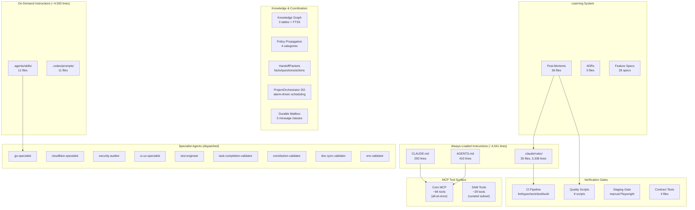

# Track 9: Agent-Ready Repository Architecture

Status: **Complete** (2026-05-07)

---

## Executive Summary

SAM's instruction architecture is among the most sophisticated agent-instruction systems in any open-source project: 35 rule files, 9 specialist review agents, 19 Codex skills, a 7-phase `/do` workflow with external-memory persistence, structured knowledge graphs, policy propagation, and handoff packets. The investment in agent guardrails is extraordinary.

However, this investment has created a **context-budget crisis**. The always-loaded instruction tier (CLAUDE.md + AGENTS.md + 35 rules) consumes ~4,300 lines / ~28k tokens on every conversation start — before a single line of code is read. This crowds out the working context that agents need for actual implementation. Simultaneously, the instruction architecture has significant **coverage gaps**: only 4 of 13 packages have nested `AGENTS.md` files, there is no progressive tool discovery for the 84-tool MCP surface, and no `.claude/settings.json` exists to configure permissions or hooks.

The coordination and verification infrastructure is strong — quality scripts, CI gates, post-mortem-driven rule evolution, and the ProjectOrchestrator DO. The primary improvements needed are (1) reducing the always-loaded instruction tax, (2) extending `AGENTS.md` coverage to all packages, (3) adding progressive MCP tool discovery, and (4) creating a `.claude/settings.json` for permission and hook configuration.

**Readiness Score: 3.8 / 5** — Strong coordination primitives and verification gates, held back by context overload and incomplete navigability aids.

---

## Table of Contents

1. [9.1 Instruction Architecture](#91-instruction-architecture)
2. [9.2 Context Map & Code Discovery](#92-context-map--code-discovery)
3. [9.3 Tool / MCP Surface Design](#93-tool--mcp-surface-design)
4. [9.4 Verification Affordances](#94-verification-affordances)
5. [9.5 Coordination & Knowledge Persistence](#95-coordination--knowledge-persistence)
6. [Repository Context Map](#repository-context-map)
7. [Proposed Nested AGENTS.md Layout](#proposed-nested-agentsmd-layout)
8. [Tool / MCP Scorecard](#tool--mcp-scorecard)
9. [Verification Matrix](#verification-matrix)
10. [Prioritized Improvements & Task Packets](#prioritized-improvements--task-packets)

---

## 9.1 Instruction Architecture

### Current Architecture

The instruction system has three tiers:

| Tier | Scope | Files | Lines | Approx Tokens | Loading |
|------|-------|-------|-------|---------------|---------|
| **Tier 1: Always-loaded** | CLAUDE.md + AGENTS.md + `.claude/rules/*.md` | 37 | ~4,041 | ~28k | Every conversation |
| **Tier 2: On-demand skills** | `.agents/skills/*.md` + `.codex/prompts/*.md` | 11 | ~4,500 | ~30k | When invoked |
| **Tier 3: Specialist agents** | `.claude/agents/*/` | 9 | ~5,400 | ~36k | When dispatched |

**Total instruction corpus: ~97 files, ~13,900 lines.**

#### Tier 1 Breakdown (Always-Loaded)

| File | Lines | Purpose |
|------|-------|---------|
| `CLAUDE.md` | 293 | Project overview, commands, recent changes, active technologies |
| `AGENTS.md` | 410 | Repo structure, key concepts, rules cross-reference |
| `.claude/rules/01-doc-sync.md` | ~90 | Documentation sync requirements |
| `.claude/rules/02-quality-gates.md` | ~280 | Testing, review, verification gates |
| `.claude/rules/03-constitution.md` | ~30 | Constitution validation |
| `.claude/rules/05-preflight.md` | ~70 | Agent preflight behavior |
| `.claude/rules/06-technical-patterns.md` | ~200 | React, credential, CORS patterns |
| `.claude/rules/07-env-and-urls.md` | ~120 | Environment variables, wrangler bindings |
| `.claude/rules/08-architecture.md` | ~100 | Architecture research requirements |
| `.claude/rules/09-task-tracking.md` | ~100 | Task tracking system |
| `.claude/rules/10-e2e-verification.md` | ~130 | End-to-end capability verification |
| `.claude/rules/11-fail-fast-patterns.md` | ~100 | Identity validation, structured logging |
| `.claude/rules/12-strategy.md` | ~120 | Strategy document standards |
| `.claude/rules/13-staging-verification.md` | ~250 | Staging deployment and live verification |
| `.claude/rules/14-do-workflow-persistence.md` | ~130 | `/do` workflow state persistence |
| `.claude/rules/16-no-page-reload-on-mutation.md` | ~60 | React mutation patterns |
| `.claude/rules/17-ui-visual-testing.md` | ~150 | Playwright visual testing |
| `.claude/rules/18-file-size-limits.md` | ~100 | File size limits (500 lines) |
| `.claude/rules/19-external-service-integration.md` | ~100 | External service integration review |
| `.claude/rules/20-cross-origin-cors.md` | ~40 | Cross-origin CORS automation |
| `.claude/rules/21-timeout-merge-guard.md` | ~60 | Timeout merge guard |
| `.claude/rules/22-infrastructure-merge-gate.md` | ~50 | Infrastructure items block merge |
| `.claude/rules/23-cross-boundary-contract-tests.md` | ~80 | Cross-boundary contract tests |
| `.claude/rules/24-no-duplicate-ui-controls.md` | ~40 | No duplicate UI controls |
| `.claude/rules/25-review-merge-gate.md` | ~80 | Review merge gate |
| `.claude/rules/26-project-chat-first.md` | ~60 | Project chat first UX |
| `.claude/rules/27-vm-agent-staging-refresh.md` | ~40 | VM agent binary refresh |
| `.claude/rules/28-credential-resolution-fallback-tests.md` | ~100 | Credential resolution tests |
| `.claude/rules/29-local-first-debugging.md` | ~250 | Local-first debugging |
| `.claude/rules/30-never-ship-broken-features.md` | ~80 | Never ship broken features |
| `.claude/rules/31-migration-safety.md` | ~100 | Migration safety |
| `.claude/rules/32-cf-api-debugging.md` | ~130 | Cloudflare API debugging |
| `.claude/rules/33-staging-feature-validation.md` | ~150 | Staging feature validation methodology |

#### Parallel Agent Systems

Two parallel agent instruction systems exist without cross-reference or deduplication:

| System | Config Dir | Skills Dir | Agents | Purpose |
|--------|-----------|------------|--------|---------|
| **Claude Code** | `.claude/` | `.agents/skills/` | `.claude/agents/` (9 specialists) | Primary development |
| **Codex** | `.agents/` | `.agents/skills/` | N/A | Secondary/legacy |

The `.agents/skills/` directory is shared between both systems but `.codex/prompts/` is Codex-only. This creates potential confusion about which system a skill belongs to.

### Findings

### [HIGH] F1: Always-Loaded Instruction Budget Exceeds Optimal Range

**Track**: 9 - Agent-Ready Repository Architecture
**Location**: `CLAUDE.md`, `AGENTS.md`, `.claude/rules/*.md`
**Category**: agent-readiness

**Finding**: The always-loaded instruction tier consumes ~4,041 lines / ~28k tokens. Claude Code's effective context window for implementation work is reduced by this amount on every conversation. Industry guidance suggests keeping always-loaded instructions under 2,000 lines / ~12k tokens.

The heaviest contributors are:
- `.claude/rules/13-staging-verification.md` (~250 lines) — significant overlap with rules 30 and 33
- `.claude/rules/29-local-first-debugging.md` (~250 lines) — includes a full debugging playbook
- `.claude/rules/02-quality-gates.md` (~280 lines) — combines testing, review, and verification
- `.claude/rules/06-technical-patterns.md` (~200 lines) — mixes React patterns with credential lifecycle

**Impact**: Agents start every task with ~28k tokens of instructions already consumed, leaving less room for code, test output, and reasoning. This directly degrades agent performance on complex implementation tasks that require reading many files.

**Recommendation**:
1. Consolidate overlapping rules (13 + 30 + 33 → single staging gate; 21 + 22 → single merge guard)
2. Move playbooks and reference tables to on-demand skills (e.g., CF API debugging → `/cf-debug` skill)
3. Extract per-domain patterns from rule 06 into nested `AGENTS.md` files (React patterns → `apps/web/AGENTS.md`, credential patterns → `apps/api/AGENTS.md`)
4. Target: reduce Tier 1 to ≤2,000 lines

**Implementation Owner**: Repository-wide instruction refactor
**Effort**: L

---

### [HIGH] F2: No `.claude/settings.json` for Permission and Hook Configuration

**Track**: 9 - Agent-Ready Repository Architecture
**Location**: `.claude/` (missing file)
**Category**: agent-readiness

**Finding**: No `.claude/settings.json` or `.claude/settings.local.json` exists. This file controls:
- Allowed tool permissions (which bash commands agents can run without prompting)
- Custom hooks (pre/post-commit, pre-push, automated behaviors)
- Default model selection and behavior flags

Without it, every agent session requires manual permission grants for common operations like `pnpm test`, `pnpm build`, `gh workflow run`, etc. This creates friction and slows down the `/do` workflow.

**Impact**: Agent efficiency is degraded by repeated permission prompts. Automated behaviors (like running lint after edits) cannot be configured. New contributors must manually approve every command.

**Recommendation**: Create `.claude/settings.json` with:
- Allow-list for common commands: `pnpm`, `npm`, `npx`, `gh`, `git`, `wrangler`, `tsx`, `go`
- Pre-commit hook: `pnpm lint --fix`
- Post-edit hook for `.ts`/`.tsx`: `pnpm typecheck` (optional, may be too aggressive)

**Implementation Owner**: Repository configuration
**Effort**: S

---

### [MEDIUM] F3: AGENTS.md / CLAUDE.md Content Duplication

**Track**: 9 - Agent-Ready Repository Architecture
**Location**: `CLAUDE.md:1-293`, `AGENTS.md:1-410`
**Category**: agent-readiness

**Finding**: Both files cover repository structure, common commands, build order, key concepts, URL construction, env var naming, architecture principles, git workflow, development guidelines, and testing. The duplication exists because CLAUDE.md is loaded by Claude Code while AGENTS.md is loaded by Codex and other tools.

Cross-referenced in Track 3 finding F13.

**Impact**: Any change to shared content must be made in two places. Drift has already occurred — CLAUDE.md contains `Recent Changes` and `Active Technologies` sections that AGENTS.md does not, while AGENTS.md has a rules cross-reference table that CLAUDE.md does not.

**Recommendation**:
1. Make CLAUDE.md the canonical source for all shared content
2. Reduce AGENTS.md to a pointer: "See CLAUDE.md for project instructions. This file contains Codex-specific extensions only."
3. Move Codex-specific content (if any) into `.codex/` configuration

**Implementation Owner**: Repository-wide instruction refactor
**Effort**: S

---

### [MEDIUM] F4: Rule Numbering Gap and Collision Risk

**Track**: 9 - Agent-Ready Repository Architecture
**Location**: `.claude/rules/` directory
**Category**: agent-readiness

**Finding**: Rule file numbering has gaps (no rules 04, 15) and rule 06 (`06-technical-patterns.md`) bundles 6 distinct concerns: provider patterns, React component patterns, React interaction-effect analysis, credential lifecycle alignment, CORS validation, UI-to-backend data path verification, canonical session routing, and idle cleanup. Cross-referenced in Track 3 finding F12.

**Impact**: The multi-topic rule file makes it harder for agents to find relevant guidance. Numbering gaps suggest deleted rules whose content may not have been fully migrated.

**Recommendation**: Split rule 06 by domain and renumber to close gaps. Each rule file should cover a single concern.

**Implementation Owner**: Repository-wide instruction refactor
**Effort**: S

---

### [LOW] F5: No Cross-Reference Matrix from Change Types to Applicable Rules

**Track**: 9 - Agent-Ready Repository Architecture
**Location**: `.claude/rules/` (missing artifact)
**Category**: agent-readiness

**Finding**: Rule 05 (`05-preflight.md`) defines 8 change classifications (`external-api-change`, `cross-component-change`, etc.) but there is no matrix mapping each classification to the specific rules that apply. An agent working on a `security-sensitive-change` must read all 35 rules to find the relevant ones.

**Impact**: Agents may miss applicable rules because they don't know which rules apply to their change type. This is especially problematic for new agents that haven't built up familiarity with the rule corpus.

**Recommendation**: Add a change-type → rule mapping table to `AGENTS.md` or a dedicated `RULES_INDEX.md`:

```
| Change Type | Applicable Rules |
|-------------|-----------------|
| security-sensitive-change | 02, 06 (credential lifecycle), 11, 19, 25, 28 |
| ui-change | 06 (React patterns), 16, 17, 24, 26 |
| infra-change | 07, 13, 22, 27, 29, 31, 32 |
```

**Implementation Owner**: Repository documentation
**Effort**: S

---

## 9.2 Context Map & Code Discovery

### Current State

#### Nested AGENTS.md Coverage

| Package/App | Has AGENTS.md | Lines |
|-------------|:---:|---:|
| `apps/api/` | Yes | ~50 |
| `apps/web/` | Yes | ~30 |
| `apps/www/` | **No** | — |
| `apps/tail-worker/` | **No** | — |
| `packages/vm-agent/` | Yes | ~40 |
| `packages/shared/` | **No** | — |
| `packages/providers/` | **No** | — |
| `packages/cloud-init/` | **No** | — |
| `packages/terminal/` | **No** | — |
| `packages/ui/` | **No** | — |
| `packages/acp-client/` | **No** | — |
| `packages/harness/` | **No** | — |

**Coverage: 3 of 12 packages/apps (25%).** The root `AGENTS.md` provides high-level orientation but agents entering a specific package have no local guide to that package's conventions, key files, or test patterns.

#### Code Discovery Aids

| Aid | Present | Notes |
|-----|:---:|-------|
| Root README.md | Yes | Project overview |
| Root AGENTS.md | Yes | 410 lines, comprehensive |
| Root CLAUDE.md | Yes | 293 lines + 35 rule files |
| Nested AGENTS.md | Partial | 3/12 packages |
| Architecture docs | Yes | `docs/architecture/` (5 files) |
| ADRs | Yes | `docs/adr/` (5 ADRs) |
| Feature specs | Yes | `specs/` (28 specs) |
| Post-mortems | Yes | `docs/notes/` (36 post-mortems) |
| Code comments | Minimal | Convention: code should be self-documenting |
| Type exports | Good | `packages/shared/src/types/` well-organized |

### Findings

### [HIGH] F6: 9 of 12 Packages Lack Nested AGENTS.md

**Track**: 9 - Agent-Ready Repository Architecture
**Location**: `packages/shared/`, `packages/providers/`, `packages/cloud-init/`, `packages/terminal/`, `packages/ui/`, `packages/acp-client/`, `packages/harness/`, `apps/www/`, `apps/tail-worker/`
**Category**: agent-readiness

**Finding**: Only `apps/api/`, `apps/web/`, and `packages/vm-agent/` have nested `AGENTS.md` files. The remaining 9 packages/apps have no local agent instructions. An agent asked to modify `packages/cloud-init/` must infer the package's structure, test patterns, and conventions from the code alone.

Cross-referenced in Track 3 finding F14.

**Impact**: Agents waste context window tokens on exploratory reads that a 30-line `AGENTS.md` would have prevented. They also miss package-specific conventions (e.g., `packages/cloud-init/` uses YAML template generation with specific indentation requirements documented in rule 06 but not in the package itself).

**Recommendation**: Create `AGENTS.md` for every package/app. Each should contain:
1. **Purpose** (1-2 sentences)
2. **Key files** (5-10 most important files with one-line descriptions)
3. **Test patterns** (how to run tests, what framework, fixture locations)
4. **Conventions** (naming, exports, error handling specific to this package)
5. **Gotchas** (known footguns, e.g., "YAML indentation is critical in cloud-init templates")

See [Proposed Nested AGENTS.md Layout](#proposed-nested-agentsmd-layout) for the full specification.

**Implementation Owner**: Per-package
**Effort**: M (30 min per package, 9 packages)

---

### [MEDIUM] F7: No Centralized "Where Things Live" Quick-Reference

**Track**: 9 - Agent-Ready Repository Architecture
**Location**: `AGENTS.md` (partial coverage)
**Category**: agent-readiness

**Finding**: `AGENTS.md` lists the top-level directory structure but does not map common agent tasks to file locations. An agent asked to "add a new MCP tool" must discover the pattern by reading existing tools — there is no quick-reference saying:

```
Adding an MCP tool:
  1. Tool definition: apps/api/src/routes/mcp/tool-definitions-<domain>.ts
  2. Handler: apps/api/src/routes/mcp/<domain>-tools.ts
  3. Registration: apps/api/src/routes/mcp/index.ts
  4. Types: packages/shared/src/types/<domain>.ts
```

**Impact**: Agents spend tokens discovering patterns that could be documented once. This is especially costly for cross-cutting tasks that touch multiple packages.

**Recommendation**: Add a "Common Tasks" section to `AGENTS.md` mapping the 10 most frequent agent tasks to their file locations and patterns:
- Add an MCP tool
- Add an API route
- Add a UI page/component
- Add a Durable Object
- Add a database migration
- Add a quality script
- Add a specialist reviewer agent
- Add a cloud-init template variable
- Add a VM agent endpoint
- Add a shared type

**Implementation Owner**: Repository documentation
**Effort**: S

---

## 9.3 Tool / MCP Surface Design

### Current State

#### MCP Tool Inventory

| Category | File(s) | Tool Count |
|----------|---------|:---:|
| Task management | `tool-definitions-task-tools.ts` | ~12 |
| Knowledge graph | `tool-definitions-knowledge-tools.ts` | ~11 |
| Session/idea linking | `tool-definitions-session-idea-tools.ts` | ~6 |
| Mission orchestration | `tool-definitions-mission-tools.ts` | ~8 |
| Orchestrator lifecycle | `tool-definitions-orchestrator-tools.ts` | ~6 |
| Policy management | `tool-definitions-policy-tools.ts` | ~5 |
| Project awareness | `tool-definitions-project-awareness.ts` | ~4 |
| File library | `tool-definitions-library-tools.ts` | ~4 |
| Agent profiles | `tool-definitions-profile-tools.ts` | ~4 |
| Workspace management | `tool-definitions-workspace-tools.ts` | ~6 |
| Trigger management | `tool-definitions-trigger-tools.ts` | ~4 |
| Orchestration (legacy) | `tool-definitions-orchestration-tools.ts` | ~8 |
| Core (base) | `tool-definitions.ts` | ~6 |
| **Total MCP tools** | | **~84** |

#### SAM Session Tools (Curated Subset)

29 tool files in `apps/api/src/durable-objects/sam-session/tools/`, organized by function:

| Group | Tools | Purpose |
|-------|-------|---------|
| Observation | `list-projects`, `get-project-status`, `get-ci-status`, `get-task-details`, `list-ideas`, `list-sessions`, `get-session-messages`, `search-messages`, `search-code`, `get-file-content`, `get-project-knowledge` | Read-only project insight |
| Action | `dispatch-task`, `create-mission`, `get-mission`, `cancel-mission`, `create-idea`, `find-related-ideas` | Modify project state |
| Knowledge | `add-knowledge`, `get-project-knowledge` | Knowledge graph operations |
| Policy | `add-policy`, `list-policies` | Policy management |
| Orchestration | `get-orchestrator-status` | Orchestrator inspection |
| Search | `search-messages`, `search-code` | Full-text and code search |

#### Tool Loading Strategy

| Consumer | Strategy | Tool Count | Issue |
|----------|----------|:---:|-------|
| Workspace agents (MCP) | **All-at-once** — every tool registered on MCP server startup | ~84 | No progressive discovery; agents see all tools regardless of task |
| SAM session | **Curated subset** — `SAM_TOOLS` array in `tools/index.ts` | ~29 | Well-scoped; organized by intent (observation vs action) |

### Findings

### [HIGH] F8: No Progressive Tool Discovery for MCP Surface

**Track**: 9 - Agent-Ready Repository Architecture
**Location**: `apps/api/src/routes/mcp/index.ts`
**Category**: agent-readiness

**Finding**: All ~84 MCP tools are registered and advertised to workspace agents simultaneously. An agent working on a simple code fix sees knowledge graph tools, orchestrator lifecycle tools, mission management tools, and file library tools — none of which are relevant to its task. This creates two problems:
1. **Context pollution**: Tool descriptions consume tokens in the agent's context
2. **Decision overhead**: More tools = more options to evaluate = slower tool selection

The SAM session demonstrates the correct pattern: a curated `SAM_TOOLS` array of ~29 tools organized by intent (observation vs action).

**Impact**: Workspace agents pay a token tax for tools they will never use. On tasks with tight context budgets, this crowds out code and reasoning.

**Recommendation**: Implement progressive tool discovery:
1. **Core tier** (~15 tools): Always available — `get_instructions`, `complete_task`, `update_task_status`, basic workspace/file operations
2. **Domain tiers** (loaded on demand): Knowledge tools, mission tools, orchestrator tools, library tools, etc.
3. Use MCP's `tools/list` capability with filtering, or implement a `discover_tools` meta-tool that returns available tool groups

**Implementation Owner**: `apps/api/src/routes/mcp/`
**Effort**: L

---

### [MEDIUM] F9: No Centralized Tool Registry or Schema Validation

**Track**: 9 - Agent-Ready Repository Architecture
**Location**: `apps/api/src/routes/mcp/tool-definitions*.ts`, `apps/api/src/routes/mcp/*-tools.ts`
**Category**: agent-readiness

**Finding**: Tool definitions are spread across 13 `tool-definitions-*.ts` files. Tool handlers are in separate `*-tools.ts` files. Registration happens via switch statements in the route handler, not a declarative registry. There is no automated check that:
- Every defined tool has a handler
- Every handler has a definition
- Tool parameter schemas are valid JSON Schema
- Tool names are unique across all definition files

**Impact**: Adding a new tool requires changes in 3 files (definition, handler, registration) with no compile-time or CI verification that they're consistent. A typo in the tool name would cause a silent failure.

**Recommendation**:
1. Create a `ToolRegistry` class that auto-validates definition-handler pairing at startup
2. Add a quality script (`pnpm quality:mcp-tools`) that verifies all definitions have handlers and vice versa
3. Consider co-locating definitions and handlers in the same file (like SAM tools do)

**Implementation Owner**: `apps/api/src/routes/mcp/`
**Effort**: M

---

### [LOW] F10: Limited Domain-Specific Error Codes in MCP Responses

**Track**: 9 - Agent-Ready Repository Architecture
**Location**: `apps/api/src/routes/mcp/*-tools.ts`
**Category**: agent-readiness

**Finding**: Only 1 domain-specific error code exists: `FILE_EXISTS` in `library-tools.ts`. All other tool errors use generic JSON-RPC error codes or plain text error messages. This makes it harder for agents to programmatically handle specific failure cases (e.g., distinguishing "entity not found" from "permission denied" from "rate limited").

**Impact**: Agents cannot programmatically retry or handle specific tool failures. They must parse error message text, which is fragile.

**Recommendation**: Define a standard error code enum for MCP tool responses:
```typescript
enum McpToolErrorCode {
  NOT_FOUND = 'NOT_FOUND',
  ALREADY_EXISTS = 'ALREADY_EXISTS',
  PERMISSION_DENIED = 'PERMISSION_DENIED',
  RATE_LIMITED = 'RATE_LIMITED',
  VALIDATION_ERROR = 'VALIDATION_ERROR',
  RESOURCE_EXHAUSTED = 'RESOURCE_EXHAUSTED',
}
```

**Implementation Owner**: `packages/shared/src/types/mcp.ts`
**Effort**: M

---

## 9.4 Verification Affordances

### Current State

#### Quality Scripts

| Script | CI Gate | What It Checks |
|--------|:---:|-----------------|
| `quality:preflight` | Yes | PR has preflight evidence block |
| `quality:wrangler-bindings` | Yes | No `[env.*]` sections, required bindings present |
| `quality:ast-checks` | Yes | AST-level code quality checks |
| `quality:file-sizes` | Yes | No source file > 500/800 lines |
| `quality:migration-safety` | Yes | No DROP TABLE on CASCADE parents |
| `quality:do-migration-safety` | Yes | No dangerous operations in DO migrations |
| `quality:source-contract-tests` | Yes | No `readFileSync` + `toContain` on interactive components |
| `quality:specialist-review` | Yes | PR has specialist review evidence table |
| `quality:observability-noise` | Partial | Staging error noise check (requires CF_TOKEN) |

#### CI Pipeline

| Job | What It Does |
|-----|-------------|
| `ci.yml` | lint, typecheck, test, build on all pushes/PRs |
| `deploy-staging.yml` | Manual trigger — staging deployment |
| `deploy.yml` | Production deploy on push to main |
| `teardown.yml` | Manual — destroy all resources |
| Quality gates | 9 scripts above |

#### Test Infrastructure

| Framework | Location | Coverage |
|-----------|----------|----------|
| Vitest (unit) | `tests/unit/` per package | Good for pure logic |
| Vitest (workers) | `apps/api/tests/workers/` | Miniflare integration tests |
| Playwright | `apps/web/tests/playwright/` | Visual audit tests (not in CI) |
| Go test | `packages/vm-agent/` | Unit tests (race detector not in CI) |
| Contract tests | `apps/api/tests/contracts/` | 4 files — cross-boundary verification |

### Findings

### [HIGH] F11: Playwright Visual Tests Not in CI Pipeline

**Track**: 9 - Agent-Ready Repository Architecture
**Location**: `apps/web/tests/playwright/`, `.github/workflows/ci.yml`
**Category**: agent-readiness

**Finding**: Rule 17 mandates Playwright visual audits for all UI changes, and the `apps/web/tests/playwright/` directory contains audit test files. However, these tests are not wired into the CI pipeline (`ci.yml`). They run only when agents manually invoke Playwright during the `/do` workflow Phase 3. This means:
1. UI regressions can ship if an agent skips the manual step
2. PRs from human contributors skip visual testing entirely

Cross-referenced with Track 6 analysis.

**Impact**: The visual testing gate exists in documentation but is not enforced by CI. Enforcement depends entirely on agent compliance with rule 17.

**Recommendation**: Add a Playwright CI job that runs visual audit tests on PRs touching `apps/web/`, `packages/ui/`, or `packages/terminal/`. Use a headless browser in CI with screenshot artifact upload.

**Implementation Owner**: `.github/workflows/ci.yml`
**Effort**: M

---

### [MEDIUM] F12: Go Race Detector Not Enabled in CI

**Track**: 9 - Agent-Ready Repository Architecture
**Location**: `.github/workflows/ci.yml`, `packages/vm-agent/`
**Category**: agent-readiness

**Finding**: The Go VM agent uses goroutines extensively (ACP session handling, PTY management, Docker operations, WebSocket streaming). `go test -race` is not included in CI. Race conditions are a common source of production bugs in concurrent Go code.

Cross-referenced with Track 6 finding.

**Impact**: Data races in the VM agent may not be caught until production, where they manifest as intermittent failures.

**Recommendation**: Add `-race` flag to Go test invocation in CI: `go test -race ./...`

**Implementation Owner**: `.github/workflows/ci.yml`
**Effort**: S

---

### [MEDIUM] F13: No Staging Smoke Test Suite

**Track**: 9 - Agent-Ready Repository Architecture
**Location**: `.github/workflows/` (missing)
**Category**: agent-readiness

**Finding**: Staging verification is entirely manual — agents run Playwright scripts during `/do` Phase 6, following the procedure in rule 13. There is no automated smoke test suite that runs after staging deployment to verify core workflows (health endpoint, auth flow, project creation, chat rendering).

**Impact**: If an agent skips staging verification (due to timeout, context loss, or oversight), there is no automated safety net. A broken staging deploy can persist unnoticed until the next agent tries to verify.

**Recommendation**: Create a post-deploy smoke test workflow that triggers automatically after `deploy-staging.yml` succeeds:
1. Health endpoint check
2. Auth flow (token-login)
3. Dashboard loads
4. API CORS headers correct
5. At minimum 5 critical paths verified

**Implementation Owner**: `.github/workflows/`
**Effort**: M

---

### [LOW] F14: Quality Scripts Lack Self-Tests for 3 of 9 Scripts

**Track**: 9 - Agent-Ready Repository Architecture
**Location**: `scripts/quality/`
**Category**: agent-readiness

**Finding**: Of the 9 quality scripts, only 4 have companion test files (`check-migration-safety.test.ts`, `check-do-migration-safety.test.ts`, `check-observability-noise.test.ts`, `check-specialist-review-evidence.test.ts`). The remaining 5 (`check-preflight-evidence.ts`, `check-wrangler-bindings.ts`, `ast-checks.ts`, `check-file-sizes.ts`, `check-source-contract-tests.ts`) lack tests.

**Impact**: A regression in a quality gate script would silently stop catching the class of bug it was designed to prevent.

**Recommendation**: Add test files for the 5 untested quality scripts, focusing on: does the script correctly flag known-bad patterns and pass known-good patterns?

**Implementation Owner**: `scripts/quality/`
**Effort**: M

---

## 9.5 Coordination & Knowledge Persistence

### Current State

#### Agent Coordination Primitives

| Primitive | Location | Purpose |
|-----------|----------|---------|
| **HandoffPacket** | `packages/shared/src/types/mission.ts` | Structured data transfer between mission tasks (summary, facts, openQuestions, artifactRefs, suggestedActions) |
| **ProjectOrchestrator DO** | `apps/api/src/durable-objects/project-orchestrator/` | Alarm-driven scheduling loop, dependency resolution, stall detection |
| **Durable Mailbox** | `apps/api/src/routes/mcp/mailbox-tools.ts` | 5 message classes (notify, deliver, interrupt, preempt_and_replan, shutdown_with_final_prompt) with urgency-based priority |
| **Policy Propagation** | `apps/api/src/routes/mcp/policy-tools.ts` | Rules/constraints/preferences inherited by child tasks via dispatch_task |
| **`.do-state.md`** | Gitignored file in repo root | External memory pattern for `/do` workflow state persistence across context compaction |
| **Task Files** | `tasks/active/*.md` | Markdown checklists with implementation notes, failure records |

#### Knowledge Persistence

| Mechanism | Storage | Scope | Query |
|-----------|---------|-------|-------|
| **Knowledge Graph** | ProjectData DO SQLite (3 tables + FTS5) | Per-project | Entity-observation-relation model with confidence scoring |
| **Policies** | ProjectData DO SQLite | Per-project | Category-based (rule/constraint/delegation/preference) |
| **Post-mortems** | `docs/notes/*.md` | Repository-wide | 36 post-mortem files with class-of-bug analysis |
| **ADRs** | `docs/adr/*.md` | Repository-wide | 5 architecture decision records |
| **Feature Specs** | `specs/*/` | Per-feature | 28 feature specifications |
| **`.do-state.md`** | Repo root (gitignored) | Per-session | External memory for workflow state |

#### Rule Evolution Process

The project has a mature post-mortem → rule → CI gate pipeline:

```
Bug discovered
  → Post-mortem written (docs/notes/YYYY-MM-DD-*-postmortem.md)
    → Class of bug identified
      → Rule added/updated (.claude/rules/*.md)
        → CI quality script added (scripts/quality/*.ts)
          → Future agents prevented from repeating the bug
```

This is evidenced by 36 post-mortems, many of which directly created new rules (e.g., the TLS YAML bug → rules 02 template output verification + infrastructure verification gate; the cascade data loss → rule 31 migration safety).

### Findings

### [INFO] F15: Strong Post-Mortem → Rule → Gate Pipeline

**Track**: 9 - Agent-Ready Repository Architecture
**Location**: `docs/notes/`, `.claude/rules/`, `scripts/quality/`
**Category**: agent-readiness

**Finding**: SAM has one of the most mature "learn from failures" systems observed in any agent-operated codebase. The pipeline from incident → post-mortem → rule → CI enforcement is well-established, with 36 post-mortems driving rule creation and 9 quality scripts enforcing key invariants.

**Impact**: Positive — this is a strong practice that should be preserved and documented as a pattern for other projects.

**Recommendation**: Document this pipeline as a first-class workflow in AGENTS.md so new agents understand how to contribute to it. Currently the process is implicit — derived from reading individual post-mortem files.

**Implementation Owner**: `AGENTS.md`
**Effort**: S

---

### [MEDIUM] F16: HandoffPacket Schema Strong but Underutilized

**Track**: 9 - Agent-Ready Repository Architecture
**Location**: `packages/shared/src/types/mission.ts`
**Category**: agent-readiness

**Finding**: The `HandoffPacket` type is well-designed with structured fields (summary, facts, openQuestions, artifactRefs, suggestedActions), but usage analysis shows it is primarily used in the orchestrator's dependency resolution flow. The rich structured data (especially `openQuestions` and `suggestedActions`) is not yet surfaced in:
1. The SAM agent's mission overview
2. Task detail views in the UI
3. Agent instructions when a dependent task starts

**Impact**: Valuable context captured by completing agents is not reaching the next agent in the dependency chain as effectively as it could be.

**Recommendation**: Wire `HandoffPacket.openQuestions` and `suggestedActions` into the `get_instructions` MCP response when a task has upstream dependencies with handoff data.

**Implementation Owner**: `apps/api/src/routes/mcp/tool-definitions.ts` (get_instructions handler)
**Effort**: M

---

### [MEDIUM] F17: No Knowledge Graph Pruning or Confidence Decay

**Track**: 9 - Agent-Ready Repository Architecture
**Location**: `apps/api/src/routes/mcp/knowledge-tools.ts`
**Category**: agent-readiness

**Finding**: The knowledge graph has `confidence` scoring and `confirmedAt` timestamps, but no automated pruning of stale or low-confidence entities. The `KNOWLEDGE_MAX_ENTITIES_PER_PROJECT` limit (default 500) is the only cap. Over time, outdated observations accumulate alongside current ones, and the auto-retrieval in `get_instructions` may return stale context.

**Impact**: Knowledge graph quality degrades over time as stale entities accumulate. Agents receive outdated context mixed with current information.

**Recommendation**:
1. Add confidence decay: entities not confirmed within N days have confidence reduced
2. Add background pruning: entities below a confidence threshold are archived (not deleted)
3. Weight auto-retrieval by recency and confidence

**Implementation Owner**: `apps/api/src/routes/mcp/knowledge-tools.ts`, `apps/api/src/services/project-data.ts`
**Effort**: M

---

### [LOW] F18: Specialist Review Agent Instructions Not Version-Tracked with Code

**Track**: 9 - Agent-Ready Repository Architecture
**Location**: `.claude/agents/` (9 directories)
**Category**: agent-readiness

**Finding**: The 9 specialist review agents (go-specialist, cloudflare-specialist, security-auditor, etc.) have instructions in `.claude/agents/<name>/` directories. These instructions evolve independently of the codebase patterns they review. When a new coding pattern is established (e.g., a new Durable Object pattern), the relevant specialist's instructions must be manually updated to know about it.

**Impact**: Specialist reviewers may not catch violations of recently-established patterns because their instructions haven't been updated.

**Recommendation**: Add a checklist item to the post-mortem template: "If this bug class is catchable by a specialist reviewer, update the relevant agent's instructions."

**Implementation Owner**: Post-mortem template, specialist agent instructions
**Effort**: S

---

## Repository Context Map



---

## Proposed Nested AGENTS.md Layout

Every package and app directory should contain an `AGENTS.md` with this structure:

```markdown
# <Package Name>

## Purpose
<1-2 sentences: what this package does and who depends on it>

## Key Files
| File | Purpose |
|------|---------|
| `src/index.ts` | Public API — all exports |
| `src/<main-module>.ts` | <primary logic> |
| ... | (5-10 most important files) |

## Test Patterns
- Framework: <Vitest | Go test | Playwright>
- Run: `<command>`
- Fixtures: `<path if any>`
- Mocking: <patterns used>

## Conventions
- <naming conventions>
- <export patterns>
- <error handling patterns>

## Gotchas
- <known footguns, e.g., "YAML indentation critical">
- <non-obvious dependencies>
```

### Proposed Coverage Plan

| Package | Priority | Key Content |
|---------|:---:|-------------|
| `packages/shared/` | P0 | Type organization, constant registries, export patterns |
| `packages/cloud-init/` | P0 | YAML template generation, indentation rules, PEM handling |
| `packages/providers/` | P0 | Provider interface contract, adding new providers |
| `apps/www/` | P1 | Astro + Starlight conventions, content collections, blog workflow |
| `apps/tail-worker/` | P1 | Tail Worker patterns, event filtering |
| `packages/ui/` | P1 | Design tokens, component patterns, Tailwind conventions |
| `packages/terminal/` | P1 | Terminal component API, xterm.js integration |
| `packages/acp-client/` | P1 | ACP component library, message rendering |
| `packages/harness/` | P2 | Harness evaluation patterns, model routing |

---

## Tool / MCP Scorecard

| Dimension | Score | Notes |
|-----------|:---:|-------|
| **Naming consistency** | 4/5 | snake_case throughout, clear verb prefixes (get_, list_, create_, update_, delete_) |
| **Parameter validation** | 3/5 | JSON Schema on definitions, but no runtime schema validation library |
| **Error specificity** | 2/5 | Only 1 domain-specific error code (FILE_EXISTS); rest are generic |
| **Progressive discovery** | 1/5 | All 84 tools loaded at once; SAM subset is curated but static |
| **Documentation** | 3/5 | Tool descriptions are clear; no generated tool catalog |
| **Testability** | 3/5 | Tools testable via Miniflare; no dedicated tool integration test suite |
| **Idempotency** | 4/5 | Most tools are idempotent (get/list/search); mutations have guard checks |
| **Composability** | 3/5 | Tools are independent; no explicit "workflow" tools that chain operations |
| **Overall** | **2.9/5** | Strong naming and idempotency; weak on discovery and error codes |

---

## Verification Matrix

| Verification Need | Current State | Automated? | Gap |
|-------------------|--------------|:---:|-----|
| TypeScript type safety | `pnpm typecheck` in CI | Yes | None |
| Lint rules | `pnpm lint` in CI | Yes | None |
| Unit tests | `pnpm test` in CI | Yes | Coverage thresholds not enforced |
| Migration safety | `quality:migration-safety` in CI | Yes | None |
| DO migration safety | `quality:do-migration-safety` in CI | Yes | None |
| File size limits | `quality:file-sizes` in CI | Yes | None |
| Wrangler bindings | `quality:wrangler-bindings` in CI | Yes | None |
| Source contract test ban | `quality:source-contract-tests` in CI | Yes | None |
| Preflight evidence | `quality:preflight` in CI | Yes | None |
| Specialist review evidence | `quality:specialist-review` in CI | Yes | None |
| AST checks | `quality:ast-checks` in CI | Yes | None |
| Playwright visual tests | Manual (agent-run) | **No** | Not in CI pipeline |
| Go race detection | Not configured | **No** | `-race` flag missing |
| Staging smoke tests | Manual (agent-run) | **No** | No post-deploy suite |
| MCP tool registration | Not checked | **No** | No definition-handler parity check |
| Observability noise | `quality:observability-noise` | Partial | Requires CF_TOKEN; not in standard CI |
| Contract test coverage | 4 files exist | Yes | Limited scope |
| Knowledge graph health | Not checked | **No** | No confidence decay or pruning |

---

## Prioritized Improvements & Task Packets

### P0 (Critical / High — Address Within 2 Weeks)

#### Task Packet 1: Reduce Always-Loaded Instruction Budget

**Objective**: Reduce Tier 1 instruction corpus from ~4,041 lines to ≤2,000 lines.

**Acceptance Criteria**:
- [ ] Overlapping staging rules (13, 30, 33) consolidated into a single rule
- [ ] Overlapping merge-guard rules (21, 22) consolidated
- [ ] CF API debugging playbook (rule 32) extracted to `/cf-debug` skill
- [ ] Local-first debugging playbook (rule 29) shortened to principles only; full playbook moved to skill
- [ ] Per-domain patterns extracted from rule 06 into relevant nested AGENTS.md files
- [ ] AGENTS.md reduced to Codex-only pointer (shared content canonical in CLAUDE.md)
- [ ] Total always-loaded content ≤ 2,000 lines measured by `cat CLAUDE.md AGENTS.md .claude/rules/*.md | wc -l`

**Related Findings**: F1, F3, F4
**Effort**: L

#### Task Packet 2: Create Missing Nested AGENTS.md Files

**Objective**: Every package and app has a local `AGENTS.md` with purpose, key files, test patterns, conventions, and gotchas.

**Acceptance Criteria**:
- [ ] `packages/shared/AGENTS.md` created with type organization and export patterns
- [ ] `packages/cloud-init/AGENTS.md` created with YAML template gotchas
- [ ] `packages/providers/AGENTS.md` created with provider interface contract
- [ ] `packages/ui/AGENTS.md` created with design token conventions
- [ ] `packages/terminal/AGENTS.md` created
- [ ] `packages/acp-client/AGENTS.md` created with ACP component patterns
- [ ] `packages/harness/AGENTS.md` created
- [ ] `apps/www/AGENTS.md` created with Astro/Starlight conventions
- [ ] `apps/tail-worker/AGENTS.md` created
- [ ] Each file follows the template in the Proposed Nested AGENTS.md Layout section
- [ ] Each file is ≤50 lines

**Related Findings**: F6
**Effort**: M

#### Task Packet 3: Create `.claude/settings.json`

**Objective**: Configure default permissions and hooks to reduce agent friction.

**Acceptance Criteria**:
- [ ] `.claude/settings.json` created and committed
- [ ] Allow-list includes: `pnpm`, `npm`, `npx`, `gh`, `git` (non-destructive), `wrangler`, `tsx`, `go`, `docker`
- [ ] No destructive commands in allow-list (no `rm -rf`, `git push --force`, `git reset --hard`)
- [ ] Documented in CLAUDE.md under a "Claude Code Configuration" section

**Related Findings**: F2
**Effort**: S

### P1 (Medium — Address Within 1 Month)

#### Task Packet 4: Implement Progressive MCP Tool Discovery

**Objective**: Workspace agents receive only task-relevant tools instead of all 84.

**Acceptance Criteria**:
- [ ] Core tool tier defined (~15 tools always available)
- [ ] Domain tool tiers defined (knowledge, mission, orchestrator, library, etc.)
- [ ] Tool loading respects task type or explicit agent request
- [ ] SAM agent retains its curated subset unchanged
- [ ] Backward-compatible: existing MCP clients still work

**Related Findings**: F8
**Effort**: L

#### Task Packet 5: Add Playwright Visual Tests to CI

**Objective**: UI regression detection is automated, not dependent on agent compliance.

**Acceptance Criteria**:
- [ ] CI job runs Playwright visual audit tests on PRs touching `apps/web/`, `packages/ui/`, `packages/terminal/`
- [ ] Headless browser (Chromium) in CI
- [ ] Screenshot artifacts uploaded on failure
- [ ] Job is non-blocking (warning) initially, blocking after 2-week stabilization

**Related Findings**: F11
**Effort**: M

#### Task Packet 6: Add MCP Tool Registry and Quality Check

**Objective**: Tool definition-handler consistency is verified automatically.

**Acceptance Criteria**:
- [ ] `pnpm quality:mcp-tools` script created
- [ ] Verifies every tool definition has a handler
- [ ] Verifies every handler has a definition
- [ ] Verifies tool names are unique across all definition files
- [ ] Added to CI pipeline

**Related Findings**: F9
**Effort**: M

#### Task Packet 7: Add Go Race Detector to CI

**Objective**: Concurrent data races in VM agent are caught before merge.

**Acceptance Criteria**:
- [ ] `go test -race ./...` runs in CI for `packages/vm-agent/`
- [ ] Existing tests pass with race detector (fix any detected races)

**Related Findings**: F12
**Effort**: S

#### Task Packet 8: Create Post-Deploy Staging Smoke Suite

**Objective**: Automated verification after every staging deployment.

**Acceptance Criteria**:
- [ ] Workflow triggers after `deploy-staging.yml` succeeds
- [ ] Checks: health endpoint, auth flow (token-login), dashboard load, API CORS
- [ ] Failure alerts via GitHub Actions notification
- [ ] Uses `SAM_PLAYWRIGHT_PRIMARY_USER` for auth

**Related Findings**: F13
**Effort**: M

### P2 (Low — Address When Convenient)

#### Task Packet 9: Add Common Tasks Quick-Reference to AGENTS.md

**Related Findings**: F7 | **Effort**: S

#### Task Packet 10: Add Domain-Specific MCP Error Codes

**Related Findings**: F10 | **Effort**: M

#### Task Packet 11: Implement Knowledge Graph Confidence Decay

**Related Findings**: F17 | **Effort**: M

#### Task Packet 12: Add Quality Script Self-Tests

**Related Findings**: F14 | **Effort**: M

#### Task Packet 13: Wire HandoffPacket Data into get_instructions

**Related Findings**: F16 | **Effort**: M

#### Task Packet 14: Document Post-Mortem → Rule → Gate Pipeline

**Related Findings**: F15 | **Effort**: S

#### Task Packet 15: Add Change-Type → Rule Cross-Reference Matrix

**Related Findings**: F5 | **Effort**: S

#### Task Packet 16: Add Specialist Reviewer Update to Post-Mortem Template

**Related Findings**: F18 | **Effort**: S

---

## Findings Index

| ID | Severity | Title | Category |
|----|----------|-------|----------|
| F1 | HIGH | Always-loaded instruction budget exceeds optimal range | agent-readiness |
| F2 | HIGH | No `.claude/settings.json` for permission and hook configuration | agent-readiness |
| F3 | MEDIUM | AGENTS.md / CLAUDE.md content duplication | agent-readiness |
| F4 | MEDIUM | Rule numbering gap and collision risk | agent-readiness |
| F5 | LOW | No cross-reference matrix from change types to applicable rules | agent-readiness |
| F6 | HIGH | 9 of 12 packages lack nested AGENTS.md | agent-readiness |
| F7 | MEDIUM | No centralized "where things live" quick-reference | agent-readiness |
| F8 | HIGH | No progressive tool discovery for MCP surface | agent-readiness |
| F9 | MEDIUM | No centralized tool registry or schema validation | agent-readiness |
| F10 | LOW | Limited domain-specific error codes in MCP responses | agent-readiness |
| F11 | HIGH | Playwright visual tests not in CI pipeline | agent-readiness |
| F12 | MEDIUM | Go race detector not enabled in CI | agent-readiness |
| F13 | MEDIUM | No staging smoke test suite | agent-readiness |
| F14 | LOW | Quality scripts lack self-tests for 3 of 9 scripts | agent-readiness |
| F15 | INFO | Strong post-mortem → rule → gate pipeline | agent-readiness |
| F16 | MEDIUM | HandoffPacket schema strong but underutilized | agent-readiness |
| F17 | MEDIUM | No knowledge graph pruning or confidence decay | agent-readiness |
| F18 | LOW | Specialist review agent instructions not version-tracked with code | agent-readiness |
