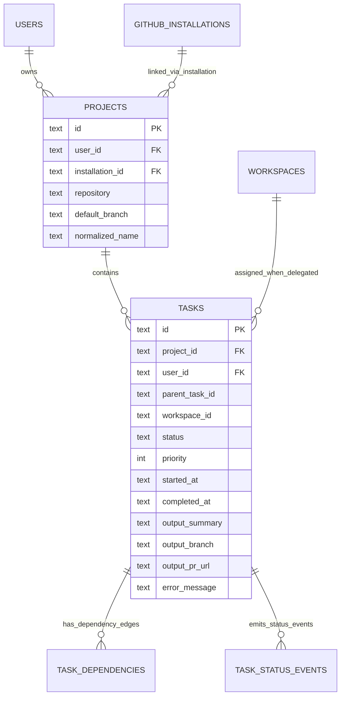
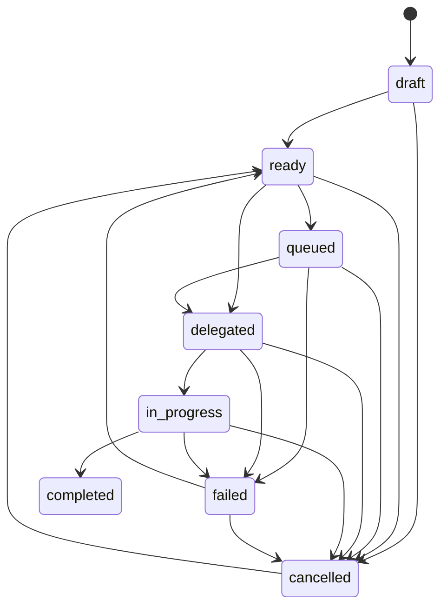
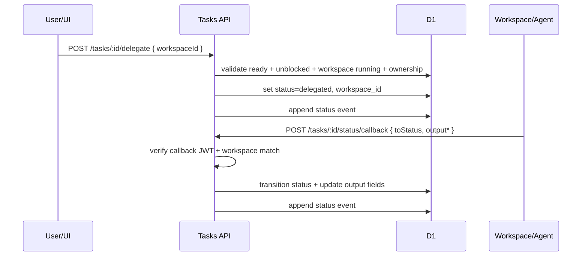
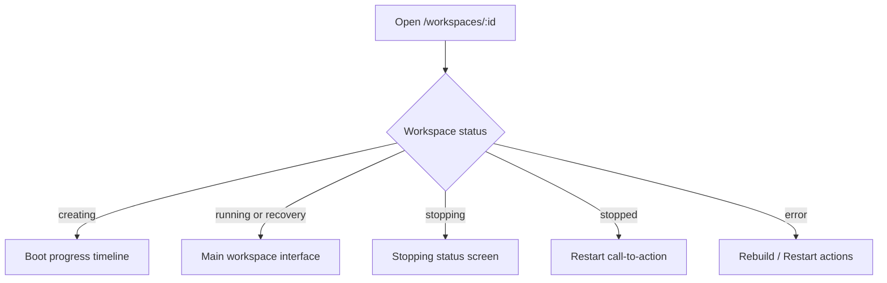

# Current State Snapshot: Projects, Tasks, and Workspace UX

- Snapshot timestamp (UTC): `2026-02-18T21:00:14Z`
- Code snapshot commit: `b76b3e9`
- Scope: Current behavior implemented in API + web UI as of the commit above.

## 1) Projects/Tasks System (Current Implementation)

### Data model



Source: `apps/api/src/db/schema.ts`, `apps/api/src/db/migrations/0011_projects_tasks_foundation.sql`.

### API surface

- Projects router: `app.route('/api/projects', projectsRoutes)` in `apps/api/src/index.ts`.
- Tasks router (project-scoped): `app.route('/api/projects/:projectId/tasks', tasksRoutes)` in `apps/api/src/index.ts`.

Implemented task operations:
- CRUD + list/filter/sort/pagination
- status transitions
- trusted callback status transitions
- dependency add/remove
- manual delegation to running workspace
- status event history

Source: `apps/api/src/routes/projects.ts`, `apps/api/src/routes/tasks.ts`.

### Ownership and access guards

- All project and task operations are user-owned (`requireOwnedProject`, `requireOwnedTask`, `requireOwnedWorkspace`).
- Exception: callback status endpoint bypasses session auth middleware but requires callback JWT.

Source: `apps/api/src/middleware/project-auth.ts`, `apps/api/src/routes/tasks.ts`.

## 2) Task Lifecycle and Execution

### Status machine



Source: `apps/api/src/services/task-status.ts`.

### Dependency blocking rule

- A task is blocked when any dependency edge points to a task not in `completed`.
- Blocked tasks cannot move into executable statuses (`queued`, `delegated`, `in_progress`).

Source: `apps/api/src/services/task-graph.ts`, `apps/api/src/services/task-status.ts`, `apps/api/src/routes/tasks.ts`.

### How tasks are executed today

Current execution is primarily a state/delegation workflow:
- Delegation endpoint assigns `workspaceId` and sets status to `delegated`.
- Actual work occurs in the workspace (human/agent activity).
- Progress/completion is reflected by status updates:
  - user path: `POST .../status`
  - trusted workspace path: `POST .../status/callback` (callback JWT required)



Source: `apps/api/src/routes/tasks.ts`, `apps/api/src/services/jwt.ts`.

## 3) Workspace UI Experience

### High-level flow



Source: `apps/web/src/pages/Workspace.tsx`.

### Running workspace layout

```mermaid
flowchart LR
  H[Header\nname/status/worktree/files/git/menu] --> T[Tab Strip\nterminal + chat tabs\ncreate/rename/reorder/close]
  T --> M[Main Content\nTerminal or Chat session view]
  M --> O[Overlays\nGit Changes\nGit Diff\nFile Browser\nFile Viewer\nCommand Palette]
  M --> S[Sidebar (desktop)\nInfo\nSessions\nGit summary\nToken usage\nEvents]
```

Source: `apps/web/src/pages/Workspace.tsx`, `apps/web/src/components/WorkspaceTabStrip.tsx`, `apps/web/src/components/WorkspaceSidebar.tsx`.

### UX capabilities in running state

- Multi-terminal tabs (when feature flag enabled) and terminal focus controls.
- Multiple chat sessions (ACP), each with independent session state.
- Worktree switch/create/remove in-header selector.
- Git panels (changes + diff/full view).
- File browser and file viewer overlays.
- Command palette + keyboard shortcuts.
- Mobile-specific slide-in workspace menu.

Source:
- `apps/web/src/pages/Workspace.tsx`
- `apps/web/src/components/ChatSession.tsx`
- `apps/web/src/components/WorktreeSelector.tsx`
- `apps/web/src/components/GitChangesPanel.tsx`
- `apps/web/src/components/GitDiffView.tsx`
- `apps/web/src/components/FileBrowserPanel.tsx`
- `apps/web/src/components/FileViewerPanel.tsx`
- `apps/web/src/components/CommandPalette.tsx`
- `apps/web/src/lib/keyboard-shortcuts.ts`

## 4) Known Gaps / Follow-up Candidates

1. Task list pagination cursor uses `task.id` even when sorting by `updatedAt` or `priority`, so deep pagination for non-id sort keys is not fully stable.
2. Status updates accept no-op transitions (`from == to`), which can create noisy duplicate status events.
3. Callback auth is workspace-scoped (not task-scoped) and relies on callback-token lifetime configuration.
4. `queued` exists in state model, but practical execution path in codebase is manual delegation plus status/callback reporting.
5. Route tests for projects/tasks are mostly source-contract assertions; deeper behavior/integration tests would improve confidence.

Primary references:
- `apps/api/src/routes/tasks.ts`
- `apps/api/src/services/task-status.ts`
- `apps/api/src/services/jwt.ts`
- `apps/api/tests/unit/routes/tasks.test.ts`
- `apps/api/tests/unit/routes/projects.test.ts`

## 5) Summary

As of `2026-02-18T21:00:14Z` at commit `b76b3e9`, the system implements:
- production-grade project/task data structures with ownership and dependency controls,
- a status/event-driven task execution tracking model with manual delegation to workspaces,
- and a workspace UI centered on tabbed terminal/chat workflows plus git/file/worktree tooling.
