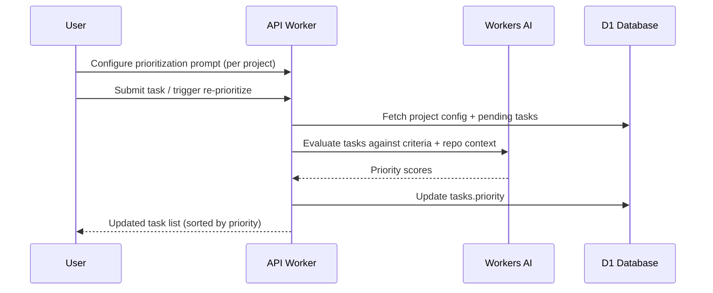

# LLM-Powered Task Prioritization — Research Notes

**Date**: 2026-03-09
**Status**: Research / Exploration

## Overview

Explore building a dynamic task prioritization system where an LLM evaluates tasks against user-defined project-level criteria, using the git repo as context to make informed priority decisions.

## Current State

### What Already Exists

| Component | Status | Details |
|-----------|--------|---------|
| `tasks.priority` column | Integer, default 0 | DB schema ready (`schema.ts:310`) |
| Priority sort index | Composite | `idx_tasks_project_status_priority_updated` on (projectId, status, priority, updatedAt) |
| `sort=priorityDesc` API param | Working | `tasks.ts:434-440` — ORDER BY priority DESC, updatedAt DESC |
| Kanban priority sort | Working | `TaskKanbanBoard.tsx:80` — tasks sorted by priority DESC within columns |
| Workers AI binding | Active | `wrangler.toml` [ai] section, used for task title generation |
| Mastra agent pattern | Proven | `task-title.ts` — structured LLM interaction with retry, timeout, fallback |
| Project-level settings | Schema exists | `projects.defaultVmSize`, `defaultAgentType` — pattern for per-project config |
| Per-project env vars & files | Tables exist | `projectRuntimeEnvVars`, `projectRuntimeFiles` — encrypted per-project storage |

### What Needs to Be Built

The priority field and sort infrastructure exist but are entirely manual today. No automated or LLM-driven evaluation exists.

## Proposed Architecture

### Core Concept



### 1. Project Prioritization Settings

Add a `prioritizationPrompt` text column to the `projects` table (or a dedicated config table). This stores the user's natural-language criteria.

**Example prompts a user might write:**

> "Prioritize tasks that fix bugs over new features. Within bugs, prioritize those affecting authentication or data integrity. Deprioritize cosmetic/UI tasks unless they block user workflows."

> "Rank by: (1) customer-reported issues first, (2) tasks touching payment code, (3) tasks with the most dependencies, (4) everything else by age."

**Schema addition:**

```typescript
// In projects table or new projectSettings table
prioritizationPrompt: text('prioritization_prompt'),  // nullable, user-defined
prioritizationEnabled: integer('prioritization_enabled').default(0),
prioritizationModel: text('prioritization_model'),  // override model, nullable
```

### 2. Prioritization Service

A new service (`apps/api/src/services/task-prioritization.ts`) following the same pattern as `task-title.ts`:

```typescript
interface PrioritizationInput {
  tasks: Array<{ id: string; title: string; description: string; status: string; createdAt: string }>;
  projectPrompt: string;        // user criteria
  repoContext?: string;         // file tree, recent commits, key files
}

interface PrioritizationResult {
  taskId: string;
  priority: number;             // 0-100 normalized score
  reasoning: string;            // brief explanation
}
```

**Key design decisions:**

- **Batch evaluation**: Send all pending tasks in a single LLM call to enable relative ranking (not individual scoring). This is critical — priority is inherently comparative.
- **Structured output**: Use Mastra's structured generation to get JSON back, not free-text.
- **Repo context injection**: Provide the LLM with relevant repo context so it can assess task impact accurately.
- **Idempotent scoring**: Re-running prioritization on the same set of tasks with the same criteria should produce consistent (not necessarily identical) results.

### 3. Repo Context Strategy

The key differentiator of this feature is that the LLM has access to the git repo for informed prioritization. Several approaches, from lightweight to heavy:

#### Option A: File Tree + README (Lightweight, ~2K tokens)

```
Inject: directory tree (depth 3) + README.md + recent git log (20 commits)
```

- Pros: Fast, cheap, fits in any context window
- Cons: Limited understanding of codebase structure and dependencies

#### Option B: Targeted File Retrieval (Medium, ~10-20K tokens)

```
Inject: file tree + key files matching task descriptions
  → For each task, grep repo for mentioned file paths, function names, or keywords
  → Include relevant file excerpts (first 50 lines of matched files)
```

- Pros: Task-specific context, much better accuracy
- Cons: Requires a pre-processing step (grep/search), higher token cost, latency

#### Option C: Embedding-Based RAG (Heavy, highest accuracy)

```
Pre-compute: embeddings for all files in the repo
At prioritization time: retrieve top-k relevant chunks per task
```

- Pros: Best context quality, scales to large repos
- Cons: Requires embedding storage, pre-computation pipeline, significantly more complex

**Recommendation**: Start with **Option B** (targeted retrieval). It balances accuracy with complexity. The LLM needs to understand *what code a task affects* to prioritize well. A file tree alone isn't enough; full RAG is overkill for v1.

### 4. Execution Triggers

When should re-prioritization run?

| Trigger | Pros | Cons |
|---------|------|------|
| **On task submit** | Fresh priority immediately | Adds latency to submit flow |
| **Manual "Re-prioritize" button** | User control, predictable | Stale until clicked |
| **Periodic (cron, every N min)** | Always fresh | Wastes AI calls on unchanged queues |
| **On task board open** | Fresh when viewed | Latency on page load |
| **Batch on change** | Only runs when tasks change | Needs change detection |

**Recommendation**: Start with **manual trigger + on-submit**:
- When a new task is submitted, re-prioritize all pending tasks in that project (debounced if multiple submits)
- A "Re-prioritize" button on the kanban board for on-demand refresh
- Later, add periodic/automatic as an opt-in

### 5. API Design

```
POST /api/projects/:projectId/prioritize
  Body: { taskIds?: string[] }  // optional subset, defaults to all draft/ready tasks
  Response: { results: PrioritizationResult[], model: string, tokenUsage: number }

PATCH /api/projects/:projectId
  Body: { prioritizationPrompt: string, prioritizationEnabled: boolean }

GET /api/projects/:projectId/tasks?sort=priorityDesc
  (existing — no changes needed)
```

### 6. UI Changes

**Project Settings page:**
- New "Task Prioritization" section
- Textarea for criteria prompt with placeholder examples
- Enable/disable toggle
- Model override dropdown (optional)

**Kanban board:**
- "Re-prioritize" button in toolbar
- Priority badges show LLM-assigned score (P0, P1, etc. or numeric)
- Optional: hover tooltip showing LLM reasoning for each task's priority

**Task submit flow:**
- After submit, priority auto-assigned (shown in task card)
- No user action needed

## Token Budget & Cost Analysis

### Per-Prioritization Call

| Component | Estimated Tokens |
|-----------|-----------------|
| System prompt + criteria | ~500 |
| Repo context (Option B) | ~5,000-15,000 |
| Task list (10 tasks, title + description) | ~2,000-5,000 |
| Output (10 scored tasks with reasoning) | ~1,000-2,000 |
| **Total per call** | **~8,500-22,500** |

Workers AI models (Llama 3.1 8B, Gemma 3 12B) have 8K-128K context windows. For most projects with <20 pending tasks, this fits comfortably.

### Scaling Concerns

- **Many tasks (50+)**: Chunk into batches of ~15, ask LLM to rank within batches, then do a final cross-batch ranking pass.
- **Large repos**: Cap repo context at ~10K tokens; use targeted retrieval, not full file dumps.
- **Rate limits**: Workers AI has per-account limits; implement backoff matching `task-title.ts` pattern.

## Risk Analysis

| Risk | Mitigation |
|------|------------|
| LLM produces inconsistent rankings | Normalize to 0-100 scale; show reasoning; allow manual override |
| Repo context too large | Cap tokens; use targeted retrieval; exclude binary/generated files |
| Latency on submit | Make prioritization async (fire-and-forget after task created) |
| Model hallucination (wrong file references) | Validate file paths in reasoning; don't expose raw reasoning without caveat |
| User criteria too vague | Provide prompt templates and examples in UI |
| Priority thrashing (changing every run) | Add hysteresis: only update priority if delta > threshold |

## Implementation Phases

### Phase 1: Foundation (MVP)
- Add `prioritizationPrompt` to projects schema + migration
- Build `task-prioritization.ts` service (batch evaluation, structured output)
- API endpoint: `POST /projects/:projectId/prioritize`
- Manual trigger only (API call, no UI yet)
- Repo context: file tree + README (Option A)
- Tests: unit + integration for service

### Phase 2: UI + Triggers
- Project settings UI for criteria prompt
- "Re-prioritize" button on kanban board
- Auto-prioritize on task submit (async, fire-and-forget)
- Priority reasoning tooltip on task cards
- Repo context upgrade to Option B (targeted retrieval)

### Phase 3: Refinement
- Priority stability (hysteresis / dampening)
- Batch chunking for large task queues
- User feedback loop (thumbs up/down on priority assignments)
- Analytics: track how often users override LLM priority
- Optional periodic re-prioritization via DO alarm

## Alternatives Considered

### 1. Rule-Based Prioritization (No LLM)
- User defines rules like "bugs > features" with simple scoring weights
- Pros: Deterministic, fast, no AI cost
- Cons: Rigid, can't understand task content or repo context
- Verdict: Good complement but not a replacement — could be a "fallback mode"

### 2. Embedding Similarity to Recent PRs
- Score tasks by how similar they are to recently merged PRs
- Pros: Captures team momentum / focus areas
- Cons: Doesn't respect user criteria, biased toward past work
- Verdict: Interesting signal to feed into LLM criteria, not a standalone approach

### 3. GitHub Issues Integration
- Pull priority from GitHub issue labels/milestones
- Pros: Respects existing workflow
- Cons: Not all tasks originate from GitHub; duplicates existing tooling
- Verdict: Worth integrating as a context signal in Phase 3

## Key Files Reference

| File | Relevance |
|------|-----------|
| `apps/api/src/db/schema.ts:283-334` | Task table with priority column |
| `apps/api/src/routes/tasks.ts:434-440` | Priority sort implementation |
| `apps/api/src/services/task-title.ts` | Pattern for Workers AI + Mastra service |
| `apps/api/src/routes/task-submit.ts` | Task submission flow (integration point) |
| `apps/web/src/components/task/TaskKanbanBoard.tsx:80` | Priority sort in UI |
| `packages/shared/src/constants.ts:204-227` | Default config pattern |
| `packages/shared/src/types.ts:369-499` | Task types |
