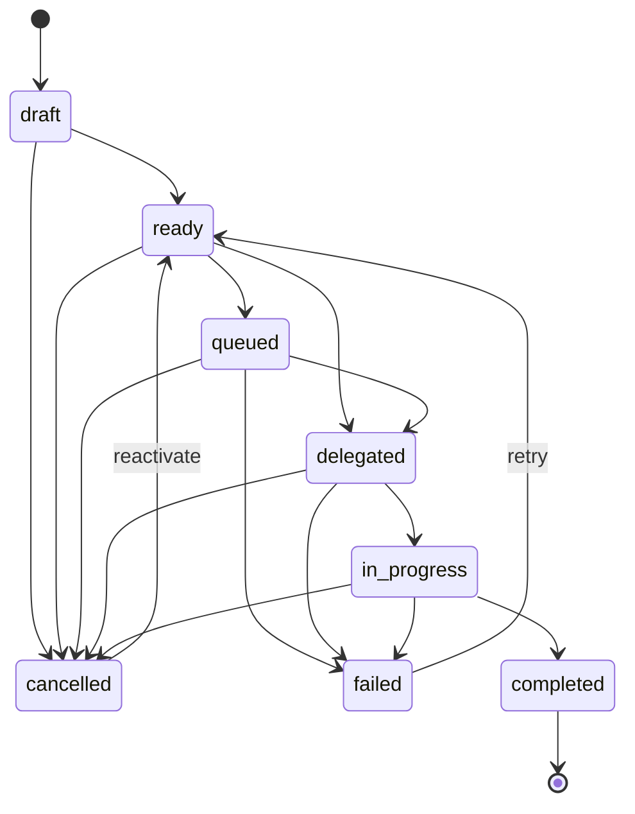
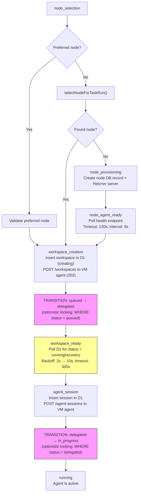
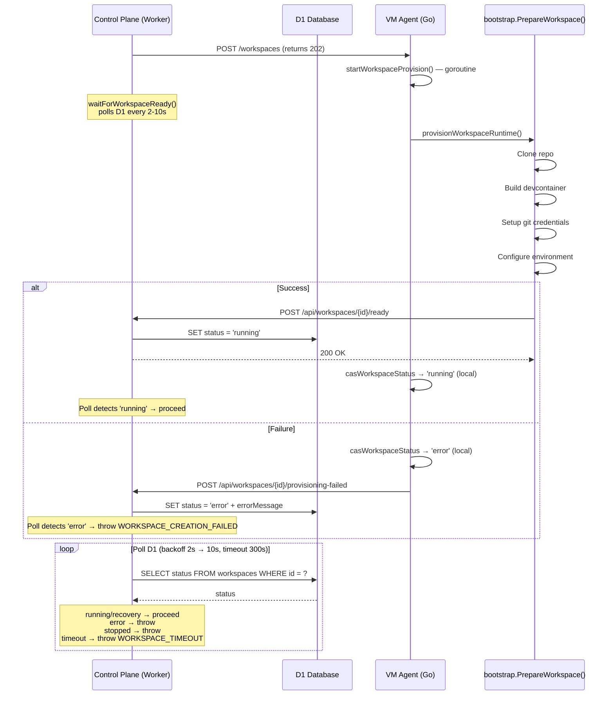

# Task Delegation System — How It Works

Deep-dive analysis of the autonomous task execution system, prompted by the error:
> "Setup failed — Task stuck in 'delegated' for 1157s (threshold: 960s). Last step: waiting for workspace to become ready. Workspace may have failed to start."

---

## 1. Task State Machine



Defined in `apps/api/src/services/task-status.ts`.

- **draft**: Task created but not ready for execution
- **ready**: Task validated and eligible for manual run
- **queued**: Task is being set up (node selection, provisioning, workspace creation)
- **delegated**: Workspace has been created on the VM, waiting for it to become ready + agent session creation
- **in_progress**: Agent session is active, task is executing
- **completed/failed/cancelled**: Terminal states

---

## 2. Two Entry Points

### A. Manual Run — `POST /projects/:projectId/tasks/:taskId/run`

Route: `apps/api/src/routes/task-runs.ts`

1. User creates task (draft) -> transitions to ready
2. User triggers `/run`
3. `initiateTaskRun()` transitions task to `queued` with `executionStep: 'node_selection'`
4. Kicks off `executeTaskRun()` via `waitUntil()`

### B. Chat Submit — `POST /projects/:projectId/tasks/submit`

Route: `apps/api/src/routes/task-submit.ts`

1. User sends message from chat UI
2. Task created directly as `queued` (skips draft/ready)
3. Chat session + first message created in ProjectData DO
4. `executeTaskRun()` kicked off via `waitUntil()`

---

## 3. The `executeTaskRun()` Orchestration

File: `apps/api/src/services/task-runner.ts`

This is NOT a Durable Object — it's a plain async function running inside the Cloudflare Worker's `waitUntil()` context. This is important because `waitUntil` has execution time limits.

### Execution Steps (Persisted Breadcrumbs)

Each step is written to the task's `execution_step` column BEFORE the long-running operation begins. If the Worker dies mid-execution, the stuck-task cron can read this to know WHERE it stalled.



### Key Design Detail: Deferred Delegation

The task enters `delegated` AFTER `createWorkspaceOnNode()` returns successfully — not before. This was a deliberate design choice to reduce the window where a silent Worker death leaves the task in a misleading state.

### Key Design Detail: Optimistic Locking

Both state transitions (queued→delegated and delegated→in_progress) use `WHERE status = X` clauses. If the stuck-task cron has already failed the task, the update returns zero rows and the task runner aborts gracefully. This prevents race conditions between the async task runner and the cron recovery system.

---

## 4. How Workspace Readiness Works

This is the critical chain that was broken in the reported error.

### The Callback Chain



### What `startWorkspaceProvision` Does on the VM (workspaces.go:155-198)

On **success**:
1. `provisionWorkspaceRuntime()` returns (includes `markWorkspaceReady()` HTTP callback)
2. `casWorkspaceStatus(id, ["creating"], "running")` — local status update on VM
3. Append node event

On **failure**:
1. `casWorkspaceStatus(id, ["creating"], "error")` — local status update on VM
2. `notifyWorkspaceProvisioningFailed()` — HTTP callback to control plane
3. Append node event

**Important**: `markWorkspaceReady()` is called from INSIDE `PrepareWorkspace()` (bootstrap.go:310), BEFORE `startWorkspaceProvision` does its own `casWorkspaceStatus`. So the control plane learns about readiness via the HTTP callback, while the VM's local state is updated separately via CAS.

---

## 5. Stuck Task Detection (Cron)

File: `apps/api/src/scheduled/stuck-tasks.ts`

Runs every 5 minutes (configured in `wrangler.toml`).

### `recoverStuckTasks()` Logic

1. Query all tasks with `status IN ('queued', 'delegated', 'in_progress')`
2. For each task, calculate `elapsedMs = now - task.updated_at`
3. Compare against configured threshold for that status
4. If stuck: transition to `failed` with descriptive error including the `executionStep`
5. Run `cleanupTaskRun()` best-effort

### Timeouts

| Status | Default Timeout | Env Override | Deployed Value (your case) |
|--------|----------------|--------------|---------------------------|
| queued | 5 min (300,000ms) | `TASK_STUCK_QUEUED_TIMEOUT_MS` | Unknown |
| delegated | 5 min (300,000ms) | `TASK_STUCK_DELEGATED_TIMEOUT_MS` | 960,000ms (16 min) |
| in_progress | 2 hours | `TASK_RUN_MAX_EXECUTION_MS` | Unknown |

**Important**: `elapsedMs` is measured from `task.updated_at`, NOT `task.created_at`. Since `setExecutionStep()` updates `updatedAt` each time, the 1157s elapsed is measured from when `executionStep` was set to `workspace_ready`.

### Workspace Provisioning Timeout (Separate Cron)

File: `apps/api/src/services/timeout.ts`

Also runs every 5 minutes. `checkProvisioningTimeouts()` marks workspaces stuck in `creating` as `error` after 10 minutes (`PROVISIONING_TIMEOUT_MS`).

**Execution order in cron** (from `index.ts:425`):
1. `checkProvisioningTimeouts()` — marks stuck workspaces as error
2. `recoverStuckTasks()` — detects stuck tasks

These run sequentially, so if the workspace timeout fires first, it sets `workspace.status = 'error'`, and the task runner's `waitForWorkspaceReady()` poll would detect the error status and throw `WORKSPACE_CREATION_FAILED` — BUT only if the task runner is still alive and polling.

---

## 6. Analysis of the Specific Error

### What the Error Message Tells Us

```
"Task stuck in 'delegated' for 1157s (threshold: 960s).
 Last step: waiting for workspace to become ready.
 Workspace may have failed to start."
```

- **1157s** (~19 minutes) in the `delegated` state
- **960s threshold** = `TASK_STUCK_DELEGATED_TIMEOUT_MS` is set to 960,000ms (16 min)
- **Last step: `workspace_ready`** = the task runner was waiting for `workspace.status` to become `running` in D1

### What Succeeded

1. Node was selected or provisioned (node_selection/node_provisioning/node_agent_ready completed)
2. Workspace was created on the VM agent (POST /workspaces returned 202)
3. Task transitioned queued → delegated
4. `executionStep` set to `workspace_ready`

### What Failed (Root Cause Candidates)

The workspace never became `running` in D1. There are several possible causes:

#### Scenario A: Worker `waitUntil` Died (Most Likely)

Cloudflare Workers in `waitUntil` have execution time limits. If the Worker process was recycled/killed during the `waitForWorkspaceReady()` polling loop:

1. Task runner dies silently — no one is polling D1 anymore
2. `executionStep` remains `workspace_ready` in D1 (the breadcrumb survives)
3. Meanwhile on the VM, provisioning may succeed and `markWorkspaceReady()` sets workspace to `running`
4. But no one is polling to notice — the task stays in `delegated`
5. 16+ minutes later, the cron catches it and fails the task

**Evidence**: The workspace DID start (user confirmed). This strongly suggests the Worker died before it could observe the workspace becoming ready and proceed to create the agent session.

#### Scenario B: `markWorkspaceReady()` Callback Failed

The VM's `PrepareWorkspace()` succeeded, but the HTTP POST to `/api/workspaces/{id}/ready` failed (DNS, auth, timeout). The workspace stays `creating` in D1 even though it's running on the VM.

**Evidence against**: User says "the workspace did start" — if the callback failed, the workspace status in D1 would be `creating` (not `running`), and the UI likely wouldn't show it as running.

#### Scenario C: Provisioning Took Too Long But Eventually Succeeded

Provisioning took longer than the `waitForWorkspaceReady()` timeout (300s default), the task runner threw `WORKSPACE_TIMEOUT`, and the task was failed by the runner's own catch block (not the cron). But then provisioning eventually finished.

**Evidence against**: The error message says "stuck in 'delegated' for 1157s" which comes from the cron, not from the task runner's error handling. If the runner had caught `WORKSPACE_TIMEOUT`, it would have set `errorMessage = 'Workspace did not become ready within 300000ms'`.

#### Scenario D: Race Between Provisioning Timeout and Stuck Task Cron

1. Workspace stays in `creating` past 10 minutes
2. `checkProvisioningTimeouts()` cron fires and sets workspace to `error`
3. BUT the task runner Worker was already dead (see Scenario A)
4. So the workspace error status is never observed by the task runner
5. `recoverStuckTasks()` fires next and catches the task in `delegated`

This is plausible but the user says the workspace did start, so workspace provisioning succeeded at some point.

---

## 7. The Core Problem: `waitUntil` Reliability

The fundamental architectural issue is that `executeTaskRun()` runs inside `waitUntil()`, which is a **fire-and-forget background context** with no durability guarantees. If the Worker is recycled:

- The async function simply stops executing
- No error is thrown, no catch block runs
- The only evidence is the `executionStep` breadcrumb in D1
- Recovery depends entirely on the 5-minute cron detecting staleness

### The Gap

Between the Worker dying and the cron detecting the stuck task (up to ~5 minutes per cron cycle + threshold), the system is in a blind spot. The workspace may become ready during this gap, but no one transitions the task to `in_progress` or creates the agent session.

---

## 8. Why No Errors in Admin Tab

The admin errors tab (`/api/admin/observability/errors`) captures errors written to the `OBSERVABILITY_DATABASE` D1 instance. These are typically:

1. Unhandled exceptions caught by the error middleware
2. Explicit error recordings via `recordError()`

When the Worker dies in `waitUntil`:
- No exception is thrown — the process is terminated
- No error middleware runs
- No `log.error()` call happens
- The cron recovery uses `log.warn('stuck_task.recovering', ...)` which goes to **console/Workers Observability logs**, NOT the error database

**Result**: Silent failures in `waitUntil` leave no trace in the admin errors tab. You'd need to check Workers Observability historical logs for the `stuck_task.recovering` event, or the `cron.completed` event which includes `stuckTasksFailedDelegated: 1`.

---

## 9. Debugging Checklist for This Specific Failure

1. **Check workspace status in D1**: Is it `running`, `creating`, or `error`?
   - If `running`: Worker died before observing readiness (Scenario A)
   - If `creating`: `markWorkspaceReady()` callback failed (Scenario B)
   - If `error`: Provisioning timeout cron caught it (Scenario D)

2. **Check Workers Observability logs** for:
   - `task_run.step.workspace_ready` — did the runner log this?
   - `task_run.step.in_progress` — did the runner ever get past workspace readiness?
   - `stuck_task.recovering` — when did the cron catch it?
   - `cron.completed` — what did the cron report?

3. **Check VM agent logs** (via admin node logs endpoint) for:
   - `workspace.provisioning` / `workspace.created` events
   - `Workspace marked ready` slog entry
   - Any `Provisioning-failed callback error` entries

4. **Check the timeline**:
   - When was the task delegated? (task.updated_at when executionStep = workspace_ready)
   - When did provisioning complete on the VM?
   - When did the cron fail the task?
   - Is the gap consistent with Worker death?

---

## 10. Recommendations for Better Debugging

### Immediate: Better Observability for `waitUntil` Failures

1. **Write stuck-task recoveries to the error database** — the cron currently only `log.warn()`s; it should also write to OBSERVABILITY_DATABASE so it appears in the admin errors tab
2. **Record the workspace status at recovery time** — when the cron fails a stuck task, also query and log the workspace status so you know which scenario occurred
3. **Log Worker execution context lifetime** — add a `finally` block in `executeTaskRun()` that logs when the function exits, whether normally or via Worker termination

### Medium-term: Move to Durable Object Orchestration

The current `waitUntil` approach is fundamentally unreliable for multi-minute orchestration. A Durable Object-based task runner could:

1. Use alarms for each step transition instead of long-running polling
2. Survive Worker restarts with persistent state
3. Provide real-time status via WebSocket
4. Eliminate the need for cron-based stuck task detection

### Quick Win: Workspace Ready Webhook

Instead of polling D1, the `/api/workspaces/{id}/ready` endpoint could directly advance the task:

1. When workspace becomes ready, the endpoint checks if there's an associated task in `delegated` state
2. If so, it creates the agent session and transitions to `in_progress` inline
3. This removes the dependency on the `waitUntil` Worker staying alive during workspace provisioning
