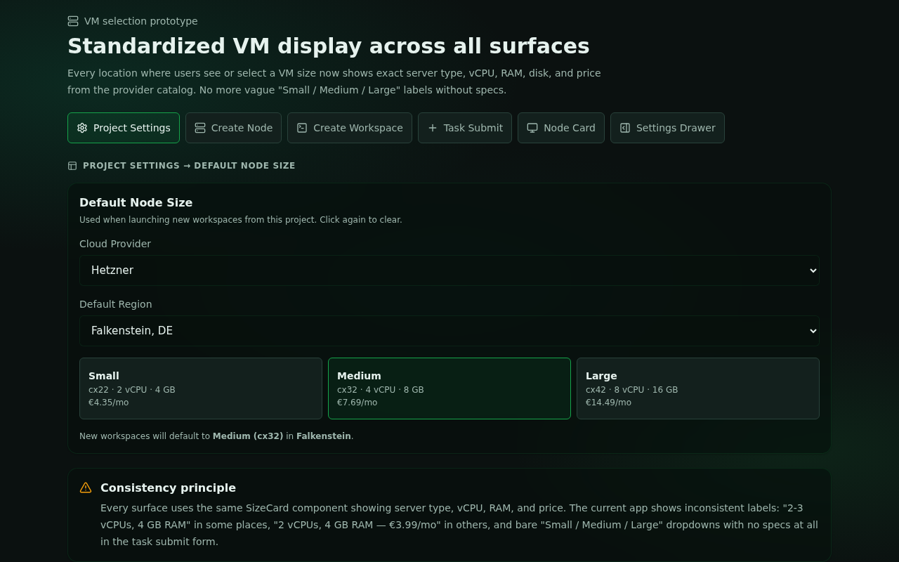
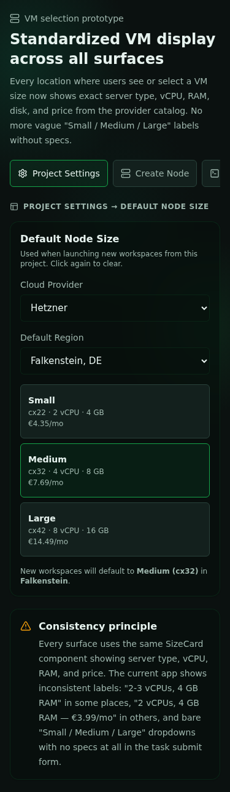

# VM Selection Prototype

Prototype route in development: `/__prototype/vm-selection`

## All Surfaces

This prototype covers every location where VM/machine selection or display happens in the app. Each tab shows how standardized specs (server type, vCPU, RAM, disk, price) would look in that context.

| Surface | Tab | What it shows |
| --- | --- | --- |
| **Project Settings** | Project Settings | Default node size with provider, region, and size cards |
| **Create Node** | Create Node | Node creation form on the Nodes page with confirmation summary |
| **Create Workspace** | Create Workspace | Workspace creation form with VM picker inline |
| **Task Submit** | Task Submit | Advanced options dropdown with specs in the option text |
| **Node Card** | Node Card | Side-by-side: current vague display vs proposed exact display |
| **Settings Drawer** | Settings Drawer | Quick settings panel with compact size cards |

## Design Principles

1. Every selection surface uses the same `SizeCard` component showing server type, vCPU, RAM, and price.
2. Even compact contexts (task submit dropdown, settings drawer) include exact specs.
3. Read-only displays (node card) show the exact server type instead of vague "Small / Medium / Large" labels.
4. Provider and region selectors appear alongside size selection where appropriate.

## Screenshots

## Validation

| Category | Score | Notes |
| --- | ---: | --- |
| Coverage | 5 | All 6 surfaces where VM selection/display occurs |
| Visual hierarchy | 4 | Consistent size cards with server type, specs, and price |
| Mobile usability | 4 | 375px viewport, no horizontal overflow, controls stack |
| System consistency | 4 | Uses shared Card, Select, StatusBadge, and design tokens |

Checked:

- `pnpm --filter @simple-agent-manager/web typecheck`
- Playwright screenshots at 375x667 and 1280x800 for all 6 surfaces (12 total)
