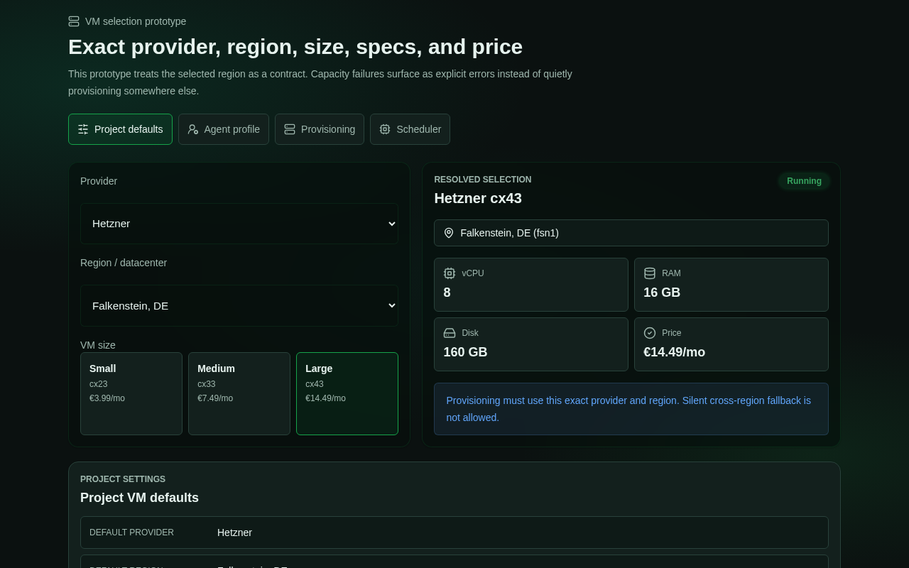
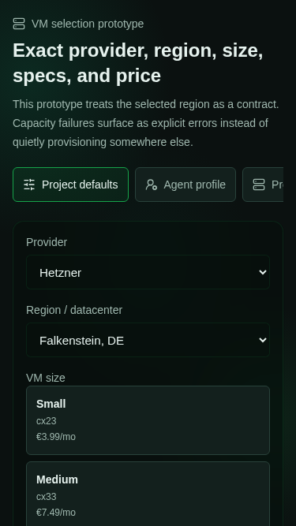

# VM Selection Prototype

Prototype route in development: `/__prototype/vm-selection`

This explores a single reusable VM selection flow for project defaults, agent profile overrides, manual provisioning, and scheduler review. The central interaction is:

1. Choose provider.
2. Choose region/datacenter for that provider.
3. Choose size with exact server type, vCPU, RAM, disk, and price.
4. Confirm that scheduling/provisioning must honor the selected region rather than silently falling back elsewhere.

## Variants Considered

1. **Single unified picker with contextual preview**: one provider/region/size control shared across surfaces, with a preview panel changing by selected screen.
2. **Separate production-like mock screens**: individual project settings, profile, node creation, and scheduler screens.
3. **Dense comparison matrix**: provider rows and size columns optimized for comparing every option at once.

Selected: **single unified picker with contextual preview**. It best demonstrates the reusable component we should eventually wire into each production surface while still showing how the selected data affects project defaults, profiles, provisioning, and scheduling.

## Screenshots

## Validation

| Category | Score | Notes |
| --- | ---: | --- |
| Visual hierarchy and scanability | 4 | Primary selection, resolved specs, and contextual preview are distinct. |
| Interaction clarity | 4 | Provider, region, and VM size choices are explicit; region fallback behavior is called out. |
| Mobile usability | 4 | 375px viewport has no horizontal overflow and controls stack into a single column. |
| Accessibility | 4 | Native selects and radio inputs are used; segmented screen switch uses button state. |
| System consistency | 4 | Uses shared `Card`, `Select`, and `StatusBadge` components plus existing tokens. |

Checked:

- `pnpm --filter @simple-agent-manager/web typecheck`
- `pnpm --filter @simple-agent-manager/web exec eslint src/App.tsx src/pages/VmSelectionPrototype.tsx`
- Playwright screenshots at 375x667 and 1280x800
- Overflow check: `document.documentElement.scrollWidth <= window.innerWidth` for both viewports
