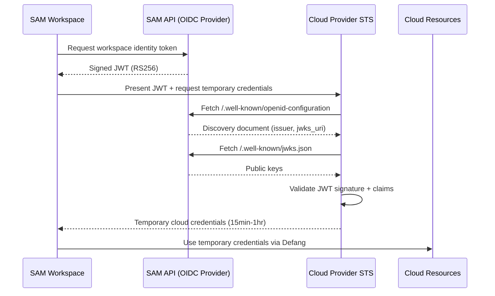
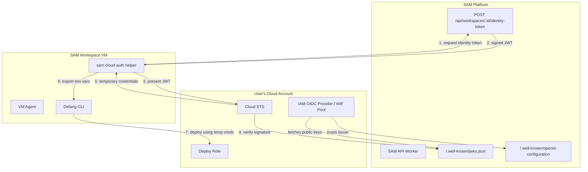

# OIDC Cloud Federation for Defang Deployment from SAM Workspaces

**Last Updated:** 2026-03-17
**Status:** Research / Proposal
**Update Trigger:** Defang adds native OIDC federation support, or SAM workspace identity model changes

## Executive Summary

SAM can act as a **custom OIDC identity provider** that issues short-lived JWTs scoped to workspace/project identity. These tokens can be exchanged for temporary cloud credentials via OIDC federation with AWS, GCP, and Azure — enabling Defang deployments from SAM workspaces without long-lived cloud secrets.

SAM already has most of the building blocks: RS256 key pair, JWT signing via `jose`, and a `/.well-known/jwks.json` endpoint. The primary work is exposing a standards-compliant OIDC discovery document, designing workspace-scoped claims, and integrating with Defang's CLI authentication.

---

## Table of Contents

1. [Problem](#problem)
2. [How OIDC Federation Works](#how-oidc-federation-works)
3. [Cloud Provider Support](#cloud-provider-support)
4. [SAM as an OIDC Identity Provider](#sam-as-an-oidc-identity-provider)
5. [Defang Integration](#defang-integration)
6. [Security Best Practices](#security-best-practices)
7. [What SAM Already Has](#what-sam-already-has)
8. [What Needs to Be Built](#what-needs-to-be-built)
9. [Recommended Architecture](#recommended-architecture)
10. [Open Questions](#open-questions)
11. [References](#references)

---

## Problem

Today, deploying from a SAM workspace to a cloud provider (AWS, GCP, etc.) via Defang requires the user to configure long-lived cloud credentials inside the workspace (e.g., `AWS_ACCESS_KEY_ID` / `AWS_SECRET_ACCESS_KEY`, or a DigitalOcean personal access token). This has several drawbacks:

- **Secret sprawl:** Cloud credentials must be injected into ephemeral VMs, increasing the attack surface.
- **No scoping:** Static credentials typically have broad permissions and no connection to the specific workspace or project.
- **No automatic expiry:** If a workspace is abandoned, the credentials persist wherever they were stored.
- **Manual rotation:** Users must manage credential rotation themselves.

The goal is to let SAM issue a **workspace-scoped JWT** that cloud providers trust directly, so that Defang (or other deployment tools) running inside a workspace can obtain temporary cloud credentials without the user ever copying a secret key into the workspace.

---

## How OIDC Federation Works

OIDC federation allows a cloud provider to **trust tokens from an external identity provider** (IdP) and exchange them for short-lived cloud credentials. The flow:



**Key principle:** The cloud provider never sees SAM's private key. It only fetches the public key from the JWKS endpoint to verify signatures. The trust relationship is established once (during cloud account setup), and all subsequent authentications are automatic and credential-free.

---

## Cloud Provider Support

### AWS

AWS supports OIDC federation natively via **IAM Identity Providers**.

**Setup (one-time, in user's AWS account):**
1. Create an IAM OIDC Identity Provider pointing to SAM's issuer URL (`https://api.<BASE_DOMAIN>`)
2. Create an IAM Role with a trust policy that allows `sts:AssumeRoleWithWebIdentity` from the SAM OIDC provider
3. Scope the trust policy using JWT claims (e.g., `sub` = project ID, `aud` = target audience)

**Token exchange at runtime:**
```bash
aws sts assume-role-with-web-identity \
  --role-arn arn:aws:iam::123456789012:role/sam-workspace-deploy \
  --role-session-name "sam-workspace-${WORKSPACE_ID}" \
  --web-identity-token "${SAM_JWT}" \
  --duration-seconds 3600
```

**Trust policy example:**
```json
{
  "Version": "2012-10-17",
  "Statement": [{
    "Effect": "Allow",
    "Principal": {
      "Federated": "arn:aws:iam::123456789012:oidc-provider/api.simple-agent-manager.org"
    },
    "Action": "sts:AssumeRoleWithWebIdentity",
    "Condition": {
      "StringEquals": {
        "api.simple-agent-manager.org:aud": "aws:deploy",
        "api.simple-agent-manager.org:sub": "project:proj_abc123"
      }
    }
  }]
}
```

**Key constraints:**
- JWKS endpoint must be HTTPS with a publicly trusted TLS certificate
- JWKS can contain up to 100 RSA keys and 100 EC keys
- AWS caches JWKS, so key rotation requires a grace period with both old and new keys published
- The `aud` claim must match the audience configured in the IAM OIDC provider

**Sources:**
- [AWS OIDC Federation docs](https://docs.aws.amazon.com/IAM/latest/UserGuide/id_roles_providers_oidc.html)
- [Create OIDC identity provider in IAM](https://docs.aws.amazon.com/IAM/latest/UserGuide/id_roles_providers_create_oidc.html)

---

### GCP

GCP supports OIDC federation via **Workload Identity Federation**.

**Setup (one-time, in user's GCP project):**
1. Create a Workload Identity Pool
2. Add an OIDC Provider to the pool, pointing to SAM's issuer URL
3. Configure attribute mapping (mapping JWT claims to GCP attributes)
4. Grant IAM roles to the federated identity

```bash
# Create pool
gcloud iam workload-identity-pools create "sam-pool" \
  --location="global" \
  --display-name="SAM Workspaces"

# Add OIDC provider
gcloud iam workload-identity-pools providers create-oidc "sam-provider" \
  --location="global" \
  --workload-identity-pool="sam-pool" \
  --issuer-uri="https://api.simple-agent-manager.org" \
  --attribute-mapping="google.subject=assertion.sub,attribute.project=assertion.project_id,attribute.workspace=assertion.workspace_id" \
  --attribute-condition="assertion.iss == 'https://api.simple-agent-manager.org'"
```

**Token exchange at runtime:**
GCP uses the OAuth 2.0 Token Exchange flow (RFC 8693):
```bash
curl -X POST https://sts.googleapis.com/v1/token \
  -d "grant_type=urn:ietf:params:oauth:grant-type:token-exchange" \
  -d "subject_token_type=urn:ietf:params:oauth:token-type:jwt" \
  -d "subject_token=${SAM_JWT}" \
  -d "audience=//iam.googleapis.com/projects/PROJECT_NUMBER/locations/global/workloadIdentityPools/sam-pool/providers/sam-provider"
```

**Key constraints:**
- JWKS must be HTTPS with a publicly trusted cert (no self-signed)
- Maximum 8 keys if uploading JWKS directly (vs. fetching from URL)
- Supports attribute conditions using CEL expressions for fine-grained access
- Tokens must contain `exp` and `iat` claims; `exp - iat` must be ≤ 24 hours
- Does NOT support opaque tokens or token introspection — must be JWT

**Alternative — direct JWKS upload:** If SAM's JWKS endpoint isn't publicly accessible (e.g., private deployments), GCP allows uploading the JWKS JSON file directly when creating the provider using `--jwk-json-path`.

**Sources:**
- [GCP Workload Identity Federation](https://docs.cloud.google.com/iam/docs/workload-identity-federation)
- [Configure with other providers](https://docs.cloud.google.com/iam/docs/workload-identity-federation-with-other-providers)
- [Best practices](https://cloud.google.com/iam/docs/best-practices-for-using-workload-identity-federation)

---

### Azure

Azure supports OIDC federation via **Microsoft Entra Workload Identity Federation**.

**Setup (one-time, in user's Azure tenant):**
1. Create an App Registration (or Managed Identity) in Microsoft Entra ID
2. Add a Federated Identity Credential pointing to SAM's issuer URL
3. Configure subject matching (SAM JWT `sub` → Azure federated credential subject)

**Required endpoints from SAM:**
- `/.well-known/openid-configuration` — Discovery document
- `/.well-known/keys` (or `jwks_uri` from discovery) — JWKS endpoint

**Token exchange at runtime:**
```bash
curl -X POST "https://login.microsoftonline.com/${TENANT_ID}/oauth2/v2.0/token" \
  -d "client_id=${APP_CLIENT_ID}" \
  -d "scope=https://management.azure.com/.default" \
  -d "grant_type=client_credentials" \
  -d "client_assertion_type=urn:ietf:params:oauth:client-assertion-type:jwt-bearer" \
  -d "client_assertion=${SAM_JWT}"
```

**Key constraints:**
- JWT `aud` must be `api://AzureADTokenExchange` (default Azure expectation)
- JWT `sub` must match the subject configured in the federated credential
- Maximum 20 federated identity credentials per managed identity
- Microsoft stores only the first 100 signing keys from the JWKS endpoint
- Issuer URL must be publicly accessible HTTPS

**Sources:**
- [Microsoft Entra Workload Identity Federation](https://learn.microsoft.com/en-us/entra/workload-id/workload-identity-federation)
- [Azure AD Workload Identity Federation with external OIDC IdP](https://arsenvlad.medium.com/azure-active-directory-workload-identity-federation-with-external-oidc-idp-4f06c9205a26)

---

### Provider Comparison

| Feature | AWS | GCP | Azure |
|---------|-----|-----|-------|
| Federation mechanism | IAM OIDC Provider | Workload Identity Pool | Entra Federated Credentials |
| Token exchange | `sts:AssumeRoleWithWebIdentity` | STS token exchange (RFC 8693) | OAuth2 client credentials with assertion |
| Required `aud` claim | Configurable (set during OIDC provider creation) | Pool provider resource URI | `api://AzureADTokenExchange` (default) |
| Max JWKS keys | 100 RSA + 100 EC | 8 (direct upload) or unlimited (URL fetch) | 100 |
| Claim-based scoping | Trust policy conditions | CEL attribute conditions | Subject matching |
| JWKS URL requirement | Public HTTPS | Public HTTPS (or direct upload) | Public HTTPS |
| Max credential lifetime | 1-12 hours (role config) | 1 hour (STS token) | 1 hour (default) |

---

## SAM as an OIDC Identity Provider

### What SAM Needs to Expose

To be recognized as a valid OIDC identity provider by cloud platforms, SAM must serve three endpoints:

#### 1. Discovery Document — `GET /.well-known/openid-configuration`

```json
{
  "issuer": "https://api.simple-agent-manager.org",
  "jwks_uri": "https://api.simple-agent-manager.org/.well-known/jwks.json",
  "response_types_supported": ["id_token"],
  "subject_types_supported": ["public"],
  "id_token_signing_alg_values_supported": ["RS256"],
  "claims_supported": [
    "iss", "sub", "aud", "exp", "iat",
    "workspace_id", "project_id", "user_id",
    "repository", "branch"
  ]
}
```

#### 2. JWKS Endpoint — `GET /.well-known/jwks.json`

SAM already serves this endpoint (`apps/api/src/services/jwt.ts`). It publishes the RS256 public key used to sign all JWTs.

#### 3. Token Issuance — `POST /api/workspaces/:id/identity-token`

A new authenticated endpoint that issues a workspace-scoped JWT for cloud federation.

### Proposed JWT Claims

```json
{
  "iss": "https://api.simple-agent-manager.org",
  "sub": "project:proj_abc123",
  "aud": "aws:deploy",
  "iat": 1710624000,
  "exp": 1710627600,
  "workspace_id": "ws_def456",
  "project_id": "proj_abc123",
  "user_id": "usr_ghi789",
  "repository": "myorg/myapp",
  "branch": "main",
  "node_id": "node_jkl012",
  "type": "workspace-identity"
}
```

**Claim design decisions:**
- **`sub` (subject):** Use `project:<projectId>` format. Cloud trust policies scope access by subject, and project-level scoping is the right granularity — a single project may have multiple workspaces, and they should share the same cloud access.
- **`aud` (audience):** Cloud-provider-specific. AWS lets you configure this; Azure expects `api://AzureADTokenExchange`; GCP uses the pool provider URI. The token request endpoint should accept a target audience parameter.
- **Custom claims:** `workspace_id`, `project_id`, `repository`, `branch` enable fine-grained trust policies (e.g., "only allow deployments from the `main` branch of repo `myorg/myapp`").
- **Short lifetime:** 10-15 minutes max (matches Latacora's recommendation). The token is only needed to perform the STS exchange.

---

## Defang Integration

### How Defang Currently Authenticates

Defang's deployment model involves:
1. **Defang Fabric authentication:** CLI authenticates to Defang's control plane via OAuth (`DEFANG_ISSUER` = `https://auth.defang.io`)
2. **Cloud provider authentication:** CLI uses cloud provider credentials from the shell environment (e.g., AWS credentials, GCP ADC, DigitalOcean token)
3. **CD service bootstrap:** First deploy creates a CD service in the user's cloud account that orchestrates subsequent deployments via gRPC

### Integration Paths

There are two complementary integration paths:

#### Path A: SAM Issues Cloud Credentials via OIDC → Defang Uses Them

This is the simpler path and works with Defang today:

1. SAM issues a workspace identity JWT
2. A helper script in the workspace exchanges the JWT for cloud credentials via the appropriate STS endpoint
3. Cloud credentials are exported as environment variables (`AWS_ACCESS_KEY_ID`, `AWS_SECRET_ACCESS_KEY`, `AWS_SESSION_TOKEN`)
4. Defang CLI picks them up from the environment (standard AWS SDK credential chain)

```bash
# Helper script: /usr/local/bin/sam-cloud-auth
#!/bin/bash
SAM_TOKEN=$(curl -s -H "Authorization: Bearer $WORKSPACE_CALLBACK_TOKEN" \
  https://api.$BASE_DOMAIN/api/workspaces/$WORKSPACE_ID/identity-token?audience=aws:deploy)

eval $(aws sts assume-role-with-web-identity \
  --role-arn "$AWS_ROLE_ARN" \
  --role-session-name "sam-$WORKSPACE_ID" \
  --web-identity-token "$SAM_TOKEN" \
  --output text \
  --query 'Credentials.[AccessKeyId,SecretAccessKey,SessionToken]' | \
  awk '{printf "export AWS_ACCESS_KEY_ID=%s\nexport AWS_SECRET_ACCESS_KEY=%s\nexport AWS_SESSION_TOKEN=%s\n", $1, $2, $3}')
```

**Pros:** Works with Defang's current CLI. No changes needed from Defang.
**Cons:** Requires the AWS CLI (or equivalent) in the workspace. Token exchange is an extra step.

#### Path B: Defang Natively Accepts SAM JWTs

If Defang adds support for OIDC-based cloud authentication (similar to their GitHub Actions OIDC flow), the integration becomes seamless:

1. SAM issues a workspace identity JWT
2. Defang CLI accepts the JWT directly and handles the cloud STS exchange internally
3. This is analogous to how Defang already handles OIDC with GitHub Actions when `AWS_ROLE_ARN` is set

This would require Defang to add support for:
- `DEFANG_OIDC_TOKEN` or similar environment variable
- Or accepting a generic OIDC token file path (like GCP's external account credential config)

**Pros:** Seamless UX. No helper scripts.
**Cons:** Requires Defang to add support.

#### Path C: Defang Trusts SAM as a Fabric Identity Provider

The most ambitious path — Defang adds SAM as a trusted identity provider for the Defang Fabric itself (not just cloud credentials). This would allow SAM workspaces to deploy to Defang Playground and BYOC targets without separate Defang authentication.

This would require partnership/coordination with Defang.

### Recommended Approach

**Start with Path A** — it works today with no changes from Defang. Build the OIDC provider and cloud credential exchange. Then pursue Path B as a feature request to Defang (or as a PR if they're open to it).

---

## Security Best Practices

### Signing Key Management

1. **Use HSM-backed keys when possible.** SAM currently uses RS256 keys from environment variables. For production OIDC provider use, consider storing the private key in Cloudflare Workers KMS or a cloud HSM.
2. **Rotate keys regularly.** SAM's current key ID format (`key-YYYY-MM`) supports monthly rotation. During rotation, publish both old and new keys in the JWKS for a grace period.
3. **Never expose the private key.** The private key should only exist in the Worker's secret environment. Only the public key is served via JWKS.

### Token Security

1. **Short token lifetime.** Identity tokens for cloud federation should be 10-15 minutes max — they're only needed for the STS exchange, not for ongoing use.
2. **Audience restriction.** Each token should specify the target cloud provider/service as the audience. Reject tokens without a specific audience.
3. **One-time-use consideration.** For highest security, track issued token IDs (`jti` claim) and reject replays. This adds complexity but prevents token theft scenarios.
4. **Scope to project, not user.** The subject should be the project (not the user) so that trust policies in the cloud account are tied to the project's deployment needs, not an individual's identity.

### JWKS Endpoint Security

1. **TLS required.** All cloud providers require the JWKS endpoint to be served over HTTPS with a publicly trusted certificate. SAM already does this via Cloudflare.
2. **Cache headers.** Set appropriate `Cache-Control` headers (e.g., `max-age=3600`) so cloud providers don't hit the endpoint on every token validation, but can still pick up key rotations within a reasonable window.
3. **No self-signed certificates.** AWS, GCP, and Azure all reject self-signed certs on the JWKS endpoint.
4. **Protect against JWKS endpoint takeover.** If SAM's DNS or TLS is compromised, an attacker could serve malicious keys. This is mitigated by Cloudflare's infrastructure, but worth noting as a risk.

### Trust Policy Scoping

1. **Never use wildcard subjects.** Cloud trust policies should always scope access to specific project IDs, repositories, or branches.
2. **Least privilege roles.** The IAM roles assumed via federation should have the minimum permissions needed for deployment (e.g., Defang CD service role, not `AdministratorAccess`).
3. **Attribute conditions.** Use custom claims (`repository`, `branch`) in trust conditions to restrict deployments to specific repos/branches.

### SPIFFE/SPIRE Considerations

For more complex deployments, SPIFFE/SPIRE could provide a more robust workload identity framework:
- SPIRE handles attestation (verifying the workload is who it claims to be) via platform-specific plugins (cloud instance metadata, Kubernetes service accounts, etc.)
- SPIRE can issue both X.509 SVIDs and JWT SVIDs
- SPIRE's OIDC Discovery Provider can expose federated identities to cloud providers

However, SPIFFE/SPIRE adds significant operational complexity. For SAM's use case — a single platform issuing tokens for known workspaces — a lightweight custom OIDC provider is simpler and sufficient. SPIFFE/SPIRE becomes relevant if SAM needs to federate across multiple trust domains or integrate with enterprise identity meshes.

---

## What SAM Already Has

| Component | Status | Location |
|-----------|--------|----------|
| RS256 key pair (JWT_PRIVATE_KEY, JWT_PUBLIC_KEY) | Exists | `apps/api/src/services/jwt.ts` |
| JWT signing with `jose` library | Exists | `apps/api/src/services/jwt.ts` |
| Monthly rotating key IDs (`key-YYYY-MM`) | Exists | `apps/api/src/services/jwt.ts` |
| JWKS endpoint (`/.well-known/jwks.json`) | Exists | `apps/api/src/services/jwt.ts` |
| Workspace identity (ID, projectId, userId, repository, branch) | Exists | `apps/api/src/db/schema.ts` |
| Authenticated API endpoints with ownership validation | Exists | `apps/api/src/middleware/auth.ts` |
| Callback token (workspace-scoped JWT) | Exists | `apps/api/src/services/jwt.ts:signCallbackToken()` |
| Issuer derived from `BASE_DOMAIN` | Exists | `apps/api/src/services/jwt.ts` |
| BYOC credential management | Exists | `apps/api/src/services/credentials.ts` |

**Bottom line:** SAM has ~80% of the OIDC provider infrastructure already. The JWKS endpoint and RS256 signing are the hardest parts, and they're done.

---

## What Needs to Be Built

### Must Have

1. **OIDC Discovery endpoint** — `GET /.well-known/openid-configuration`
   - Returns issuer, jwks_uri, supported algorithms, supported claims
   - Simple JSON response, no logic beyond reading `BASE_DOMAIN`
   - **Effort:** Small (~1 hour)

2. **Workspace identity token endpoint** — `POST /api/workspaces/:id/identity-token`
   - Authenticated (requires valid session)
   - Ownership-validated (user must own the workspace)
   - Accepts `audience` parameter (e.g., `aws:deploy`, `api://AzureADTokenExchange`)
   - Returns a signed JWT with workspace/project claims
   - **Effort:** Small-medium (~2-4 hours, mostly claim design and tests)

3. **Cloud federation setup guide** — Documentation for users
   - How to set up AWS IAM OIDC Provider pointing to SAM
   - How to set up GCP Workload Identity Pool pointing to SAM
   - How to set up Azure Federated Identity Credential pointing to SAM
   - **Effort:** Medium (~4 hours for all three providers)

### Nice to Have

4. **Token exchange helper script** — Installed in workspaces
   - `sam-cloud-auth aws` / `sam-cloud-auth gcp` commands
   - Requests SAM identity token, exchanges for cloud credentials, exports env vars
   - Could be part of cloud-init or workspace setup
   - **Effort:** Medium (~4-6 hours)

5. **UI for cloud federation configuration** — Settings page
   - Configure AWS Role ARN, GCP Project/Pool, Azure Tenant/App per project
   - Store federation config in project settings (not secrets — these are public identifiers)
   - **Effort:** Medium-large (~1-2 days)

6. **Automatic credential injection** — Workspace startup
   - On workspace start, if project has cloud federation configured, automatically run the token exchange and inject credentials
   - **Effort:** Medium (~4-6 hours, depends on workspace startup hooks)

7. **Defang-specific integration** — Direct Defang support
   - If Defang adds OIDC token support, build a direct integration
   - **Effort:** Depends on Defang's API

---

## Recommended Architecture



### Implementation Order

1. **Phase 1:** OIDC Discovery endpoint + workspace identity token endpoint (enables the flow)
2. **Phase 2:** Documentation + setup guides (enables users to configure their cloud accounts)
3. **Phase 3:** Helper script in workspaces (improves UX)
4. **Phase 4:** UI configuration + automatic injection (polished experience)
5. **Phase 5:** Defang partnership / native integration (seamless deployment)

---

## Open Questions

1. **Subject format:** Should the `sub` claim be `project:<projectId>` or just `<projectId>`? The prefixed format is more explicit but may be unusual for some cloud provider trust policy configurations.

2. **Multi-audience tokens:** Should a single token be valid for multiple cloud providers, or should each token exchange request a provider-specific audience? Provider-specific is safer but requires multiple requests if deploying across clouds.

3. **Defang Fabric authentication:** Could SAM's OIDC provider also authenticate to the Defang Fabric (replacing `defang login`), or is that a separate concern? This depends on whether Defang supports custom OIDC providers for Fabric auth.

4. **Self-hosted SAM instances:** For self-hosted deployments where the SAM API isn't on a publicly accessible URL, GCP's direct JWKS upload and potential cloud-specific workarounds would be needed. Should this be a first-class concern?

5. **Rate limiting:** Cloud STSs cache JWKS but still hit the endpoint periodically. Should SAM's JWKS endpoint have special rate-limit treatment (higher limits, aggressive caching headers)?

6. **Key rotation coordination:** When SAM rotates its monthly signing key, cloud providers that cache the old JWKS will reject tokens signed with the new key until they refresh. What's the right cache header / grace period strategy?

---

## References

### Cloud Provider Documentation
- [AWS OIDC Federation](https://docs.aws.amazon.com/IAM/latest/UserGuide/id_roles_providers_oidc.html)
- [AWS — Create an OIDC Identity Provider in IAM](https://docs.aws.amazon.com/IAM/latest/UserGuide/id_roles_providers_create_oidc.html)
- [GCP Workload Identity Federation](https://docs.cloud.google.com/iam/docs/workload-identity-federation)
- [GCP — Configure with Other Providers](https://docs.cloud.google.com/iam/docs/workload-identity-federation-with-other-providers)
- [GCP — Best Practices for Workload Identity Federation](https://cloud.google.com/iam/docs/best-practices-for-using-workload-identity-federation)
- [Azure Workload Identity Federation](https://learn.microsoft.com/en-us/entra/workload-id/workload-identity-federation)
- [Azure AD WIF with External OIDC IdP](https://arsenvlad.medium.com/azure-active-directory-workload-identity-federation-with-external-oidc-idp-4f06c9205a26)

### Defang
- [Defang — How It Works](https://docs.defang.io/docs/intro/how-it-works)
- [Defang — AWS Provider](https://docs.defang.io/docs/providers/aws)
- [Defang — Deploying from GitHub Actions to AWS](https://docs.defang.io/docs/tutorials/deploying-from-github-actions/to-aws)
- [Defang CLI Reference](https://docs.defang.io/docs/cli)

### Workload Identity & Best Practices
- [Latacora — OIDC Workload Identity on AWS](https://www.latacora.com/blog/2025/11/04/aws-oidc-workload-identity/)
- [SPIFFE — SPIRE Concepts](https://spiffe.io/docs/latest/spire-about/spire-concepts/)
- [SPIFFE — AWS OIDC Authentication](https://spiffe.io/docs/latest/keyless/oidc-federation-aws/)
- [GitHub Actions — OpenID Connect](https://docs.github.com/en/actions/concepts/security/openid-connect)
- [Teleport — GCP Workload Identity Federation with JWTs](https://goteleport.com/docs/machine-workload-identity/workload-identity/gcp-workload-identity-federation-jwt/)

### SAM Codebase (Current State)
- `apps/api/src/services/jwt.ts` — RS256 signing, JWKS endpoint, token types
- `apps/api/src/db/schema.ts` — Workspace/project/user schema
- `apps/api/src/middleware/auth.ts` — Authentication middleware
- `apps/api/src/index.ts` — Env interface with JWT_PRIVATE_KEY, JWT_PUBLIC_KEY
