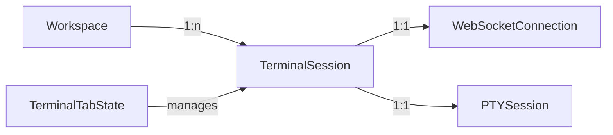

# Data Model: Multi-Terminal UI

## Core Entities

### TerminalSession
Represents a single terminal session within a workspace.

```typescript
interface TerminalSession {
  id: string;                    // UUID for session identification
  name: string;                   // User-editable tab name
  status: 'connecting' | 'connected' | 'disconnected' | 'error';
  createdAt: Date;
  lastActivityAt: Date;
  workingDirectory?: string;      // Current pwd (if available)
  isActive: boolean;             // Currently visible tab
  order: number;                 // Tab position (0-based)
}
```

**Validation Rules:**
- `id` must be valid UUID v4
- `name` max 50 characters, default "Terminal {n}"
- `order` must be unique within workspace
- `order` must be sequential (no gaps)

**State Transitions:**
- `connecting` → `connected` | `error`
- `connected` → `disconnected` | `error`
- `disconnected` → `connecting`
- `error` → `connecting`

### TerminalTabState
UI state for the tabbed interface.

```typescript
interface TerminalTabState {
  sessions: Map<string, TerminalSession>;  // sessionId → session
  activeSessionId: string | null;
  maxSessions: number;                     // From config
  tabOverflowMode: 'scroll' | 'menu';     // UI behavior
}
```

**Validation Rules:**
- `sessions.size` ≤ `maxSessions`
- `activeSessionId` must exist in `sessions` or be null
- At least one session must be `isActive` if sessions exist

### WebSocketMessage (Extended)
Extended protocol for session routing.

```typescript
// Client → Server
interface ClientMessage {
  sessionId?: string;           // NEW: Target session (optional for backward compat)
  type: 'input' | 'resize' | 'ping' | 'create_session' | 'close_session';
  data?: any;
}

// Server → Client
interface ServerMessage {
  sessionId?: string;           // NEW: Source session
  type: 'output' | 'session' | 'error' | 'pong' | 'session_created' | 'session_closed';
  data?: any;
}

// New message types
interface CreateSessionMessage {
  type: 'create_session';
  data: {
    sessionId: string;          // Client-generated UUID
    rows: number;
    cols: number;
  };
}

interface SessionCreatedMessage {
  type: 'session_created';
  data: {
    sessionId: string;
    workingDirectory: string;
  };
}
```

**Validation Rules:**
- `sessionId` if present must be valid UUID
- Missing `sessionId` routes to default/first session
- `create_session` requires unique `sessionId`
- Server rejects messages to non-existent sessions

## Relationships



## Storage

### Frontend (Browser)
- **SessionStorage**: Current tab state (activeSessionId, tab order)
- **Memory only**: Terminal sessions, xterm.js instances
- **No persistence**: Sessions lost on page refresh (by design)

### VM Agent (Go)
- **Memory map**: sessionId → PTYSession
- **No persistence**: Sessions cleared on agent restart
- **Session cookies**: HTTP session for WebSocket auth

## Configuration

### Environment Variables
```typescript
// Frontend
VITE_MAX_TERMINAL_SESSIONS=10        // Maximum concurrent terminals
VITE_TAB_SWITCH_ANIMATION_MS=200     // Tab transition duration
VITE_TERMINAL_SCROLLBACK_LINES=1000  // Per-terminal buffer size

// VM Agent
MAX_TERMINAL_SESSIONS=10             // Server-side limit
SESSION_IDLE_TIMEOUT_SECONDS=3600    // Auto-close idle sessions
TERMINAL_RESOURCE_LIMIT_MB=100       // Memory limit per session
```

## Access Control

### Session Ownership
- User must own workspace to create sessions
- JWT token contains workspace claim
- Each WebSocket connection authenticated once
- All sessions on connection inherit auth

### Resource Limits
- Per-user session limit enforced at VM Agent
- Memory limits prevent resource exhaustion
- Idle sessions auto-closed after timeout
- Concurrent session creation throttled

## Data Flow

### Session Creation
1. User clicks "New Terminal" button
2. Frontend generates UUID for sessionId
3. Frontend sends `create_session` message
4. VM Agent creates PTY, stores in map
5. VM Agent responds with `session_created`
6. Frontend creates TerminalSession entity
7. Frontend creates new xterm.js instance
8. Tab UI updates to show new tab

### Tab Switching
1. User clicks inactive tab
2. Frontend updates `activeSessionId`
3. Previous xterm.js hidden (display:none)
4. New xterm.js shown and focused
5. No WebSocket message needed (UI only)

### Session Closing
1. User clicks tab close button (×)
2. Frontend sends `close_session` message
3. VM Agent kills PTY process
4. VM Agent removes from session map
5. VM Agent sends `session_closed` confirmation
6. Frontend disposes xterm.js instance
7. Frontend removes TerminalSession
8. If was active, activate adjacent tab