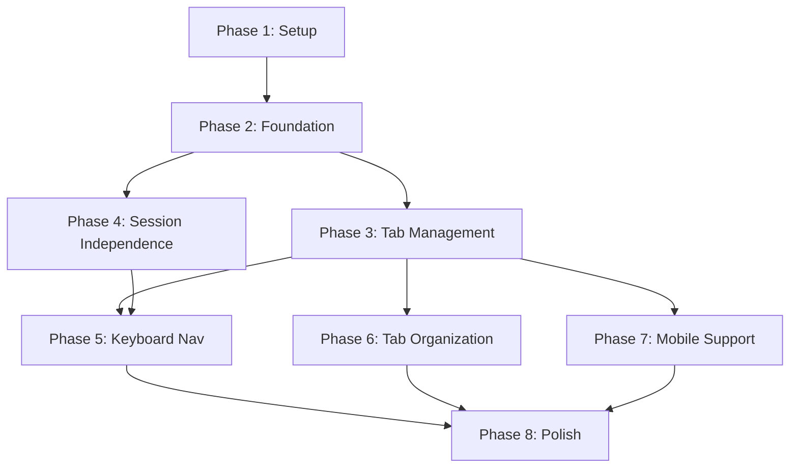

# Implementation Tasks: Multi-Terminal UI

**Feature**: Multi-Terminal UI
**Branch**: `011-multi-terminal-ui`
**Dependencies**: React 18, xterm.js 5.3, TypeScript 5.x, Go 1.22

## Phase Structure

- Phase 1: Setup & Configuration
- Phase 2: Foundational Components
- Phase 3: User Story 1 - Terminal Tab Management (P1)
- Phase 4: User Story 2 - Session Independence (P1)
- Phase 5: User Story 3 - Keyboard Navigation (P2)
- Phase 6: User Story 4 - Tab Organization (P2)
- Phase 7: User Story 5 - Mobile Support (P3)
- Phase 8: Polish & Integration

## Phase 1: Setup & Configuration

**Goal**: Initialize project structure and configuration

### Tasks

- [X] T001 Create TypeScript type definitions in packages/terminal/src/types/multi-terminal.ts
- [X] T002 [P] Add environment variable configuration to apps/web/.env.example for VITE_MAX_TERMINAL_SESSIONS, VITE_TAB_SWITCH_ANIMATION_MS, VITE_TERMINAL_SCROLLBACK_LINES
- [X] T003 [P] Add Go environment variables to packages/vm-agent/.env.example for MAX_TERMINAL_SESSIONS, SESSION_IDLE_TIMEOUT_SECONDS, TERMINAL_RESOURCE_LIMIT_MB
- [X] T004 Create base CSS file for tab styling in apps/web/src/styles/terminal-tabs.css

## Phase 2: Foundational Components

**Goal**: Build core protocol and message handling infrastructure

### Tasks

- [X] T005 Extend WebSocket protocol types in packages/terminal/src/protocol.ts to support sessionId field
- [X] T006 Create Go message types in packages/vm-agent/internal/server/messages.go for multi-session support
- [X] T007 Update VM Agent PTY manager in packages/vm-agent/internal/pty/manager.go to support session namespacing
- [X] T008 Modify WebSocket handler in packages/vm-agent/internal/server/websocket.go to route messages by sessionId

## Phase 3: User Story 1 - Terminal Tab Management (P1)

**Goal**: Users can create, switch between, and close multiple terminal tabs

**Independent Test Criteria**:
- Can create up to 10 terminal tabs
- Can switch between tabs by clicking
- Can close individual tabs with X button
- Active tab is visually highlighted
- Tab overflow shows scroll arrows when > viewport width

### Implementation

- [X] T009 [US1] Create TabItem component in packages/terminal/src/components/TabItem.tsx with name display, close button, and active state
- [X] T010 [P] [US1] Create TabBar component in packages/terminal/src/components/TabBar.tsx with tab rendering and click handlers
- [X] T011 [P] [US1] Create TabOverflowMenu component in packages/terminal/src/components/TabOverflowMenu.tsx for handling tab overflow
- [X] T012 [US1] Create useTerminalSessions hook in packages/terminal/src/hooks/useTerminalSessions.ts for managing terminal session state
- [X] T013 [US1] Create MultiTerminal container component in packages/terminal/src/MultiTerminal.tsx integrating TabBar with Terminal instances
- [x] T014 [US1] Update Workspace page in apps/web/src/pages/Workspace.tsx to use MultiTerminal instead of Terminal
- [X] T015 [P] [US1] Style tab bar with active/inactive states in apps/web/src/styles/terminal-tabs.css

## Phase 4: User Story 2 - Session Independence (P1)

**Goal**: Each terminal maintains independent state (working directory, environment, processes)

**Independent Test Criteria**:
- Terminal 1 can cd to /tmp while Terminal 2 stays in /home
- Terminal 1 can run a long process while Terminal 2 remains responsive
- Switching tabs preserves terminal output and state
- Background terminals continue executing commands

### Implementation

- [X] T016 [US2] Implement session creation handler in packages/vm-agent/internal/server/websocket.go for create_session messages
- [X] T017 [US2] Implement session close handler in packages/vm-agent/internal/server/websocket.go for close_session messages
- [X] T018 [US2] Add session routing logic in packages/vm-agent/internal/pty/manager.go to maintain separate PTY instances per session
- [X] T019 [US2] Update frontend WebSocket handling in packages/terminal/src/useWebSocket.ts to include sessionId in messages
- [X] T020 [US2] Implement terminal instance management in packages/terminal/src/MultiTerminal.tsx to maintain separate xterm.js instances
- [X] T021 [P] [US2] Add lazy rendering optimization in packages/terminal/src/MultiTerminal.tsx to only render active terminal

## Phase 5: User Story 3 - Keyboard Navigation (P2)

**Goal**: Power users can navigate terminals entirely via keyboard

**Independent Test Criteria**:
- Ctrl+Shift+T creates new terminal
- Ctrl+Shift+W closes current terminal
- Ctrl+Tab/Ctrl+Shift+Tab cycles through terminals
- Alt+1 through Alt+9 jumps to specific terminal

### Implementation

- [X] T022 [US3] Create useTabShortcuts hook in packages/terminal/src/hooks/useTabShortcuts.ts for keyboard event handling
- [X] T023 [US3] Implement keyboard shortcut registration in packages/terminal/src/MultiTerminal.tsx
- [X] T024 [P] [US3] Add keyboard shortcut configuration loading from environment variables in packages/terminal/src/hooks/useTabShortcuts.ts
- [X] T025 [P] [US3] Add accessibility attributes (role, aria-label, tabindex) to tab components in packages/terminal/src/components/TabItem.tsx

## Phase 6: User Story 4 - Tab Organization (P2)

**Goal**: Users can organize terminals with custom names

**Independent Test Criteria**:
- Double-click on tab name enters edit mode
- Can rename tab to custom string (max 50 chars)
- Renamed tabs persist during session
- Tab names default to "Terminal N"

### Implementation

- [X] T026 [US4] Add rename functionality to TabItem component in packages/terminal/src/components/TabItem.tsx with inline edit
- [X] T027 [US4] Implement rename_session message handler in packages/vm-agent/internal/server/websocket.go
- [X] T028 [P] [US4] Add rename action to terminal session state in packages/terminal/src/hooks/useTerminalSessions.ts
- [X] T029 [P] [US4] Style inline tab name editor in apps/web/src/styles/terminal-tabs.css

## Phase 7: User Story 5 - Mobile Support (P3)

**Goal**: Terminal tabs work seamlessly on mobile devices

**Independent Test Criteria**:
- Tab bar is touch-scrollable on mobile
- Tabs collapse to icons on narrow screens
- Touch gestures work for tab operations
- Responsive breakpoints at 640px and 768px

### Implementation

- [X] T030 [US5] Add touch event handlers to TabBar in packages/terminal/src/components/TabBar.tsx
- [X] T031 [US5] Implement swipe gesture support in packages/terminal/src/components/TabBar.tsx
- [X] T032 [P] [US5] Add responsive CSS for mobile breakpoints in apps/web/src/styles/terminal-tabs.css
- [X] T033 [P] [US5] Create mobile-optimized tab overflow menu in packages/terminal/src/components/TabOverflowMenu.tsx

## Phase 8: Polish & Integration

**Goal**: Final integration, testing, and documentation

### Tasks

- [X] T034 Add feature flag for multi-terminal in apps/web/src/config/features.ts
- [ ] T035 [P] Create API endpoint for terminal configuration in apps/api/src/routes/terminal.ts
- [ ] T036 [P] Add terminal session list endpoint in apps/api/src/routes/terminal.ts
- [x] T037 Update user documentation in docs/guides/multi-terminal.md
- [X] T038 Add backward compatibility check to ensure single-terminal mode still works
- [X] T039 Implement resource limit enforcement in packages/vm-agent/internal/pty/manager.go
- [X] T040 Add performance monitoring for tab switch latency in packages/terminal/src/MultiTerminal.tsx

## Dependencies Graph



## Parallel Execution Examples

### Phase 1 (Setup) - All Parallel
```bash
T001 & T002 & T003 & T004  # All independent file creations
```

### Phase 3 (US1: Tab Management) - Partial Parallel
```bash
T009 & T010 & T011  # Independent component creation
T012                 # Hook depends on types
T013                 # Depends on T009-T012
T014                 # Depends on T013
T015                 # Independent styling
```

### Phase 4 (US2: Session Independence) - Backend/Frontend Split
```bash
# Backend team
T016 & T017         # Message handlers
T018                # Depends on handlers

# Frontend team (parallel to backend)
T019 & T020         # WebSocket and instance management
T021                # Optimization after T020
```

## Implementation Strategy

### MVP Scope (Phases 1-4)
- Basic multi-terminal with tab management
- Session independence
- Delivers core value immediately
- ~21 tasks

### Enhancement Scope (Phases 5-7)
- Keyboard shortcuts for power users
- Tab renaming for organization
- Mobile optimization
- ~12 additional tasks

### Final Polish (Phase 8)
- Feature flags for gradual rollout
- Performance monitoring
- Documentation
- ~7 tasks

## Success Metrics

- [ ] All user stories independently testable
- [ ] Tab switch latency < 50ms
- [ ] Support for 10+ concurrent terminals
- [ ] Memory usage < 100MB per terminal
- [ ] Mobile responsive at 640px and 768px breakpoints
- [ ] Zero regression in single-terminal mode
- [ ] 90%+ test coverage for critical paths

## Total Tasks: 40

**Distribution**:
- Setup & Foundation: 8 tasks
- US1 (Tab Management): 7 tasks
- US2 (Session Independence): 6 tasks
- US3 (Keyboard Navigation): 4 tasks
- US4 (Tab Organization): 4 tasks
- US5 (Mobile Support): 4 tasks
- Polish & Integration: 7 tasks

**Parallel Opportunities**:
- 17 tasks marked [P] for parallel execution
- Frontend/Backend can work simultaneously on US2
- Component development highly parallelizable