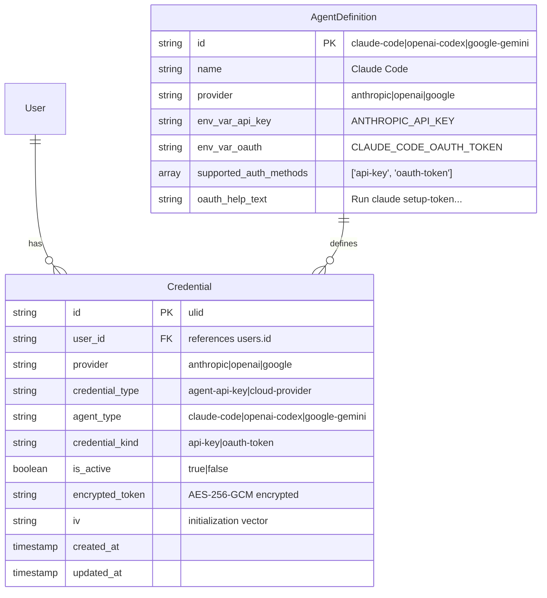

# Data Model: Agent OAuth & Subscription Authentication

**Feature**: Dual credential support (API key + OAuth token)
**Date**: 2026-02-09

## Entity Relationship Diagram



## Entity Definitions

### Credential (Extended)

**Purpose**: Store encrypted agent credentials with support for multiple types per agent

**New Fields**:
- `credential_kind`: Discriminates between `api-key` and `oauth-token`
- `is_active`: Boolean flag indicating which credential is currently in use

**Constraints**:
- UNIQUE on (user_id, agent_type, credential_kind) where credential_type = 'agent-api-key'
- Exactly one credential must be active per agent per user (enforced by application logic)
- Maximum 2 credentials per agent (one of each kind)

**State Transitions**:
```
[New Credential Created] → is_active = true (auto-activate)
[Another Credential Saved] → old.is_active = false, new.is_active = true
[Active Credential Deleted] → remaining.is_active = true (if exists)
[Toggle Active] → old.is_active = false, selected.is_active = true
```

### AgentDefinition (Extended)

**Purpose**: Define supported authentication methods for each agent

**New Metadata Fields** (stored in code, not database):
- `envVarOAuth`: Environment variable name for OAuth token (e.g., `CLAUDE_CODE_OAUTH_TOKEN`)
- `supportedAuthMethods`: Array of supported credential kinds (`['api-key', 'oauth-token']`)
- `oauthHelpText`: User guidance for obtaining OAuth tokens
- `oauthLabelText`: UI label for OAuth option (e.g., "Pro/Max Subscription")

## Database Schema Changes

### Migration: 0006_dual_credentials_oauth_support.sql

```sql
-- Add credential_kind to distinguish API keys from OAuth tokens
ALTER TABLE credentials
ADD COLUMN credential_kind TEXT NOT NULL DEFAULT 'api-key'
CHECK (credential_kind IN ('api-key', 'oauth-token'));

-- Add is_active to track which credential is in use
ALTER TABLE credentials
ADD COLUMN is_active BOOLEAN NOT NULL DEFAULT true;

-- Drop old unique index that prevents multiple credentials per agent
DROP INDEX IF EXISTS idx_credentials_user_type_agent;

-- Create new unique index allowing one of each kind per agent
CREATE UNIQUE INDEX idx_credentials_user_agent_kind
ON credentials(user_id, agent_type, credential_kind)
WHERE credential_type = 'agent-api-key';

-- Index for efficient active credential queries
CREATE INDEX idx_credentials_active
ON credentials(user_id, agent_type, is_active)
WHERE credential_type = 'agent-api-key' AND is_active = true;
```

## Query Patterns

### Get Active Credential for Agent

```typescript
const activeCredential = await db
  .select()
  .from(credentials)
  .where(
    and(
      eq(credentials.userId, userId),
      eq(credentials.credentialType, 'agent-api-key'),
      eq(credentials.agentType, agentType),
      eq(credentials.isActive, true)
    )
  )
  .limit(1);
```

### List All Credentials for Agent

```typescript
const allCredentials = await db
  .select()
  .from(credentials)
  .where(
    and(
      eq(credentials.userId, userId),
      eq(credentials.credentialType, 'agent-api-key'),
      eq(credentials.agentType, agentType)
    )
  )
  .orderBy(desc(credentials.isActive)); // Active first
```

### Toggle Active Credential

```typescript
await db.transaction(async (tx) => {
  // Deactivate all credentials for this agent
  await tx
    .update(credentials)
    .set({ isActive: false })
    .where(
      and(
        eq(credentials.userId, userId),
        eq(credentials.agentType, agentType)
      )
    );

  // Activate the selected credential
  await tx
    .update(credentials)
    .set({ isActive: true })
    .where(eq(credentials.id, credentialId));
});
```

### Save New Credential (Auto-Activate)

```typescript
await db.transaction(async (tx) => {
  // Check if credential of this kind already exists
  const existing = await tx
    .select()
    .from(credentials)
    .where(
      and(
        eq(credentials.userId, userId),
        eq(credentials.agentType, agentType),
        eq(credentials.credentialKind, credentialKind)
      )
    )
    .limit(1);

  if (existing.length > 0) {
    // Update existing credential
    await tx
      .update(credentials)
      .set({
        encryptedToken: newEncryptedToken,
        iv: newIv,
        isActive: true, // Auto-activate
        updatedAt: now
      })
      .where(eq(credentials.id, existing[0].id));
  } else {
    // Deactivate other credentials first
    await tx
      .update(credentials)
      .set({ isActive: false })
      .where(
        and(
          eq(credentials.userId, userId),
          eq(credentials.agentType, agentType)
        )
      );

    // Insert new credential as active
    await tx.insert(credentials).values({
      id: ulid(),
      userId,
      provider: agentDefinition.provider,
      credentialType: 'agent-api-key',
      agentType,
      credentialKind,
      encryptedToken,
      iv,
      isActive: true,
      createdAt: now,
      updatedAt: now
    });
  }
});
```

## Validation Rules

1. **Credential Kind Validation**
   - Must be either `api-key` or `oauth-token`
   - Enforced by CHECK constraint in database

2. **Active Credential Rules**
   - Exactly one credential must be active per agent
   - New credentials auto-activate (deactivating others)
   - Deleting active credential auto-activates remaining (if exists)

3. **Token Format Validation**
   - No format validation at storage layer (tokens are opaque)
   - Optional client-side detection for wrong credential type
   - Agent binary handles actual authentication validation

4. **Maximum Credentials Per Agent**
   - Maximum 2 credentials (one api-key, one oauth-token)
   - Enforced by unique index on (user_id, agent_type, credential_kind)

## Security Considerations

1. **Encryption**: Both API keys and OAuth tokens use same AES-256-GCM encryption
2. **Isolation**: Credentials scoped by user_id, no cross-user access
3. **Logging**: Never log decrypted tokens, only credential metadata
4. **Masking**: Display only last 4 characters in UI for both types
5. **Transport**: Credentials transmitted to VM Agent over HTTPS with JWT auth

## Backward Compatibility

1. **Existing Credentials**: Automatically become `credential_kind = 'api-key'` and `is_active = true`
2. **API Compatibility**: Existing endpoints continue working, return active credential by default
3. **No Breaking Changes**: All changes are additive (new columns, new indexes)
4. **Rollback Safe**: Can drop new columns/indexes without data loss