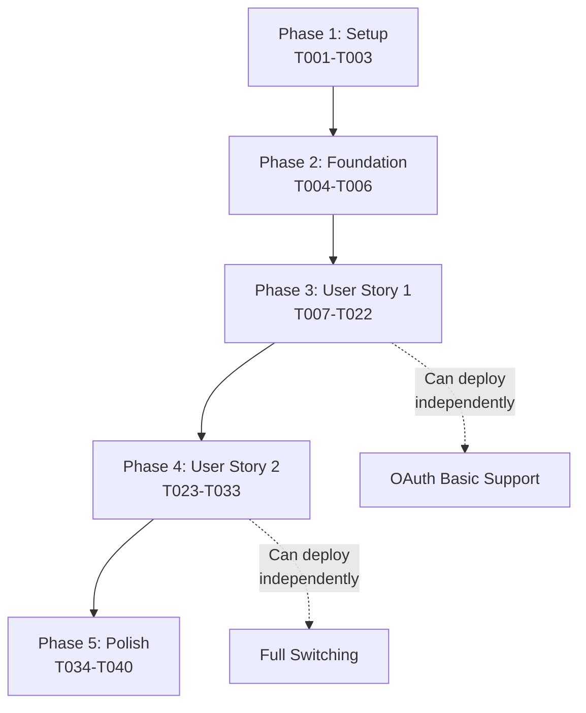

# Implementation Tasks: Agent OAuth & Subscription Authentication

**Feature**: Dual credential support for Claude Code (API key + OAuth token)
**Branch**: `013-agent-oauth-support`

## Summary

Enable Claude Max/Pro subscribers to use their OAuth tokens alongside API keys, with the ability to save both and toggle between them. Implementation focuses on extending the existing credential system with minimal changes.

## Implementation Strategy

**Approach**: Incremental delivery with user story focus
- User Story 1 (P1) delivers core OAuth functionality - MVP
- User Story 2 (P2) adds credential switching capability
- Each story is independently testable and deployable

## Phase 1: Setup Tasks

Initial project setup and prerequisites that block all user stories.

- [x] T001 Create database migration file apps/api/src/db/migrations/0006_dual_credentials_oauth_support.sql
- [x] T002 Update database schema types in apps/api/src/db/schema.ts with credentialKind and isActive fields
- [x] T003 Extend shared types in packages/shared/src/types.ts with OAuth credential interfaces

## Phase 2: Foundational Tasks

Core functionality required before any user story implementation.

- [x] T004 Add OAuth metadata to agent definitions in packages/shared/src/agents.ts
- [x] T005 Create credential validation utilities in apps/api/src/services/validation.ts
- [x] T006 Run database migration to add new columns with defaults

## Phase 3: User Story 1 - Connect Claude Code with OAuth (P1)

**Goal**: Users can save and use OAuth tokens for Claude Code authentication
**Independent Test**: User saves OAuth token, opens workspace, Claude Code authenticates successfully

### API Implementation

- [x] T007 [US1] Extend SaveAgentCredentialRequest to include credentialKind in apps/api/src/routes/credentials.ts
- [x] T008 [P] [US1] Update PUT /api/credentials/agent to handle credential_kind and auto-activation in apps/api/src/routes/credentials.ts
- [x] T009 [P] [US1] Modify GET /api/credentials/agent to return both credential types with isActive flag in apps/api/src/routes/credentials.ts
- [x] T010 [US1] Update getDecryptedAgentKey to fetch active credential only in apps/api/src/routes/credentials.ts
- [x] T011 [P] [US1] Extend /api/workspaces/:id/agent-key to return credentialKind in apps/api/src/routes/workspaces.ts

### UI Components

- [ ] T012 [P] [US1] Add OAuth token input option to AgentKeyCard in apps/web/src/components/AgentKeyCard.tsx
- [ ] T013 [P] [US1] Display credential type labels (API Key vs OAuth Token) in apps/web/src/components/AgentKeyCard.tsx
- [ ] T014 [US1] Show active credential indicator when both types exist in apps/web/src/components/AgentKeyCard.tsx
- [ ] T015 [P] [US1] Add OAuth help text with claude setup-token instructions in apps/web/src/components/AgentKeyCard.tsx

### VM Agent Updates

- [ ] T016 [US1] Modify gateway.go to receive credentialKind from API in packages/vm-agent/internal/acp/gateway.go
- [ ] T017 [US1] Update getAgentCommandInfo to return both env var names in packages/vm-agent/internal/acp/gateway.go
- [ ] T018 [US1] Implement env var selection logic based on credentialKind in packages/vm-agent/internal/acp/gateway.go
- [ ] T019 [US1] Update StartProcess to inject correct environment variable in packages/vm-agent/internal/acp/process.go

### Integration & Testing

- [ ] T020 [P] [US1] Create integration test for OAuth credential save flow in apps/api/tests/integration/credentials.test.ts
- [ ] T021 [P] [US1] Add test for auto-activation behavior in apps/api/tests/integration/credentials.test.ts
- [ ] T022 [P] [US1] Test VM Agent env var injection with OAuth token in packages/vm-agent/internal/acp/gateway_test.go

## Phase 4: User Story 2 - Credential Switching (P2)

**Goal**: Users can switch between API key and OAuth token
**Independent Test**: User toggles active credential, new workspace uses selected type

### API Endpoints

- [ ] T023 [US2] Create POST /api/credentials/agent/:agentType/toggle endpoint in apps/api/src/routes/credentials.ts
- [ ] T024 [US2] Implement credential toggle transaction logic in apps/api/src/routes/credentials.ts
- [ ] T025 [P] [US2] Add DELETE /api/credentials/agent/:agentType/:credentialKind endpoint in apps/api/src/routes/credentials.ts
- [ ] T026 [US2] Handle auto-activation when deleting active credential in apps/api/src/routes/credentials.ts

### UI Components

- [ ] T027 [P] [US2] Create CredentialToggle component in apps/web/src/components/CredentialToggle.tsx
- [ ] T028 [US2] Integrate CredentialToggle into AgentKeyCard in apps/web/src/components/AgentKeyCard.tsx
- [ ] T029 [P] [US2] Add toggle API call handlers in apps/web/src/services/credentials.ts
- [ ] T030 [US2] Update Settings page to handle credential switching in apps/web/src/pages/Settings.tsx

### Testing

- [ ] T031 [P] [US2] Test credential toggle functionality in apps/api/tests/integration/credentials.test.ts
- [ ] T032 [P] [US2] Test deletion with auto-activation in apps/api/tests/integration/credentials.test.ts
- [ ] T033 [P] [US2] Create component tests for CredentialToggle in apps/web/tests/components/CredentialToggle.test.tsx

## Phase 5: Polish & Documentation

Cross-cutting concerns and final polish tasks.

- [ ] T034 [P] Update CLAUDE.md with OAuth authentication documentation
- [ ] T035 [P] Add OAuth token format detection for better error messages in apps/api/src/services/validation.ts
- [ ] T036 [P] Implement credential masking for OAuth tokens in apps/api/src/services/encryption.ts
- [ ] T037 [P] Add error handling for expired OAuth tokens in packages/vm-agent/internal/acp/gateway.go
- [ ] T038 Create end-to-end test for complete OAuth flow in tests/e2e/oauth-credential-flow.test.ts
- [ ] T039 [P] Update API documentation with new credential endpoints
- [ ] T040 [P] Add migration rollback script in case of issues

## Task Dependencies

## Parallel Execution Opportunities

### Within User Story 1 (can run in parallel after T007):
- T008, T009, T011 - Independent API route updates
- T012, T013, T015 - Independent UI component changes
- T020, T021, T022 - Independent test creation

### Within User Story 2 (can run in parallel after T023):
- T025 - Delete endpoint (independent)
- T027 - Component creation (independent)
- T029 - Service layer (independent)
- T031, T032, T033 - Independent tests

### Polish Phase (all can run in parallel):
- T034-T037, T039-T040 - Documentation and utility tasks

## MVP Definition

**Minimum Viable Product = User Story 1 (T001-T022)**

This delivers:
- OAuth token support for Claude Code
- Auto-activation of new credentials
- Basic UI to add OAuth tokens
- Proper env var injection in VM Agent

Users can immediately use their Claude Max/Pro subscriptions, even without the switching capability from User Story 2.

## Success Metrics

- **Total Tasks**: 40
- **User Story 1**: 22 tasks (MVP)
- **User Story 2**: 11 tasks (Enhancement)
- **Polish**: 7 tasks
- **Parallel Opportunities**: ~60% of tasks within each phase
- **Independent Deployments**: 2 (after US1, after US2)

## Notes

- Database migration (T006) must complete before any API changes
- User Story 1 is fully independent and deployable
- User Story 2 requires User Story 1 but adds switching capability
- All credential operations maintain encryption standards
- No breaking changes to existing API key flow