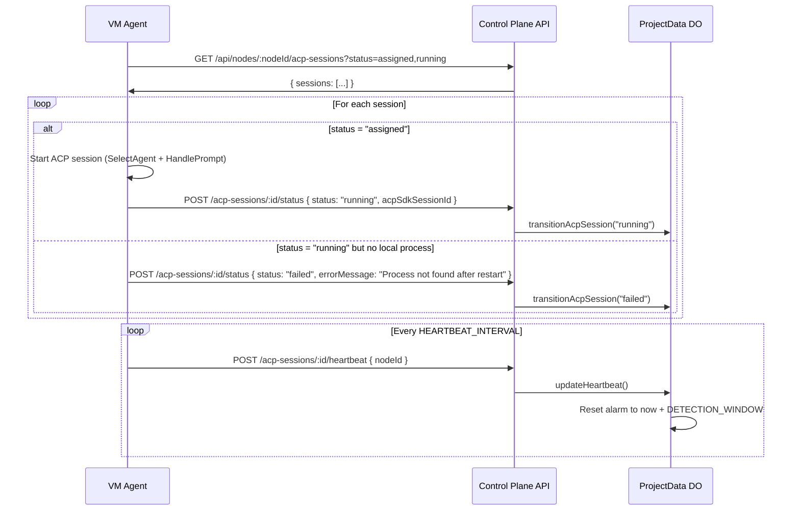

# VM Agent Reconciliation Contract

**Feature**: 027-do-session-ownership | **Date**: 2026-03-11

## Overview

When a VM agent starts (or restarts), it must reconcile its local state with the control plane. This ensures no sessions are lost or stuck due to VM restarts.

## Reconciliation Flow



## VM Agent Startup Sequence

```
1. Agent binary starts
2. Initialize PTY manager, HTTP server, WebSocket hub (unchanged)
3. NEW: Query control plane for assigned/running sessions
   GET /api/nodes/:nodeId/acp-sessions?status=assigned,running
   Timeout: ACP_SESSION_RECONCILIATION_TIMEOUT_MS (default: 30s)
4. For each "assigned" session:
   a. Create local Session record in agentsessions.Manager
   b. Start ACP session (SelectAgent → HandlePrompt)
   c. Report "running" status to control plane
   d. Start heartbeat goroutine
5. For each "running" session without local process:
   a. Report "failed" with error "Process lost during restart"
6. Continue normal operation (accept new session assignments)
```

## Heartbeat Protocol

### VM Agent Side

```go
// Heartbeat goroutine per active ACP session
func (m *Manager) startHeartbeat(ctx context.Context, sessionID, projectID, nodeID string) {
    ticker := time.NewTicker(heartbeatInterval) // ACP_SESSION_HEARTBEAT_INTERVAL_MS
    defer ticker.Stop()

    for {
        select {
        case <-ctx.Done():
            return
        case <-ticker.C:
            err := m.apiClient.SendHeartbeat(ctx, projectID, sessionID, nodeID)
            if err != nil {
                slog.Warn("heartbeat failed", "sessionId", sessionID, "error", err)
                // Don't stop — retry on next tick. DO alarm is the safety net.
            }
        }
    }
}
```

### Control Plane Side

```typescript
// ProjectData DO method
async updateHeartbeat(sessionId: string, nodeId: string): Promise<void> {
  const session = this.getAcpSession(sessionId);
  if (!session) throw new Error('Session not found');
  if (session.node_id !== nodeId) throw new Error('Node mismatch');
  if (!['assigned', 'running'].includes(session.status)) return; // Ignore for terminal states

  const now = Date.now();
  this.sql.exec(
    'UPDATE acp_sessions SET last_heartbeat_at = ?, updated_at = ? WHERE id = ?',
    now, now, sessionId
  );

  // Reset detection alarm
  const detectionWindow = parseInt(this.env.ACP_SESSION_DETECTION_WINDOW_MS || '300000');
  this.ctx.storage.setAlarm(now + detectionWindow);
}
```

### DO Alarm Handler (Interruption Detection)

```typescript
// In ProjectData DO alarm() handler
async checkSessionHeartbeats(): Promise<void> {
  const detectionWindow = parseInt(this.env.ACP_SESSION_DETECTION_WINDOW_MS || '300000');
  const cutoff = Date.now() - detectionWindow;

  const staleSessions = this.sql.exec(
    `SELECT id FROM acp_sessions
     WHERE status IN ('assigned', 'running')
     AND last_heartbeat_at < ?`,
    cutoff
  ).toArray();

  for (const session of staleSessions) {
    await this.transitionAcpSession(session.id, 'interrupted', {
      actorType: 'alarm',
      reason: 'Heartbeat timeout exceeded detection window',
    });
  }
}
```

## Failure Scenarios

| Scenario | VM Agent Behavior | DO Behavior |
|----------|-------------------|-------------|
| VM crash (sudden death) | Nothing (dead) | Heartbeat alarm fires → session "interrupted" |
| VM restart (clean) | Reconciliation on startup | Continues receiving heartbeats after restart |
| Network partition | Heartbeat POST fails, logs warning | Alarm fires if partition > detection window |
| API unreachable on startup | Reconciliation times out, logs error, starts fresh | Sessions remain "assigned" until heartbeat timeout |
| Agent process crash (VM alive) | Detects process exit, reports "failed" | Transitions to "failed" |

## Configuration

| Env Var | Default | Where Set | Description |
|---------|---------|-----------|-------------|
| `ACP_SESSION_HEARTBEAT_INTERVAL_MS` | `60000` | VM agent env | How often to send heartbeats |
| `ACP_SESSION_DETECTION_WINDOW_MS` | `300000` | Worker env | How long before declaring interrupted |
| `ACP_SESSION_RECONCILIATION_TIMEOUT_MS` | `30000` | VM agent env | Timeout for startup reconciliation query |
