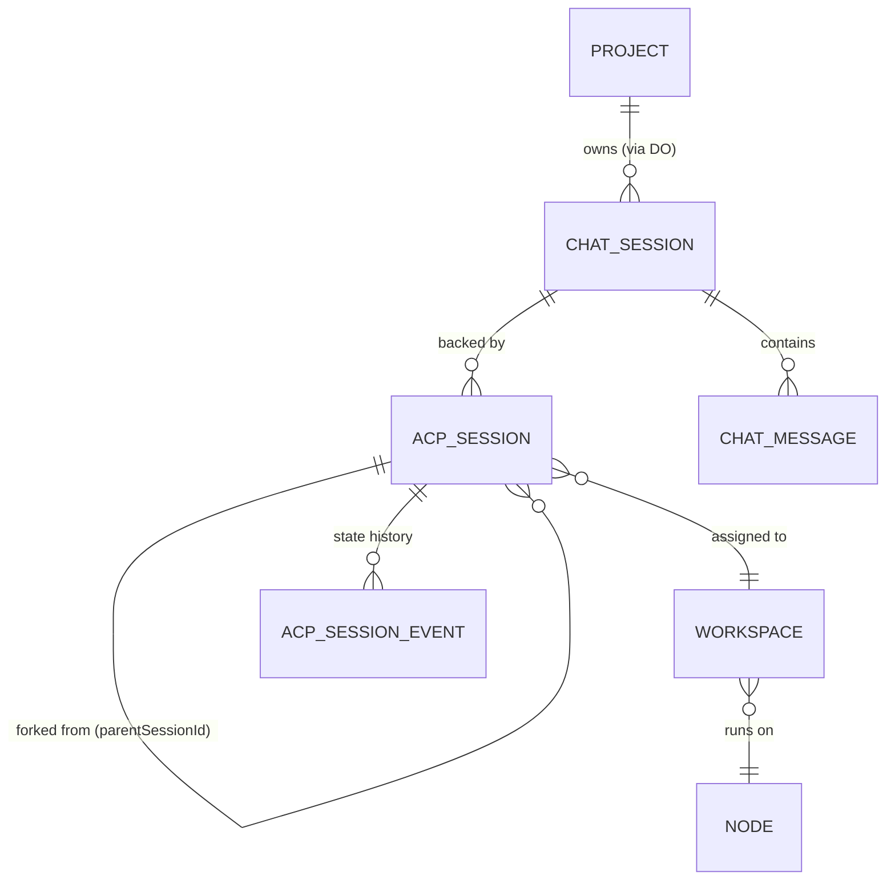
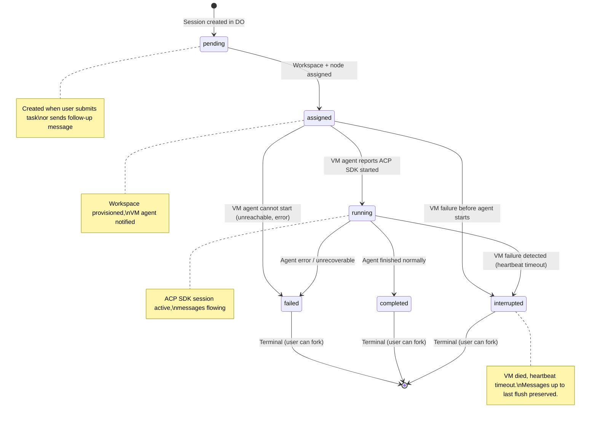
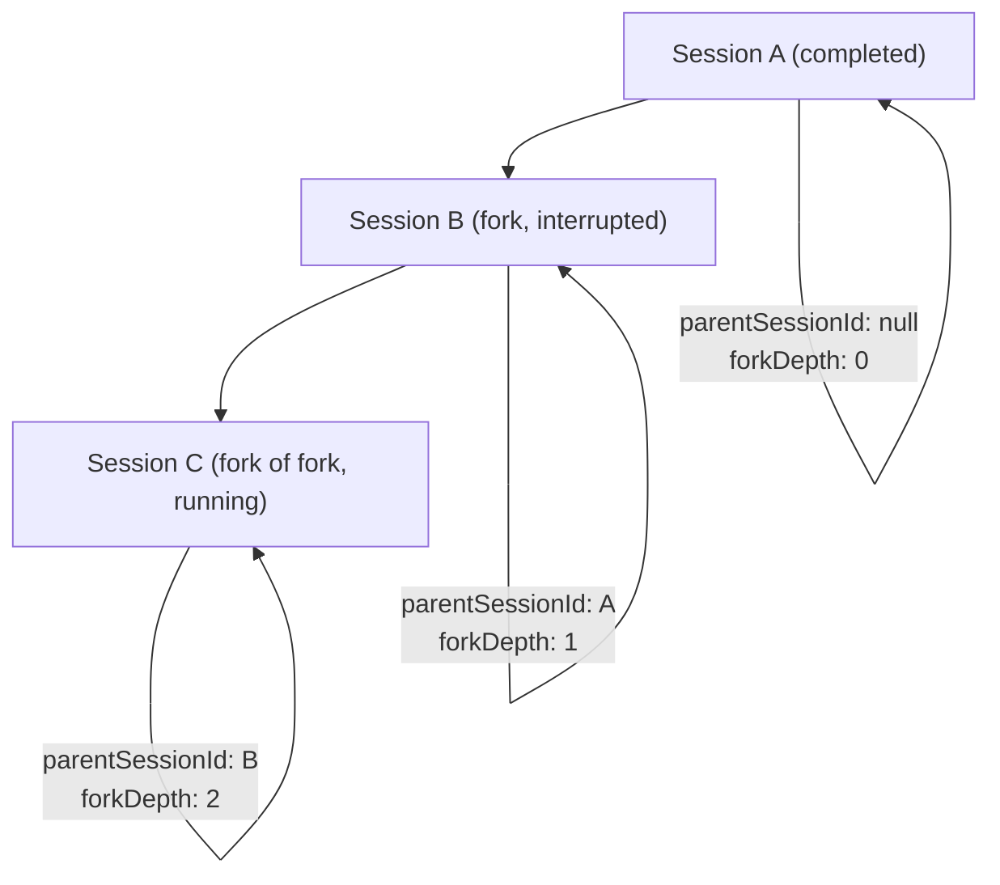

# Data Model: DO-Owned ACP Session Lifecycle

**Feature**: 027-do-session-ownership | **Date**: 2026-03-11

## Entity Relationship Diagram



## New Table: `acp_sessions` (ProjectData DO SQLite)

This table is the **authoritative source of truth** for all ACP session state. Lives in the ProjectData Durable Object's embedded SQLite alongside `chat_sessions` and `chat_messages`.

### Schema

```sql
-- Migration 008: Add ACP sessions table
CREATE TABLE acp_sessions (
  id TEXT PRIMARY KEY,                          -- UUID, matches chat_sessions.id or independent
  chat_session_id TEXT NOT NULL REFERENCES chat_sessions(id) ON DELETE CASCADE,
  workspace_id TEXT,                            -- NULL until assigned to a workspace
  node_id TEXT,                                 -- NULL until assigned; denormalized for fast queries
  acp_sdk_session_id TEXT,                      -- ACP SDK's session ID, set when agent starts
  parent_session_id TEXT REFERENCES acp_sessions(id), -- NULL for root sessions, set for forks
  status TEXT NOT NULL DEFAULT 'pending',        -- State machine: see below
  agent_type TEXT,                              -- e.g., 'claude-code', 'codex'
  initial_prompt TEXT,                          -- Task description or fork context summary
  error_message TEXT,                           -- Set on 'failed' status
  last_heartbeat_at INTEGER,                    -- Epoch ms, updated by VM agent heartbeat
  fork_depth INTEGER NOT NULL DEFAULT 0,         -- 0 for root, incremented on fork
  created_at INTEGER NOT NULL DEFAULT (unixepoch() * 1000),
  updated_at INTEGER NOT NULL DEFAULT (unixepoch() * 1000),
  assigned_at INTEGER,                          -- When workspace was assigned
  started_at INTEGER,                           -- When ACP SDK session started (running)
  completed_at INTEGER,                         -- When session reached terminal state
  interrupted_at INTEGER                        -- When VM failure detected
);

CREATE INDEX idx_acp_sessions_chat ON acp_sessions(chat_session_id);
CREATE INDEX idx_acp_sessions_workspace ON acp_sessions(workspace_id);
CREATE INDEX idx_acp_sessions_node ON acp_sessions(node_id);
CREATE INDEX idx_acp_sessions_parent ON acp_sessions(parent_session_id);
CREATE INDEX idx_acp_sessions_status ON acp_sessions(status);
```

### New Table: `acp_session_events` (ProjectData DO SQLite)

Audit log of all state transitions for debugging and observability.

```sql
-- Migration 008 (continued)
CREATE TABLE acp_session_events (
  id TEXT PRIMARY KEY,
  acp_session_id TEXT NOT NULL REFERENCES acp_sessions(id) ON DELETE CASCADE,
  from_status TEXT,                             -- NULL for initial creation
  to_status TEXT NOT NULL,
  actor_type TEXT NOT NULL,                     -- 'system', 'vm-agent', 'user', 'alarm'
  actor_id TEXT,                                -- Node ID, user ID, or null for system
  reason TEXT,                                  -- Human-readable reason
  metadata TEXT,                                -- JSON blob for extra context
  created_at INTEGER NOT NULL DEFAULT (unixepoch() * 1000)
);

CREATE INDEX idx_acp_session_events_session ON acp_session_events(acp_session_id, created_at);
```

## State Machine



### Valid Transitions

| From | To | Trigger | Actor |
|------|----|---------|-------|
| (new) | `pending` | User submits task / sends follow-up | system |
| `pending` | `assigned` | Workspace + node provisioned | system (task runner) |
| `assigned` | `running` | VM agent reports ACP SDK session started | vm-agent |
| `running` | `completed` | Agent reports completion | vm-agent |
| `running` | `failed` | Agent reports error | vm-agent |
| `running` | `interrupted` | Heartbeat timeout alarm fires | alarm |
| `assigned` | `failed` | VM agent reports cannot start | vm-agent |
| `assigned` | `interrupted` | Heartbeat timeout / node destroyed | alarm / system |

### Invalid Transitions (Enforced)

- Cannot go backwards (e.g., `running` → `assigned`)
- Cannot transition from terminal states (`completed`, `failed`, `interrupted`)
- `pending` cannot skip to `running` (must be assigned first)

## Fork Lineage

When a user sends a follow-up to a completed/interrupted session whose workspace is gone:

1. System creates a new `acp_sessions` record with `parent_session_id` pointing to the original
2. `fork_depth` = parent's `fork_depth + 1` (capped at `ACP_SESSION_MAX_FORK_DEPTH`)
3. `initial_prompt` contains context summary from parent's messages
4. New session follows the same state machine from `pending`



## TypeScript Types (packages/shared)

```typescript
export type AcpSessionStatus =
  | 'pending'
  | 'assigned'
  | 'running'
  | 'completed'
  | 'failed'
  | 'interrupted';

export interface AcpSession {
  id: string;
  chatSessionId: string;
  workspaceId: string | null;
  nodeId: string | null;
  acpSdkSessionId: string | null;
  parentSessionId: string | null;
  status: AcpSessionStatus;
  agentType: string | null;
  initialPrompt: string | null;
  errorMessage: string | null;
  lastHeartbeatAt: number | null;
  forkDepth: number;
  createdAt: number;
  updatedAt: number;
  assignedAt: number | null;
  startedAt: number | null;
  completedAt: number | null;
  interruptedAt: number | null;
}

export interface AcpSessionEvent {
  id: string;
  acpSessionId: string;
  fromStatus: AcpSessionStatus | null;
  toStatus: AcpSessionStatus;
  actorType: 'system' | 'vm-agent' | 'user' | 'alarm';
  actorId: string | null;
  reason: string | null;
  metadata: Record<string, unknown> | null;
  createdAt: number;
}

export interface ForkRequest {
  parentSessionId: string;
  initialPrompt: string;  // Context summary
}
```

## VM Agent Contract Extensions (packages/shared/vm-agent-contract.ts)

### New: Heartbeat

```typescript
// VM agent → Control plane (periodic)
POST /api/projects/:projectId/acp-sessions/:sessionId/heartbeat
Request: { nodeId: string; acpSdkSessionId: string }
Response: 204 No Content

// On failure: VM agent logs warning, retries on next interval
```

### New: Session State Report

```typescript
// VM agent → Control plane (on ACP SDK events)
POST /api/projects/:projectId/acp-sessions/:sessionId/status
Request: {
  status: 'running' | 'completed' | 'failed';
  acpSdkSessionId?: string;  // Set on 'running'
  errorMessage?: string;       // Set on 'failed'
  nodeId: string;
}
Response: 200 { status: AcpSessionStatus }
```

### New: Reconciliation Query

```typescript
// VM agent → Control plane (on startup)
GET /api/nodes/:nodeId/acp-sessions?status=assigned,running
Response: {
  sessions: Array<{
    id: string;
    chatSessionId: string;
    workspaceId: string;
    status: AcpSessionStatus;
    initialPrompt: string | null;
    agentType: string | null;
  }>
}
```

## Existing Tables — No Schema Changes

| Table | Owner | Change |
|-------|-------|--------|
| `chat_sessions` (DO) | ProjectData DO | No schema change. ACP sessions reference it. |
| `chat_messages` (DO) | ProjectData DO | No schema change. Messages still reference chat_sessions.id. |
| `agent_sessions` (D1) | API Worker | Becomes read-optimized projection. Updated async from DO. |
| `workspaces` (D1) | API Worker | No schema change. `project_id` already exists. |
| `task_status_events` (DO) | ProjectData DO | No schema change. |

## Validation Rules

1. **Workspace-project binding**: ACP sessions can only be created for workspaces with a non-null `project_id`. Enforced at API layer before DO call.
2. **State machine enforcement**: DO validates all transitions against the valid transitions table. Invalid transitions return 409 Conflict.
3. **Fork depth limit**: Forks beyond `ACP_SESSION_MAX_FORK_DEPTH` are rejected with 422.
4. **Heartbeat freshness**: Only accepted for sessions in `assigned` or `running` status.
5. **Identity validation**: Every state change logs all IDs (sessionId, chatSessionId, workspaceId, nodeId, projectId) per Principle XIII.
