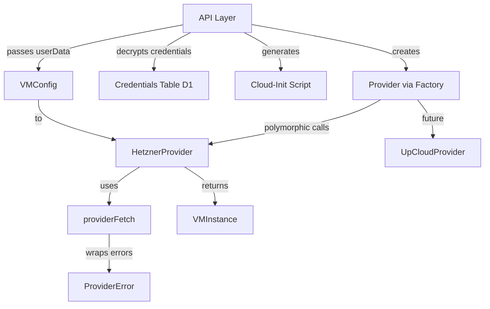
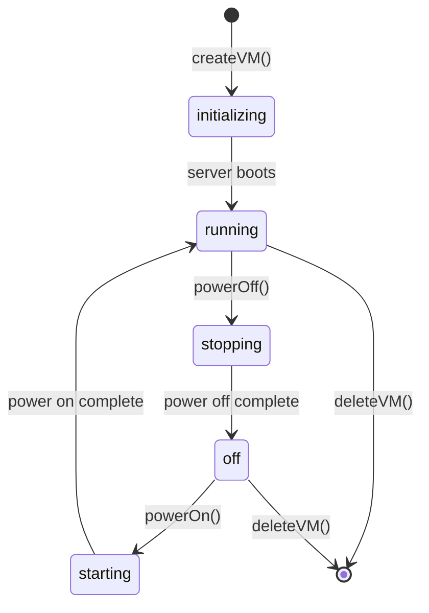

# Data Model: Provider Interface Modernization

## Entities

### Provider (Interface)

The core abstraction for cloud infrastructure providers.

| Property | Type | Description |
|----------|------|-------------|
| `name` | `string` (readonly) | Provider identifier matching `CredentialProvider` type (e.g., `'hetzner'`) |
| `locations` | `readonly string[]` | Available datacenter/region identifiers |
| `sizes` | `readonly Record<VMSize, SizeConfig>` | Available VM size configurations |

| Method | Signature | Description |
|--------|-----------|-------------|
| `createVM` | `(config: VMConfig) => Promise<VMInstance>` | Provision a new VM |
| `deleteVM` | `(id: string) => Promise<void>` | Delete a VM (idempotent on 404) |
| `getVM` | `(id: string) => Promise<VMInstance \| null>` | Get VM by ID (null if not found) |
| `listVMs` | `(labels?: Record<string, string>) => Promise<VMInstance[]>` | List VMs with optional label filter |
| `powerOff` | `(id: string) => Promise<void>` | Power off a VM |
| `powerOn` | `(id: string) => Promise<void>` | Power on a VM |
| `validateToken` | `() => Promise<boolean>` | Validate the provider credentials |

### VMConfig (Value Object)

Configuration for creating a VM. Contains NO secrets.

| Field | Type | Required | Description |
|-------|------|----------|-------------|
| `name` | `string` | Yes | Server name |
| `size` | `VMSize` | Yes | VM size tier (`'small' \| 'medium' \| 'large'`) |
| `location` | `string` | Yes | Datacenter/region identifier |
| `userData` | `string` | Yes | Pre-generated cloud-init script (opaque to provider) |
| `labels` | `Record<string, string>` | No | Metadata labels for the VM |
| `image` | `string` | No | OS image (default: `'ubuntu-24.04'`) |

**Removed from current VMConfig**: `workspaceId`, `repoUrl`, `authPassword`, `apiToken`, `baseDomain`, `apiUrl`, `githubToken` — these are either secrets (belong in cloud-init generation) or application-level concerns (belong in the caller).

### VMInstance (Value Object)

Representation of a provisioned VM as returned by the provider.

| Field | Type | Description |
|-------|------|-------------|
| `id` | `string` | Provider-specific server ID |
| `name` | `string` | Server name |
| `ip` | `string` | Public IPv4 address |
| `status` | `VMStatus` | Current status |
| `serverType` | `string` | Provider-specific server type (e.g., `'cx23'`) |
| `createdAt` | `string` | ISO 8601 creation timestamp |
| `labels` | `Record<string, string>` | Metadata labels |

### VMStatus (Enum)

```typescript
type VMStatus = 'initializing' | 'running' | 'off' | 'starting' | 'stopping';
```

### SizeConfig (Value Object)

Provider-specific size tier configuration.

| Field | Type | Description |
|-------|------|-------------|
| `type` | `string` | Provider-specific server type identifier |
| `price` | `string` | Human-readable price string |
| `vcpu` | `number` | Virtual CPU count |
| `ramGb` | `number` | RAM in gigabytes |
| `storageGb` | `number` | Storage in gigabytes |

### ProviderConfig (Discriminated Union)

Authentication configuration per provider type.

```typescript
type ProviderConfig =
  | { provider: 'hetzner'; apiToken: string; datacenter?: string }
  | { provider: 'upcloud'; username: string; password: string };
```

**Note**: Only `hetzner` variant is implemented in this spec. The `upcloud` variant defines the type shape for future use.

### ProviderError (Error Class)

Normalized error for all provider operations.

| Field | Type | Description |
|-------|------|-------------|
| `providerName` | `string` | Provider that produced the error |
| `statusCode` | `number \| undefined` | HTTP status code (if from API call) |
| `message` | `string` | Human-readable error message |
| `cause` | `Error \| undefined` | Original error |

## Relationships



## State Transitions

VMInstance status transitions are provider-specific. For Hetzner:



## Database Impact

**No database schema changes required.** The `credentials` table already has a `provider` text column that supports any provider name. The `CredentialProvider` type in `packages/shared/src/types.ts` remains `'hetzner'` (expansion is out of scope per spec).
