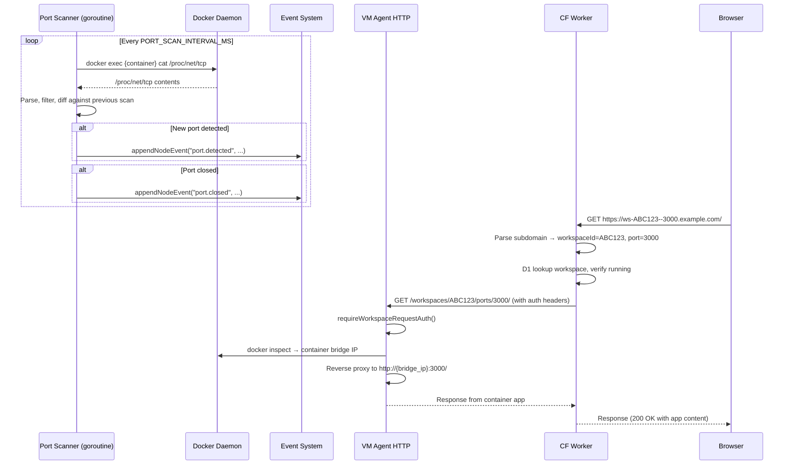

# Data Model: Workspace Port Exposure

## Entities

### DetectedPort (VM Agent, in-memory)

No database storage needed. Port state is ephemeral and maintained in-memory by the VM agent's port scanner goroutine.

```go
type DetectedPort struct {
    Port       int    `json:"port"`
    Address    string `json:"address"`    // "0.0.0.0" or "127.0.0.1"
    Label      string `json:"label"`      // Heuristic or devcontainer label
    URL        string `json:"url"`        // Constructed browser URL
    DetectedAt time.Time `json:"detectedAt"`
}
```

```typescript
// TypeScript equivalent (packages/shared/src/types.ts)
interface DetectedPort {
  port: number;
  address: string;       // "0.0.0.0" or "127.0.0.1"
  label: string;         // e.g., "Django", "Vite Dev", ":4567"
  url: string;           // e.g., "https://ws-ABC123--8000.example.com"
  detectedAt: string;    // ISO 8601
}
```

### PortScanState (VM Agent, per-workspace)

```go
type PortScanState struct {
    mu            sync.RWMutex
    ports         map[int]DetectedPort  // port number -> detected port
    containerIP   string                // Cached bridge IP
    ipCachedAt    time.Time             // When bridge IP was last fetched
    lastScanAt    time.Time
    lastScanError error
}
```

---

## API Contracts

### GET /workspaces/{workspaceId}/ports (VM Agent)

Returns the current list of detected listening ports for a workspace.

**Auth**: `requireWorkspaceRequestAuth()` (existing)

**Response** `200 OK`:
```json
{
  "ports": [
    {
      "port": 3000,
      "address": "0.0.0.0",
      "label": "Web App",
      "url": "https://ws-ABC123--3000.example.com",
      "detectedAt": "2026-03-16T10:30:00Z"
    },
    {
      "port": 8000,
      "address": "0.0.0.0",
      "label": "Django",
      "url": "https://ws-ABC123--8000.example.com",
      "detectedAt": "2026-03-16T10:30:05Z"
    }
  ]
}
```

**Response** `200 OK` (no ports):
```json
{
  "ports": []
}
```

### Worker Subdomain Routing (Cloudflare Worker)

**Input**: `Host: ws-ABC123--3000.example.com`

**Parsing logic**:
```typescript
const hostname = new URL(request.url).hostname;
const subdomain = hostname.split('.')[0]; // "ws-ABC123--3000"

let workspaceId: string;
let targetPort: number | undefined;

if (subdomain.includes('--')) {
  const [wsSubdomain, portStr] = subdomain.split('--');
  workspaceId = wsSubdomain.replace('ws-', '').toUpperCase();
  targetPort = parseInt(portStr, 10);
  if (isNaN(targetPort) || targetPort < 1 || targetPort > 65535) {
    return new Response('Invalid port', { status: 400 });
  }
} else {
  workspaceId = subdomain.replace('ws-', '').toUpperCase();
}
```

**Backend URL construction**:
```typescript
// Without port: proxy to VM agent root (existing behavior)
// With port: proxy to VM agent port proxy endpoint
const backendPath = targetPort
  ? `/workspaces/${workspaceId}/ports/${targetPort}${url.pathname}`
  : url.pathname;
```

---

## Event Types

### port.detected

Emitted when a new port is detected listening.

```json
{
  "id": "evt-abc123",
  "workspaceId": "ABC123",
  "level": "info",
  "type": "port.detected",
  "message": "Port 3000 detected (Web App)",
  "detail": {
    "port": 3000,
    "address": "0.0.0.0",
    "label": "Web App",
    "url": "https://ws-ABC123--3000.example.com"
  },
  "createdAt": "2026-03-16T10:30:00Z"
}
```

### port.closed

Emitted when a previously-detected port stops listening.

```json
{
  "id": "evt-def456",
  "workspaceId": "ABC123",
  "level": "info",
  "type": "port.closed",
  "message": "Port 3000 closed",
  "detail": {
    "port": 3000
  },
  "createdAt": "2026-03-16T10:35:00Z"
}
```

---

## /proc/net/tcp Parsing Format

Each line after the header:
```
  sl  local_address rem_address   st tx_queue rx_queue tr tm->when retrnsmt   uid  timeout inode
   0: 00000000:0BB8 00000000:0000 0A 00000000:00000000 00:00000000 00000000     0        0 12345 ...
```

Parsing:
- `local_address`: `{hex_ip}:{hex_port}` — e.g., `00000000:0BB8` = `0.0.0.0:3000`
- `st` (state): `0A` = `TCP_LISTEN` (the only state we care about)
- IP decoding: `00000000` = `0.0.0.0`, `0100007F` = `127.0.0.1` (little-endian)

```go
func parseProcNetTcp(content string) []DetectedPort {
    // Skip header line
    // For each subsequent line:
    //   1. Split by whitespace
    //   2. Extract fields[1] (local_address) and fields[3] (state)
    //   3. If state != "0A", skip (not LISTEN)
    //   4. Split local_address on ":"
    //   5. Parse hex port: strconv.ParseInt(hexPort, 16, 32)
    //   6. Parse hex IP (little-endian for IPv4)
    //   7. Apply exclusion filters
    //   8. Build DetectedPort
}
```

---

## Sequence Diagram: Port Detection Flow



---

## Configuration Variables

| Variable | Type | Default | Description |
|----------|------|---------|-------------|
| `PORT_SCAN_INTERVAL_MS` | int | 5000 | Scan frequency per workspace |
| `PORT_SCAN_EXCLUDE` | string | "22,2375,2376,8443" | Ports to never report |
| `PORT_SCAN_EPHEMERAL_MIN` | int | 32768 | Minimum ephemeral port (excluded) |
| `PORT_PROXY_CACHE_TTL_MS` | int | 30000 | Container bridge IP cache TTL |
| `PORT_SCAN_ENABLED` | bool | true | Master toggle |
