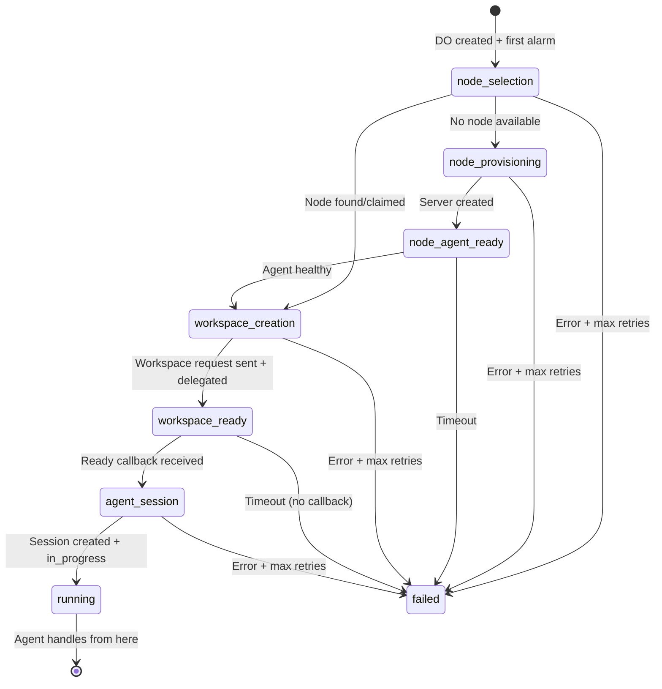
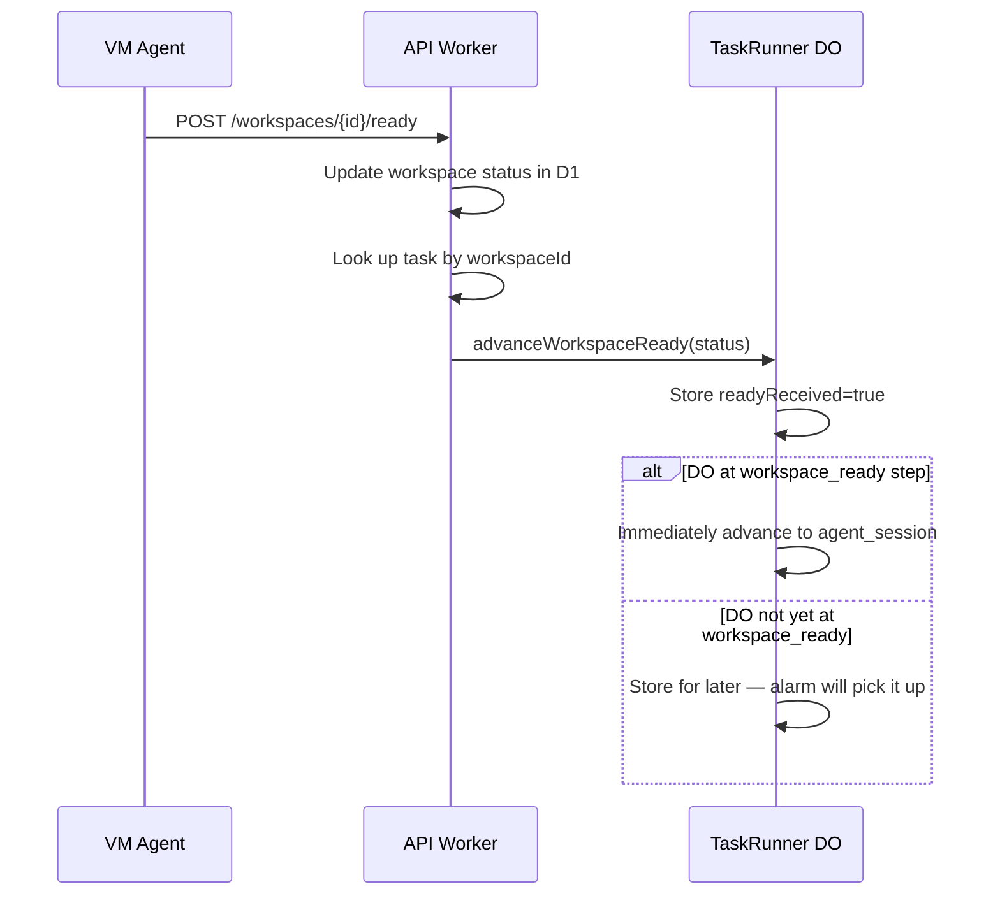

# Data Model: TDF-2 Orchestration Engine

## TaskRunner Durable Object State

The TaskRunner DO uses `ctx.storage` (not embedded SQLite) because:
1. The state is simple key-value (no relational queries needed)
2. Storage operations are transactional within a single `get`/`put`
3. Matches the NodeLifecycle DO pattern already in the codebase

### Stored State Schema

```typescript
interface TaskRunnerState {
  /** Schema version for backward compatibility during deployments */
  version: 1;

  /** Task identity */
  taskId: string;
  projectId: string;
  userId: string;

  /** Current execution step */
  currentStep: TaskExecutionStep;

  /** Accumulated results from completed steps */
  stepResults: StepResults;

  /** Task configuration (captured at creation, not re-read from D1) */
  config: TaskRunConfig;

  /** Retry tracking for current step */
  retryCount: number;

  /** Whether workspace-ready callback arrived before we reached that step */
  workspaceReadyReceived: boolean;
  workspaceReadyStatus: 'running' | 'recovery' | 'error' | null;
  workspaceErrorMessage: string | null;

  /** Timestamps */
  createdAt: number; // epoch ms
  lastStepAt: number; // epoch ms — when current step started
}

interface StepResults {
  /** From node_selection step */
  nodeId: string | null;
  autoProvisioned: boolean;

  /** From workspace_creation step */
  workspaceId: string | null;
  chatSessionId: string | null;

  /** From agent_session step */
  agentSessionId: string | null;
}

interface TaskRunConfig {
  vmSize: VMSize;
  vmLocation: VMLocation;
  branch: string;
  preferredNodeId: string | null;
  userName: string | null;
  userEmail: string | null;
  githubId: string | null;
  taskTitle: string;
  taskDescription: string | null;
  repository: string;
  installationId: string;
  outputBranch: string | null;
  projectDefaultVmSize: VMSize | null;
}
```

### Step State Machine



### Alarm Strategy: Single Alarm with Step Dispatch

The DO uses a **single alarm** that dispatches to the appropriate step handler based on `currentStep`. This is simpler than alarm-per-step and matches the NodeLifecycle DO pattern.

```typescript
async alarm(): Promise<void> {
  const state = await this.getState();
  if (!state) return;

  switch (state.currentStep) {
    case 'node_selection': return this.handleNodeSelection(state);
    case 'node_provisioning': return this.handleNodeProvisioning(state);
    case 'node_agent_ready': return this.handleNodeAgentReady(state);
    case 'workspace_creation': return this.handleWorkspaceCreation(state);
    case 'workspace_ready': return this.handleWorkspaceReady(state);
    case 'agent_session': return this.handleAgentSession(state);
    case 'running': return; // No more alarms needed
  }
}
```

### Retry & Backoff Configuration

All configurable via environment variables (Constitution Principle XI):

| Parameter | Env Var | Default | Purpose |
|-----------|---------|---------|---------|
| Step retry max | `TASK_RUNNER_STEP_MAX_RETRIES` | 3 | Max retries per step before failing |
| Retry base delay | `TASK_RUNNER_RETRY_BASE_DELAY_MS` | 5000 | Initial retry delay (ms) |
| Retry max delay | `TASK_RUNNER_RETRY_MAX_DELAY_MS` | 60000 | Max retry delay after backoff (ms) |
| Agent ready poll interval | `TASK_RUNNER_AGENT_POLL_INTERVAL_MS` | 5000 | Health check poll interval |
| Agent ready timeout | `TASK_RUNNER_AGENT_READY_TIMEOUT_MS` | 120000 | Max wait for agent health |
| Workspace ready timeout | `TASK_RUNNER_WORKSPACE_READY_TIMEOUT_MS` | 600000 | Max wait for ready callback |
| Provisioning poll interval | `TASK_RUNNER_PROVISION_POLL_INTERVAL_MS` | 10000 | Server status poll interval |

### Callback Advancement

The workspace-ready callback flow:



### DO Naming Convention

- **Binding**: `TASK_RUNNER` (in wrangler.toml)
- **Class**: `TaskRunner` (exported from index.ts)
- **ID**: `env.TASK_RUNNER.idFromName(taskId)` — one DO per task
- **Migration tag**: `v4` (next after AdminLogs v3)

### D1 Interaction Pattern

The DO reads/writes D1 via `this.env.DATABASE` (same as NodeLifecycle DO). It does NOT duplicate D1 state — it uses D1 as the source of truth for task status and just drives the transitions. The DO's own storage tracks *where it is in the pipeline* and *accumulated step results*.

| Data | Where stored | Why |
|------|-------------|-----|
| Task status, executionStep | D1 (tasks table) | Frontend polls D1; shared across workers |
| Current pipeline step, retry count | DO storage | Pipeline control; survives restarts |
| Step results (nodeId, workspaceId) | DO storage | Pipeline state; needed for subsequent steps |
| Workspace-ready signal | DO storage | Callback → DO coordination |
| Task status events | D1 (taskStatusEvents) | Audit trail; queried by frontend |

### Concurrency Safety

Durable Objects guarantee single-threaded execution — only one alarm or RPC call runs at a time. This eliminates the race conditions between the async task runner and stuck-task cron that exist today. The only remaining race is between the stuck-task cron and a DO-managed task, which we handle by having the cron check for DO-managed tasks (presence of a marker field or by querying the DO).
