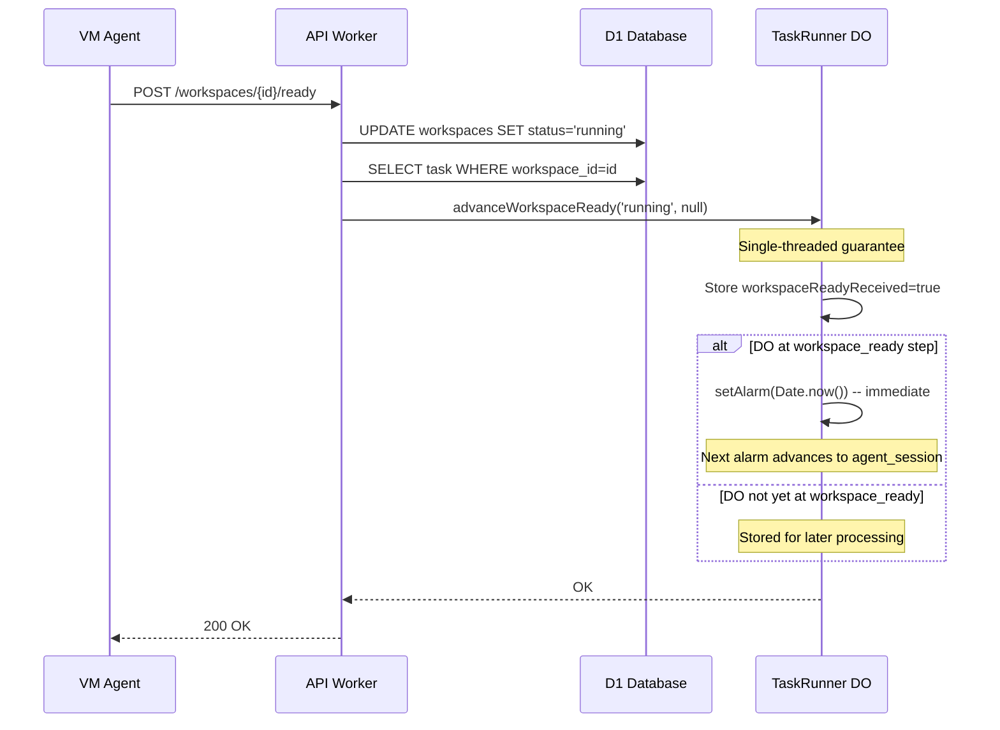
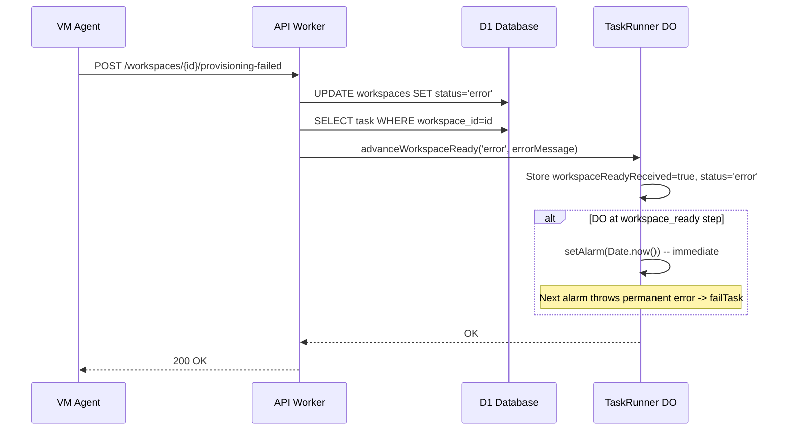
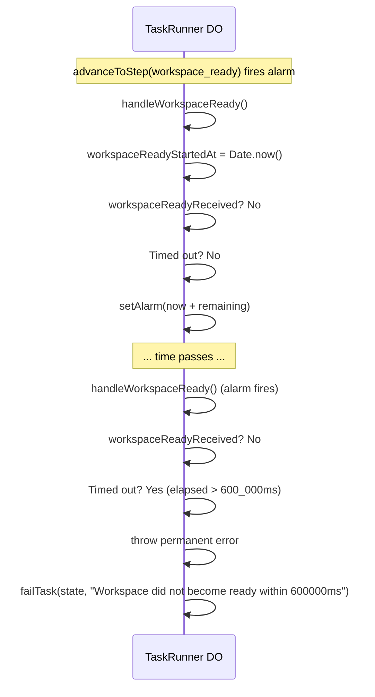

# Data Model: TDF-5 Workspace Lifecycle -- Event-Driven Readiness

## No Schema Changes

TDF-5 does not add new database tables, columns, or D1 schema changes. The change is purely behavioral: removing the D1 polling fallback from the TaskRunner DO's `handleWorkspaceReady()` step and making the callback notification inline.

## State Changes in TaskRunner DO

### Fields Used (No Changes)

The existing `TaskRunnerState` fields used by the workspace-ready flow remain unchanged:

| Field | Type | Purpose |
|-------|------|---------|
| `workspaceReadyReceived` | `boolean` | Flag set by `advanceWorkspaceReady()` RPC |
| `workspaceReadyStatus` | `'running' \| 'recovery' \| 'error' \| null` | Status from callback |
| `workspaceErrorMessage` | `string \| null` | Error message from provisioning-failed callback |
| `workspaceReadyStartedAt` | `number \| null` | Epoch ms when DO first entered workspace_ready step |
| `currentStep` | `TaskExecutionStep` | Current step in the pipeline |
| `completed` | `boolean` | Terminal flag |

### Behavioral Changes

**Before (Hybrid)**:
```
handleWorkspaceReady alarm fires:
  1. Check workspaceReadyReceived flag -> advance if set
  2. Check timeout -> fail if exceeded
  3. Query D1 for workspace status -> advance if running  <-- REMOVED
  4. Schedule next poll alarm (5s)  <-- CHANGED
```

**After (Pure Callback)**:
```
handleWorkspaceReady alarm fires:
  1. Check workspaceReadyReceived flag -> advance if set
  2. Check timeout -> fail if exceeded
  3. Schedule timeout alarm (remaining time until timeout)  <-- CHANGED
```

## Callback Advancement Flow

### Sequence Diagram



### Provisioning Failure Flow



### Timeout Flow (No Callback Arrives)



## Race Condition Analysis

### Race 1: Callback Before DO Reaches workspace_ready

**Scenario**: VM agent finishes provisioning very quickly. The `/ready` callback arrives while the DO is still at `workspace_creation` step.

**Handling** (unchanged from TDF-2):
1. `advanceWorkspaceReady()` is called on the DO
2. DO checks `state.completed` -- false
3. DO stores `workspaceReadyReceived = true`, `workspaceReadyStatus = 'running'`
4. DO checks `state.currentStep === 'workspace_ready'` -- false (still at workspace_creation)
5. Signal is stored but no alarm is triggered
6. When DO naturally advances to `workspace_ready`, the alarm fires `handleWorkspaceReady()`
7. `handleWorkspaceReady()` checks `state.workspaceReadyReceived` -- true, advances immediately

### Race 2: Callback After Timeout

**Scenario**: VM agent retries are slow, and the DO times out before the callback arrives.

**Handling** (unchanged from TDF-2):
1. DO timeout alarm fires, `handleWorkspaceReady()` detects `elapsed > timeoutMs`
2. DO calls `failTask()`, sets `state.completed = true`
3. Late callback arrives, `advanceWorkspaceReady()` is called
4. DO checks `state.completed` -- true, returns immediately (no-op)

### Race 3: Duplicate Callbacks

**Scenario**: VM agent retries the `/ready` callback (TDF-4 retry logic).

**Handling** (unchanged):
1. First callback: `advanceWorkspaceReady()` sets `workspaceReadyReceived = true`, advances DO
2. Second callback: `advanceWorkspaceReady()` is called again
3. If DO is already past `workspace_ready` or completed, it's a no-op

## Configuration (Unchanged)

| Parameter | Env Var | Default | Purpose |
|-----------|---------|---------|---------|
| Workspace ready timeout | `TASK_RUNNER_WORKSPACE_READY_TIMEOUT_MS` | 600000 (10 min) | Max wait for callback |

**Removed dependency**: The `TASK_RUNNER_AGENT_POLL_INTERVAL_MS` env var is no longer used by `handleWorkspaceReady()`. It is still used by `handleNodeAgentReady()` for health check polling.
