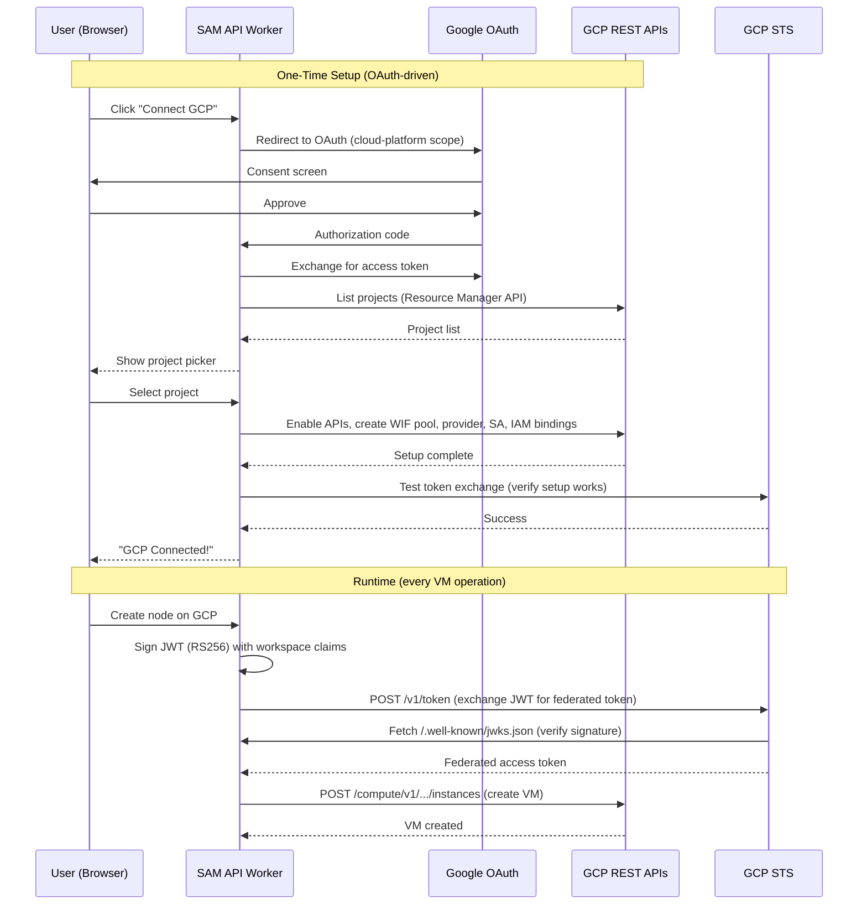

# GCP OIDC Integration via OAuth — One-Click "Connect GCP"

**Created**: 2026-03-18
**Status**: Backlog
**Priority**: High
**Estimated Effort**: X-Large
**Depends On**: None (SAM already has ~80% of the OIDC infrastructure)
**Implementation**: Use `/speckit.specify` → `/speckit.plan` → `/speckit.tasks` → `/speckit.implement` workflow

## Summary

Implement a one-click "Connect GCP" flow where users authenticate with Google OAuth, select a GCP project, and SAM automatically creates all the Workload Identity Federation resources needed for keyless GCP Compute Engine access. No `gcloud` commands, no JSON key files, no manual console clicks.

After setup, SAM acts as a custom OIDC identity provider: it issues short-lived JWTs that are exchanged for temporary GCP credentials via the standard STS token exchange protocol. No long-lived secrets are stored anywhere — SAM keeps only the GCP project number, service account email, and pool/provider identifiers.

**This would make SAM the first SaaS platform to offer fully automated GCP OIDC setup via OAuth.** Every other platform (Terraform Cloud, GitHub Actions, Spacelift, Pulumi, env0, GitLab) requires manual `gcloud` commands or GCP Console configuration.

## User Experience (Happy Path)

1. User navigates to Settings → Cloud Providers
2. User clicks "Connect Google Cloud"
3. Google OAuth popup: user signs in with their Google account and approves the `cloud-platform` scope
4. SAM shows a project picker dropdown (populated from the user's GCP projects)
5. User selects a project
6. SAM shows real-time progress:
   - "Enabling required APIs..." ✓
   - "Creating identity pool..." ✓
   - "Configuring OIDC provider..." ✓
   - "Creating service account..." ✓
   - "Setting permissions..." ✓
   - "Verifying connection..." ✓
7. "GCP connected! You can now provision nodes on Google Cloud."
8. GCP appears as a provider option when creating nodes

**Total user effort: 3 clicks + select a project from a dropdown.**

## Architecture Overview



## Technical Design

### Part 1: Google OAuth Integration

SAM needs a second OAuth provider (in addition to GitHub). This is for GCP resource management only — not for user authentication/login.

**Google Cloud OAuth App Setup:**
- Create OAuth 2.0 Client ID in Google Cloud Console (type: Web Application)
- Redirect URI: `https://api.{BASE_DOMAIN}/auth/google/callback`
- Requested scope: `https://www.googleapis.com/auth/cloud-platform`
- Use **incremental authorization** — only request the scope when user clicks "Connect GCP", not at login

**New environment variables:**
- `GOOGLE_CLIENT_ID` — OAuth 2.0 client ID
- `GOOGLE_CLIENT_SECRET` — OAuth 2.0 client secret

**OAuth flow:**
1. `GET /auth/google/authorize` — Redirects to Google OAuth with `cloud-platform` scope + `state` param (CSRF token stored in KV)
2. `GET /auth/google/callback` — Exchanges authorization code for access token, does NOT store the token persistently — passes it to the setup orchestrator
3. Access token is used only for the setup sequence, then discarded

**Important:** The Google OAuth token is **ephemeral**. It is used during the setup flow and then thrown away. SAM never stores Google OAuth tokens. After setup, SAM authenticates to GCP via its own OIDC tokens (self-issued JWTs exchanged via STS).

### Part 2: OIDC Provider Infrastructure (SAM as IdP)

SAM already has most of the building blocks. What's needed:

#### 2a. OIDC Discovery Endpoint

`GET /.well-known/openid-configuration` — New route in `apps/api/src/index.ts`

```json
{
  "issuer": "https://api.{BASE_DOMAIN}",
  "jwks_uri": "https://api.{BASE_DOMAIN}/.well-known/jwks.json",
  "response_types_supported": ["id_token"],
  "subject_types_supported": ["public"],
  "id_token_signing_alg_values_supported": ["RS256"],
  "claims_supported": [
    "iss", "sub", "aud", "exp", "iat",
    "workspace_id", "project_id", "user_id",
    "repository", "node_id"
  ]
}
```

The JWKS endpoint (`/.well-known/jwks.json`) already exists — registered in `apps/api/src/index.ts`, backed by `getJWKS()` in `apps/api/src/services/jwt.ts`.

#### 2b. Identity Token Issuance

New function in `apps/api/src/services/jwt.ts` — `signIdentityToken()`:

```typescript
interface IdentityTokenClaims {
  userId: string;
  projectId: string;
  workspaceId?: string;
  nodeId?: string;
  audience: string; // GCP WIF provider resource URI
}

// Returns a signed JWT with:
// iss: https://api.{BASE_DOMAIN}
// sub: project:{projectId}
// aud: //iam.googleapis.com/projects/{NUM}/locations/global/workloadIdentityPools/{POOL}/providers/{PROVIDER}
// exp: iat + 600 (10 minutes — only needed for STS exchange)
// + custom claims: user_id, project_id, workspace_id, node_id
```

This uses the existing RS256 key pair (`JWT_PRIVATE_KEY`, `JWT_PUBLIC_KEY`) and `jose` library. The existing `signCallbackToken()` pattern in `jwt.ts` is a direct template.

### Part 3: GCP Setup Orchestrator

New service: `apps/api/src/services/gcp-setup.ts`

This service takes a Google OAuth access token and a GCP project ID, then executes the following steps. All calls are standard REST — no SDK needed, works from Cloudflare Workers.

#### Step 1: Get Project Number

```
GET https://cloudresourcemanager.googleapis.com/v1/projects/{projectId}
Authorization: Bearer {google_oauth_token}
```

Response includes `projectNumber` (numeric string, e.g., `"123456789012"`). This is needed because WIF principal identifiers use the numeric project number, not the string project ID.

#### Step 2: Enable Required APIs

```
POST https://serviceusage.googleapis.com/v1/projects/{projectNumber}/services:batchEnable
Authorization: Bearer {google_oauth_token}
Content-Type: application/json

{
  "serviceIds": [
    "iam.googleapis.com",
    "iamcredentials.googleapis.com",
    "sts.googleapis.com",
    "compute.googleapis.com"
  ]
}
```

Returns a long-running operation. Poll until done. Note: `serviceusage.googleapis.com` itself must be enabled — it is enabled by default on new GCP projects.

#### Step 3: Create Workload Identity Pool

```
POST https://iam.googleapis.com/v1/projects/{projectNumber}/locations/global/workloadIdentityPools?workloadIdentityPoolId=sam-pool
Authorization: Bearer {google_oauth_token}
Content-Type: application/json

{
  "displayName": "Simple Agent Manager",
  "description": "Workload identity pool for SAM platform"
}
```

Returns a long-running `Operation`. Poll `GET https://iam.googleapis.com/v1/{operation.name}` until `done: true`.

Pool ID constraints: 4-32 chars, `[a-z0-9-]`, cannot start with `gcp-`. Use `sam-pool` as the default. If it already exists (409 Conflict), check if it's ours and reuse it.

#### Step 4: Create OIDC Provider

```
POST https://iam.googleapis.com/v1/projects/{projectNumber}/locations/global/workloadIdentityPools/sam-pool/providers?workloadIdentityPoolProviderId=sam-oidc
Authorization: Bearer {google_oauth_token}
Content-Type: application/json

{
  "displayName": "SAM OIDC Provider",
  "description": "OIDC provider for Simple Agent Manager",
  "attributeMapping": {
    "google.subject": "assertion.sub",
    "attribute.sam_user": "assertion.user_id",
    "attribute.sam_project": "assertion.project_id"
  },
  "attributeCondition": "assertion.iss == 'https://api.{BASE_DOMAIN}'",
  "oidc": {
    "issuerUri": "https://api.{BASE_DOMAIN}",
    "allowedAudiences": [
      "https://api.{BASE_DOMAIN}"
    ]
  }
}
```

Returns async operation. Poll until done.

The `attributeCondition` is a CEL expression that restricts which tokens are accepted — only tokens issued by this SAM instance. The `attributeMapping` maps SAM JWT claims to Google attributes, enabling fine-grained IAM bindings (e.g., per-user or per-project access).

#### Step 5: Create Service Account

```
POST https://iam.googleapis.com/v1/projects/{projectId}/serviceAccounts
Authorization: Bearer {google_oauth_token}
Content-Type: application/json

{
  "accountId": "sam-vm-manager",
  "serviceAccount": {
    "displayName": "SAM VM Manager",
    "description": "Service account for SAM to manage Compute Engine VMs"
  }
}
```

`accountId` constraints: 6-30 chars, `[a-z]([-a-z0-9]*[a-z0-9])`. Creates email: `sam-vm-manager@{projectId}.iam.gserviceaccount.com`.

If already exists (409 Conflict), reuse it.

#### Step 6: Grant Workload Identity User on Service Account

This uses a **read-modify-write** pattern to avoid overwriting existing IAM bindings:

```
# 6a: Read current policy
POST https://iam.googleapis.com/v1/projects/{projectId}/serviceAccounts/sam-vm-manager@{projectId}.iam.gserviceaccount.com:getIamPolicy
Authorization: Bearer {google_oauth_token}
Content-Type: application/json
{}

# 6b: Add our binding and write back
POST https://iam.googleapis.com/v1/projects/{projectId}/serviceAccounts/sam-vm-manager@{projectId}.iam.gserviceaccount.com:setIamPolicy
Authorization: Bearer {google_oauth_token}
Content-Type: application/json

{
  "policy": {
    "bindings": [
      ...existingBindings,
      {
        "role": "roles/iam.workloadIdentityUser",
        "members": [
          "principalSet://iam.googleapis.com/projects/{projectNumber}/locations/global/workloadIdentityPools/sam-pool/*"
        ]
      }
    ],
    "etag": "{etag_from_step_6a}"
  }
}
```

The `etag` field prevents concurrent policy modification race conditions. Always include it.

#### Step 7: Grant Compute Instance Admin to Service Account

Same read-modify-write pattern, but on the **project** IAM policy:

```
# 7a: Read project IAM policy
POST https://cloudresourcemanager.googleapis.com/v1/projects/{projectId}:getIamPolicy
Authorization: Bearer {google_oauth_token}
Content-Type: application/json
{}

# 7b: Add compute admin binding and write back
POST https://cloudresourcemanager.googleapis.com/v1/projects/{projectId}:setIamPolicy
Authorization: Bearer {google_oauth_token}
Content-Type: application/json

{
  "policy": {
    "bindings": [
      ...existingBindings,
      {
        "role": "roles/compute.instanceAdmin.v1",
        "members": [
          "serviceAccount:sam-vm-manager@{projectId}.iam.gserviceaccount.com"
        ]
      }
    ],
    "etag": "{etag_from_step_7a}",
    "version": 3
  }
}
```

**Critical:** The `version: 3` field enables conditional bindings. Always set this when reading/writing project IAM policies.

#### Step 8: Verify Setup

SAM performs a test token exchange to confirm everything works:

1. Sign a test identity JWT with `signIdentityToken()`
2. Call GCP STS: `POST https://sts.googleapis.com/v1/token` with the JWT
3. If STS returns an access token, call `POST https://iamcredentials.googleapis.com/v1/projects/-/serviceAccounts/sam-vm-manager@{projectId}.iam.gserviceaccount.com:generateAccessToken` to verify SA impersonation works
4. If both succeed, the setup is verified

### Part 4: GCP STS Token Exchange Service

New service: `apps/api/src/services/gcp-sts.ts`

This is used at **runtime** (not during setup) whenever SAM needs to make GCP Compute Engine API calls.

```typescript
interface GcpTokenExchangeConfig {
  gcpProjectNumber: string;
  gcpProjectId: string;
  poolId: string;        // "sam-pool"
  providerId: string;    // "sam-oidc"
  serviceAccountEmail: string;
}

// Step 1: Exchange SAM JWT for federated access token
// POST https://sts.googleapis.com/v1/token
// No Authorization header (the JWT is the credential)
// Body:
// {
//   "audience": "//iam.googleapis.com/projects/{NUM}/locations/global/workloadIdentityPools/sam-pool/providers/sam-oidc",
//   "grantType": "urn:ietf:params:oauth:grant-type:token-exchange",
//   "requestedTokenType": "urn:ietf:params:oauth:token-type:access_token",
//   "scope": "https://www.googleapis.com/auth/cloud-platform",
//   "subjectTokenType": "urn:ietf:params:oauth:token-type:jwt",
//   "subjectToken": "{sam_signed_jwt}"
// }
// Returns: { "access_token": "ya29...", "token_type": "Bearer", "expires_in": 3600 }

// Step 2: Impersonate service account for Compute Engine access
// POST https://iamcredentials.googleapis.com/v1/projects/-/serviceAccounts/{sa_email}:generateAccessToken
// Authorization: Bearer {federated_token_from_step_1}
// Body:
// {
//   "scope": ["https://www.googleapis.com/auth/compute"],
//   "lifetime": "3600s"
// }
// Returns: { "accessToken": "ya29.sa...", "expireTime": "2026-03-18T..." }
```

**Token caching:** The SA access token is valid for 1 hour. Cache it per-user/per-project with a 55-minute TTL (5-minute safety margin). Use Cloudflare KV with key format `gcp-token:{userId}:{projectId}`.

### Part 5: GCP Compute Engine Provider

New provider: `packages/providers/src/gcp.ts`

Implements the existing `Provider` interface. Uses the GCP STS token exchange for authentication instead of a static service account JSON key.

**Base URL:** `https://compute.googleapis.com/compute/v1/projects/{projectId}`

**VM Lifecycle API Mappings:**

| Provider Method | GCP API | Notes |
|----------------|---------|-------|
| `createVM()` | `POST /zones/{zone}/instances` | Returns async Operation, must poll |
| `deleteVM()` | `DELETE /zones/{zone}/instances/{name}` | Returns async Operation |
| `getVM()` | `GET /zones/{zone}/instances/{name}` | Synchronous |
| `listVMs()` | `GET /zones/{zone}/instances?filter=labels.sam-managed=true` | Label-filtered |
| `powerOff()` | `POST /zones/{zone}/instances/{name}/stop` | Returns async Operation |
| `powerOn()` | `POST /zones/{zone}/instances/{name}/start` | Returns async Operation |
| `validateToken()` | Test STS token exchange | Verifies OIDC setup works |

**Async Operation Polling:**
All mutating operations return an `Operation` resource. Poll `GET /zones/{zone}/operations/{operationId}` until `status === "DONE"`. Use exponential backoff (1s, 2s, 4s, ..., max 30s). Timeout after 5 minutes.

**Instance Creation Payload:**
```json
{
  "name": "sam-node-{nodeId}",
  "machineType": "zones/{zone}/machineTypes/{type}",
  "labels": {
    "sam-managed": "true",
    "node-id": "{nodeId}",
    "user-id": "{userId}"
  },
  "disks": [{
    "boot": true,
    "autoDelete": true,
    "initializeParams": {
      "sourceImage": "projects/ubuntu-os-cloud/global/images/family/ubuntu-2404-lts-amd64",
      "diskSizeGb": "50"
    }
  }],
  "networkInterfaces": [{
    "network": "global/networks/default",
    "accessConfigs": [{
      "type": "ONE_TO_ONE_NAT",
      "name": "External NAT"
    }]
  }],
  "metadata": {
    "items": [{
      "key": "user-data",
      "value": "{cloud_init_yaml}"
    }]
  }
}
```

**Size Mappings:**

| SAM Size | GCP Machine Type | vCPU | RAM |
|----------|-----------------|------|-----|
| small | `e2-standard-2` | 2 | 8GB |
| medium | `e2-standard-4` | 4 | 16GB |
| large | `e2-standard-8` | 8 | 32GB |

**GCP Status → SAM Status Mapping:**

| GCP Status | SAM Status |
|-----------|------------|
| `PROVISIONING`, `STAGING` | `creating` |
| `RUNNING` | `running` |
| `STOPPING` | `stopping` |
| `STOPPED`, `TERMINATED` | `stopped` |
| `SUSPENDING`, `SUSPENDED` | `stopped` |

**Zone/Region Options:**
- `us-central1-a` (Iowa)
- `us-east1-b` (South Carolina)
- `us-west1-a` (Oregon)
- `europe-west1-b` (Belgium)
- `europe-west3-a` (Frankfurt)
- `europe-west2-a` (London)
- `asia-southeast1-a` (Singapore)
- `asia-northeast1-a` (Tokyo)

### Part 6: Data Model Changes

#### Credential Storage

Add `'gcp'` to `CREDENTIAL_PROVIDERS` in `packages/shared/src/types.ts`.

For GCP OIDC, the credential stored is **not a secret** — it's a set of public identifiers:

```typescript
interface GcpOidcCredential {
  provider: 'gcp';
  gcpProjectId: string;           // e.g., "my-project-123"
  gcpProjectNumber: string;       // e.g., "123456789012"
  serviceAccountEmail: string;    // e.g., "sam-vm-manager@my-project.iam.gserviceaccount.com"
  wifPoolId: string;              // e.g., "sam-pool"
  wifProviderId: string;          // e.g., "sam-oidc"
  defaultZone: string;            // e.g., "us-central1-a"
}
```

These get serialized and stored in the existing encrypted `credentials` table. Even though they're not secret, using the same storage path keeps the credential model consistent.

#### Provider Credential Serialization

Update `apps/api/src/services/provider-credentials.ts` to handle the GCP variant — serialize/deserialize the `GcpOidcCredential` fields.

### Part 7: UI Changes

#### Settings → Cloud Providers

Add a "Google Cloud" card alongside the existing Hetzner and Scaleway cards.

**States:**
- **Not connected:** Shows "Connect Google Cloud" button
- **Connecting:** Shows progress indicator with step-by-step status
- **Connected:** Shows project ID, service account email, zone. "Disconnect" link.

**Project Picker:**
After OAuth, fetch the user's GCP projects via `GET /api/gcp/projects` (which proxies to the Resource Manager API using the ephemeral OAuth token). Show a searchable dropdown.

**Zone Picker:**
After project selection, show a zone dropdown with the supported zones listed above.

#### Node Creation

When GCP is connected, it appears as a provider option in the node creation flow. The zone is pre-filled from the credential's `defaultZone` but can be overridden per-node.

### Part 8: API Routes

New routes in `apps/api/src/routes/`:

| Route | Method | Purpose |
|-------|--------|---------|
| `/auth/google/authorize` | GET | Initiate Google OAuth flow |
| `/auth/google/callback` | GET | Handle OAuth callback, return token to setup flow |
| `/.well-known/openid-configuration` | GET | OIDC Discovery document |
| `/api/gcp/projects` | GET | List user's GCP projects (uses ephemeral OAuth token) |
| `/api/gcp/setup` | POST | Execute the setup orchestrator (body: `{ projectId, zone, oauthToken }`) |
| `/api/gcp/verify` | POST | Verify OIDC setup works (test token exchange) |

The `oauthToken` is passed from the frontend to the setup endpoint as a short-lived value. It is not stored in the database.

## What SAM Already Has (Existing Infrastructure)

| Component | Status | Location |
|-----------|--------|----------|
| RS256 key pair (JWT_PRIVATE_KEY, JWT_PUBLIC_KEY) | ✅ Exists | `apps/api/src/services/jwt.ts` |
| JWT signing with `jose` library | ✅ Exists | `apps/api/src/services/jwt.ts` |
| Monthly rotating key IDs (`key-YYYY-MM`) | ✅ Exists | `apps/api/src/services/jwt.ts` |
| JWKS endpoint (`/.well-known/jwks.json`) | ✅ Exists | `apps/api/src/index.ts` + `jwt.ts:getJWKS()` |
| Workspace/project identity model | ✅ Exists | `apps/api/src/db/schema.ts` |
| Authenticated API endpoints | ✅ Exists | `apps/api/src/middleware/auth.ts` |
| BYOC credential management | ✅ Exists | `apps/api/src/services/provider-credentials.ts` |
| Provider abstraction (`Provider` interface) | ✅ Exists | `packages/providers/src/types.ts` |
| Credential encryption (AES-GCM) | ✅ Exists | `apps/api/src/services/provider-credentials.ts` |
| Provider factory (`createProvider()`) | ✅ Exists | `packages/providers/src/index.ts` |
| Provider contract test suite | ✅ Exists | `packages/providers/tests/contract/` |
| Issuer derived from `BASE_DOMAIN` | ✅ Exists | `apps/api/src/services/jwt.ts` |

## Research References

| Document | Purpose |
|----------|---------|
| `docs/research/oidc-cloud-federation-for-defang.md` | Comprehensive OIDC federation research for AWS/GCP/Azure |
| `tasks/backlog/2026-02-16-provider-gcp.md` | Original GCP provider task (service account JSON approach — superseded by this task for auth, but VM lifecycle API details are still relevant) |

## External References

### GCP APIs
- [Workload Identity Federation](https://docs.cloud.google.com/iam/docs/workload-identity-federation)
- [WIF with Other Providers (Custom OIDC)](https://docs.cloud.google.com/iam/docs/workload-identity-federation-with-other-providers)
- [Manage WIF Pools & Providers REST API](https://cloud.google.com/iam/docs/reference/rest/v1/projects.locations.workloadIdentityPools)
- [WIF Provider REST API](https://cloud.google.com/iam/docs/reference/rest/v1/projects.locations.workloadIdentityPools.providers)
- [Service Accounts REST API](https://docs.cloud.google.com/iam/docs/reference/rest/v1/projects.serviceAccounts)
- [STS Token Exchange](https://docs.cloud.google.com/iam/docs/reference/sts/rest/v1/TopLevel/token)
- [IAM Credentials — generateAccessToken](https://cloud.google.com/iam/docs/reference/credentials/rest/v1/projects.serviceAccounts/generateAccessToken)
- [Resource Manager — projects.get](https://cloud.google.com/resource-manager/reference/rest/v1/projects/get)
- [Service Usage — batchEnable](https://cloud.google.com/service-usage/docs/reference/rest/v1/services/batchEnable)
- [Compute Engine — Instances](https://cloud.google.com/compute/docs/reference/rest/v1/instances)
- [WIF Best Practices](https://cloud.google.com/iam/docs/best-practices-for-using-workload-identity-federation)

### OAuth
- [Google OAuth 2.0 for Web Server Apps](https://developers.google.com/identity/protocols/oauth2/web-server)
- [OAuth 2.0 Scopes for Google APIs](https://developers.google.com/identity/protocols/oauth2/scopes)
- [Sensitive Scope Verification](https://developers.google.com/identity/protocols/oauth2/production-readiness/sensitive-scope-verification)

### Competitive Analysis (None do automated OAuth setup)
- [Terraform Cloud — GCP Dynamic Credentials](https://developer.hashicorp.com/terraform/cloud-docs/dynamic-provider-credentials/gcp-configuration)
- [GitHub Actions — google-github-actions/auth](https://github.com/google-github-actions/auth)
- [Spacelift — GCP OIDC Integration](https://docs.spacelift.io/integrations/cloud-providers/oidc/gcp-oidc)
- [Pulumi — OIDC for GCP](https://www.pulumi.com/docs/pulumi-cloud/access-management/oidc/provider/gcp/)
- [env0 — OIDC with GCP](https://docs.env0.com/docs/oidc-with-google-cloud-platform)

## Implementation Checklist

### Phase 1: OIDC Provider Infrastructure
- [ ] Add `GET /.well-known/openid-configuration` route returning OIDC discovery document
- [ ] Add `signIdentityToken()` to `apps/api/src/services/jwt.ts` (workspace/project-scoped JWT for federation)
- [ ] Add cache headers to JWKS endpoint (`Cache-Control: max-age=3600`)
- [ ] Write tests for OIDC discovery endpoint (correct issuer, jwks_uri, claims)
- [ ] Write tests for identity token signing (correct claims, valid signature, short expiry)

### Phase 2: Google OAuth Flow
- [ ] Add `GOOGLE_CLIENT_ID` and `GOOGLE_CLIENT_SECRET` to Env interface and env documentation
- [ ] Implement `GET /auth/google/authorize` — redirect to Google OAuth with `cloud-platform` scope
- [ ] Implement `GET /auth/google/callback` — exchange code for access token, return to frontend
- [ ] Handle OAuth state parameter (CSRF protection via KV-stored nonce)
- [ ] Write tests for OAuth flow (state validation, token exchange)

### Phase 3: GCP Setup Orchestrator
- [ ] Create `apps/api/src/services/gcp-setup.ts` with the 8-step setup sequence
- [ ] Implement project number lookup (Resource Manager API)
- [ ] Implement API enablement (Service Usage API — batch enable)
- [ ] Implement WIF pool creation with async operation polling
- [ ] Implement OIDC provider creation with async operation polling
- [ ] Implement service account creation (handle 409 Conflict — already exists)
- [ ] Implement read-modify-write IAM binding for workloadIdentityUser on SA
- [ ] Implement read-modify-write IAM binding for compute.instanceAdmin.v1 on project
- [ ] Implement setup verification (test token exchange via STS)
- [ ] Implement `GET /api/gcp/projects` (list user's projects via Resource Manager)
- [ ] Implement `POST /api/gcp/setup` route
- [ ] Write tests for each setup step (mock GCP API responses)
- [ ] Write integration test for full setup sequence

### Phase 4: GCP STS Token Exchange
- [ ] Create `apps/api/src/services/gcp-sts.ts`
- [ ] Implement SAM JWT → GCP STS federated token exchange
- [ ] Implement federated token → SA access token impersonation
- [ ] Implement token caching in KV (55-minute TTL)
- [ ] Write tests for token exchange flow
- [ ] Write tests for token caching (cache hit, cache miss, expiry)

### Phase 5: GCP Compute Engine Provider
- [ ] Add `'gcp'` to `CREDENTIAL_PROVIDERS` in `packages/shared/src/types.ts`
- [ ] Add `GcpOidcCredential` type to shared types
- [ ] Add `GcpProviderConfig` to `packages/providers/src/types.ts`
- [ ] Create `packages/providers/src/gcp.ts` implementing `Provider` interface
- [ ] Implement `createVM()` with full instance payload (boot disk, network, metadata, labels)
- [ ] Implement `deleteVM()` with async operation polling
- [ ] Implement `getVM()` with status mapping
- [ ] Implement `listVMs()` with label filtering
- [ ] Implement `powerOff()` / `powerOn()` with async operation polling
- [ ] Implement `validateToken()` via test STS exchange
- [ ] Implement async operation polling helper (exponential backoff, timeout)
- [ ] Handle full URL construction for machineType and sourceImage
- [ ] Define size mappings (small/medium/large → e2-standard-2/4/8)
- [ ] Define zone list
- [ ] Update `createProvider()` factory to handle GCP
- [ ] Update `provider-credentials.ts` serialization for GCP variant
- [ ] Pass provider contract test suite
- [ ] Write unit tests with mocked fetch (>90% coverage)

### Phase 6: UI — "Connect GCP" Wizard
- [ ] Add GCP card to Settings → Cloud Providers page
- [ ] Implement Google OAuth redirect flow from frontend
- [ ] Implement project picker dropdown (fetched via API)
- [ ] Implement zone picker dropdown
- [ ] Implement real-time setup progress indicator
- [ ] Implement connected state display (project ID, SA email, zone)
- [ ] Add GCP as provider option in node creation flow
- [ ] Write behavioral tests for the Connect GCP flow

### Phase 7: Wrangler + Deployment
- [ ] Add `GOOGLE_CLIENT_ID` and `GOOGLE_CLIENT_SECRET` to Worker secrets
- [ ] Update `scripts/deploy/configure-secrets.sh` with Google OAuth secret mapping
- [ ] Verify no `[env.*]` sections added to `wrangler.toml`

## Acceptance Criteria

- [ ] User can click "Connect Google Cloud" and complete setup with only OAuth approval + project selection
- [ ] SAM stores no Google OAuth tokens and no GCP service account keys
- [ ] SAM successfully creates WIF pool, OIDC provider, service account, and IAM bindings
- [ ] SAM verifies the setup by performing a real STS token exchange
- [ ] GCP appears as a provider option in node creation after connecting
- [ ] Nodes can be created, listed, stopped, started, and deleted on GCP Compute Engine
- [ ] VM operations use OIDC token exchange (no stored credentials) for every API call
- [ ] OIDC discovery endpoint serves valid OpenID Configuration document
- [ ] JWKS endpoint serves the correct public key for token verification
- [ ] All new env vars are configurable (not hardcoded) per constitution Principle XI

## Notes

- The existing `tasks/backlog/2026-02-16-provider-gcp.md` task covers the service account JSON approach. This task **supersedes it for authentication** but the Compute Engine API details (VM lifecycle, size mappings, operation polling) are still relevant and referenced here.
- Google OAuth app verification for `cloud-platform` scope is required for >100 users. Since there's currently one user, this can be done later. Unverified apps work fine for the app owner.
- The `cloud-platform` scope is classified as "sensitive" (not "restricted") — verification requires a justification + demo video, not a third-party security assessment.
- Pool/provider names can't be reused for 30 days after deletion. The setup orchestrator should check for existing resources before creating new ones.
- Always use read-modify-write for IAM policy changes to avoid overwriting existing bindings. Include the `etag` field.
