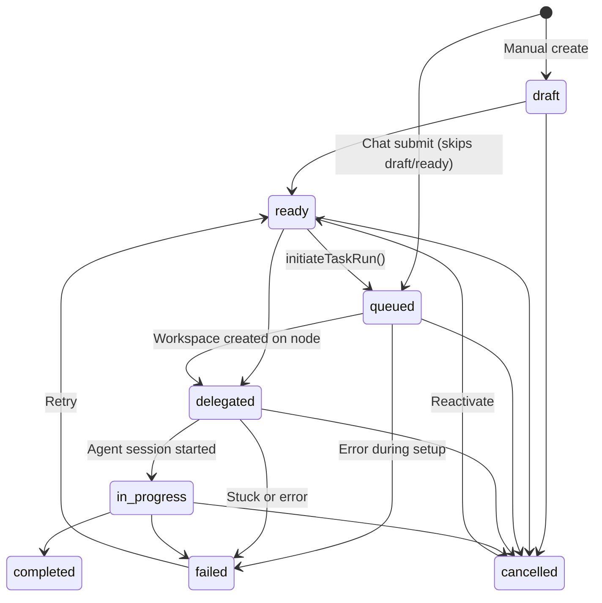
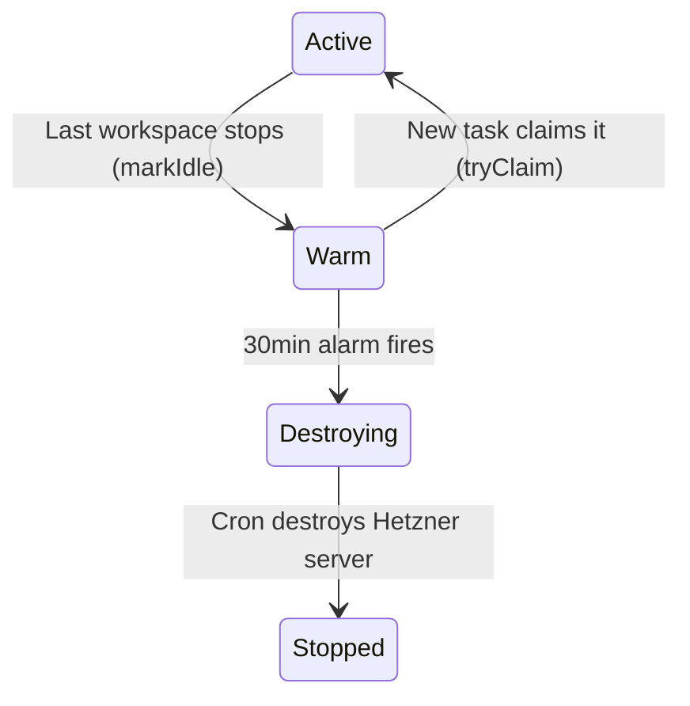

# Task Delegation & Chat System — Complete Flow Map

**Created**: 2026-02-27
**Priority**: High
**Classification**: `cross-component-change`, `business-logic-change`
**Related**: `docs/notes/task-delegation-system-analysis.md` (specific stuck-task investigation)

## Purpose

The task delegation / chat system does not work properly. This document maps the entire end-to-end flow across all components so we can identify where things break down and plan fixes systematically.

---

## Architecture Overview

The system spans five layers:

```
Web UI (React)  -->  API Worker (Hono/CF Worker)  -->  Durable Objects (ProjectData, NodeLifecycle)
                                                   -->  D1 Database (tasks, workspaces, nodes)
                                                   -->  VM Agent (Go, on Hetzner VM)
```

### Component Map

| Component | Files | Role |
|-----------|-------|------|
| **Task Submit** | `apps/api/src/routes/task-submit.ts` | Single-action task creation from chat UI |
| **Task CRUD** | `apps/api/src/routes/tasks.ts` | Full task lifecycle + callback endpoint |
| **Task Runs** | `apps/api/src/routes/task-runs.ts` | Manual task execution trigger |
| **Task Runner** | `apps/api/src/services/task-runner.ts` | Async orchestration engine (node -> workspace -> agent) |
| **Node Selector** | `apps/api/src/services/node-selector.ts` | Warm pool + capacity-based node selection |
| **Task Status** | `apps/api/src/services/task-status.ts` | Status transition validation |
| **Task Graph** | `apps/api/src/services/task-graph.ts` | Dependency DAG + cycle detection |
| **Node Lifecycle DO** | `apps/api/src/durable-objects/node-lifecycle.ts` | Warm pool state machine |
| **ProjectData DO** | `apps/api/src/durable-objects/project-data.ts` | Chat sessions, messages, activity events |
| **Project Data Service** | `apps/api/src/services/project-data.ts` | Typed wrapper for ProjectData DO RPCs |
| **Chat Routes** | `apps/api/src/routes/chat.ts` | Session CRUD + WebSocket streaming |
| **Activity Routes** | `apps/api/src/routes/activity.ts` | Activity feed API |
| **Node Agent Client** | `apps/api/src/services/node-agent.ts` | HTTP calls to VM agent |
| **Stuck Tasks Cron** | `apps/api/src/scheduled/stuck-tasks.ts` | Recovery for stalled tasks |
| **Node Cleanup Cron** | `apps/api/src/scheduled/node-cleanup.ts` | Teardown of idle nodes |
| **VM Agent Server** | `packages/vm-agent/internal/server/server.go` | Workspace provisioning, ACP sessions, task callbacks |
| **VM Workspace Mgmt** | `packages/vm-agent/internal/server/workspaces.go` | Workspace lifecycle on VM |
| **VM Bootstrap** | `packages/vm-agent/internal/bootstrap/bootstrap.go` | Repo clone, devcontainer, git setup |
| **Message Reporter** | `packages/vm-agent/internal/messagereport/` | Batch message persistence to control plane |
| **Chat UI** | `apps/web/src/pages/ProjectChat.tsx` | Main chat interface + task submit |
| **Task Submit Form** | `apps/web/src/components/task/TaskSubmitForm.tsx` | Single-line task input |
| **Kanban Board** | `apps/web/src/components/task/TaskKanbanBoard.tsx` | Visual task status board |
| **DB Schema** | `apps/api/src/db/schema.ts` | D1 tables (tasks, workspaces, nodes, agentSessions) |
| **Shared Types** | `packages/shared/src/types.ts` | TypeScript contracts |

---

## State Machines

### Task Status



Defined in: `apps/api/src/services/task-status.ts`

### Execution Steps (Breadcrumb Trail)

These track WHERE in the orchestration pipeline the task is. Persisted to `tasks.executionStep` BEFORE each long-running operation, enabling stuck-task recovery.

```
node_selection -> node_provisioning -> node_agent_ready -> workspace_creation -> workspace_ready -> agent_session -> running -> awaiting_followup
```

### Node Lifecycle (Warm Pool)



Managed by: `NodeLifecycle DO` (`apps/api/src/durable-objects/node-lifecycle.ts`)

### Chat Session Status

```
active -> stopped (explicit stop or idle cleanup)
active -> error (error during session)
```

Managed by: `ProjectData DO` (`apps/api/src/durable-objects/project-data.ts`)

---

## End-to-End Flow: Chat Submit Task

This is the primary flow — user types a message in the chat UI and a task runs autonomously.

### Phase 1: Submission (Synchronous, ~100ms)

**Entry**: `POST /api/projects/:projectId/tasks/submit`
**File**: `apps/api/src/routes/task-submit.ts`

```
User types "Fix the login bug" in TaskSubmitForm -> clicks "Run Now"
    |
    v
Frontend: POST /api/projects/:projectId/tasks/submit
    { message: "Fix the login bug", vmSize?: "medium", nodeId?: null }
    |
    v
API Worker:
    1. Validate project ownership (requireOwnedProject)
    2. Validate message (non-empty, <= 2000 chars)
    3. Check Hetzner credentials exist
    4. Validate nodeId if provided (must be running)
    5. Generate task ID (ULID)
    6. Generate branch name: sam/{slug}-{ulid} (generateBranchName)
    7. Determine VM config: explicit override > project default > platform default
    8. INSERT task -> D1 (status=queued, executionStep=node_selection)
    9. INSERT taskStatusEvent (null -> queued)
    10. Create chat session in ProjectData DO (best-effort, non-blocking)
        - If fails: use fallback sessionId = "sess-fallback-{taskId}"
    11. Persist first user message to session (best-effort)
    12. Record activity event (best-effort, via waitUntil)
    13. Load full task record from D1
    14. Kick off executeTaskRun() via waitUntil
    15. Return 202: { taskId, sessionId, branchName, status: "queued" }
```

**Critical observation**: Session creation is best-effort. If the DO call fails, a fallback session ID is used that doesn't correspond to a real session. This could cause message persistence and WebSocket streaming to silently fail.

### Phase 2: Async Orchestration (waitUntil, 1-10+ minutes)

**Entry**: `executeTaskRun()` in `apps/api/src/services/task-runner.ts`
**Execution context**: Cloudflare Worker `waitUntil()` — NOT a Durable Object. No durability guarantees.

```
executeTaskRun():
    |
    |-- Step 1: NODE SELECTION (executionStep = 'node_selection')
    |   |
    |   |-- Preferred node provided?
    |   |   YES: Validate it exists + status=running + owned by user
    |   |   NO: selectNodeForTaskRun() [apps/api/src/services/node-selector.ts]
    |   |       |
    |   |       |-- Step 0: Try warm pool nodes
    |   |       |   Query D1 for nodes with warmSince != null, status=running
    |   |       |   Sort by size/location match
    |   |       |   For each: re-check D1 freshness, then DO tryClaim()
    |   |       |   If claimed: return node (skip provisioning!)
    |   |       |
    |   |       |-- Step 1: Check existing running nodes with capacity
    |   |       |   Query all running nodes for user
    |   |       |   Filter by health, workspace count, CPU/memory thresholds
    |   |       |   Sort: location match > size match > lowest load score
    |   |       |   Score = 40% CPU + 60% memory
    |   |       |
    |   |       |-- No node found: return null -> triggers provisioning
    |   |
    |   |-- No node found?
    |       |
    |       |-- Step 1b: NODE PROVISIONING (executionStep = 'node_provisioning')
    |       |   Check user node limit (maxNodesPerUser)
    |       |   createNodeRecord() -> D1 insert
    |       |   Store autoProvisionedNodeId on task
    |       |   provisionNode() -> Hetzner API: create server
    |       |   Verify node status=running after provisioning
    |       |
    |       |-- Step 1c: WAIT FOR AGENT (executionStep = 'node_agent_ready')
    |           waitForNodeAgentReady() -> polls VM health endpoint
    |           Timeout: 120s, interval: 5s
    |
    |-- Step 2: WORKSPACE CREATION (executionStep = 'workspace_creation')
    |   |
    |   |-- Generate unique workspace display name
    |   |-- INSERT workspace -> D1 (status=creating)
    |   |-- UPDATE task with workspaceId
    |   |-- Create chat session in ProjectData DO (best-effort)
    |   |   NOTE: This is a SECOND session creation attempt (first was in task-submit.ts)
    |   |   If task-submit already created one, this creates a duplicate!
    |   |-- Set outputBranch = "task/{taskId}" on task
    |   |-- Sign callback JWT token
    |   |-- POST /workspaces to VM agent (createWorkspaceOnNode)
    |   |   -> VM agent returns 202 Accepted
    |   |   -> Provisioning happens async on VM (goroutine)
    |   |
    |   |-- TRANSITION: queued -> delegated
    |       Optimistic lock: WHERE status = 'queued'
    |       If 0 rows updated: cron already failed it -> abort gracefully
    |       INSERT taskStatusEvent (queued -> delegated)
    |
    |-- Step 3: WAIT FOR WORKSPACE READY (executionStep = 'workspace_ready')
    |   |
    |   |-- waitForWorkspaceReady() polls D1
    |   |   Initial interval: 500ms (WORKSPACE_READY_POLL_INTERVAL_MS)
    |   |   Backoff: 1.5x multiplier
    |   |   Max interval: 5s (WORKSPACE_READY_MAX_POLL_INTERVAL_MS)
    |   |   Timeout: 10min (WORKSPACE_READY_TIMEOUT_MS)
    |   |
    |   |-- Checks workspace.status:
    |       'running' or 'recovery' -> proceed
    |       'error' -> throw WORKSPACE_CREATION_FAILED
    |       'stopped' -> throw WORKSPACE_STOPPED
    |       disappeared -> throw WORKSPACE_LOST
    |       timeout -> throw WORKSPACE_TIMEOUT
    |
    |-- Step 4: AGENT SESSION CREATION (executionStep = 'agent_session')
    |   |
    |   |-- INSERT agentSession -> D1 (status=running)
    |   |-- POST /workspaces/:id/agent-sessions to VM agent
    |       (createAgentSessionOnNode)
    |
    |-- Step 5: MARK IN-PROGRESS (executionStep = 'running')
        |
        |-- TRANSITION: delegated -> in_progress
            Optimistic lock: WHERE status = 'delegated'
            If 0 rows updated: cron already failed it -> abort
            SET startedAt = now
            INSERT taskStatusEvent (delegated -> in_progress)
```

**Error handling**: Any exception in the above triggers:
1. `failTask()` -> mark task as failed with error message (idempotent: skips if already terminal)
2. Best-effort cleanup: stop workspace on node
3. If auto-provisioned: check if node has other workspaces, if not: markIdle via NodeLifecycle DO

### Phase 3: VM Execution (on Hetzner VM, minutes to hours)

**Files**: `packages/vm-agent/internal/server/server.go`, `packages/vm-agent/internal/server/workspaces.go`, `packages/vm-agent/internal/bootstrap/bootstrap.go`

```
VM Agent receives POST /workspaces:
    |
    |-- upsertWorkspaceRuntime() -> stores workspace state + callbackToken
    |-- startWorkspaceProvision() (goroutine)
        |
        |-- provisionWorkspaceRuntime() [bootstrap.go]
        |   |-- Clone repository
        |   |-- Build devcontainer (docker build)
        |   |-- Setup git credentials (gh-token-wrapper)
        |   |-- Configure environment
        |   |-- markWorkspaceReady() -> POST /api/workspaces/{id}/ready
        |       (This updates workspace.status = 'running' in D1)
        |
        |-- On success: casWorkspaceStatus("creating" -> "running") locally
        |-- On failure: casWorkspaceStatus("creating" -> "error") locally
        |   notifyWorkspaceProvisioningFailed() -> POST /api/workspaces/{id}/provisioning-failed
        |   (This updates workspace.status = 'error' in D1)

VM Agent receives POST /workspaces/:id/agent-sessions:
    |
    |-- Start ACP (Agent Communication Protocol) session
    |-- Task description is the initial prompt
    |-- Agent (Claude Code) executes autonomously
    |
    |-- Message persistence (during execution):
    |   VM agent buffers messages locally
    |   Periodically POSTs batch to /api/projects/:projectId/messages/batch
    |   via workspace routes (apps/api/src/routes/workspaces.ts)
    |   Messages deduplicated by messageId in ProjectData DO
    |
    |-- On prompt completion: OnPromptComplete callback fires
        |
        |-- If error/failure:
        |   POST /tasks/:taskId/status/callback
        |   { toStatus: "failed", errorMessage: "..." }
        |
        |-- If success:
            |-- gitPushWorkspaceChanges(workspaceId)
            |   git add -> git commit -> git push -> gh pr create
            |
            |-- POST /tasks/:taskId/status/callback
                {
                  executionStep: "awaiting_followup",
                  gitPushResult: { pushed, commitSha, branchName, prUrl, ... }
                }
                NOTE: No toStatus field — task stays in_progress
```

### Phase 4: Callback Processing (API Worker)

**File**: `apps/api/src/routes/tasks.ts` (`:taskId/status/callback` handler)

```
POST /tasks/:taskId/status/callback
    |
    |-- Verify callback JWT token (signed with taskId + workspaceId)
    |-- Validate task exists + workspace matches
    |
    |-- If executionStep only (no toStatus):
    |   |-- Update executionStep in D1
    |   |-- If gitPushResult provided:
    |   |   Finalization guard: only save push results once (check finalizedAt)
    |   |   Update outputBranch, outputPrUrl on task
    |   |-- Record activity event (task.execution_step)
    |   |
    |   |-- If executionStep == "awaiting_followup":
    |       |-- Find chat session for workspace
    |       |-- markAgentCompleted() on session (sets agentCompletedAt)
    |       |-- scheduleIdleCleanup() -> 15min timer in ProjectData DO
    |       |-- Record activity event (task.agent_completed)
    |
    |-- If toStatus provided:
        |-- Validate transition (canTransitionTaskStatus)
        |-- UPDATE task status in D1
        |-- INSERT taskStatusEvent
        |-- If toStatus == 'completed' or 'failed':
            waitUntil: cleanupTaskRun()
```

### Phase 5: Idle Cleanup (15 minutes after agent completion)

**File**: `apps/api/src/durable-objects/project-data.ts`

```
ProjectData DO alarm fires (15 min after scheduleIdleCleanup):
    |
    |-- Check if cleanup was cancelled (user sent follow-up)
    |-- If not cancelled:
        |-- Stop workspace on node
        |-- Mark workspace stopped in D1
        |-- Mark node warm via NodeLifecycle DO (if auto-provisioned + no other workspaces)
        |-- Stop chat session
```

**User follow-up cancels cleanup**:
```
User sends message -> POST /sessions/:sessionId/idle-reset
    |
    |-- cancelIdleCleanup() on ProjectData DO
    |-- Reschedules new 15min timer
```

### Phase 6: Frontend Tracking

**File**: `apps/web/src/pages/ProjectChat.tsx`, `apps/web/src/components/task/TaskSubmitForm.tsx`

```
After submit returns 202:
    |
    |-- Show provisioning spinner inline
    |-- Poll task status every 2-3s (GET /tasks/:taskId)
    |   Check: task.status, task.executionStep
    |
    |-- When task.status == 'in_progress':
    |   Navigate to chat session
    |   Subscribe to WebSocket: GET /sessions/ws (upgrade)
    |   Receive message.new events from ProjectData DO broadcast
    |   Render messages in real-time
    |
    |-- When agent signals awaiting_followup:
    |   Show idle timer (15 min countdown)
    |   User can send follow-up message to continue
    |
    |-- On error: show error message from task.errorMessage
```

---

## Chat Message Flow

### Message Persistence Path

```
Claude Code (ACP) generates response on VM
    |
    v
VM Agent message buffer (local)
    |
    v  (periodic batch flush)
POST /api/projects/:projectId/workspaces/:workspaceId/messages/batch
    |
    v
API Worker -> projectDataService.persistMessageBatch()
    |
    v
ProjectData DO -> INSERT into chat_messages table
    - Deduplicates by messageId (idempotent)
    - Increments session message_count
    - Auto-captures topic from first user message
    |
    v  (broadcast)
WebSocket clients receive 'message.new' event
    |
    v
Frontend renders message in ProjectMessageView
```

### WebSocket Event Stream

**Upgrade**: `GET /api/projects/:projectId/sessions/ws`
**Handler**: `apps/api/src/routes/chat.ts` -> forwards to ProjectData DO

Events broadcast:
- `message.new` — New message persisted
- `session.created` — New session started
- `session.stopped` — Session ended
- `activity.new` — Activity event recorded

### Chat Session Lifecycle

```
Created (task-submit or task-runner)
    |
    v  [messages flow during execution]
Active (status=active, agentCompletedAt=null)
    |
    v  [agent signals awaiting_followup]
Idle (status=active, agentCompletedAt!=null, isIdle=true)
    |
    |--> User sends follow-up: reset idle timer, continue execution
    |
    |--> 15min timeout: scheduleIdleCleanup fires
         |
         v
Stopped (status=stopped)
```

---

## Recovery & Resilience Mechanisms

### Stuck Task Cron (`apps/api/src/scheduled/stuck-tasks.ts`)

Runs every 5 minutes. Scans for tasks stuck in non-terminal states.

| Task Status | Default Timeout | Env Override | Action |
|-------------|----------------|--------------|--------|
| `queued` | 5 min | `TASK_STUCK_QUEUED_TIMEOUT_MS` | Fail task + cleanup |
| `delegated` | 5 min | `TASK_STUCK_DELEGATED_TIMEOUT_MS` | Fail task + cleanup |
| `in_progress` | 2 hours | `TASK_RUN_MAX_EXECUTION_MS` | Fail task + cleanup |

Timeout measured from `task.updatedAt` (which is refreshed by `setExecutionStep()`).

### Workspace Provisioning Timeout (`apps/api/src/services/timeout.ts`)

Also runs in the cron cycle. Marks workspaces stuck in `creating` as `error` after 10 minutes.

**Execution order in cron** (from `apps/api/src/index.ts`):
1. `checkProvisioningTimeouts()` — marks stuck workspaces as error
2. `recoverStuckTasks()` — detects stuck tasks

### Optimistic Locking

Both task transitions (queued->delegated and delegated->in_progress) use `WHERE status = X`. If the cron has already failed the task, the update returns 0 rows and the task runner aborts. Prevents race conditions between async runner and cron.

### NodeLifecycle Three-Layer Defense

1. **DO alarm**: Fires after NODE_WARM_TIMEOUT_MS (default 30 min)
2. **Cron sweep**: Picks up nodes marked for destruction
3. **Max lifetime**: Safety net if all else fails

---

## Known Weak Points & Failure Modes

### 1. waitUntil Reliability (CRITICAL)

`executeTaskRun()` runs inside `waitUntil()` which has NO durability guarantees. If the Cloudflare Worker is recycled mid-execution:
- The async function silently stops
- No error is thrown, no catch block runs
- Only evidence: `executionStep` breadcrumb in D1
- Recovery depends on stuck-task cron (up to 5min delay + threshold)

**Symptom**: Task stuck in `delegated` with `executionStep=workspace_ready` even though the workspace DID become ready on the VM. The Worker died before it could observe readiness and create the agent session.

**See**: `docs/notes/task-delegation-system-analysis.md` for detailed analysis.

### 2. Duplicate Chat Session Creation

`task-submit.ts` creates a chat session (step 10), then `task-runner.ts` creates ANOTHER session in workspace creation (step 2). This means:
- Two sessions may exist for the same task
- The first session (from submit) has the user's initial message
- The second session (from runner) is linked to the workspace
- Message persistence may go to the wrong session

### 3. Fallback Session ID

If session creation fails in `task-submit.ts`, a fallback ID `sess-fallback-{taskId}` is returned. This doesn't correspond to a real session in the DO, so:
- Frontend gets a session ID that doesn't exist
- WebSocket subscription for that session ID gets no events
- Message persistence to that session silently fails

### 4. Best-Effort Message Persistence

All message persistence (first user message, batch messages from VM) is best-effort. Failures are caught and logged but execution continues. Users may see an empty chat even though the agent is working.

### 5. Workspace Ready Callback Race

The workspace readiness chain has a subtle ordering:
1. `PrepareWorkspace()` calls `markWorkspaceReady()` (HTTP POST to control plane)
2. Control plane sets workspace.status = 'running' in D1
3. `startWorkspaceProvision()` does `casWorkspaceStatus("creating" -> "running")` locally

If the HTTP callback fails (DNS, timeout, auth), the workspace is running on the VM but `creating` in D1. The task runner's poll sees `creating` indefinitely until timeout.

### 6. No Observability for Silent waitUntil Failures

When the Worker dies in waitUntil:
- No exception thrown, no error middleware runs
- Stuck-task cron uses `log.warn()` which goes to Workers Observability logs, NOT the error database
- Admin errors tab shows nothing

### 7. Chat Session Not Linked to Workspace at Submit Time

At task submission time, the workspace doesn't exist yet. The session is created with `workspaceId = null`. The workspace is only created later in `executeTaskRun()`. The session's workspaceId is updated in the runner, but if the runner fails before that point, the session has no workspace link.

### 8. Idle Cleanup Depends on Chat Session Link

The idle cleanup flow (`awaiting_followup` -> `scheduleIdleCleanup`) looks up the chat session via `workspace.chatSessionId`. If the workspace has no linked session (see point 7), the cleanup timer is never set, and the workspace stays running indefinitely (until stuck-task cron catches it).

---

## Configuration Reference

### Task Execution

| Variable | Default | Purpose |
|----------|---------|---------|
| `TASK_RUN_CLEANUP_DELAY_MS` | 0 | Wait before cleanup |
| `TASK_STUCK_QUEUED_TIMEOUT_MS` | 300,000 (5 min) | Stuck in node selection |
| `TASK_STUCK_DELEGATED_TIMEOUT_MS` | 300,000 (5 min) | Stuck in workspace creation |
| `TASK_RUN_MAX_EXECUTION_MS` | 7,200,000 (2 hrs) | Max runtime |

### Workspace Provisioning

| Variable | Default | Purpose |
|----------|---------|---------|
| `WORKSPACE_READY_TIMEOUT_MS` | 600,000 (10 min) | Polling timeout for workspace ready |
| `WORKSPACE_READY_POLL_INTERVAL_MS` | 500 | Initial poll interval |
| `WORKSPACE_READY_MAX_POLL_INTERVAL_MS` | 5,000 | Max poll interval (1.5x backoff) |
| `PROVISIONING_TIMEOUT_MS` | 600,000 (10 min) | Cron marks stuck creating workspaces |

### Warm Node Pool

| Variable | Default | Purpose |
|----------|---------|---------|
| `NODE_WARM_TIMEOUT_MS` | 1,800,000 (30 min) | How long idle nodes stay warm |
| `NODE_LIFECYCLE_ALARM_RETRY_MS` | 5,000 | Alarm retry on transient DO failure |

### Node Selection

| Variable | Default | Purpose |
|----------|---------|---------|
| `TASK_RUN_NODE_CPU_THRESHOLD_PERCENT` | 80 | Max CPU for capacity check |
| `TASK_RUN_NODE_MEMORY_THRESHOLD_PERCENT` | 85 | Max memory for capacity check |
| `MAX_WORKSPACES_PER_NODE` | 10 | Max concurrent workspaces per node |
| `MAX_NODES_PER_USER` | (from limits) | User node limit |

### Chat & Sessions

| Variable | Default | Purpose |
|----------|---------|---------|
| `MAX_SESSIONS_PER_PROJECT` | 1,000 | Session limit per project |
| `MAX_MESSAGES_PER_SESSION` | 10,000 | Message limit per session |
| `SESSION_IDLE_TIMEOUT_MINUTES` | 15 | Idle cleanup timer |
| `ACTIVITY_RETENTION_DAYS` | 30 | Activity event retention |

### Branch Naming

| Variable | Default | Purpose |
|----------|---------|---------|
| `BRANCH_NAME_PREFIX` | `sam/` | Branch name prefix |
| `BRANCH_NAME_MAX_LENGTH` | 60 | Max branch name length |

---

## Recommended Fixes (Priority Order)

### P0: Move orchestration to Durable Object

The `waitUntil()` approach is fundamentally unreliable for multi-minute orchestration. Replace with a TaskRunner DO that:
- Uses alarms for each step transition
- Survives Worker restarts
- Eliminates dependency on stuck-task cron for normal operation
- Provides real-time status without polling

### P1: Webhook-driven workspace ready

Instead of polling D1, the `/api/workspaces/{id}/ready` endpoint should directly advance the task:
1. When workspace becomes ready, check if there's an associated task in `delegated` state
2. If so, create the agent session and transition to `in_progress` inline
3. Eliminates the `waitUntil` death window during workspace provisioning

### P2: Fix duplicate session creation

Remove the session creation from `task-runner.ts` (step 2) since `task-submit.ts` already creates one. Instead, link the existing session to the workspace when the workspace is created.

### P3: Fix fallback session ID

Instead of using `sess-fallback-{taskId}`, retry session creation or fail the task submission. A task without a valid session ID provides a broken user experience.

### P4: Write stuck-task recoveries to error database

The cron currently only `log.warn()`s stuck task recovery. It should also write to OBSERVABILITY_DATABASE so it appears in the admin errors tab.

### P5: Record workspace status at recovery time

When the cron fails a stuck task, also query and log the workspace status. This tells you which failure scenario occurred without manual investigation.

---

## Debugging Checklist

When a task gets stuck or fails:

1. **Check task status + executionStep in D1**
   - `queued` + `node_selection`: Node selection failed or Worker died before finding node
   - `queued` + `node_provisioning`: Hetzner API call failed
   - `queued` + `node_agent_ready`: VM booted but agent didn't respond
   - `delegated` + `workspace_creation`: Workspace API call to VM failed
   - `delegated` + `workspace_ready`: Workspace provisioning on VM failed OR Worker died while polling
   - `delegated` + `agent_session`: Agent session creation failed

2. **Check workspace status in D1**
   - `creating`: Workspace provisioning still in progress or callback failed
   - `running`: Worker died before observing readiness (most common for stuck `delegated`)
   - `error`: Provisioning failed on VM
   - `stopped`: Something stopped it during creation

3. **Check Workers Observability logs** for:
   - `task_run.step.*` entries — how far did the runner get?
   - `stuck_task.recovering` — when did cron catch it?
   - `task_run.failed` — runner's own error handling
   - `task_run.aborted_by_recovery` — runner detected cron already failed it

4. **Check VM agent logs** (admin node logs endpoint):
   - `workspace.provisioning` / `workspace.created` events
   - `Workspace marked ready` — was the callback sent?
   - `Provisioning-failed callback error` — callback failed
   - ACP session creation/completion events

5. **Check the timeline**:
   - When was the task created? (`task.createdAt`)
   - When was execution step last updated? (`task.updatedAt`)
   - When did cron fire? (Workers Observability logs)
   - Gap between updatedAt and cron = Worker death window

---

## Files to Investigate for Fixes

| File | Issue |
|------|-------|
| `apps/api/src/services/task-runner.ts` | waitUntil reliability, duplicate session creation |
| `apps/api/src/routes/task-submit.ts` | Fallback session ID, session-workspace linking |
| `apps/api/src/routes/tasks.ts` | Callback handler, idle cleanup chain |
| `apps/api/src/routes/workspaces.ts` | `/ready` endpoint — could advance task inline |
| `apps/api/src/durable-objects/project-data.ts` | Session lifecycle, idle cleanup alarm |
| `apps/api/src/scheduled/stuck-tasks.ts` | Error database recording, workspace status logging |
| `packages/vm-agent/internal/server/server.go` | Task completion callback, message reporter |
| `packages/vm-agent/internal/bootstrap/bootstrap.go` | markWorkspaceReady callback reliability |
| `apps/web/src/pages/ProjectChat.tsx` | Provisioning tracking, error display |
