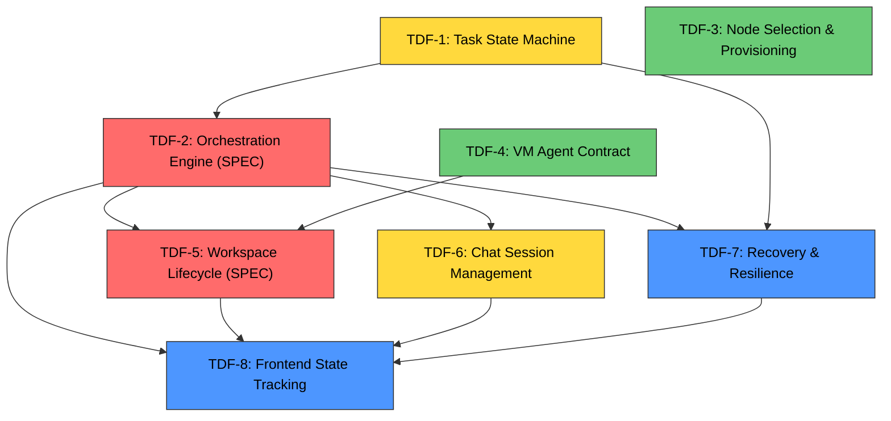

# Task Delegation Fix (TDF) — Series Index

**Created**: 2026-02-27
**Purpose**: Comprehensive fix for the task delegation and chat system failures identified in our flow map analysis.

## Research Documents

- `docs/task-delegation-flow-map.md` — Complete end-to-end flow map with all 8 known failure points
- `docs/notes/task-delegation-system-analysis.md` — Deep-dive analysis of a specific stuck-task failure

## Task Series

| ID | Task | Type | Priority | Depends On | Status |
|----|------|------|----------|------------|--------|
| TDF-1 | [Task State Machine](2026-02-27-tdf-1-task-state-machine.md) | Task | High | None | Backlog |
| TDF-2 | [Orchestration Engine](2026-02-27-tdf-2-orchestration-engine.md) | **SPEC** | Critical | TDF-1 | Backlog |
| TDF-3 | [Node Selection & Provisioning](2026-02-27-tdf-3-node-selection-provisioning.md) | Task | Medium | None | Backlog |
| TDF-4 | [VM Agent Contract](2026-02-27-tdf-4-vm-agent-contract.md) | Task | Medium | None | Backlog |
| TDF-5 | [Workspace Lifecycle](2026-02-27-tdf-5-workspace-lifecycle.md) | **SPEC** | High | TDF-2, TDF-4 | Backlog |
| TDF-6 | [Chat Session Management](2026-02-27-tdf-6-chat-session-management.md) | Task | High | TDF-2 | Backlog |
| TDF-7 | [Recovery & Resilience](2026-02-27-tdf-7-recovery-resilience.md) | Task | Medium | TDF-1, TDF-2 | Backlog |
| TDF-8 | [Frontend State Tracking](2026-02-27-tdf-8-frontend-state-tracking.md) | Task | Medium | TDF-2, TDF-5, TDF-6, TDF-7 | Backlog |

## Dependency Graph

**Legend**: Red = SPEC (full speckit flow), Yellow = High priority tasks, Green = Independent (can start immediately), Blue = Depends on orchestration engine

## Build Order

### Phase 1 (Parallel — no dependencies)
- **TDF-1**: Task State Machine (foundation)
- **TDF-3**: Node Selection & Provisioning (independent)
- **TDF-4**: VM Agent Contract (independent)

### Phase 2 (After TDF-1)
- **TDF-2**: Orchestration Engine (SPEC) — the critical path

### Phase 3 (After TDF-2 + dependencies)
- **TDF-5**: Workspace Lifecycle (SPEC) — needs TDF-2 + TDF-4
- **TDF-6**: Chat Session Management — needs TDF-2
- **TDF-7**: Recovery & Resilience — needs TDF-1 + TDF-2

### Phase 4 (After all above)
- **TDF-8**: Frontend State Tracking — needs TDF-2, TDF-5, TDF-6, TDF-7

## SPEC Task Workflow

Tasks marked as **SPEC** must go through the full speckit flow:
1. `/speckit.specify` — Create feature specification
2. `/speckit.plan` — Generate implementation plan
3. `/speckit.tasks` — Generate implementation tasks
4. `/speckit.implement` — Execute implementation

Agents should stop and ask for clarification if there are ambiguous design decisions. The human can run `/speckit.clarify` to resolve open questions.
